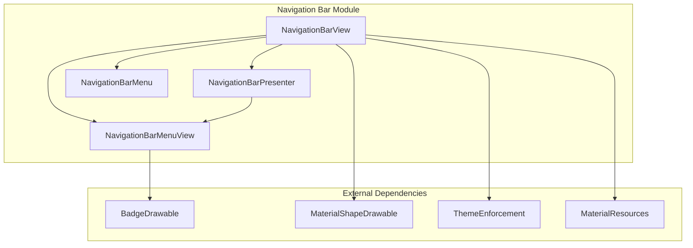
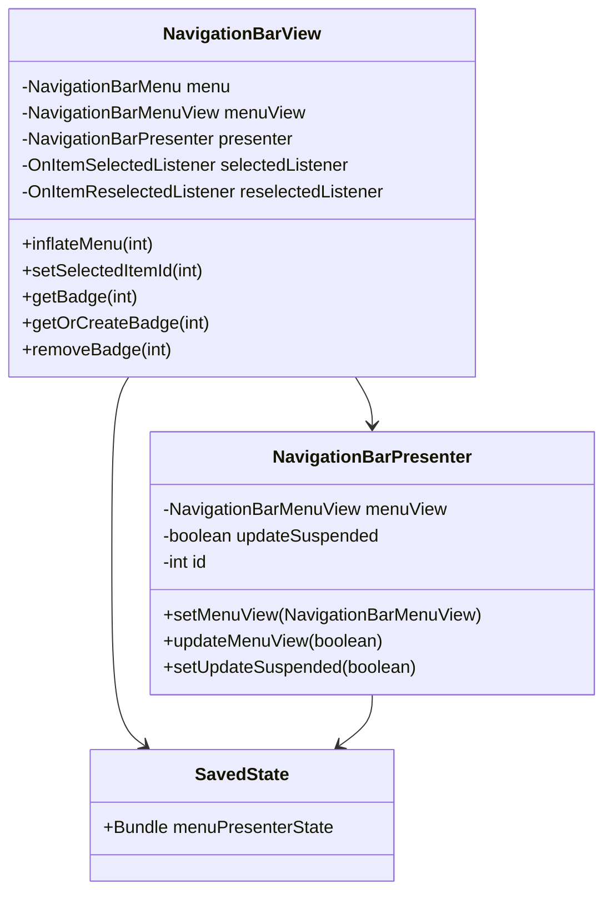
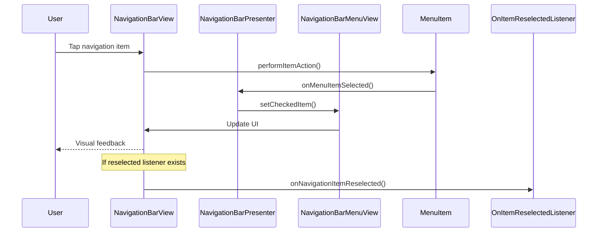
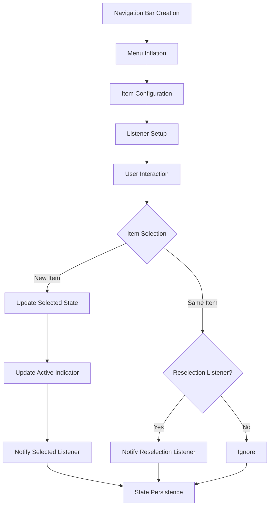
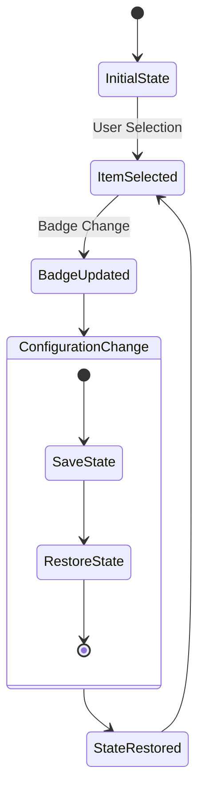

# Navigation Bar Module

The navigation-bar module provides the core functionality for Material Design navigation components, including bottom navigation bars and navigation rails. It offers a flexible framework for creating navigation interfaces that allow users to switch between top-level destinations in a single tap.

## Overview

The navigation-bar module is built around the abstract `NavigationBarView` class, which serves as the foundation for both bottom navigation and navigation rail implementations. It provides a comprehensive set of features for managing navigation items, handling user interactions, and maintaining visual consistency with Material Design principles.

## Core Components

### NavigationBarView
The primary abstract class that provides the base functionality for navigation bars. It handles menu inflation, item selection, state management, and visual customization.

**Key Features:**
- Menu resource inflation and management
- Item selection and reselection handling
- Label visibility modes (auto, selected, labeled, unlabeled)
- Icon and text customization
- Active indicator support
- Badge integration
- State persistence

### NavigationBarPresenter
The presenter class that mediates between the menu data and the view representation. It implements the MenuPresenter interface and handles menu updates, state saving, and badge management.

## Architecture



## Component Relationships



## Data Flow



## Key Features

### Label Visibility Modes
The module supports four label visibility modes:
- **LABEL_VISIBILITY_AUTO**: Automatically determines visibility based on item count
- **LABEL_VISIBILITY_SELECTED**: Shows labels only on selected items
- **LABEL_VISIBILITY_LABELED**: Always shows labels on all items
- **LABEL_VISIBILITY_UNLABELED**: Never shows labels

### Active Indicators
Modern navigation bars support active indicators that highlight the currently selected item:
- Configurable width and height
- Customizable shape appearance
- Color state list support
- Expanded state for horizontal layouts

### Badge System
Integration with the badge module allows displaying notification counts or status indicators on navigation items:
- Dynamic badge creation and removal
- State persistence across configuration changes
- Customizable badge appearance

### State Management
The module provides comprehensive state management:
- Selected item persistence
- Badge state preservation
- Configuration change handling
- Parcelable state implementation

## Process Flow



## Customization Options

### Visual Customization
- **Icon tinting**: ColorStateList for different states
- **Text appearance**: Separate active and inactive text styles
- **Background**: Custom drawables or ripple effects
- **Elevation**: Material elevation support
- **Shape appearance**: Custom shapes for background and indicators

### Layout Configuration
- **Item gravity**: Control item positioning within containers
- **Icon gravity**: Top or start positioning
- **Padding**: Custom spacing for items and indicators
- **Spacing**: Horizontal spacing between icons and labels

### Behavioral Settings
- **Label font scaling**: Respect system font size settings
- **Label max lines**: Control text wrapping
- **Measure from baseline**: Precise text positioning
- **Submenu support**: Enable/disable submenu functionality

## Integration with Other Modules

### Badge Module
The navigation-bar module integrates with the [badge](badge.md) module to provide notification indicators:
- Badge creation and management
- State synchronization
- Visual integration with navigation items

### Theme Module
Integration with the [theme](theme.md) module ensures consistent styling:
- Material theme overlay application
- Color scheme adherence
- Typography consistency

### Shape Module
The [shape](shape.md) module provides custom shape support:
- Background shape customization
- Active indicator shapes
- Material shape drawable integration

### Resources Module
The [resources](resources.md) module handles resource loading:
- Material attribute resolution
- Color state list creation
- Dimension resource handling

## Usage Examples

### Basic Setup
```xml
<com.google.android.material.bottomnavigation.BottomNavigationView
    android:id="@+id/navigation"
    android:layout_width="match_parent"
    android:layout_height="wrap_content"
    app:menu="@menu/navigation_menu" />
```

### Programmatic Configuration
```java
NavigationBarView navigationBar = findViewById(R.id.navigation);
navigationBar.setOnItemSelectedListener(item -> {
    // Handle navigation item selection
    return true;
});

// Add badge
BadgeDrawable badge = navigationBar.getOrCreateBadge(R.id.navigation_item);
badge.setNumber(5);
```

### Advanced Customization
```java
// Configure active indicator
navigationBar.setItemActiveIndicatorEnabled(true);
navigationBar.setItemActiveIndicatorColor(ColorStateList.valueOf(activeColor));
navigationBar.setItemActiveIndicatorShapeAppearance(shapeAppearanceModel);

// Set label visibility
navigationBar.setLabelVisibilityMode(NavigationBarView.LABEL_VISIBILITY_SELECTED);

// Customize text appearance
navigationBar.setItemTextAppearanceActive(R.style.ActiveTextStyle);
navigationBar.setItemTextAppearanceInactive(R.style.InactiveTextStyle);
```

## State Persistence

The module implements comprehensive state persistence through the SavedState mechanism:



## Performance Considerations

### Menu Updates
- Suspended updates during batch operations
- Efficient menu view rebuilding
- Selective UI updates

### Memory Management
- Badge drawable recycling
- State bundle optimization
- View hierarchy minimization

### Animation Support
- Smooth transitions between items
- Active indicator animations
- Badge appearance/disappearance effects

## Accessibility

The navigation-bar module provides comprehensive accessibility support:
- Screen reader compatibility
- Keyboard navigation support
- High contrast mode support
- Touch target sizing compliance
- Semantic content descriptions

## Best Practices

### Design Guidelines
- Limit navigation items to 3-5 for optimal usability
- Use clear, recognizable icons
- Maintain consistent labeling
- Follow Material Design spacing guidelines

### Implementation Tips
- Set up listeners early in the component lifecycle
- Handle configuration changes properly
- Use appropriate label visibility modes
- Test with various screen sizes and orientations

### Performance Optimization
- Minimize menu updates during user interactions
- Use appropriate icon sizes
- Consider lazy loading for complex navigation structures
- Implement proper state management

## Related Documentation

- [Badge Module](badge.md) - Notification indicators
- [Theme Module](theme.md) - Material theming integration
- [Shape Module](shape.md) - Custom shape support
- [Resources Module](resources.md) - Resource management
- [Bottom Navigation](bottom-navigation.md) - Specific bottom navigation implementation
- [Navigation Rail](navigation-rail.md) - Navigation rail implementation