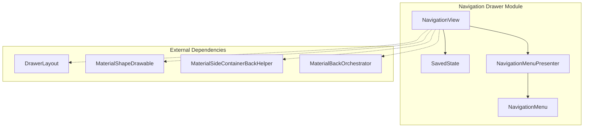
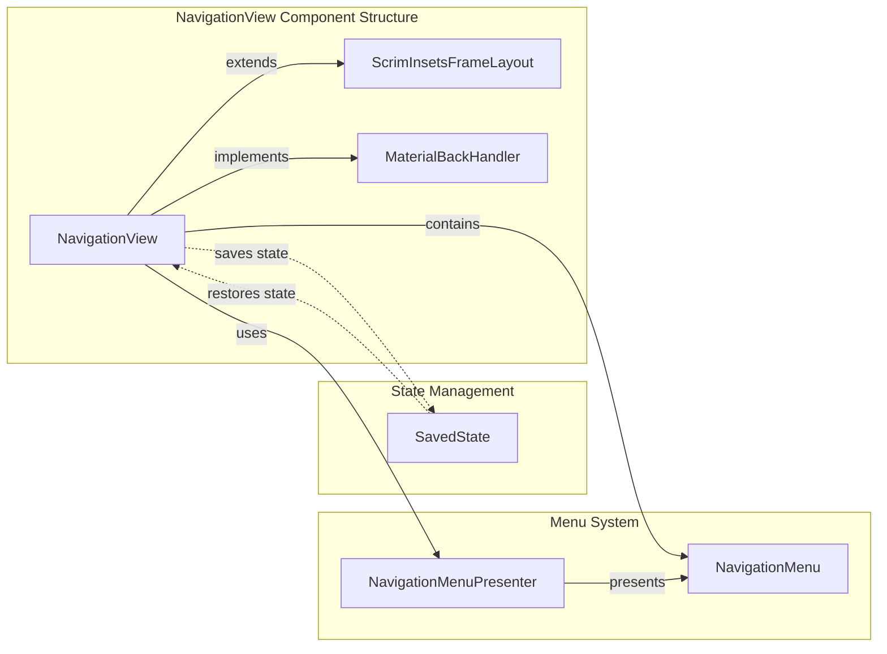
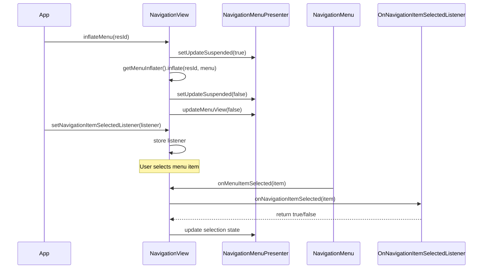
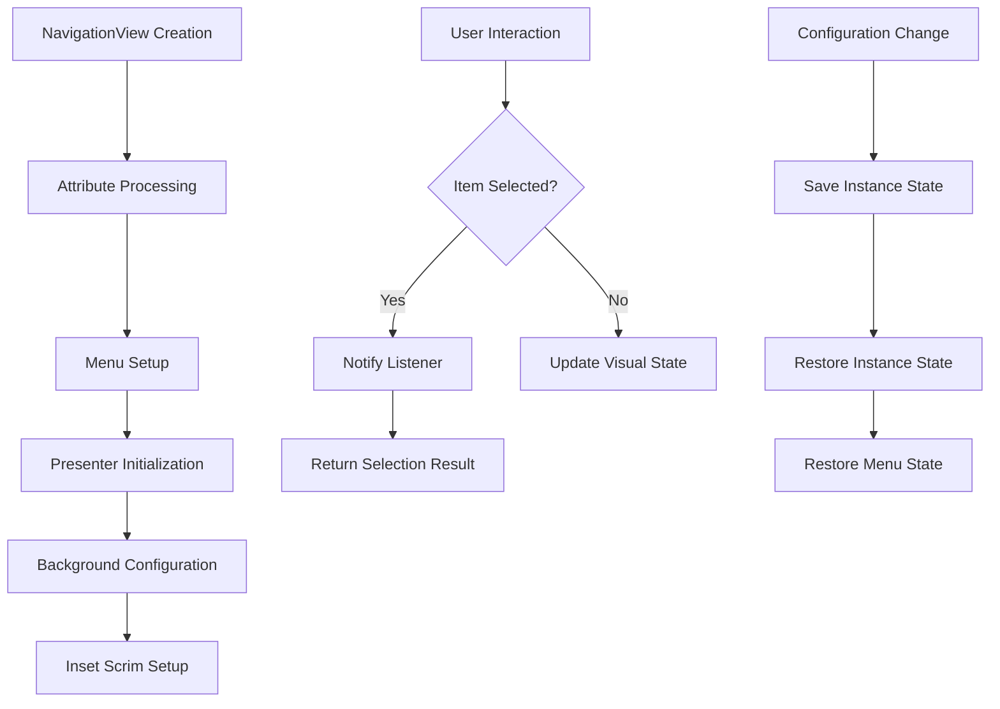

# Navigation Drawer Module

The navigation-drawer module provides the NavigationView component, a Material Design implementation of a navigation drawer that offers a consistent and accessible way to present primary navigation options in Android applications.

## Overview

NavigationView is a core component of Material Design's navigation patterns, typically placed inside a DrawerLayout to create a slide-out navigation menu. It provides a standardized way to display navigation items with icons, text, and selection states while maintaining Material Design principles.

## Core Components

### NavigationView
The main component that represents a standard navigation menu for applications. Key features include:
- Menu resource inflation for content population
- Header view support for user information or branding
- Item selection and state management
- Material Design theming and styling
- Integration with DrawerLayout for slide-out behavior
- Back gesture support for modern Android versions

### SavedState
Handles state persistence for NavigationView, ensuring that menu selections and expanded states are maintained across configuration changes and activity lifecycle events.

## Architecture



## Component Relationships



## Data Flow



## Key Features

### Material Design Integration
- **Shape Theming**: Supports MaterialShapeDrawable for customizable backgrounds
- **Elevation**: Proper elevation handling for shadow effects
- **Ripple Effects**: Built-in ripple animations for item interactions
- **Color Theming**: Integration with Material Design color systems

### DrawerLayout Integration
- **Corner Shaping**: Automatic corner radius adjustment when placed in DrawerLayout
- **Back Gesture Support**: Material back navigation with predictive animations
- **Scrim Management**: Intelligent scrim rendering for system insets
- **Layout Positioning**: Proper handling of drawer gravity and positioning

### State Management
- **Selection Persistence**: Maintains checked item state across configuration changes
- **Menu State**: Preserves expanded/collapsed states of menu groups
- **Header State**: Maintains header view configurations

## Process Flow



## Integration with System Components

### DrawerLayout Integration
NavigationView is designed to work seamlessly with DrawerLayout, providing:
- Automatic drawer behavior integration
- Proper back gesture handling
- Corner shaping based on drawer position
- Scrim coordination for system bars

### Material Design System
The component integrates with various Material Design systems:
- **Theming**: References to [theme.md](theme.md) for consistent styling
- **Shape System**: Integration with [shape.md](shape.md) for customizable backgrounds
- **Motion**: Back gesture animations via [motion.md](motion.md)
- **Resources**: Color and dimension management through [resources.md](resources.md)

## Usage Patterns

### Basic Implementation
```xml
<androidx.drawerlayout.widget.DrawerLayout>
    <com.google.android.material.navigation.NavigationView
        android:id="@+id/navigation"
        android:layout_width="wrap_content"
        android:layout_height="match_parent"
        android:layout_gravity="start"
        app:menu="@menu/navigation_menu" />
</androidx.drawerlayout.widget.DrawerLayout>
```

### Advanced Configuration
- Custom item backgrounds and ripples
- Header layouts for user information
- Programmatic menu manipulation
- State restoration handling

## Related Documentation

- [Navigation Bar](navigation-bar.md) - For bottom navigation alternatives
- [DrawerLayout Utilities](navigation-utilities.md) - Helper utilities for drawer management
- [Material Shape](shape.md) - Background shape customization
- [Theme System](theme.md) - Material Design theming integration
- [Motion System](motion.md) - Animation and gesture handling