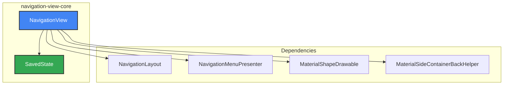
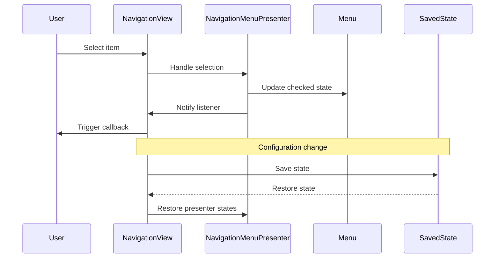
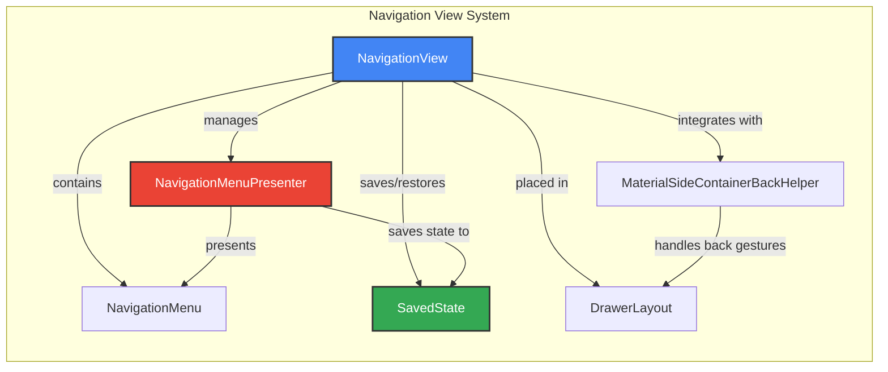
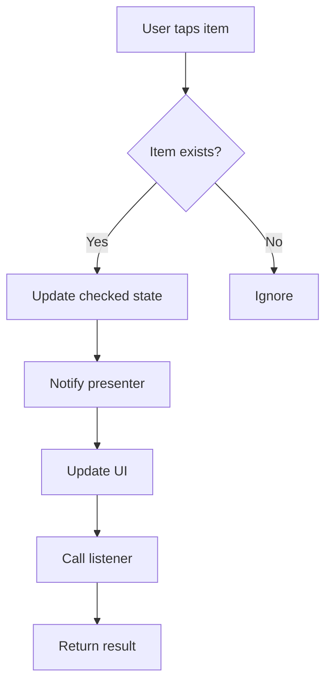
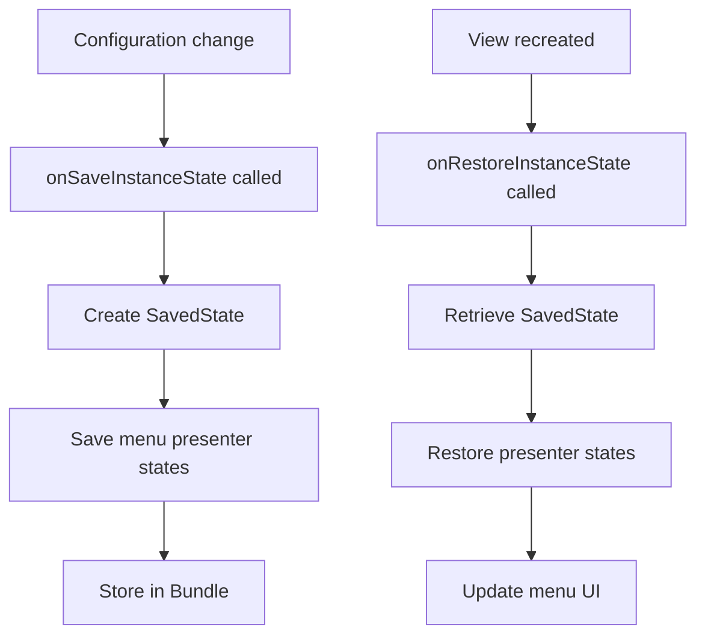

# Navigation View Core Module

## Overview

The navigation-view-core module provides the foundational components for implementing Material Design navigation drawers in Android applications. This module contains the core `NavigationView` component and its state management system, serving as the primary interface for creating navigation menus within drawer layouts.

## Purpose and Core Functionality

The navigation-view-core module enables developers to:
- Create navigation drawers with Material Design styling
- Manage navigation menu state and persistence
- Handle navigation item selection and user interactions
- Integrate with drawer layouts for slide-out navigation
- Support customizable theming and styling options

## Architecture

### Component Structure



### Core Components

#### NavigationView
The main component that represents a standard navigation menu for applications. It extends `ScrimInsetsFrameLayout` and implements `MaterialBackHandler` to provide:
- Menu population from resource files
- Header view support
- Item selection handling
- Material Design theming
- Drawer layout integration
- Back gesture support

#### SavedState
Handles the persistence of navigation view state across configuration changes and activity lifecycle events. It stores:
- Menu presenter states
- Checked item information
- User interaction states

## Data Flow



## Component Interactions



## Key Features

### State Management
- **SavedState**: Preserves navigation menu state across configuration changes
- **Menu Persistence**: Maintains item selection and menu structure
- **Presenter State**: Saves and restores the internal state of menu presenters

### Material Design Integration
- **Theming Support**: Integrates with Material Design themes and color schemes
- **Shape Appearance**: Supports customizable shapes and corner radius
- **Elevation**: Proper elevation handling for Material Design surfaces
- **Ripple Effects**: Built-in support for Material Design ripple animations

### Drawer Layout Integration
- **Automatic Detection**: Detects when placed inside a DrawerLayout
- **Corner Shaping**: Automatically shapes exposed corners when in drawer
- **Back Gesture Support**: Handles predictive back gestures for drawer dismissal
- **Scrim Management**: Manages inset scrims for system bars

### Customization Options
- **Item Styling**: Customizable text appearance, colors, and backgrounds
- **Icon Support**: Tinting and sizing options for menu item icons
- **Padding Control**: Horizontal and vertical padding for menu items
- **Header Support**: Support for custom header views

## Process Flow

### Navigation Item Selection


### State Saving/Restoration


## Integration with Other Modules

### Related Modules
- **[navigation-bar-core](navigation-bar-core.md)**: Provides navigation bar components that complement navigation views
- **[drawer-utils](drawer-utils.md)**: Utility functions for drawer layout integration
- **[shape](shape.md)**: Material shape system for customizable backgrounds
- **[color](color.md)**: Color theming and harmonization support

### Dependencies
- **MaterialShapeDrawable**: For customizable backgrounds and shapes
- **MaterialSideContainerBackHelper**: For predictive back gesture support
- **NavigationMenuPresenter**: For menu presentation logic
- **ScrimInsetsFrameLayout**: For inset scrim management

## Usage Examples

### Basic Implementation
```xml
<androidx.drawerlayout.widget.DrawerLayout>
    <com.google.android.material.navigation.NavigationView
        android:id="@+id/navigation_view"
        android:layout_width="wrap_content"
        android:layout_height="match_parent"
        android:layout_gravity="start"
        app:menu="@menu/navigation_menu" />
</androidx.drawerlayout.widget.DrawerLayout>
```

### Programmatic Usage
```java
NavigationView navigationView = findViewById(R.id.navigation_view);
navigationView.setNavigationItemSelectedListener(item -> {
    // Handle navigation item selection
    return true;
});

// Customize appearance
navigationView.setItemIconTintList(iconTint);
navigationView.setItemTextColor(textColor);
navigationView.setItemBackground(itemBackground);
```

## Best Practices

1. **State Persistence**: Always test state restoration during configuration changes
2. **Performance**: Use appropriate item limits to avoid performance issues
3. **Accessibility**: Ensure proper content descriptions for navigation items
4. **Theming**: Leverage Material Design themes for consistent appearance
5. **Testing**: Test integration with DrawerLayout and back gesture handling

## API Reference

### Key Classes
- `NavigationView`: Main navigation view component
- `NavigationView.SavedState`: State persistence for navigation view
- `OnNavigationItemSelectedListener`: Interface for handling item selection

### Key Methods
- `setNavigationItemSelectedListener()`: Set item selection listener
- `inflateMenu()`: Inflate menu from resource
- `setCheckedItem()`: Set checked item programmatically
- `getMenu()`: Access the underlying menu

For detailed API documentation, refer to the official Material Design Components documentation.