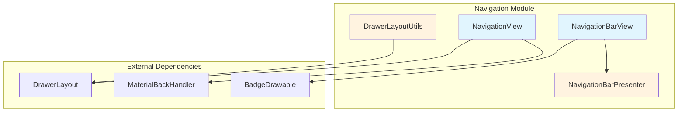
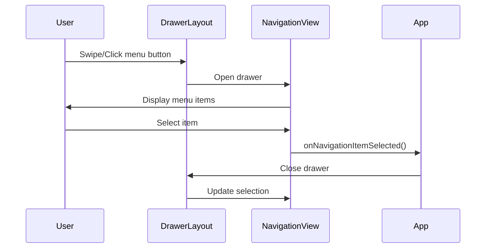
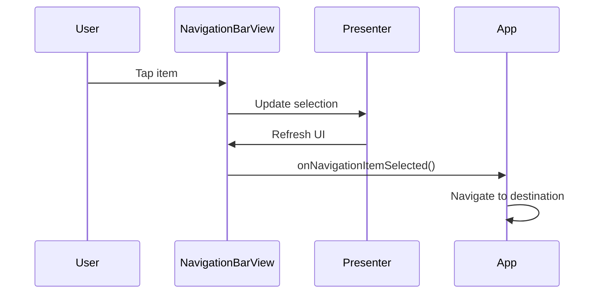

# Navigation Module Documentation

## Overview

The Navigation module provides Material Design navigation components for Android applications, offering a comprehensive set of tools for creating intuitive and consistent navigation experiences. This module implements the Material Design navigation patterns including navigation drawers, bottom navigation, and navigation rails.

## Architecture

The Navigation module is structured around four main component categories that work together to provide flexible navigation solutions:

## Core Components

### 1. NavigationView
The primary component for implementing navigation drawers, typically placed inside a DrawerLayout. It provides a comprehensive navigation menu with support for headers, items, and subheaders.

**Key Features:**
- Material Design navigation drawer implementation
- Integration with DrawerLayout for slide-out navigation
- Support for menu headers and custom views
- Back gesture handling for modern Android versions
- Edge-to-edge display support with inset scrims
- Shapeable backgrounds with corner radius customization

**Related Files:**
- NavigationView.java - Main implementation
- NavigationView.SavedState - State persistence

**Detailed Documentation:** [NavigationView Core](navigation-view-core.md)

### 2. NavigationBarView
An abstract base class that provides common functionality for bottom navigation bars and navigation rails. It handles item selection, state management, and visual customization.

**Key Features:**
- Abstract implementation for navigation bars
- Support for item selection and reselection events
- Badge integration for notification indicators
- Active indicator customization
- Label visibility modes (auto, selected, labeled, unlabeled)
- Icon gravity and item gravity configurations

**Related Files:**
- NavigationBarView.java - Abstract base implementation
- NavigationBarView.SavedState - State persistence

**Detailed Documentation:** [NavigationBar Core](navigation-bar-core.md)

### 3. NavigationBarPresenter
A MenuPresenter implementation that bridges the gap between the menu data model and the navigation bar view, handling menu updates and state synchronization.

**Key Features:**
- Menu presentation logic
- Badge state management
- Menu item state synchronization
- Update suspension for batch operations

**Related Files:**
- NavigationBarPresenter.java - Presenter implementation
- NavigationBarPresenter.SavedState - State persistence

### 4. DrawerLayoutUtils
Utility class providing helper methods for DrawerLayout integration, particularly for animation and visual effects.

**Key Features:**
- Scrim color animation utilities
- Drawer close animation support
- Smooth transitions for drawer operations

**Related Files:**
- DrawerLayoutUtils.java - Utility methods

**Detailed Documentation:** [Drawer Utils](drawer-utils.md)

## Integration Patterns

### Navigation Drawer Pattern

### Bottom Navigation Pattern

## State Management

All navigation components implement comprehensive state persistence through SavedState classes:

- **NavigationView.SavedState**: Persists menu state and checked items
- **NavigationBarView.SavedState**: Persists menu presenter state
- **NavigationBarPresenter.SavedState**: Persists selected item ID and badge states

## Styling and Customization

The module supports extensive customization through Material Design theming:

### NavigationView Styling
- Background colors and shapes
- Item text appearance and colors
- Icon tinting and sizing
- Divider and subheader styling
- Ripple effects and padding

### NavigationBarView Styling
- Active indicator customization (color, shape, size)
- Label visibility and text appearance
- Icon gravity and item gravity
- Badge integration
- Background elevation and tinting

## Dependencies

The Navigation module integrates with several other Material Design components:

- **[Badge Module](badge.md)**: For notification indicators on navigation items
- **[Shape Module](shape.md)**: For customizable backgrounds and indicators
- **[Animation Module](animation.md)**: For smooth transitions and effects
- **[Theme Module](theme.md)**: For consistent styling across components

## Best Practices

1. **NavigationView Usage**:
   - Always place inside a DrawerLayout
   - Use appropriate gravity (start/end) for RTL support
   - Implement proper back handling for gesture navigation
   - Consider edge-to-edge display for modern Android versions

2. **NavigationBarView Usage**:
   - Limit to 3-5 items for optimal usability
   - Use appropriate label visibility modes
   - Implement both selection and reselection listeners
   - Consider active indicators for better visual feedback

3. **State Management**:
   - Always save and restore navigation state
   - Handle configuration changes properly
   - Maintain selection state across app lifecycle

4. **Accessibility**:
   - Provide descriptive labels for all navigation items
   - Ensure proper contrast ratios
   - Support screen readers and navigation
   - Test with accessibility services enabled

## Migration Guide

When migrating from older navigation implementations:

1. Replace custom drawer implementations with NavigationView
2. Update navigation bar implementations to extend NavigationBarView
3. Migrate state management to use SavedState classes
4. Update theming to use Material Design attributes
5. Implement proper back handling for modern Android versions

## Performance Considerations

- Use `setUpdateSuspended(true)` for batch menu updates
- Avoid frequent menu item additions/removals
- Consider using badges judiciously to avoid visual clutter
- Implement proper view recycling for large navigation menus
- Use appropriate label visibility modes to reduce layout complexity