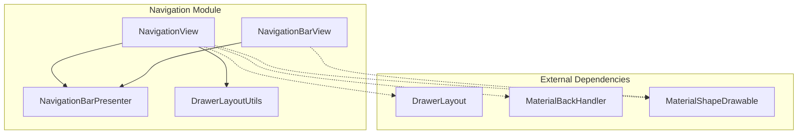

# Navigation Module Documentation

## Overview

The Navigation module provides Material Design navigation components for Android applications, offering a comprehensive set of tools for creating intuitive and consistent navigation experiences. This module implements the Material Design navigation patterns including navigation drawers, bottom navigation, and navigation rails.

## Architecture

The Navigation module is structured around several key components that work together to provide flexible navigation solutions:


```mermaid
graph TB
    subgraph "Navigation Module"
        NV[NavigationView]
        NBV[NavigationBarView]
        NBP[NavigationBarPresenter]
        DLU[DrawerLayoutUtils]
        
        NV --> NBP
        NBV --> NBP
        NV --> DLU
    end
    
    subgraph "External Dependencies"
        DL[DrawerLayout]
        MB[MaterialBackHandler]
        MS[MaterialShapeDrawable]
    end
    
    NV -.-> DL
    NV -.-> MB
    NV -.-> MS
    NBV -.-> MS
```

## Core Components

### 1. NavigationView
The primary component for implementing navigation drawers. It provides a vertically scrollable menu structure typically placed within a DrawerLayout.

**Key Features:**
- Material Design compliant navigation drawer
- Support for headers, menu items, and dividers
- Integration with DrawerLayout for slide-out navigation
- Back gesture support for Android 13+
- Shape appearance customization
- Edge-to-edge display support

**Dependencies:**
- [appbar.md](appbar.md) - For AppBarLayout integration
- [internal.md](internal.md) - For theme management and utilities
- [shape.md](shape.md) - For customizable shapes
- [theme.md](theme.md) - For Material theming

### 2. NavigationBarView
An abstract base class for bottom navigation and navigation rail components, providing common functionality for horizontal navigation patterns.

**Key Features:**
- Abstract implementation for navigation bars
- Support for 3-5 navigation destinations
- Active indicator animations
- Label visibility modes (auto, selected, labeled, unlabeled)
- Icon gravity options (top, start)
- Badge support for notifications

**Dependencies:**
- [badge.md](badge.md) - For notification badges
- [shape.md](shape.md) - For active indicator shapes
- [theme.md](theme.md) - For Material theming

### 3. NavigationBarPresenter
Internal presenter class that manages the menu state and presentation logic for navigation components.

**Key Features:**
- Menu state management
- Badge state persistence
- Item selection handling
- Integration with Android's menu system

### 4. DrawerLayoutUtils
Utility class providing animation helpers for DrawerLayout integration.

**Key Features:**
- Scrim color animations
- Drawer close animations
- Smooth transition effects

## Sub-modules

The Navigation module can be divided into several logical sub-modules:

### Navigation Drawer
- **File:** [navigation-drawer.md](navigation-drawer.md)
- **Purpose:** Implements slide-out navigation drawers
- **Key Components:** NavigationView, DrawerLayout integration
- **Details:** Comprehensive documentation for NavigationView implementation, state management, and Material Design compliance

### Navigation Bar
- **File:** [navigation-bar.md](navigation-bar.md) 
- **Purpose:** Provides bottom navigation and navigation rail functionality
- **Key Components:** NavigationBarView, item management, active indicators
- **Details:** Complete guide to NavigationBarView usage, customization options, and integration patterns

### Navigation Utilities
- **File:** [navigation-utilities.md](navigation-utilities.md)
- **Purpose:** Helper classes and utilities for navigation components
- **Key Components:** DrawerLayoutUtils, state management
- **Details:** Utility functions for animations, scrim effects, and drawer interactions

## Integration Patterns

### Basic Navigation Drawer Setup
```xml
<androidx.drawerlayout.widget.DrawerLayout>
    <!-- Main content -->
    <com.google.android.material.navigation.NavigationView
        android:layout_gravity="start"
        app:menu="@menu/navigation_menu" />
</androidx.drawerlayout.widget.DrawerLayout>
```

### Navigation Bar Implementation
NavigationBarView serves as the base for both BottomNavigationView and NavigationRailView, providing consistent behavior across different navigation patterns.

## State Management

The module implements comprehensive state management through:

- **SavedState classes:** Handle configuration changes and state persistence
- **Menu presenters:** Manage menu item states and selections
- **Badge state:** Preserve notification badge states across configuration changes

## Material Design Compliance

All navigation components follow Material Design guidelines including:

- Proper elevation and shadows
- Consistent color theming
- Appropriate animations and transitions
- Accessibility support
- Responsive design patterns

## Related Documentation

- [Material Design Navigation Guidelines](https://material.io/components/navigation)
- [Bottom Navigation Documentation](bottom-navigation.md)
- [Navigation Rail Documentation](navigation-rail.md)
- [Drawer Layout Documentation](drawer-layout.md)