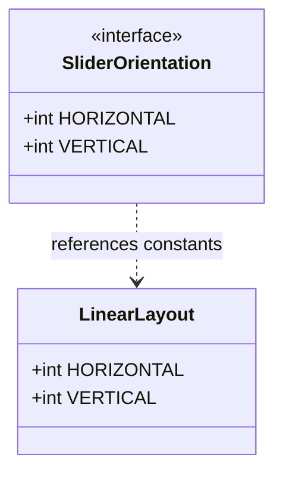
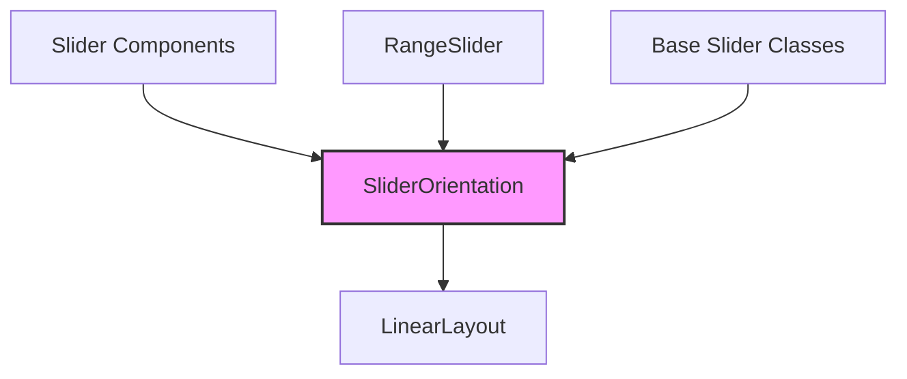
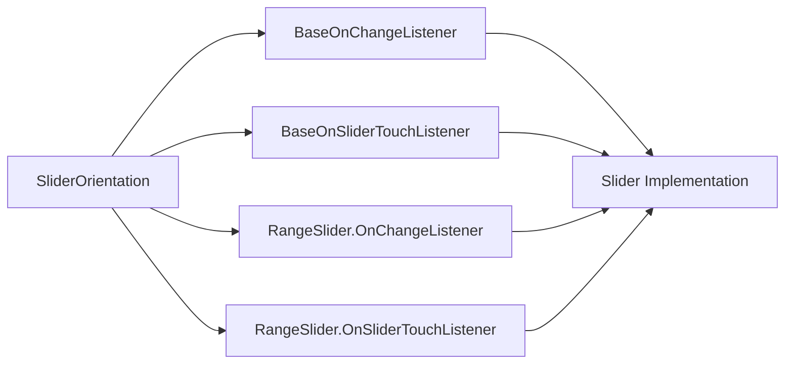
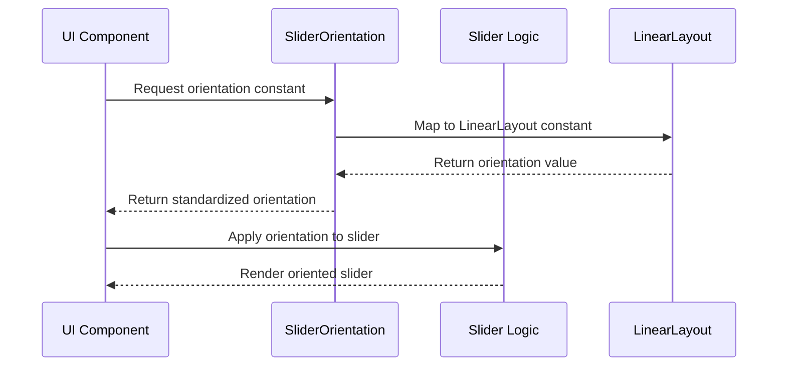

# Orientation Module Documentation

## Introduction

The orientation module provides a standardized interface for defining and managing orientation properties in Material Design components, specifically for slider controls. This module serves as a foundational component that ensures consistent orientation behavior across the Material Design component library.

## Module Overview

The orientation module is a lightweight, focused component that defines the fundamental orientation constants used throughout the Material Design system. It provides a clean abstraction over Android's native LinearLayout orientation constants, ensuring type safety and consistency in orientation handling.

## Core Components

### SliderOrientation Interface

The `SliderOrientation` interface is the primary component of this module, providing a standardized way to define orientation properties for slider components.

**Key Features:**
- Defines horizontal and vertical orientation constants
- Maps to Android's LinearLayout orientation constants
- Provides type-safe orientation specification
- Ensures consistency across Material Design slider implementations

**Constants:**
- `HORIZONTAL`: Represents horizontal orientation (maps to `LinearLayout.HORIZONTAL`)
- `VERTICAL`: Represents vertical orientation (maps to `LinearLayout.VERTICAL`)

## Architecture

### Component Structure



### Module Dependencies



## Integration with Slider Module

The orientation module is designed to work seamlessly with the broader slider module ecosystem:

### Relationship with Slider Components



### Data Flow



## Usage Patterns

### Basic Implementation

The orientation module is typically used as follows:

1. **Import the interface**: Components import `SliderOrientation` to access orientation constants
2. **Apply orientation**: Use `HORIZONTAL` or `VERTICAL` constants when configuring slider layout
3. **Consistency**: Ensures all slider components use the same orientation definitions

### Integration Example

```java
// Example usage in a slider component
public class CustomSlider extends View implements SliderOrientation {
    private int orientation = HORIZONTAL; // Default to horizontal
    
    public void setOrientation(int orientation) {
        if (orientation == HORIZONTAL || orientation == VERTICAL) {
            this.orientation = orientation;
            requestLayout();
        }
    }
}
```

## Design Principles

### Consistency
- Provides standardized orientation constants across all Material Design slider components
- Ensures uniform behavior and appearance
- Reduces code duplication and potential errors

### Type Safety
- Interface-based approach provides compile-time checking
- Prevents invalid orientation values
- Clear contract for orientation handling

### Minimalism
- Lightweight interface with only essential constants
- No unnecessary complexity or dependencies
- Focused on a single responsibility

## Related Modules

The orientation module works in conjunction with several other modules in the Material Design system:

- **[slider](slider.md)**: Main slider module that uses orientation constants
- **[range-slider](range-slider.md)**: Range slider implementations that leverage orientation
- **[base-listeners](base-listeners.md)**: Listener components that may be orientation-aware

## Technical Specifications

### Performance Considerations
- Zero runtime overhead (constants are inlined at compile time)
- No memory allocation beyond the interface definition
- Minimal impact on application size

### Compatibility
- Compatible with all Android versions supporting LinearLayout
- No version-specific dependencies
- Forward and backward compatible design

### Thread Safety
- Constants are immutable and thread-safe
- No state management required
- Safe for use in multi-threaded environments

## Future Considerations

### Potential Enhancements
- Additional orientation options (diagonal, circular)
- Orientation animation support
- Accessibility improvements for orientation changes

### Extension Points
- Custom orientation implementations
- Orientation-aware layout managers
- Integration with responsive design patterns

## Conclusion

The orientation module serves as a foundational component that brings consistency and standardization to orientation handling in Material Design slider components. Its simple, focused design ensures that all slider implementations can reliably and consistently handle orientation properties while maintaining the flexibility needed for diverse use cases.