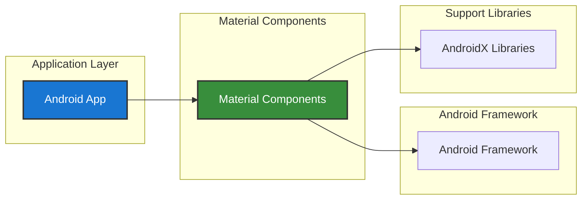

# Material Components for Android - Repository Overview

## Purpose

The `material-components--material-components-android` repository is the official Android implementation of Google's Material Design Components library. It provides a comprehensive collection of UI components that implement Material Design principles, enabling developers to build consistent, beautiful, and accessible Android applications with minimal effort.

## Repository Architecture

The repository follows a modular architecture where each UI component is organized as a self-contained module with its own directory structure, components, and documentation. The architecture enables selective component usage and maintains clear separation of concerns.

```mermaid
graph TB
    subgraph "Material Components Repository"
        A[AppBar] --> A1[AppBarLayout]
        A --> A2[CollapsingToolbarLayout]
        
        B[Button] --> B1[MaterialButton]
        B --> B2[MaterialButtonGroup]
        B --> B3[MaterialSplitButton]
        
        C[Card] --> C1[MaterialCardView]
        
        D[Navigation] --> D1[NavigationView]
        D --> D2[NavigationBarView]
        D --> D3[BottomNavigationView]
        
        E[TextField] --> E1[TextInputLayout]
        E --> E2[TextInputEditText]
        
        F[Other Components]
        F --> F1[Tabs]
        F --> F2[BottomSheet]
        F --> F3[FloatingActionButton]
        F --> F4[Snackbar]
        F --> F5[Slider]
        F --> F6[DatePicker]
        F --> F7[Color]
        F --> F8[Shape]
        F --> F9[Transition]
        F --> F10[Carousel]
        F --> F11[Search]
        F --> F12[SideSheet]
        F --> F13[ProgressIndicator]
        F --> F14[Divider]
        F --> F15[Badge]
        F --> F16[Behavior]
    end
    
    subgraph "Core Systems"
        CS[Color System]
        TS[Theme System]
        SS[Shape System]
        AS[Animation System]
    end
    
    A -.-> CS
    B -.-> CS
    C -.-> CS
    D -.-> CS
    E -.-> CS
    F -.-> CS
    
    A -.-> TS
    B -.-> TS
    C -.-> TS
    D -.-> TS
    E -.-> TS
    F -.-> TS
    
    A -.-> SS
    B -.-> SS
    C -.-> SS
    D -.-> SS
    E -.-> SS
    F -.-> SS
    
    A -.-> AS
    B -.-> AS
    C -.-> AS
    D -.-> AS
    E -.-> AS
    F -.-> AS
```

## Core Module Categories

### 1. Navigation Components
- **AppBar**: Collapsing toolbars with scroll behaviors
- **Navigation**: Drawer and bottom navigation patterns
- **Tabs**: Horizontal tab navigation with ViewPager integration
- **BottomNavigation**: Bottom navigation bar implementation

### 2. Input Components
- **TextField**: Material Design text input with floating labels
- **Button**: Various button styles including split buttons and groups
- **Checkbox**: Three-state checkbox with Material theming
- **Slider**: Single and range value selection controls
- **Chip**: Compact elements for selections and filters

### 3. Display Components
- **Card**: Container components with elevation and shape
- **Snackbar**: Transient bottom bar notifications
- **Badge**: Notification indicators for UI elements
- **Divider**: Visual separators with Material styling

### 4. Advanced Components
- **BottomSheet**: Modal bottom sheets with drag gestures
- **SideSheet**: Side-sliding panels for supplementary content
- **FloatingActionButton**: Primary action buttons with behaviors
- **Carousel**: Dynamic scrolling layouts with item transformations
- **Search**: Coordinated search bar and view components
- **DatePicker**: Calendar and text input date selection
- **ProgressIndicator**: Animated progress indicators

### 5. Foundation Systems
- **Color**: Dynamic colors, harmonization, and contrast support
- **Shape**: Material Design shape theming and customization
- **Transition**: Motion patterns and animation utilities
- **Behavior**: Scroll-based view behaviors for CoordinatorLayout

## Key Features

### Material Design Compliance
All components implement Material Design 3 specifications with proper theming, motion, and accessibility support.

### Modular Architecture
Each component is self-contained with clear dependencies, enabling selective usage and reducing bundle size.

### Theme Integration
Comprehensive theming support with Material Design color systems, shape theming, and typography scales.

### Accessibility
Full accessibility support including screen readers, keyboard navigation, and high contrast modes.

### Performance Optimizations
Hardware-accelerated animations, efficient view recycling, and memory-conscious implementations.

### Backward Compatibility
Support for Android API 21+ with graceful degradation on older versions.

## Integration Patterns

## Development Workflow

The repository supports:
- **Selective Component Usage**: Import only needed components
- **Custom Theming**: Override default styles and behaviors
- **Extensibility**: Subclass components for custom implementations
- **Testing**: Comprehensive testing utilities and mock components

## Documentation Structure

Each module includes:
- **Core Documentation**: Component overview and usage examples
- **Sub-module Documentation**: Detailed component breakdowns
- **Integration Guides**: Cross-component usage patterns
- **API References**: Complete method and attribute documentation

This repository serves as the definitive implementation of Material Design for Android, providing developers with a robust, well-documented, and thoroughly tested component library for building modern Android applications.