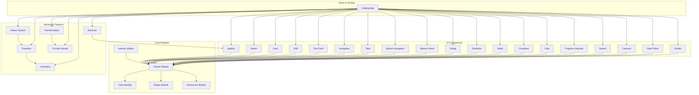

# Material Components for Android - Repository Overview

## Purpose

The `material-components--material-components-android` repository is the official Android implementation of Google's Material Design Components library. It provides a comprehensive collection of UI components that implement Material Design principles, enabling developers to build beautiful, functional, and consistent Android applications with minimal effort.

## Repository Architecture

The repository follows a modular architecture where each Material Design component is implemented as a self-contained module with clear dependencies and integration points.


```mermaid
graph TB
    subgraph "Core Modules"
        theme[Theme Module]
        color[Color Module]
        shape[Shape Module]
        resources[Resources Module]
        internal[Internal Utilities]
    end
    
    subgraph "UI Components"
        appbar[AppBar]
        button[Button]
        card[Card]
        fab[FAB]
        textfield[Text Field]
        navigation[Navigation]
        tabs[Tabs]
        bottomnav[Bottom Navigation]
        bottomsheet[Bottom Sheet]
        dialog[Dialog]
        snackbar[Snackbar]
        slider[Slider]
        checkbox[Checkbox]
        chip[Chip]
        progress[Progress Indicator]
        search[Search]
        carousel[Carousel]
        datepicker[Date Picker]
        divider[Divider]
    end
    
    subgraph "Advanced Features"
        transition[Transition]
        transformation[Transformation]
        circularreveal[Circular Reveal]
        behavior[Behavior]
        motion[Motion System]
        animation[Animation]
    end
    
    subgraph "Demo & Testing"
        catalog[Catalog App]
    end
    
    theme --> color
    theme --> shape
    theme --> resources
    internal --> theme
    
    appbar --> theme
    button --> theme
    card --> theme
    fab --> theme
    textfield --> theme
    navigation --> theme
    tabs --> theme
    bottomnav --> theme
    bottomsheet --> theme
    dialog --> theme
    snackbar --> theme
    slider --> theme
    checkbox --> theme
    chip --> theme
    progress --> theme
    search --> theme
    carousel --> theme
    datepicker --> theme
    divider --> theme
    
    transition --> animation
    transformation --> circularreveal
    behavior --> appbar
    motion --> transition
    
    catalog --> appbar
    catalog --> button
    catalog --> card
    catalog --> fab
    catalog --> textfield
    catalog --> navigation
    catalog --> tabs
    catalog --> bottomnav
    catalog --> bottomsheet
    catalog --> dialog
    catalog --> snackbar
    catalog --> slider
    catalog --> checkbox
    catalog --> chip
    catalog --> progress
    catalog --> search
    catalog --> carousel
    catalog --> datepicker
    catalog --> divider
    catalog --> transition
    catalog --> transformation
    catalog --> circularreveal
    catalog --> behavior
    catalog --> motion
    catalog --> animation
```

## Core Module Documentation

### Foundation Modules

- **[Theme Module](theme.md)**: Provides automatic view inflation and theme overlay system for consistent Material Design theming across all components
- **[Color Module](color.md)**: Implements dynamic colors, color harmonization, contrast control, and advanced color science utilities
- **[Shape Module](shape.md)**: Enables custom shape definitions, corner treatments, edge treatments, and dynamic shape morphing
- **[Resources Module](resources.md)**: Handles theme attribute resolution, resource loading, text appearance configuration, and typeface utilities
- **[Internal Utilities](internal.md)**: Provides essential helper classes for view manipulation, theme enforcement, context operations, and system integration

### UI Component Modules

- **[AppBar](appbar.md)**: Implements flexible app bars with scrolling behaviors, elevation changes, and collapsing toolbar effects
- **[Button](button.md)**: Provides Material Design buttons with enhanced styling, theming, and group functionality
- **[Card](card.md)**: Offers Material Design cards with customizable shapes, states, and rich content support
- **[FAB](fab.md)**: Implements floating action buttons with extended variants and CoordinatorLayout integration
- **[Text Field](text-field.md)**: Provides enhanced text input with floating labels, validation, and various visual styles
- **[Navigation](navigation.md)**: Implements navigation drawers, bottom navigation, and navigation rails
- **[Tabs](tabs.md)**: Offers comprehensive tab-based navigation with ViewPager integration
- **[Bottom Navigation](bottom-navigation.md)**: Provides bottom navigation bars for 3-5 top-level destinations
- **[Bottom Sheet](bottom-sheet.md)**: Implements modal bottom sheets with multiple states and smooth animations
- **[Dialog](dialog.md)**: Provides utility functionality for Material Design compliant dialogs
- **[Snackbar](snackbar.md)**: Offers lightweight feedback messages with action integration
- **[Slider](slider.md)**: Implements Material Design sliders for value selection
- **[Checkbox](checkbox.md)**: Provides three-state checkboxes with Material Design theming
- **[Chip](chip.md)**: Offers compact elements for input, attributes, or actions
- **[Progress Indicator](progress-indicator.md)**: Implements loading and progress indicators
- **[Search](search.md)**: Provides search bar and search view components
- **[Carousel](carousel.md)**: Offers stylized scrollable lists with dynamic item transformations
- **[Date Picker](date-picker.md)**: Implements comprehensive date selection components
- **[Divider](divider.md)**: Provides visual separation components

### Advanced Feature Modules

- **[Transition](transition.md)**: Provides comprehensive animation and transition components for Material Design motion patterns
- **[Transformation](transformation.md)**: Enables smooth morphing animations between UI elements (deprecated, use Transition module)
- **[Circular Reveal](circular-reveal.md)**: Implements circular reveal animations for expanding/collapsing UI elements
- **[Behavior](behavior.md)**: Provides scroll-based interaction behaviors for Material Design components
- **[Motion System](motion.md)**: Integrates with Material Design motion guidelines and back gesture handling
- **[Animation](animation.md)**: Offers foundational animation utilities and compatibility helpers

### Demo & Testing

- **[Catalog](catalog.md)**: Comprehensive demonstration app showcasing all Material Design components with interactive examples

## Key Features

### Material Design Compliance
- Full implementation of Material Design 3 specifications
- Consistent theming and styling across all components
- Accessibility support with proper ARIA labels and keyboard navigation
- RTL (Right-to-Left) layout support for international applications

### Developer Experience
- Extensive customization options through XML attributes and programmatic APIs
- Comprehensive documentation with usage examples
- Backward compatibility with older Android versions
- Seamless integration with existing Android applications

### Performance & Quality
- Hardware-accelerated animations and transitions
- Efficient memory management and view recycling
- Comprehensive testing suite with unit and integration tests
- Continuous integration and automated quality checks

## Integration Patterns

The repository is designed to be used as a dependency in Android projects through Gradle:

```gradle
implementation 'com.google.android.material:material:1.9.0'
```

Each component can be used independently or in combination with others, following Material Design principles for consistent user experiences.

## Development & Contribution

The repository follows Android development best practices with:
- Modular architecture for maintainability
- Comprehensive documentation for each component
- Extensive test coverage
- Continuous integration pipeline
- Clear contribution guidelines

This repository represents the definitive implementation of Material Design for Android, providing developers with a robust foundation for building modern, beautiful, and accessible Android applications.