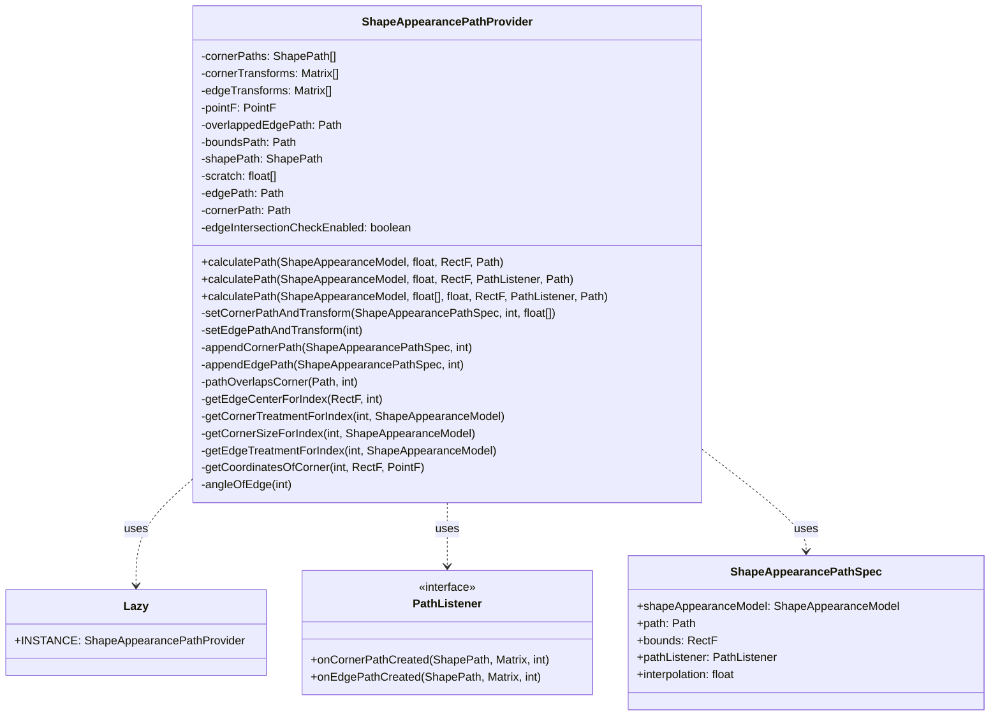
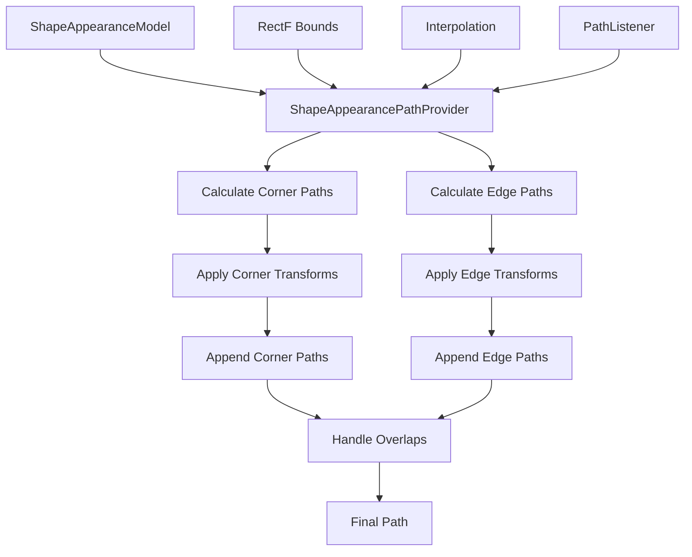
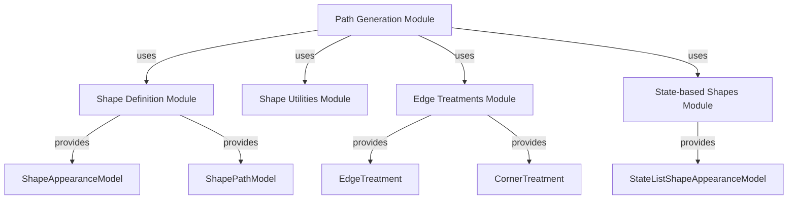
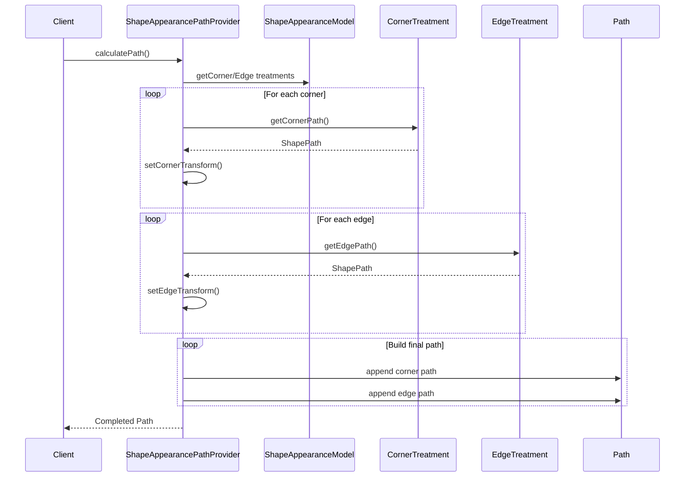

# Path Generation Module Documentation

## Introduction

The path-generation module is a critical component of the Material Design Components (MDC) library that handles the conversion of abstract shape definitions into actual Android graphics paths. This module serves as the bridge between the declarative shape appearance models and the imperative path drawing operations required by the Android graphics system.

## Module Overview

The path-generation module is responsible for transforming geometric shape specifications into renderable `android.graphics.Path` objects. It provides the core functionality for materializing complex shapes with custom corner treatments, edge treatments, and interpolations that are fundamental to Material Design's expressive shape system.

## Core Architecture

### Primary Component: ShapeAppearancePathProvider

The module centers around the `ShapeAppearancePathProvider` class, which implements a singleton pattern through its nested `Lazy` static class. This provider is the main entry point for converting `ShapeAppearanceModel` instances into `Path` objects.



## Data Flow Architecture

The path generation process follows a systematic approach to transform shape definitions into drawable paths:



## Component Relationships

The path-generation module interacts with several other modules within the Material Design Components system:



## Key Functional Components

### 1. Path Calculation Engine

The core path calculation engine processes shape appearance models through multiple stages:

- **Corner Processing**: Transforms corner treatments into geometric paths
- **Edge Processing**: Converts edge treatments into path segments
- **Transform Application**: Applies rotation and translation matrices
- **Overlap Handling**: Manages complex intersections between edges and corners

### 2. Interpolation Support

The module supports dynamic shape interpolation, allowing for smooth transitions between different shape states. This is essential for animations and interactive material design components.

### 3. Corner Size Override System

Provides flexibility to override corner sizes specified in the shape appearance model, enabling dynamic corner radius adjustments.

### 4. Path Listener Interface

Offers a callback mechanism for monitoring path generation progress, useful for debugging and custom rendering scenarios.

## Process Flow

The path generation follows a systematic process:



## Integration with Material Design System

The path-generation module is fundamental to the Material Design shape system, enabling:

- **Custom Component Shapes**: Material buttons, cards, and surfaces with custom shapes
- **Animated Shape Transitions**: Smooth morphing between different shape states
- **Theme-based Shapes**: Dynamic shape adaptation based on material themes
- **Edge and Corner Customization**: Complex edge treatments and corner styles

## Performance Considerations

The module implements several optimization strategies:

- **Object Reuse**: Pre-allocated arrays and objects to minimize garbage collection
- **Lazy Initialization**: Singleton pattern ensures single instance creation
- **Matrix Caching**: Reuses transformation matrices for efficiency
- **Path Intersection Optimization**: Smart overlap detection and handling

## Thread Safety

The `ShapeAppearancePathProvider` is designed with `@UiThread` annotation, ensuring that path calculations occur on the main UI thread. This is critical for Android graphics operations and prevents potential concurrency issues.

## Error Handling

The module includes robust error handling for edge cases:

- **Invalid Bounds**: Handles zero or negative dimension bounds
- **Path Intersections**: Manages complex overlapping scenarios
- **Rounding Errors**: Compensates for floating-point precision issues
- **Empty Paths**: Gracefully handles degenerate shape cases

## Dependencies

The path-generation module relies on several key dependencies:

- **Shape Definition Module**: Provides `ShapeAppearanceModel` and related shape definitions
- **Android Graphics Framework**: Core `Path`, `Matrix`, and `RectF` classes
- **Material Shape Utilities**: Helper classes for shape manipulation
- **Edge Treatment Components**: Custom edge and corner treatment implementations

## Usage Patterns

### Basic Path Generation
```java
ShapeAppearancePathProvider provider = ShapeAppearancePathProvider.getInstance();
Path path = new Path();
RectF bounds = new RectF(0, 0, 100, 100);
provider.calculatePath(shapeAppearanceModel, 1.0f, bounds, path);
```

### Advanced Usage with Listener
```java
provider.calculatePath(shapeAppearanceModel, interpolation, bounds, 
    new PathListener() {
        @Override
        public void onCornerPathCreated(ShapePath cornerPath, Matrix transform, int count) {
            // Handle corner path creation
        }
        
        @Override
        public void onEdgePathCreated(ShapePath edgePath, Matrix transform, int count) {
            // Handle edge path creation
        }
    }, path);
```

## Future Considerations

The path-generation module is designed to be extensible for future enhancements:

- **GPU Acceleration**: Potential integration with GPU-based path rendering
- **Complex Shape Support**: Enhanced support for non-rectangular base shapes
- **Performance Optimization**: Further optimization for complex shape calculations
- **Accessibility**: Enhanced support for accessibility features in shaped components

## Related Documentation

- [Shape Definition Module](shape-definition.md) - Core shape model definitions
- [Shape Utilities Module](shape-utilities.md) - Helper utilities for shape operations
- [Edge Treatments Module](edge-treatments.md) - Custom edge and corner treatments
- [State-based Shapes Module](state-based-shapes.md) - Dynamic shape state management