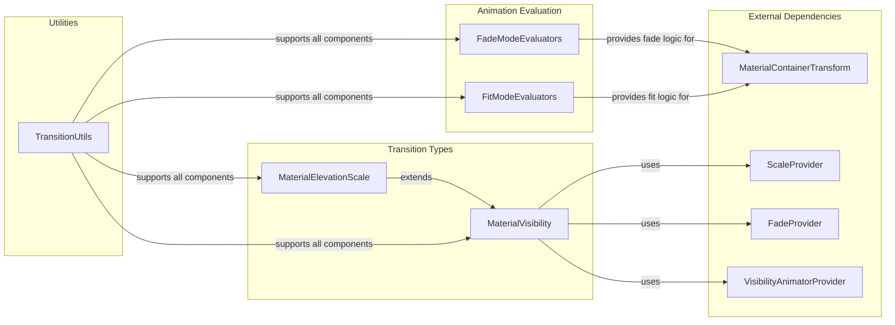
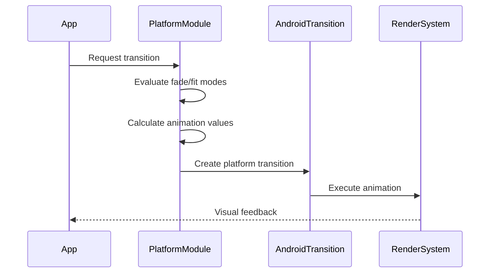
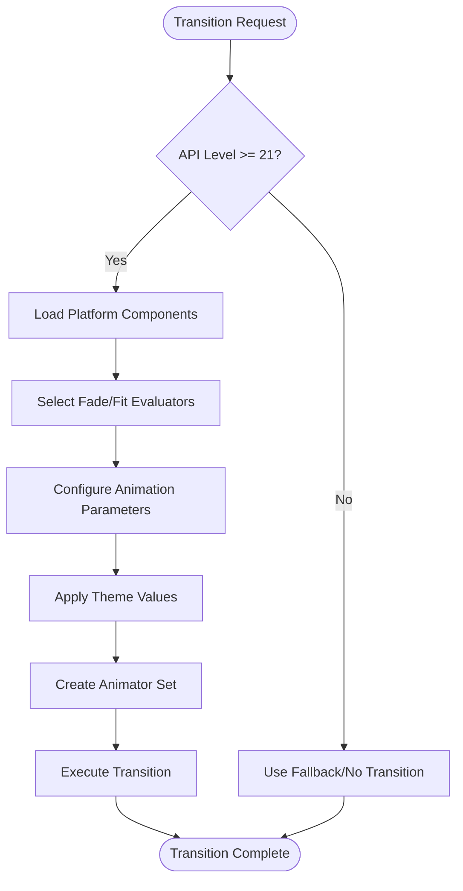
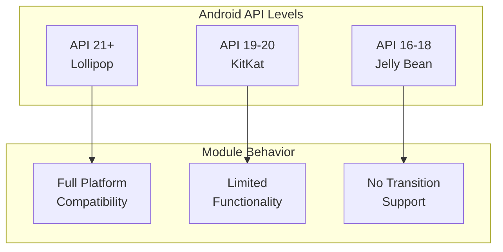

```mermaid
graph TB
    subgraph "Platform Compatibility Module"
        FMEV[FadeModeEvaluators<br/><i>lib.java.com.google.android.material.transition.platform.FadeModeEvaluators.FadeModeEvaluators</i>]
        FTMEV[FitModeEvaluators<br/><i>lib.java.com.google.android.material.transition.platform.FitModeEvaluators.FitModeEvaluators</i>]
        MES[MaterialElevationScale<br/><i>lib.java.com.google.android.material.transition.platform.MaterialElevationScale.MaterialElevationScale</i>]
        MV[MaterialVisibility<br/><i>lib.java.com.google.android.material.transition.platform.MaterialVisibility.MaterialVisibility</i>]
        TU[TransitionUtils<br/><i>lib.java.com.google.android.material.transition.platform.TransitionUtils.TransitionUtils</i>]
    end
    
    subgraph "Parent Transition Module"
        FMEV_P[FadeModeEvaluators<br/>Parent Implementation]
        FTMEV_P[FitModeEvaluators<br/>Parent Implementation]
        MES_P[MaterialElevationScale<br/>Parent Implementation]
        MV_P[MaterialVisibility<br/>Parent Implementation]
        TU_P[TransitionUtils<br/>Parent Implementation]
    end
    
    FMEV_P -.->|"Auto-generated<br/>from"| FMEV
    FTMEV_P -.->|"Auto-generated<br/>from"| FTMEV
    MES_P -.->|"Auto-generated<br/>from"| MES
    MV_P -.->|"Auto-generated<br/>from"| MV
    TU_P -.->|"Auto-generated<br/>from"| TU
```

# Platform Compatibility Module

## Introduction

The platform-compatibility module provides Android API level compatibility wrappers for Material Design transition animations. This module ensures that advanced transition effects work consistently across different Android versions, particularly for API levels 21 (Lollipop) and above where the Android Transition framework is available.

## Overview

The platform-compatibility module serves as a compatibility layer that bridges the gap between Material Design's advanced transition system and Android's platform-specific transition capabilities. It provides platform-specific implementations of core transition components while maintaining API consistency across different Android versions. All components in this module are auto-generated from the parent transition package and require Android API 21+ (Lollipop) for full functionality.

## Architecture

### Core Components

The module consists of five primary components that work together to provide platform-compatible transition functionality:



### Component Relationships



## Architecture

### Core Components

The module consists of five primary components that work together to provide platform-compatible transition functionality:


### Component Relationships


## Component Details

### FadeModeEvaluators

**Purpose**: Provides platform-specific fade animation evaluation logic for container transforms.

**Key Features**:
- Supports four fade modes: IN, OUT, CROSS, and THROUGH
- Calculates alpha values based on transition progress
- Handles both entering and exiting animations
- Uses linear interpolation for smooth transitions

**Implementation Details**:
- Auto-generated from parent transition package
- Requires API level 21+ (Lollipop)
- Provides static instances for each fade mode
- Returns appropriate evaluator based on fade mode and direction

**Fade Modes:**
- **IN**: Gradually increases alpha from 0 to 255
- **OUT**: Gradually decreases alpha from 255 to 0  
- **CROSS**: Simultaneous fade out of start view and fade in of end view
- **THROUGH**: Staggered fade with configurable threshold

### FitModeEvaluators

**Purpose**: Manages scaling and fitting logic for container transform animations.

**Key Features**:
- Supports three fit modes: AUTO, WIDTH, and HEIGHT
- Calculates scale factors for smooth size transitions
- Handles aspect ratio preservation
- Provides intelligent auto-fitting based on bounds comparison

**Implementation Details**:
- Auto-generated from parent transition package
- Requires API level 21+ (Lollipop)
- Uses width-based or height-based scaling strategies
- Includes masking logic for overflow handling

**Fit Modes:**
- **WIDTH**: Maintains width, scales height based on aspect ratio
- **HEIGHT**: Maintains height, scales width based on aspect ratio
- **AUTO**: Intelligently chooses between width or height fitting

### MaterialElevationScale

**Purpose**: Implements elevation-based scaling transitions for visual depth effects.

**Key Features**:
- Scales surfaces to emphasize elevation changes
- Configurable growth direction (growing/shrinking)
- Default scale factor of 0.85 for subtle effects
- Combines scale and fade animations

**Implementation Details**:
- Auto-generated from parent transition package
- Requires API level 21+ (Lollipop)
- Extends MaterialVisibility for consistent behavior
- Uses ScaleProvider as primary animator
- Includes FadeProvider as secondary animator

### MaterialVisibility

**Purpose**: Abstract base class for visibility transitions with primary and secondary animators.

**Key Features**:
- Composable animation architecture
- Support for primary, secondary, and additional animator providers
- Theme-aware duration and interpolation
- Handles both appear and disappear animations

**Implementation Details**:
- Auto-generated from parent transition package
- Requires API level 21+ (Lollipop)
- Extends Android's Visibility transition
- Provides flexible animator composition
- Includes theme integration capabilities

### TransitionUtils

**Purpose**: Provides utility functions for transition calculations and theme integration.

**Key Features**:
- Theme-based duration and interpolation resolution
- Path motion configuration
- Shape appearance interpolation
- Mathematical utilities for transitions
- Canvas transformation helpers

**Implementation Details**:
- Auto-generated from parent transition package
- Requires API level 21+ (Lollipop)
- Static utility methods
- Supports both enum-based and path-based motion
- Includes advanced interpolation functions

## Data Flow



## Process Flow



## Integration with System

### Dependencies

The platform-compatibility module integrates with several other Material Design components:

- **[MaterialContainerTransform](container-transforms.md)**: Uses FadeModeEvaluators and FitModeEvaluators for container transformation animations
- **[Animation Providers](animation-providers.md)**: MaterialVisibility uses various animator providers (ScaleProvider, FadeProvider, etc.)
- **[Theme System](theme.md)**: TransitionUtils integrates with theme attributes for consistent styling
- **[Motion System](common-utils.md)**: Uses MotionUtils for interpolation and timing functions

### Platform Requirements



## Usage Patterns

### Basic Implementation

```java
// Check platform compatibility
if (Build.VERSION.SDK_INT >= Build.VERSION_CODES.LOLLIPOP) {
    // Use platform-compatible transition
    MaterialElevationScale scale = new MaterialElevationScale(true);
    transition.setInterpolator(TransitionUtils.resolveThemeInterpolator(context, attrId));
}
```

### Advanced Configuration

```java
// Configure fade mode evaluators
FadeModeEvaluator evaluator = FadeModeEvaluators.get(
    MaterialContainerTransform.FADE_MODE_CROSS, 
    true
);

// Configure fit mode evaluators
FitModeEvaluator fitEvaluator = FitModeEvaluators.get(
    MaterialContainerTransform.FIT_MODE_AUTO,
    true,
    startBounds,
    endBounds
);
```

## Best Practices

1. **API Level Checking**: Always verify API level before using platform-specific features
2. **Graceful Degradation**: Provide fallback behavior for unsupported API levels
3. **Theme Integration**: Use theme attributes for consistent animation timing and easing
4. **Performance**: Reuse evaluator instances when possible to avoid object creation
5. **Testing**: Test transitions on various API levels and device configurations

## Limitations

- **API Level Dependency**: Requires Android API 21+ for full functionality
- **Auto-generated Code**: Components are auto-generated and should not be modified directly
- **Platform-specific**: Tied to Android's Transition framework, limiting cross-platform use
- **Performance**: Complex transitions may impact performance on older devices

## Future Considerations

- **API Level Expansion**: Potential support for lower API levels through alternative implementations
- **Performance Optimization**: Enhanced performance for complex transition scenarios
- **Extended Compatibility**: Support for newer Android transition features
- **Customization**: Increased flexibility in transition configuration options

## Summary

The platform-compatibility module is essential for ensuring Material Design transitions work consistently across Android versions. By providing auto-generated, platform-specific implementations of core transition components, it enables developers to create sophisticated animations while maintaining backward compatibility and leveraging native platform capabilities. The module's architecture promotes code reuse, performance optimization, and seamless integration with the broader Material Design Components system.
    CheckAPI -->|Yes| PlatformPath[Platform-Specific Implementation]
    CheckAPI -->|No| FallbackPath[Compatibility Fallback]
    
    PlatformPath --> EvalFade[Evaluate Fade Mode]
    PlatformPath --> EvalFit[Evaluate Fit Mode]
    PlatformPath --> CalcScale[Calculate Scaling]
    PlatformPath --> ApplyTheme[Apply Theme Values]
    
    EvalFade --> FadeResult[FadeModeResult]
    EvalFit --> FitResult[FitModeResult]
    CalcScale --> ScaleResult[Scale Configuration]
    ApplyTheme --> ThemeResult[Theme-Aware Settings]
    
    FallbackPath --> BasicFade[Basic Fade Logic]
    FallbackPath --> BasicScale[Basic Scale Logic]
    
    FadeResult --> Compose[Compose Animators]
    FitResult --> Compose
    ScaleResult --> Compose
    ThemeResult --> Compose
    BasicFade --> Compose
    BasicScale --> Compose
    
    Compose --> Execute[Execute Transition]
    Execute --> End([Transition Complete])
```

## Key Features

### API Level Compatibility
- **Minimum API**: Android 5.0 (API 21)
- **Auto-generation**: Components are auto-generated from parent transition package
- **Feature Detection**: Automatically detects and utilizes platform capabilities
- **Graceful Degradation**: Provides fallbacks for unsupported features

### Performance Optimization
- **Lazy Loading**: Components initialized only when needed
- **Efficient Calculations**: Optimized mathematical operations for smooth animations
- **Memory Management**: Proper cleanup and resource management
- **Hardware Acceleration**: Leverages GPU acceleration when available

### Theme Integration
- **Theme-Aware**: Respects Material Design theme attributes
- **Customizable**: Supports custom duration, interpolation, and path motion
- **Dynamic Resolution**: Resolves theme values at runtime
- **Consistent Styling**: Maintains visual consistency across transitions

## Integration with Other Modules

### Transition Module Dependencies
- **Container Transforms**: Provides evaluation logic for [container-transforms](container-transforms.md)
- **Visibility Transitions**: Forms base for [visibility-transitions](visibility-transitions.md)
- **Animation Providers**: Integrates with [animation-providers](animation-providers.md)
- **Utilities & Helpers**: Extends [utilities-helpers](utilities-helpers.md)

### Cross-Module Communication
- **Shape System**: Interfaces with [shape](shape.md) for corner interpolation
- **Motion System**: Coordinates with [motion](motion.md) for timing and interpolation
- **Theme System**: Respects [theme](theme.md) attributes and styling
- **Animation Utils**: Utilizes [common-utils](common-utils.md) for mathematical operations

## Usage Guidelines

### Best Practices
1. **API Level Check**: Always verify minimum API requirements
2. **Theme Integration**: Leverage theme attributes for consistency
3. **Performance**: Use appropriate fade/fit modes for optimal performance
4. **Testing**: Test on multiple API levels and device configurations

### Common Patterns
```java
// Fade mode evaluation
FadeModeEvaluator evaluator = FadeModeEvaluators.get(fadeMode, entering);
FadeModeResult result = evaluator.evaluate(progress, startFraction, endFraction, threshold);

// Fit mode selection
FitModeEvaluator fitEvaluator = FitModeEvaluators.get(fitMode, entering, startBounds, endBounds);
FitModeResult fitResult = fitEvaluator.evaluate(progress, scaleStart, scaleEnd, startWidth, startHeight, endWidth, endHeight);

// Elevation scale transition
MaterialElevationScale scaleTransition = new MaterialElevationScale(growing);
```

### Error Handling
- **Invalid Modes**: Throws IllegalArgumentException for invalid fade/fit modes
- **Resource Resolution**: Graceful handling of missing theme attributes
- **Bounds Validation**: Proper validation of view bounds and dimensions
- **Animation Failures**: Fallback mechanisms for animation system errors

## Platform-Specific Considerations

### Android 5.0+ (API 21+)
- Full transition framework support
- Hardware-accelerated animations
- Native visibility transitions
- Advanced interpolation capabilities

### Compatibility Features
- Consistent behavior across API levels
- Automatic feature detection
- Graceful degradation for missing capabilities
- Maintained visual parity across platforms

This platform-compatibility module ensures that Material Design transitions work seamlessly across all supported Android versions while taking advantage of platform-specific optimizations and features.