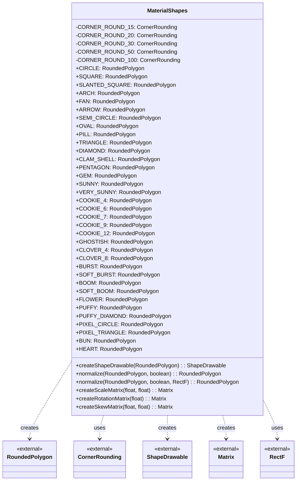
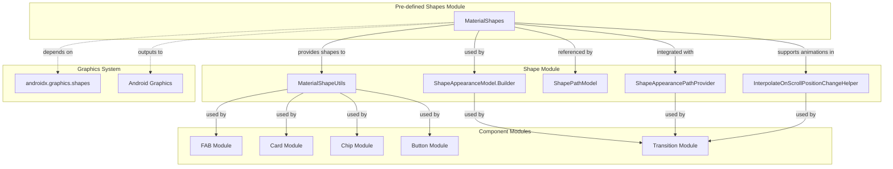
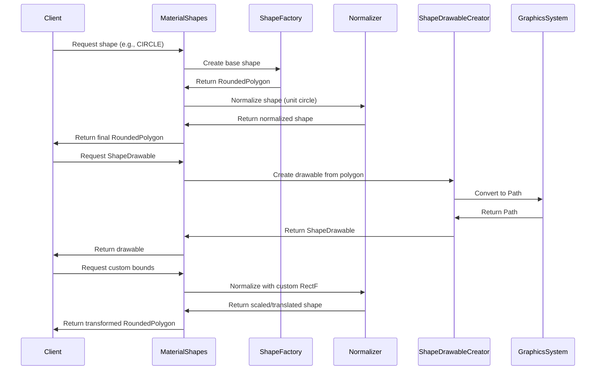
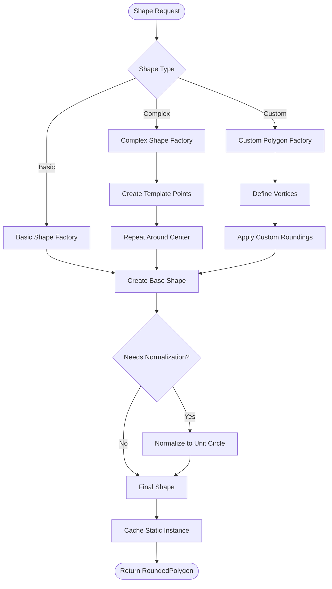

# Pre-defined Shapes Module Documentation

## Introduction

The pre-defined-shapes module is a core component of the Material Design Components library that provides a comprehensive collection of pre-built geometric shapes for use throughout the Material Design system. This module serves as a centralized repository of Material-endorsed shapes that can be used for various UI elements, animations, and visual effects across Android applications.

The module leverages the `androidx.graphics.shapes` library to create sophisticated rounded polygons with precise corner roundings and smooth curves, ensuring consistent visual quality and performance across all Material Design components.

## Architecture Overview

The pre-defined-shapes module is built around a single utility class `MaterialShapes` that provides static access to a wide variety of geometric shapes. The architecture follows a factory pattern where each shape is created through specialized private methods and exposed as public static final constants.



## Component Relationships

The pre-defined-shapes module serves as a foundational component that integrates with multiple other modules within the Material Design system:



## Data Flow Architecture

The data flow in the pre-defined-shapes module follows a creation-normalization-utilization pattern:



## Shape Categories and Use Cases

The pre-defined shapes are organized into several categories based on their visual characteristics and intended use cases:

### Basic Geometric Shapes
- **CIRCLE**: Perfect circles for FABs, avatars, and circular progress indicators
- **SQUARE**: Basic square shapes with rounded corners for cards and buttons
- **TRIANGLE**: Triangular shapes for arrows, indicators, and decorative elements
- **OVAL**: Elliptical shapes for extended FABs and oval containers

### Advanced Geometric Shapes
- **DIAMOND**: Diamond shapes for decorative elements and special buttons
- **PENTAGON**: Five-sided polygons for unique UI elements
- **HEXAGON**: Six-sided polygons (available through cookie variations)

### Organic and Decorative Shapes
- **HEART**: Heart shapes for favorite buttons and emotional UI elements
- **FLOWER**: Floral patterns for decorative backgrounds and artistic elements
- **CLOVER**: Clover shapes for luck-themed or decorative applications
- **GHOSTISH**: Ghost-like shapes for playful UI elements

### Functional UI Shapes
- **PILL**: Pill-shaped elements for tags, chips, and capsule buttons
- **ARCH**: Arch shapes for architectural UI elements and headers
- **ARROW**: Directional arrows for navigation and indicators
- **FAN**: Fan shapes for expandable menus and radial layouts

### Complex Decorative Patterns
- **SUNNY/VERY_SUNNY**: Star-like patterns for rating systems and decorative elements
- **COOKIE_4/6/7/9/12**: Cookie-shaped polygons with varying numbers of vertices
- **BURST/SOFT_BURST**: Explosion-like patterns for emphasis and attention
- **BOOM/SOFT_BOOM**: Dynamic burst patterns for action effects

### Pixel Art Inspired
- **PIXEL_CIRCLE**: Pixelated circular shapes for retro-themed designs
- **PIXEL_TRIANGLE**: Pixelated triangular shapes for geometric patterns

### Food and Object Inspired
- **BUN**: Bun-shaped elements for food-related applications
- **PUFFY/PUFFY_DIAMOND**: Soft, inflated shapes for playful UI elements

## Process Flow for Shape Creation

The shape creation process follows a systematic approach to ensure consistency and quality:



## Integration with Material Design System

The pre-defined-shapes module integrates seamlessly with the broader Material Design ecosystem:

### Shape Theming Integration
The shapes provided by this module are designed to work with Material's shape theming system, allowing developers to maintain consistent visual language across their applications. The shapes can be customized through the [shape-definition-and-modeling](shape-definition-and-modeling.md) module's `ShapeAppearanceModel.Builder`.

### Animation and Transition Support
Shapes from this module can be animated and transformed using utilities from the [shape-rendering-and-animation](shape-rendering-and-animation.md) module, particularly through the `InterpolateOnScrollPositionChangeHelper` for scroll-based shape animations.

### Component-Specific Usage
Different Material components utilize these pre-defined shapes:

- **[FAB Module](fab.md)**: Uses CIRCLE, OVAL, and custom shapes for floating action buttons
- **[Card Module](card.md)**: Employs rounded rectangles and custom shapes for card containers
- **[Chip Module](chip.md)**: Utilizes PILL and custom rounded shapes for chip components
- **[Button Module](button.md)**: Uses rounded rectangles and custom shapes for button backgrounds

### Utility Integration
The module works closely with [shape-utilities-and-helpers](shape-utilities-and-helpers.md) for additional shape manipulation and transformation capabilities through `MaterialShapeUtils`.

## Performance Considerations

The pre-defined-shapes module is optimized for performance through several strategies:

### Static Instance Caching
All shape instances are created as static final constants, ensuring they are instantiated once and reused throughout the application lifecycle, reducing memory allocation and garbage collection overhead.

### Efficient Normalization
The normalization process uses optimized matrix transformations and bounds calculations to ensure shapes fit properly within their intended bounds while maintaining visual quality.

### Graphics Pipeline Integration
The module integrates directly with Android's graphics pipeline through `ShapeDrawable` and `PathShape`, ensuring efficient rendering and minimal overhead during drawing operations.

## Usage Examples

### Basic Shape Usage
```java
// Get a pre-defined shape
RoundedPolygon circle = MaterialShapes.CIRCLE;
RoundedPolygon heart = MaterialShapes.HEART;

// Create a drawable from the shape
ShapeDrawable circleDrawable = MaterialShapes.createShapeDrawable(circle);
```

### Custom Bounds Normalization
```java
// Normalize shape to custom bounds
RectF customBounds = new RectF(0, 0, 200, 100);
RoundedPolygon normalizedShape = MaterialShapes.normalize(heart, true, customBounds);
```

### Shape Transformation
```java
// Apply transformations
Matrix rotation = MaterialShapes.createRotationMatrix(45f);
Matrix scale = MaterialShapes.createScaleMatrix(1.5f, 1.5f);
```

## Dependencies and External Libraries

The pre-defined-shapes module has minimal external dependencies:

### Core Dependencies
- **androidx.graphics.shapes**: Provides the underlying `RoundedPolygon` and shape creation utilities
- **Android Graphics Framework**: Integrates with `ShapeDrawable`, `PathShape`, `Matrix`, and `RectF`

### Internal Dependencies
- **Material Shape Utilities**: Works with other shape-related modules for comprehensive shape management
- **Animation System**: Integrates with Material's animation helpers for smooth shape transitions

## Future Considerations

The pre-defined-shapes module is designed to be extensible, allowing for:

- **Additional Shape Categories**: New shape categories can be added following the established patterns
- **Dynamic Shape Generation**: Potential for runtime shape generation based on parameters
- **Shape Composition**: Ability to combine multiple shapes for complex visual effects
- **Theme Integration**: Enhanced integration with Material's dynamic theming system

This module serves as the foundation for consistent, high-quality shape rendering throughout the Material Design Components library, ensuring that all visual elements maintain the distinctive Material Design aesthetic while providing developers with a rich palette of pre-built shapes for their applications.