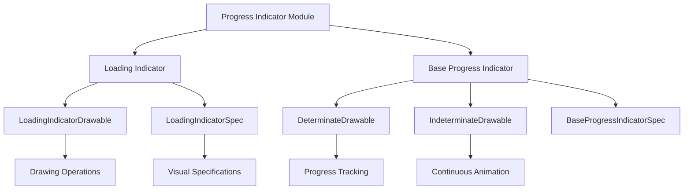

# Progress Indicator Module

## Overview

The progress-indicator module provides Material Design components for displaying progress and loading states in Android applications. It offers two main types of indicators: loading indicators and progress indicators, each designed for different use cases and user experience patterns.

## Architecture

## Core Components

### LoadingIndicator
The `LoadingIndicator` class implements a specialized loading indicator designed for Material Design 3. For detailed implementation and usage information, see [loading-indicator.md](loading-indicator.md).

Key features include:
- **Delayed Show/Hide**: Configurable delays for showing and hiding animations
- **Customizable Visuals**: Support for indicator size, colors, and container dimensions
- **Animation Control**: Smooth visibility transitions with animation callbacks
- **Accessibility**: Proper accessibility support with ProgressBar classification

### BaseProgressIndicator
The `BaseProgressIndicator` class serves as an abstract base for various progress indicator types. For comprehensive technical details, see [base-progress-indicator.md](base-progress-indicator.md).

Key capabilities include:
- **Dual Mode Support**: Both determinate and indeterminate progress modes
- **Animation Behaviors**: Configurable show/hide animation directions (inward, outward, escape)
- **Wave Effects**: Support for wave-based progress indicators with customizable amplitude and wavelength
- **Track Customization**: Configurable track thickness, colors, and corner radius

## Key Features

### Animation System
Both components implement sophisticated animation systems with:
- **Visibility Management**: Smart handling of component visibility with animation callbacks
- **Timing Controls**: Configurable delays and minimum display times
- **Smooth Transitions**: Support for various animation behaviors and directions

### Visual Customization
- **Color Management**: Support for single or multiple indicator colors
- **Size Control**: Configurable indicator and container dimensions
- **Shape Options**: Rounded corners and gap controls
- **Wave Properties**: Amplitude, wavelength, and speed controls for wave-based indicators

### Performance Optimization
- **Efficient Drawing**: Optimized canvas operations with clipping and translation
- **State Management**: Proper handling of component lifecycle and state changes
- **Resource Management**: Efficient drawable and animation resource handling

## Usage Patterns

### Loading Indicators
Best suited for:
- Full-screen loading states
- Content loading placeholders
- Background operations without specific progress
- Material Design 3 applications

### Progress Indicators
Ideal for:
- File uploads/downloads with known progress
- Multi-step processes
- Operations with quantifiable progress
- Both determinate and indeterminate scenarios

## Integration with Material Design System

The progress-indicator module integrates with other Material Design components:

- **Theme Integration**: Uses Material theme attributes for consistent styling
- **Color System**: Leverages MaterialColors for theme-aware color application
- **Animation Framework**: Integrates with Material animation patterns and duration scales

## Related Modules

- **[color.md](color.md)**: For color management and theming
- **[animation.md](animation.md)**: For animation patterns and behaviors
- **[theme.md](theme.md)**: For Material Design theme integration

## Implementation Considerations

### Performance
- Components are optimized for smooth 60fps animations
- Efficient invalidation and redraw mechanisms
- Proper resource cleanup on detachment

### Accessibility
- Full accessibility support with proper content descriptions
- Screen reader compatibility
- High contrast mode support

### Customization
- Extensive attribute support for visual customization
- Programmatic API for runtime changes
- Style resource support for consistent theming