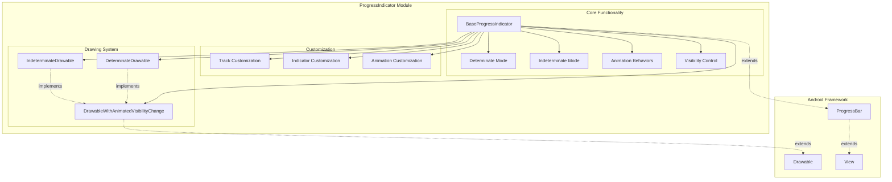
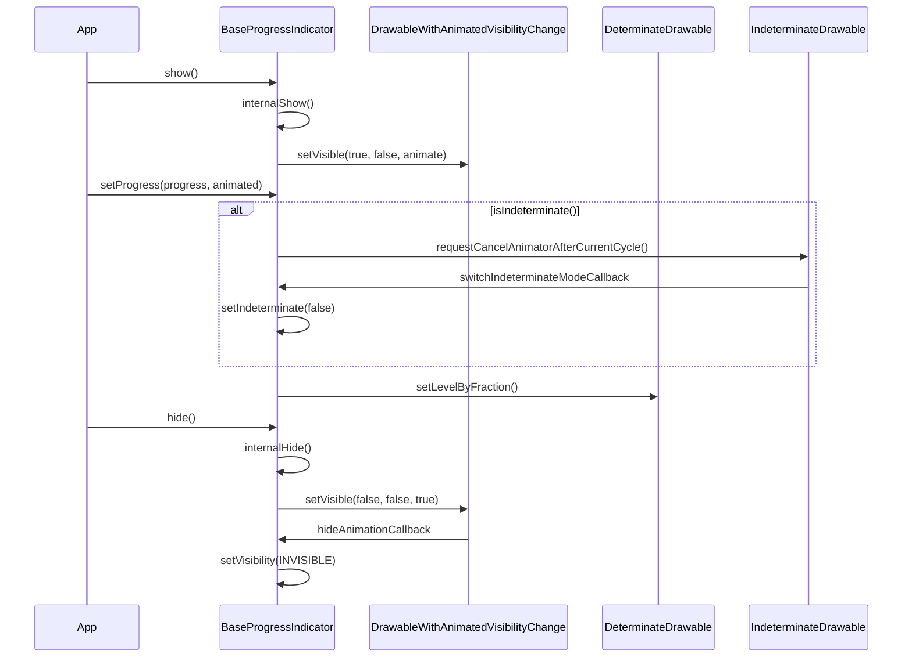
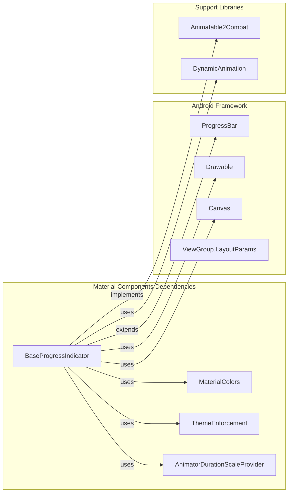
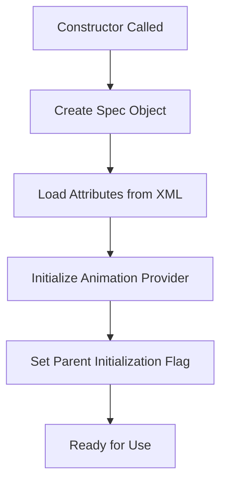
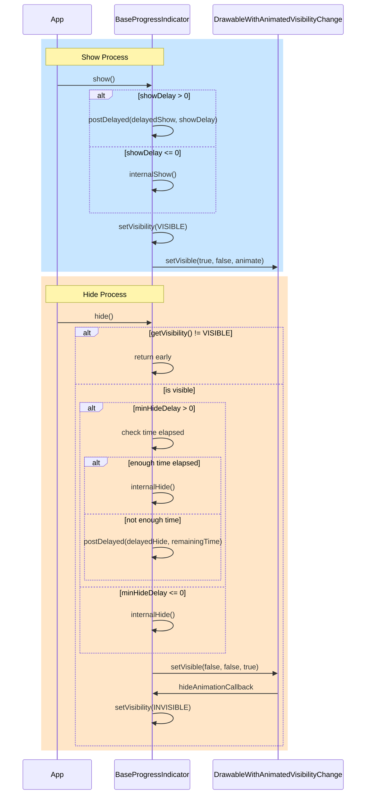
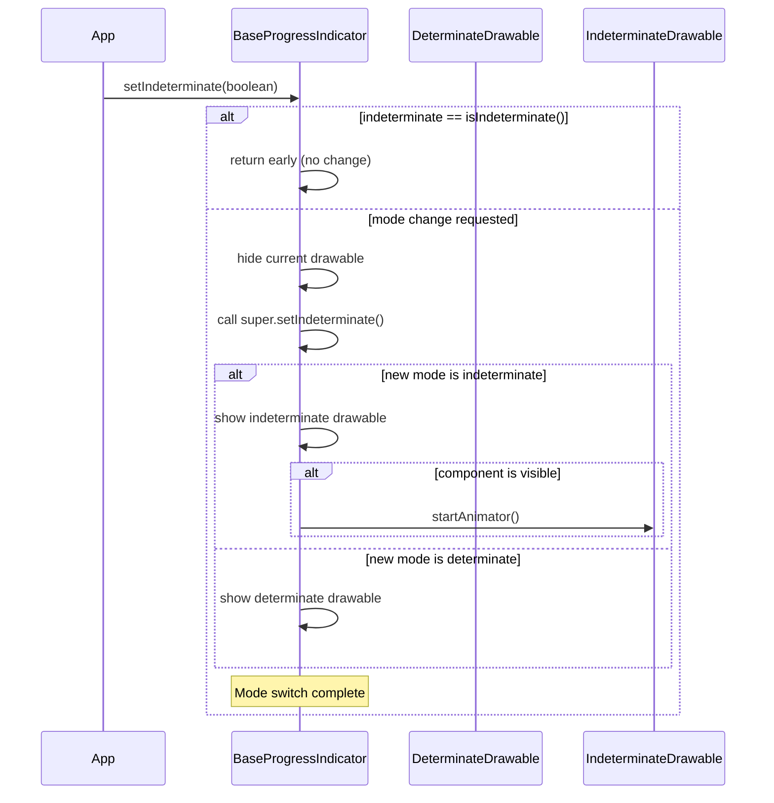

# ProgressIndicator Module Documentation

## Introduction

The ProgressIndicator module is a core component of the Material Design Components library that provides animated progress indicators for Android applications. It extends the standard Android ProgressBar with Material Design principles, offering both determinate and indeterminate progress visualization with sophisticated animation behaviors and customization options.

## Module Architecture

### Core Components

The module is built around a single primary component:

- **BaseProgressIndicator**: Abstract base class that provides common functionality for all progress indicator types

### Module Structure

```
progressindicator/
└── BaseProgressIndicator (abstract base class)
    ├── Determinate mode support
    ├── Indeterminate mode support
    ├── Animation behaviors
    └── Customization attributes
```

## Component Details

### BaseProgressIndicator

The `BaseProgressIndicator` is an abstract class that extends Android's `ProgressBar` and serves as the foundation for all Material Design progress indicators. It provides:

#### Key Features

1. **Dual Mode Support**: Seamlessly switches between determinate and indeterminate progress modes
2. **Animation Behaviors**: Configurable show/hide animations with multiple behavior options
3. **Material Design Compliance**: Follows Material Design guidelines for progress indicators
4. **Customization**: Extensive styling options for colors, thickness, corner radius, and wave properties
5. **Performance Optimization**: Efficient drawing and animation management

#### Animation Behaviors

The component supports various animation behaviors:

**Show Animations:**
- `SHOW_NONE`: No animation
- `SHOW_OUTWARD`: Expands outward
- `SHOW_INWARD`: Expands inward

**Hide Animations:**
- `HIDE_NONE`: No animation
- `HIDE_OUTWARD`: Contracts outward
- `HIDE_INWARD`: Contracts inward
- `HIDE_ESCAPE`: Escape-style animation

#### Core Attributes

- **trackThickness**: Thickness of the indicator and track
- **indicatorColor**: Color(s) of the progress indicator
- **trackColor**: Color of the background track
- **trackCornerRadius**: Rounded corner radius
- **showAnimationBehavior**: Animation for showing the indicator
- **hideAnimationBehavior**: Animation for hiding the indicator
- **showDelay**: Delay before showing the indicator
- **minHideDelay**: Minimum time before hiding

## Architecture Diagram



## Data Flow



## Component Relationships



## Process Flow

### Initialization Process



### Show/Hide Animation Process



### Mode Switching Process



## Integration with Other Modules

The ProgressIndicator module integrates with several other Material Design components:

### Color Module Integration
- Uses [`MaterialColors`](color.md) for theme-aware color resolution
- Supports dynamic color theming through the color system

### Theme System Integration
- Leverages [`ThemeEnforcement`](theme.md) for consistent theming
- Respects Material Design theme attributes

### Animation System Integration
- Uses [`AnimatorDurationScaleProvider`](animation.md) for system-wide animation scaling
- Supports accessibility settings for reduced motion

## Usage Examples

### Basic Usage

```xml
<com.google.android.material.progressindicator.LinearProgressIndicator
    android:layout_width="match_parent"
    android:layout_height="wrap_content"
    android:progress="75"
    app:trackThickness="4dp"
    app:indicatorColor="@color/colorPrimary"
    app:trackColor="@color/colorSurfaceVariant" />
```

### Programmatic Control

```java
progressIndicator.show();
progressIndicator.setProgressCompat(50, true);
progressIndicator.setIndicatorColor(Color.RED, Color.BLUE);
progressIndicator.hide();
```

## Performance Considerations

1. **Animation Optimization**: Uses hardware acceleration when available
2. **Memory Management**: Properly manages drawable lifecycle
3. **Drawing Efficiency**: Custom onDraw implementation optimized for progress indicators
4. **Thread Safety**: Synchronized methods for progress updates

## Accessibility

- Supports screen readers with proper content descriptions
- Respects system animation settings
- Provides haptic feedback options
- Supports high contrast mode

## Testing

The module includes comprehensive testing utilities:

- [`@VisibleForTesting`](testing.md) annotations for testable methods
- Mock animation providers for unit testing
- Accessibility testing support

## Future Enhancements

Potential areas for expansion:

1. Additional progress indicator types (circular, linear variants)
2. Enhanced animation curves and transitions
3. Integration with motion design system
4. Performance optimizations for low-end devices

## References

- [Material Design Progress Indicators](https://material.io/components/progress-indicators)
- [Android ProgressBar Documentation](https://developer.android.com/reference/android/widget/ProgressBar)
- Related module documentation:
  - [Color Module](color.md)
  - [Animation Module](animation.md)
  - [Theme System](theme.md)