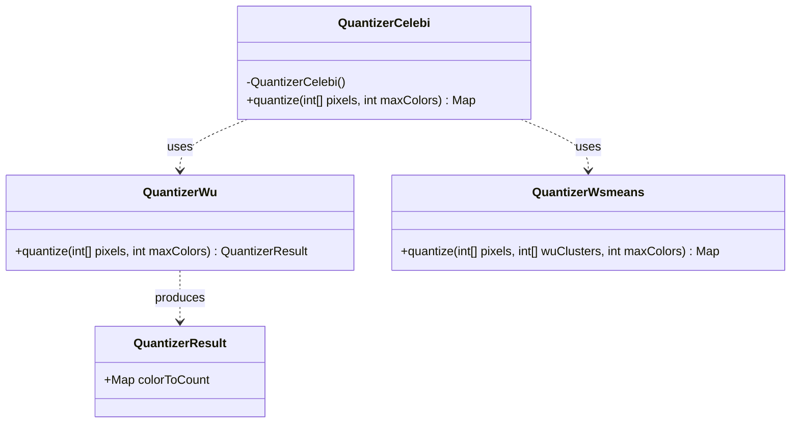
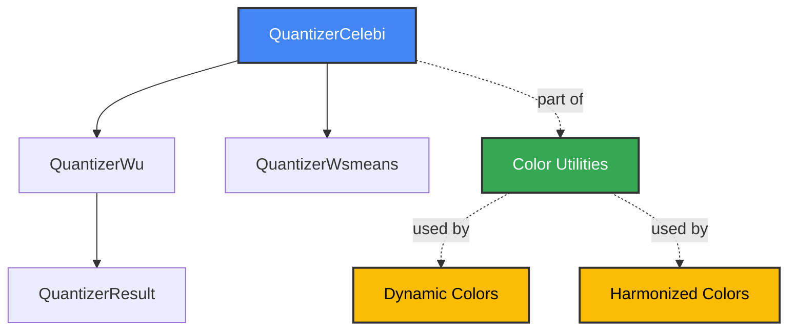
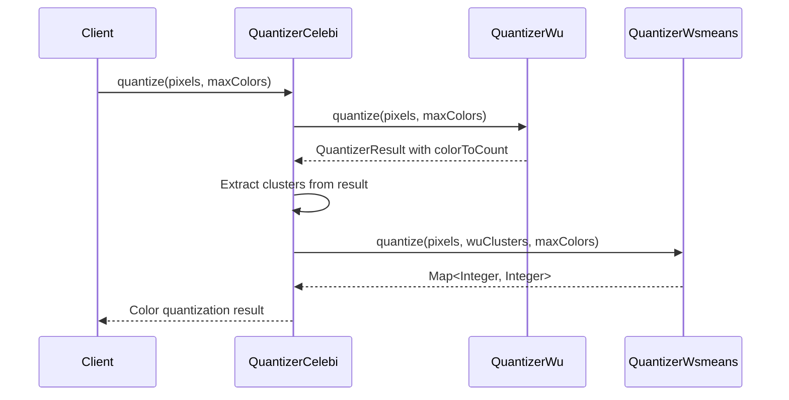
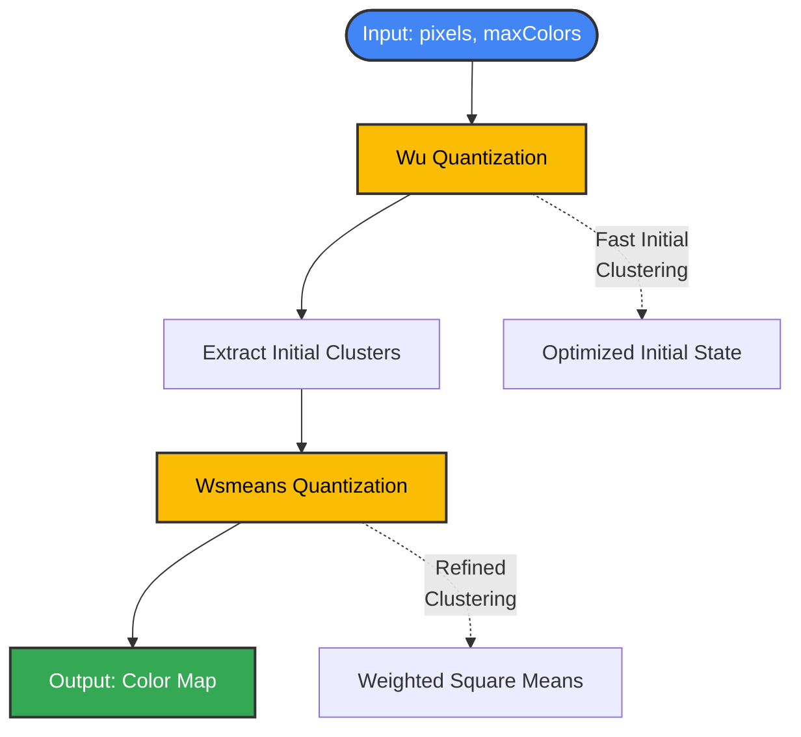
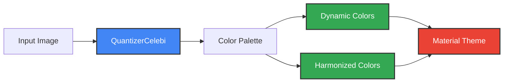

# Quantizer Celebi Module

## Introduction

The Quantizer Celebi module is a specialized image quantization component within the Material Design Components library that implements an advanced color quantization algorithm. This module provides high-quality color reduction for images by combining the Wu quantizer's initial state determination with optimized K-Means clustering, resulting in superior color palette generation compared to standard quantization methods.

## Core Functionality

The module implements the Celebi quantization algorithm, which was designed by M. Emre Celebi and documented in the 2011 paper "Improving the Performance of K-Means for Color Quantization". The algorithm enhances the standard K-Means approach by using Wu quantizer output as the initial state instead of random centroids, significantly improving both quality and performance.

## Architecture

### Component Structure

### Module Dependencies

## Data Flow

## Process Flow

## Key Features

### Algorithm Enhancement
- **Improved Initial State**: Uses Wu quantizer output instead of random centroids
- **Performance Optimization**: Leverages Wsmeans (Weighted Square Means) optimizations
- **Quality Improvement**: Superior color palette generation compared to standard K-Means

### API Design
- **Static Utility Class**: Cannot be instantiated, provides static quantization method
- **Simple Interface**: Single `quantize()` method with clear parameters
- **Restricted Access**: Library-group restricted, not for public API use

### Input/Output Specification
- **Input**: Array of ARGB pixel values and maximum color count
- **Output**: Map of quantized colors to pixel counts
- **Flexibility**: May return fewer colors than requested maximum

## Integration Context

### Color System Pipeline
The Quantizer Celebi module operates within the broader Material Design color system:

### Related Modules
- **[color-utilities.md](color-utilities.md)**: Parent module containing various color processing utilities
- **[dynamic-colors.md](dynamic-colors.md)**: Uses quantization results for dynamic theming
- **[color-harmonization.md](color-harmonization.md)**: Applies quantization for color harmony
- **[quantizer-wsmeans.md](quantizer-wsmeans.md)**: Partner algorithm for final quantization step

## Usage Patterns

### Primary Use Case
The module is primarily used internally by the Material Design Components library for:
- Extracting representative color palettes from images
- Supporting dynamic color theming based on wallpaper/content
- Generating harmonized color schemes

### Algorithm Workflow
1. **Initial Quantization**: Wu quantizer provides fast, reasonable initial clusters
2. **Cluster Extraction**: Convert Wu results to initial centroids for K-Means
3. **Refined Quantization**: Wsmeans performs optimized K-Means with Wu initial state
4. **Result Mapping**: Return color-to-pixel count mapping for downstream processing

## Technical Considerations

### Performance Characteristics
- **Two-Stage Process**: Combines fast initial clustering with refined optimization
- **Memory Efficiency**: Processes pixel data in-place without excessive copying
- **Scalability**: Handles large images through efficient algorithm design

### Quality Metrics
- **Color Accuracy**: Minimizes perceptual difference between original and quantized images
- **Palette Coherence**: Produces visually pleasing and representative color selections
- **Consistency**: Reliable results across different image types and content

## Implementation Notes

### Restricted API
The `@RestrictTo(LIBRARY_GROUP)` annotation indicates this is an internal implementation detail, not intended for direct use by application developers. This allows the library team to modify the implementation without breaking external dependencies.

### Algorithm Attribution
The implementation is based on M. Emre Celebi's research, specifically the 2011 paper on improving K-Means performance for color quantization, ensuring both academic rigor and practical effectiveness.

### Future Considerations
The TODO comment regarding copybara release suggests potential future plans to make this utility more broadly available, though currently it remains an internal library component.