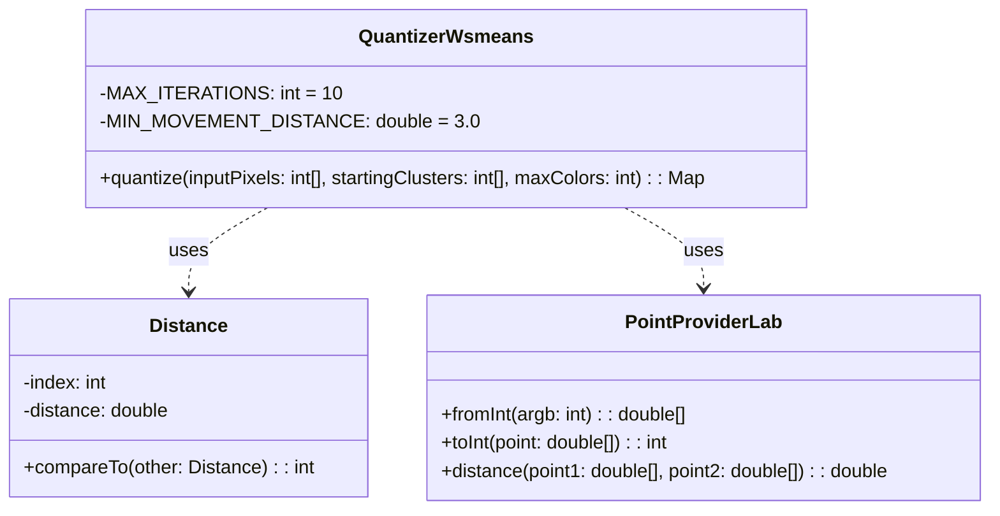
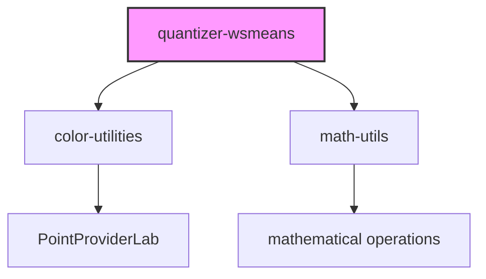
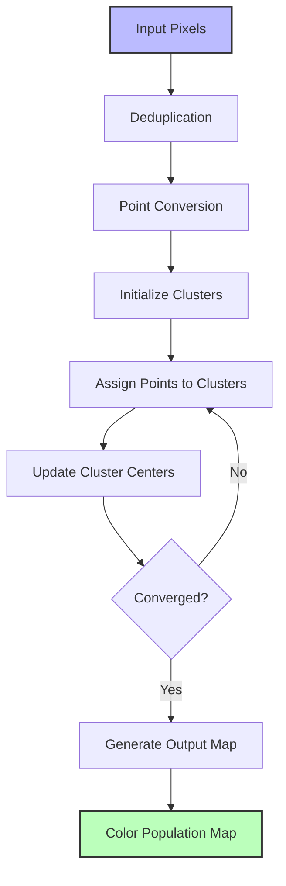
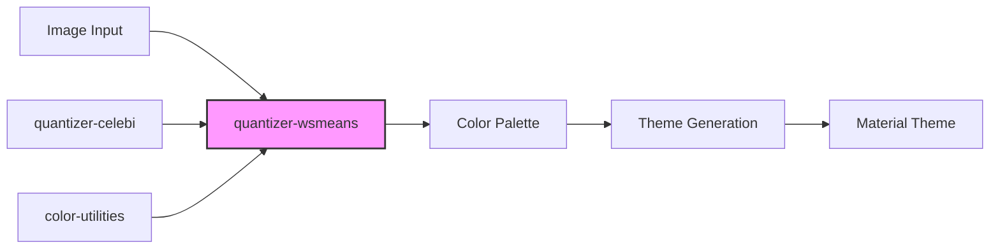

# Quantizer Wsmeans Module

## Introduction

The quantizer-wsmeans module implements a sophisticated image quantization algorithm that reduces the number of colors in an image while minimizing visual quality loss. This module is part of the Material Design Components color utilities and provides an optimized K-Means clustering implementation specifically designed for color quantization tasks.

## Overview

The `QuantizerWsmeans` class implements the Weighted Square Means (Wsmeans) algorithm, an enhanced version of the K-Means clustering algorithm that incorporates several optimizations for improved performance and quality in color quantization applications.

## Architecture

### Core Component



### Module Dependencies



## Core Functionality

### QuantizerWsmeans Class

The main class provides a single static method for color quantization:

#### `quantize(int[] inputPixels, int[] startingClusters, int maxColors)`

**Purpose**: Reduces the number of colors in an image while minimizing the visual difference between the original and quantized image.

**Parameters**:
- `inputPixels`: Array of colors in ARGB format representing the input image
- `startingClusters`: Initial cluster centers (can be empty for automatic initialization)
- `maxColors`: Maximum number of colors to reduce the image to

**Returns**: Map where keys are colors in ARGB format and values represent the count of input pixels belonging to each color

**Algorithm Features**:
- **Deduplication**: Identical pixels are processed only once, significantly improving performance
- **Triangle Inequality Rule**: Reduces the number of distance calculations needed
- **Weighted Clustering**: Takes pixel frequency into account for better color representation
- **Deterministic Results**: Uses seeded random number generator for reproducible output

## Data Flow



## Algorithm Process

### 1. Preprocessing
- **Pixel Deduplication**: Identifies unique pixels and counts their occurrences
- **Color Space Conversion**: Converts ARGB colors to LAB color space for perceptually uniform distance calculations
- **Point Array Creation**: Creates arrays for unique points and their counts

### 2. Cluster Initialization
- If starting clusters are provided, they are used as initial centers
- Additional clusters are created if needed to reach the desired count
- Random assignment of points to clusters for initial state

### 3. Iterative Optimization
For each iteration (maximum 10):

#### Distance Matrix Calculation
- Computes distances between all cluster pairs
- Sorts distances for efficient nearest-neighbor searches
- Applies triangle inequality to skip unnecessary calculations

#### Point Reassignment
- Evaluates whether points should move to different clusters
- Uses movement threshold (3.0 units) to prevent oscillation
- Counts total points moved to check for convergence

#### Cluster Center Update
- Recalculates cluster centers as weighted averages of assigned points
- Updates component sums (A, B, C channels in LAB space)
- Handles empty clusters by resetting to origin

### 4. Result Generation
- Maps final cluster centers back to ARGB colors
- Aggregates pixel counts for each color
- Returns population map with quantized colors

## Performance Optimizations

### 1. Pixel Deduplication
```java
Map<Integer, Integer> pixelToCount = new LinkedHashMap<>();
// Identical pixels are processed only once
```

### 2. Triangle Inequality Optimization
```java
if (distanceToIndexMatrix[previousClusterIndex][j].distance >= 4 * previousDistance) {
    continue; // Skip unnecessary distance calculations
}
```

### 3. Early Termination
- Algorithm stops when no points move between iterations
- Prevents unnecessary computation after convergence

## Integration with Color System

The quantizer-wsmeans module integrates with the broader Material Design color system:



## Usage Patterns

### Primary Use Case
The module is typically used as part of a color extraction pipeline:

1. **Image Analysis**: Extract dominant colors from images
2. **Palette Generation**: Create harmonious color schemes
3. **Theme Creation**: Generate Material Design themes from images

### Integration Points
- Works with [quantizer-celebi.md](quantizer-celebi.md) for initial cluster selection
- Part of the [color-utilities.md](color-utilities.md) module family
- Supports [dynamic-colors.md](dynamic-colors.md) functionality

## Technical Specifications

### Constraints
- **Maximum Iterations**: 10 (prevents infinite loops)
- **Minimum Movement**: 3.0 units (prevents oscillation)
- **Color Space**: LAB for perceptual uniformity
- **Random Seed**: Fixed (0x42688) for reproducibility

### Performance Characteristics
- **Time Complexity**: O(n × k × i) where n=points, k=clusters, i=iterations
- **Space Complexity**: O(n + k²) for distance matrices
- **Optimization**: Significantly faster than standard K-Means due to deduplication and triangle inequality

## Error Handling

The implementation includes several safeguards:
- **Empty Cluster Handling**: Resets empty clusters to prevent division by zero
- **Parameter Validation**: Implicit validation through array bounds checking
- **Convergence Guarantee**: Maximum iteration limit prevents infinite loops

## References

- **Algorithm Source**: Celebi, M. E. (2011). "Improving the Performance of K-Means for Color Quantization"
- **Related Modules**: [quantizer-celebi.md](quantizer-celebi.md), [color-utilities.md](color-utilities.md)
- **Parent Module**: [color.md](color.md)
- **Research Paper**: https://arxiv.org/abs/1101.0395