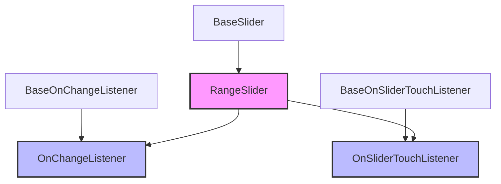
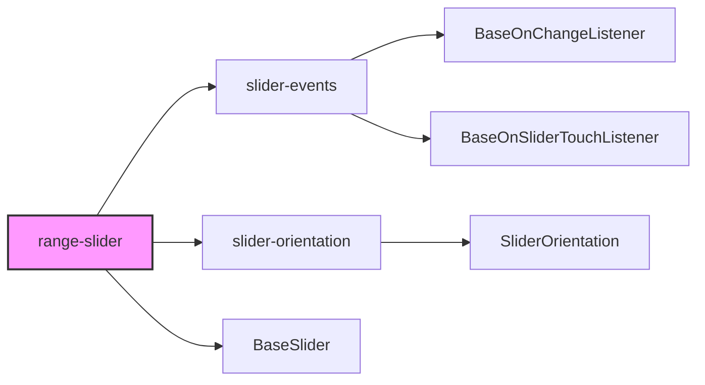
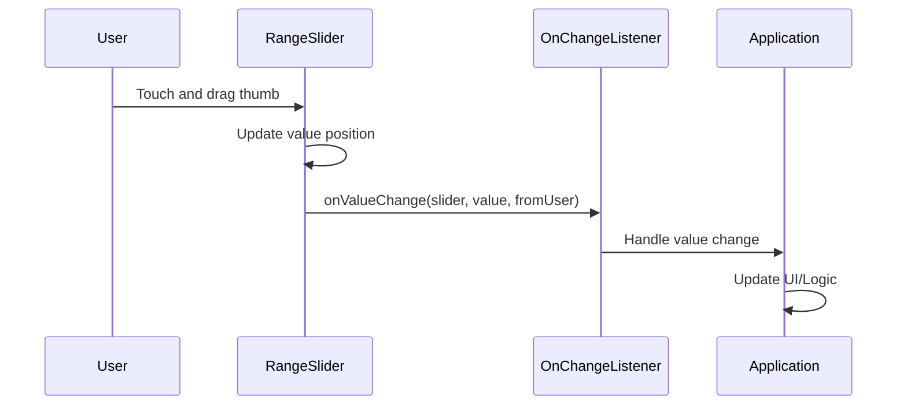
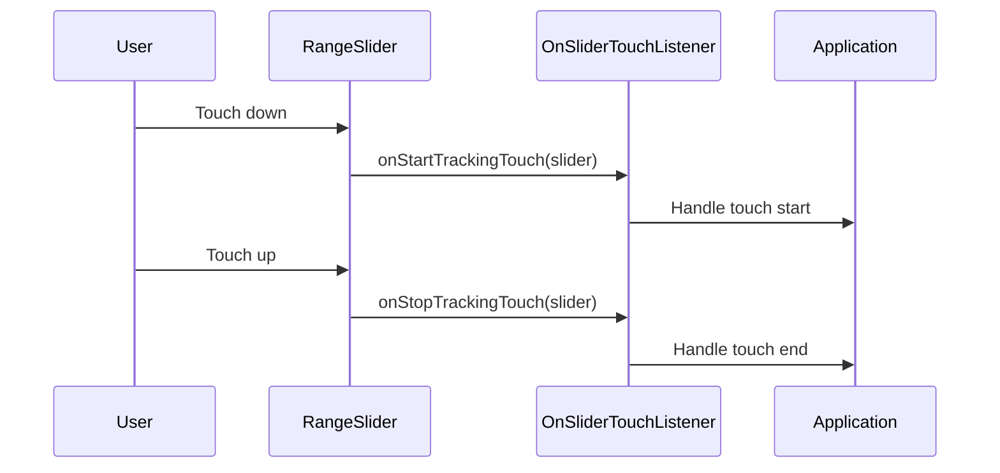
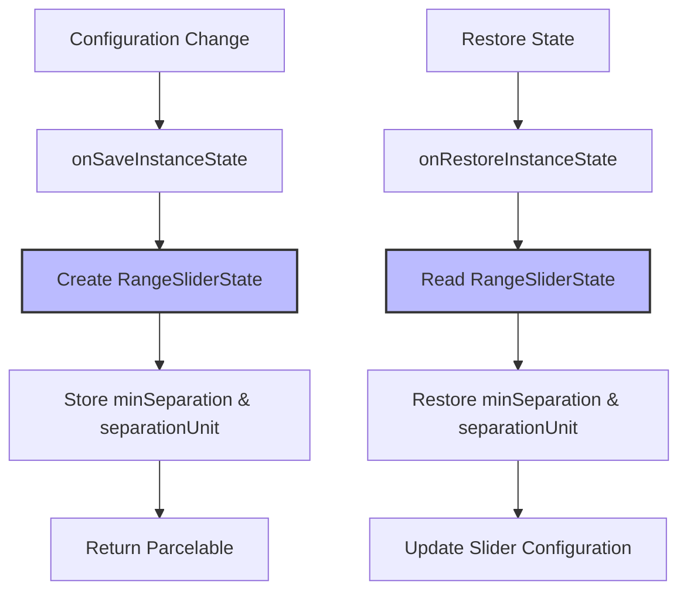

# Range Slider Module Documentation

## Introduction

The Range Slider module is a specialized component within the Material Design Components library that provides a UI control for selecting a range of values from a continuous or discrete set. Unlike a standard slider that handles a single value, the Range Slider manages multiple thumbs to represent minimum and maximum values, making it ideal for filtering, price ranges, and other dual-value selection scenarios.

## Module Overview

The Range Slider module extends the base slider functionality to support multiple values and thumbs, providing a rich set of features for range-based value selection. It is part of the larger [slider](slider.md) module ecosystem and inherits from the `BaseSlider` class to provide specialized range-specific behavior.

## Core Components

### RangeSlider Class
The main component that extends `BaseSlider` to provide range-specific functionality:
- **Purpose**: Manages multiple slider thumbs for range selection
- **Key Features**: Multi-value support, minimum separation between thumbs, customizable thumb drawables
- **Inheritance**: Extends `BaseSlider<RangeSlider, OnChangeListener, OnSliderTouchListener>`

### Event Listeners

#### OnChangeListener
```java
public interface OnChangeListener extends BaseOnChangeListener<RangeSlider>
```
- **Purpose**: Handles value change events for all thumbs in the range slider
- **Usage**: Notified when any thumb value changes during user interaction
- **Inheritance**: Extends `BaseOnChangeListener<RangeSlider>` from [slider-events](slider.md)

#### OnSliderTouchListener
```java
public interface OnSliderTouchListener extends BaseOnSliderTouchListener<RangeSlider>
```
- **Purpose**: Manages touch interaction events for the range slider
- **Methods**: `onStartTrackingTouch()` and `onStopTrackingTouch()`
- **Inheritance**: Extends `BaseOnSliderTouchListener<RangeSlider>` from [slider-events](slider.md)

## Architecture

### Component Hierarchy


### Module Dependencies


## Key Features

### Multi-Value Support
- Manages multiple values simultaneously through a `List<Float>` structure
- Each value represents a thumb position on the slider track
- Supports both continuous and discrete value sets

### Minimum Separation
- **Pixel-based separation**: `setMinSeparation(float)` - minimum distance in pixels
- **Value-based separation**: `setMinSeparationValue(float)` - minimum distance in value scale
- Prevents thumbs from overlapping and ensures meaningful range selection

### Customization Options
- Custom thumb drawables for individual values
- Consistent styling with Material Design guidelines
- Support for both drawable resources and `Drawable` objects

## Data Flow

### Value Change Flow


### Touch Event Flow


## State Management

### RangeSliderState
The module implements custom state persistence through `RangeSliderState`:
- **Purpose**: Maintains slider state during configuration changes
- **Storage**: Saves `minSeparation` and `separationUnit` values
- **Implementation**: Extends `AbsSavedState` for Android's saved state mechanism

### State Persistence Flow


## XML Attributes

### Range-Specific Attributes
- `app:values`: Initial values for the range slider (resource reference to array)
- `app:minSeparation`: Minimum distance between overlapping thumbs

### Inherited Attributes
The Range Slider inherits all attributes from the base slider component, including:
- Value range configuration (`valueFrom`, `valueTo`)
- Step size for discrete values
- Visual styling attributes
- Track and thumb customization

## Usage Patterns

### Basic Range Selection
```xml
<com.google.android.material.slider.RangeSlider
    android:layout_width="match_parent"
    android:layout_height="wrap_content"
    android:valueFrom="0"
    android:valueTo="100"
    app:values="@array/initial_range_values"
    app:minSeparation="10dp" />
```

### Programmatic Usage
```java
RangeSlider rangeSlider = findViewById(R.id.range_slider);
rangeSlider.setValues(20f, 80f);
rangeSlider.setMinSeparation(5f);
rangeSlider.addOnChangeListener((slider, value, fromUser) -> {
    List<Float> values = slider.getValues();
    // Handle value changes
});
```

## Integration with Other Modules

### Slider Module Ecosystem
The Range Slider is part of a comprehensive slider system:
- **[slider-events](slider.md)**: Provides base event listener interfaces
- **[slider-orientation](slider.md)**: Handles orientation-specific behavior
- **BaseSlider**: Common functionality shared with single-value sliders

### Material Design Integration
- Consistent theming with other Material components
- Support for Material Design color schemes
- Integration with elevation and shadow systems
- Accessibility features aligned with Material guidelines

## Performance Considerations

### Memory Management
- Efficient state persistence with minimal object creation
- Optimized value storage using `ArrayList<Float>`
- Lazy initialization of custom drawables

### Touch Responsiveness
- Smooth touch handling for multiple thumbs
- Efficient separation validation during drag operations
- Optimized redraw cycles for performance

## Accessibility

### Screen Reader Support
- Proper content descriptions for thumbs
- Value announcements during interaction
- Semantic meaning for range selection

### Keyboard Navigation
- Support for keyboard-based value adjustment
- Proper focus management for multiple thumbs
- Integration with system accessibility services

## Best Practices

### Value Management
- Use appropriate `minSeparation` to prevent overlapping
- Consider value-based separation for meaningful ranges
- Validate initial values against the defined range

### User Experience
- Provide clear visual feedback for thumb positions
- Consider using custom drawables for better visibility
- Implement appropriate change listeners for responsive UI updates

### Performance Optimization
- Minimize operations in change listeners
- Use appropriate step sizes for discrete values
- Consider debouncing frequent value changes

## Related Documentation
- [Slider Module](slider.md) - Base slider functionality and shared components
- [Material Design Slider Guidelines](https://material.io/components/sliders) - Design principles and usage patterns
- [Android Accessibility Guide](https://developer.android.com/guide/topics/ui/accessibility) - Accessibility implementation details