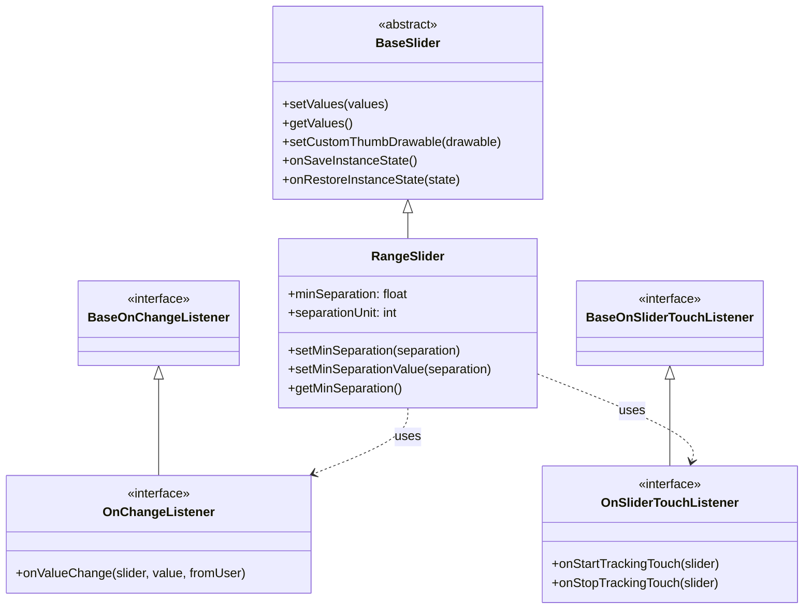
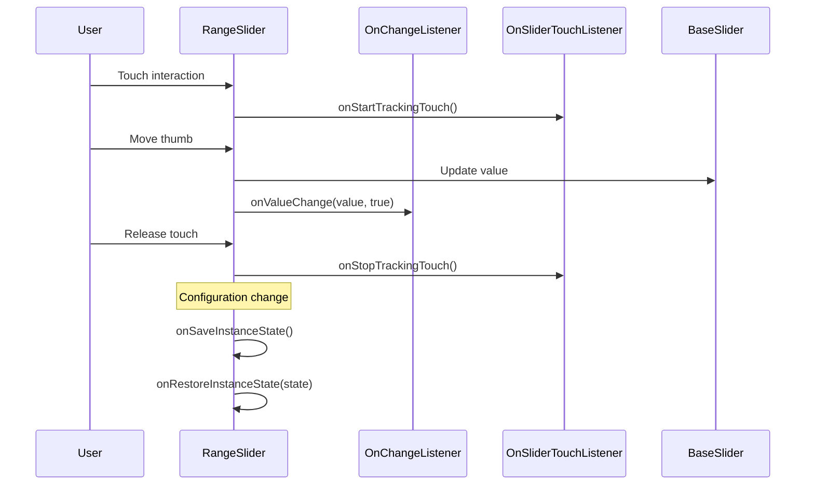
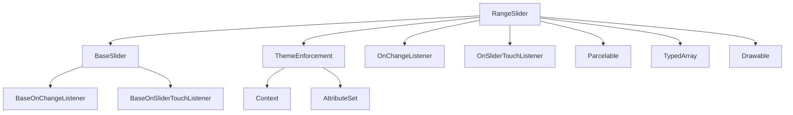
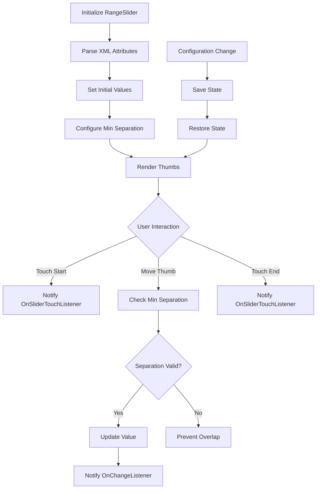

# Range Slider Module Documentation

## Introduction

The Range Slider module provides a Material Design component that allows users to select a range of values from a continuous or discrete set. Unlike a standard slider that controls a single value, the Range Slider supports multiple thumbs, enabling users to define minimum and maximum bounds, create ranges, or select multiple discrete values.

This module is part of the larger [Slider](slider.md) component family and extends the base slider functionality to support multi-value selection scenarios commonly used in price filters, date ranges, and other range-based user inputs.

## Architecture Overview

The Range Slider module follows a hierarchical inheritance structure built upon Material Design principles:


```mermaid
classDiagram
    class BaseSlider {
        <<abstract>>
        +setValues(values)
        +getValues()
        +setCustomThumbDrawable(drawable)
        +onSaveInstanceState()
        +onRestoreInstanceState(state)
    }
    
    class RangeSlider {
        +minSeparation: float
        +separationUnit: int
        +setMinSeparation(separation)
        +setMinSeparationValue(separation)
        +getMinSeparation()
    }
    
    class OnChangeListener {
        <<interface>>
        +onValueChange(slider, value, fromUser)
    }
    
    class OnSliderTouchListener {
        <<interface>>
        +onStartTrackingTouch(slider)
        +onStopTrackingTouch(slider)
    }
    
    class BaseOnChangeListener {
        <<interface>>
    }
    
    class BaseOnSliderTouchListener {
        <<interface>>
    }
    
    BaseSlider <|-- RangeSlider
    BaseOnChangeListener <|-- OnChangeListener
    BaseOnSliderTouchListener <|-- OnSliderTouchListener
    RangeSlider ..> OnChangeListener : uses
    RangeSlider ..> OnSliderTouchListener : uses
```

## Core Components

### RangeSlider Class
The main component that extends `BaseSlider` to provide multi-thumb functionality. Key features include:

- **Multi-value Support**: Manages multiple slider values simultaneously
- **Minimum Separation**: Enforces minimum distance between thumbs to prevent overlap
- **Custom Thumb Drawables**: Supports individual thumb customization for each value
- **State Persistence**: Handles configuration changes through saved state

### Listener Interfaces

#### OnChangeListener
```java
public interface OnChangeListener extends BaseOnChangeListener<RangeSlider> {
    void onValueChange(@NonNull RangeSlider slider, float value, boolean fromUser);
}
```
- Notifies when any slider value changes
- Provides access to the affected slider instance
- Indicates whether the change was user-initiated

#### OnSliderTouchListener
```java
public interface OnSliderTouchListener extends BaseOnSliderTouchListener<RangeSlider> {
    void onStartTrackingTouch(@NonNull RangeSlider slider);
    void onStopTrackingTouch(@NonNull RangeSlider slider);
}
```
- Monitors user interaction with the slider
- Useful for implementing custom behaviors during touch events

## Data Flow Architecture


```mermaid
sequenceDiagram
    participant User
    participant RangeSlider
    participant OnChangeListener
    participant OnSliderTouchListener
    participant BaseSlider
    
    User->>RangeSlider: Touch interaction
    RangeSlider->>OnSliderTouchListener: onStartTrackingTouch()
    
    User->>RangeSlider: Move thumb
    RangeSlider->>BaseSlider: Update value
    RangeSlider->>OnChangeListener: onValueChange(value, true)
    
    User->>RangeSlider: Release touch
    RangeSlider->>OnSliderTouchListener: onStopTrackingTouch()
    
    Note over RangeSlider: Configuration change
    RangeSlider->>RangeSlider: onSaveInstanceState()
    RangeSlider->>RangeSlider: onRestoreInstanceState(state)
```

## Component Dependencies


```mermaid
graph TD
    RangeSlider[RangeSlider] --> BaseSlider[BaseSlider]
    RangeSlider --> ThemeEnforcement[ThemeEnforcement]
    RangeSlider --> OnChangeListener[OnChangeListener]
    RangeSlider --> OnSliderTouchListener[OnSliderTouchListener]
    
    BaseSlider --> BaseOnChangeListener[BaseOnChangeListener]
    BaseSlider --> BaseOnSliderTouchListener[BaseOnSliderTouchListener]
    
    ThemeEnforcement --> Context[Context]
    ThemeEnforcement --> AttributeSet[AttributeSet]
    
    RangeSlider --> Parcelable[Parcelable]
    RangeSlider --> TypedArray[TypedArray]
    RangeSlider --> Drawable[Drawable]
```

## Key Features and Functionality

### Multi-Value Management
The RangeSlider excels at managing multiple values through its specialized API:

```java
// Set multiple values
rangeSlider.setValues(10.0f, 50.0f, 90.0f);

// Get all current values
List<Float> values = rangeSlider.getValues();

// Set individual thumb drawables
rangeSlider.setCustomThumbDrawablesForValues(R.drawable.thumb1, R.drawable.thumb2);
```

### Minimum Separation Control
Prevents thumbs from overlapping by enforcing minimum distances:

```java
// Set minimum separation in pixels
rangeSlider.setMinSeparation(20.0f);

// Set minimum separation in value scale
rangeSlider.setMinSeparationValue(5.0f);
```

### State Persistence
The component handles configuration changes through its internal `RangeSliderState` class, preserving:
- Current slider values
- Minimum separation settings
- Separation unit type (pixels vs. values)

## Integration with Material Design System

The RangeSlider integrates with several Material Design components and utilities:

- **[Theme System](theme.md)**: Uses `ThemeEnforcement` for consistent styling
- **[Base Slider](slider.md)**: Inherits core slider functionality and behaviors
- **[Internal Utilities](internal.md)**: Leverages Material internal utilities for theme enforcement

## Usage Patterns

### Basic Range Selection
```xml
<com.google.android.material.slider.RangeSlider
    android:layout_width="match_parent"
    android:layout_height="wrap_content"
    android:valueFrom="0"
    android:valueTo="100"
    app:values="@array/initial_range_values"
    app:minSeparation="5dp" />
```

### Programmatic Configuration
```java
RangeSlider rangeSlider = findViewById(R.id.range_slider);
rangeSlider.setValues(25.0f, 75.0f);
rangeSlider.setMinSeparation(10.0f);

rangeSlider.addOnChangeListener((slider, value, fromUser) -> {
    // Handle value changes
    List<Float> currentValues = slider.getValues();
});
```

## Process Flow


```mermaid
flowchart TD
    A[Initialize RangeSlider] --> B[Parse XML Attributes]
    B --> C[Set Initial Values]
    C --> D[Configure Min Separation]
    D --> E[Render Thumbs]
    
    E --> F{User Interaction}
    F -->|Touch Start| G[Notify OnSliderTouchListener]
    F -->|Move Thumb| H[Check Min Separation]
    H --> I{Separation Valid?}
    I -->|Yes| J[Update Value]
    I -->|No| K[Prevent Overlap]
    J --> L[Notify OnChangeListener]
    
    F -->|Touch End| M[Notify OnSliderTouchListener]
    
    N[Configuration Change] --> O[Save State]
    O --> P[Restore State]
    P --> E
```

## Best Practices

1. **Value Validation**: Always validate the number of values and their ranges before setting them
2. **Separation Units**: Choose appropriate separation units based on use case (pixels for visual separation, values for logical ranges)
3. **Listener Management**: Properly manage listener registration to avoid memory leaks
4. **State Restoration**: Handle configuration changes appropriately using saved state
5. **Accessibility**: Ensure proper content descriptions and accessibility support

## Related Documentation

- [Base Slider Components](slider.md) - Core slider functionality and base classes
- [Material Theme System](theme.md) - Theming and styling integration
- [Internal Utilities](internal.md) - Supporting utilities and helpers
- [Common Animation Utilities](common-utils.md) - Animation and interaction support

## Technical Considerations

### Performance
- Efficient value management through `ArrayList<Float>`
- Minimal object allocation during touch events
- Optimized state serialization for configuration changes

### Memory Management
- Proper cleanup of listeners and callbacks
- Efficient drawable resource management for custom thumbs
- State restoration without memory leaks

### Extensibility
- Interface-based listener pattern for customization
- Protected methods for subclassing and extension
- Support for custom thumb drawables and styling