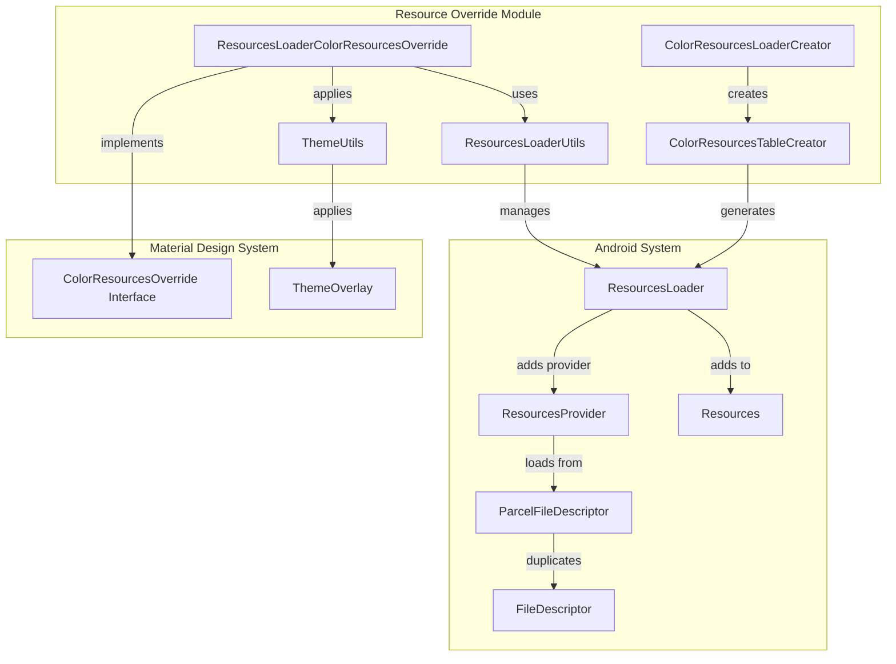
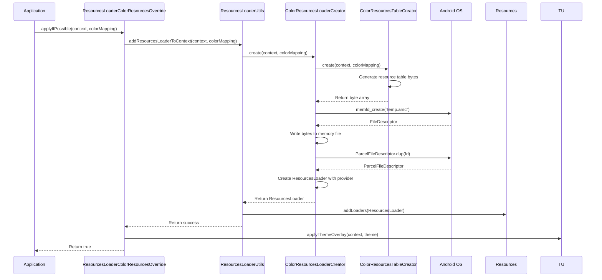
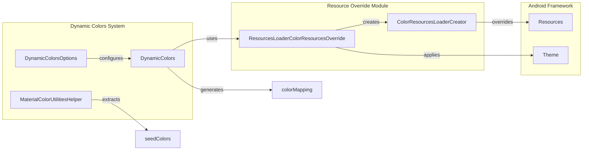

# Resource Override Module

The resource-override module provides runtime color resource replacement capabilities for Android applications using the Material Design Components library. This module enables dynamic theming by allowing applications to override color resources at runtime without requiring app restarts or resource rebuilding.

## Overview

The resource-override module is a specialized component within the Material Design color system that leverages Android's Resources Loader API (Android R+) to dynamically replace color resources. It forms a critical part of the dynamic theming infrastructure, enabling features like personalized color schemes and runtime theme switching.

## Core Functionality

### Runtime Color Resource Replacement

The module enables applications to replace color resources at runtime by creating custom resource tables that override existing color values. This is achieved through:

- **Dynamic Resource Table Creation**: Generates Android resource table binaries (.arsc format) at runtime
- **Memory-based Resource Loading**: Uses memory file descriptors to load custom resource tables
- **Context-aware Resource Override**: Applies overrides to specific contexts without affecting the entire application

### Key Capabilities

- **Selective Color Override**: Target specific color resources while preserving others
- **Package-aware Processing**: Handles both Android system colors and application-specific colors
- **Theme Integration**: Seamlessly integrates with Material Design theme overlays
- **Context Preservation**: Maintains original context resources while providing overridden versions

## Architecture

### Component Structure



### Data Flow Architecture



## Core Components

### ColorResourcesLoaderCreator

The `ColorResourcesLoaderCreator` class serves as the primary factory for creating `ResourcesLoader` instances that contain custom color resource tables. This class:

- **Memory File Management**: Creates temporary memory file descriptors for resource table storage
- **Resource Provider Integration**: Configures `ResourcesProvider` instances to load from memory files
- **Error Handling**: Provides comprehensive error handling for resource creation failures
- **Android R+ Support**: Requires Android API level R (30) or higher

**Key Methods:**
- `create(Context, Map<Integer, Integer>)`: Creates a ResourcesLoader with custom color mappings

### ColorResourcesTableCreator

The `ColorResourcesTableCreator` class implements the core logic for generating Android resource table binaries. It replicates the Android framework's resource table format to create valid .arsc files at runtime.

**Key Features:**
- **Binary Format Compliance**: Generates valid Android resource table binaries
- **Package-aware Processing**: Handles both Android system and application packages
- **Resource Type Management**: Manages color resource types and their specifications
- **String Pool Management**: Creates and manages string pools for resource names

**Internal Structure:**
- `ResTable`: Main resource table container
- `ResChunkHeader`: Standard header for all resource chunks
- `StringPoolChunk`: Manages resource name strings
- `PackageChunk`: Contains package-specific resources
- `TypeSpecChunk`: Defines resource type specifications
- `TypeChunk`: Contains actual resource entries

### ResourcesLoaderColorResourcesOverride

This class implements the `ColorResourcesOverride` interface and provides the main API for applying color resource overrides. It coordinates between the resource creation utilities and the Android Resources system.

**Key Methods:**
- `applyIfPossible(Context, Map<Integer, Integer>)`: Applies color overrides to a context
- `wrapContextIfPossible(Context, Map<Integer, Integer>)`: Creates a themed context with color overrides

### ResourcesLoaderUtils

Utility class that provides helper methods for working with the Resources Loader API:

- **Context Integration**: Manages adding resource loaders to contexts
- **Resource Type Validation**: Validates color resource types
- **Error Handling**: Provides safe resource loader creation and application

### ThemeUtils

Provides utility methods for applying theme overlays to contexts and activities:

- **Theme Application**: Applies theme overlays with proper force flags
- **Window DecorView Integration**: Ensures theme overlays apply to window decor views
- **Activity Support**: Special handling for Activity contexts

## Integration with Material Design System

### Dynamic Colors Integration

The resource-override module integrates with the broader [dynamic-colors](dynamic-colors.md) system to enable personalized color schemes:



### Theme Overlay Application

The module works in conjunction with [theme](theme.md) utilities to ensure proper theme overlay application:

- **Style Application**: Uses `applyStyle()` instead of `setTheme()` to avoid Force Dark issues
- **Window Integration**: Applies themes to window decor views for complete coverage
- **Context Preservation**: Maintains original context while applying overlays

## Usage Patterns

### Basic Color Override

```java
// Create color mapping
Map<Integer, Integer> colorMapping = new HashMap<>();
colorMapping.put(R.color.primary, newPrimaryColor);
colorMapping.put(R.color.secondary, newSecondaryColor);

// Apply override
ResourcesLoaderColorResourcesOverride override = ResourcesLoaderColorResourcesOverride.getInstance();
boolean success = override.applyIfPossible(context, colorMapping);
```

### Context Wrapping

```java
// Create themed context with color overrides
Context themedContext = override.wrapContextIfPossible(originalContext, colorMapping);
```

## Technical Implementation Details

### Resource Table Format

The module generates Android resource table binaries that follow the standard .arsc format:

- **Header Structure**: Standard resource table headers with proper type identifiers
- **String Pool Management**: UTF-8 and UTF-16 string encoding support
- **Package Organization**: Separate handling for Android system and application packages
- **Resource Entry Layout**: Proper resource entry structures with value types

### Memory Management

- **Memory File Descriptors**: Uses `memfd_create()` for temporary file storage
- **Parcel File Descriptors**: Manages file descriptor duplication and cleanup
- **Stream Handling**: Proper output stream management with automatic resource cleanup

### Error Handling

- **Resource Validation**: Validates color resources before processing
- **Exception Management**: Comprehensive exception handling with logging
- **Graceful Degradation**: Returns original context when override fails

## Dependencies

### Internal Dependencies

- **[color-utilities](color-utilities.md)**: Provides color manipulation utilities
- **[theme](theme.md)**: Theme overlay application utilities
- **[core-material-colors](core-material-colors.md)**: Core Material Design color definitions

### External Dependencies

- **Android Resources Loader API**: Requires Android API level R (30) or higher
- **Android Resource Types**: Framework resource type definitions
- **Parcel File Descriptor**: Android IPC file descriptor management

## Performance Considerations

### Resource Creation Overhead

- **Binary Generation**: Resource table creation involves multiple processing steps
- **Memory Allocation**: Temporary memory files require system resource allocation
- **String Processing**: String pool creation and management overhead

### Runtime Performance

- **Context Isolation**: Uses `ContextThemeWrapper` to isolate resource changes
- **Configuration Override**: Applies configuration changes to trigger resource reloading
- **Theme Application**: Efficient theme overlay application with minimal overhead

## Security Considerations

### Resource Validation

- **Package ID Validation**: Validates package IDs to prevent unauthorized resource access
- **Resource Type Checking**: Ensures only color resources are processed
- **Name Validation**: Validates resource names against application resources

### Memory Safety

- **File Descriptor Management**: Proper cleanup of file descriptors to prevent leaks
- **Stream Resource Management**: Automatic resource cleanup using try-with-resources
- **Memory File Cleanup**: Ensures temporary memory files are properly closed

## Future Enhancements

### API Evolution

- **Extended Resource Support**: Potential support for other resource types beyond colors
- **Performance Optimization**: Optimization of resource table generation algorithms
- **Enhanced Error Reporting**: Improved error reporting and debugging capabilities

### Platform Integration

- **Android Version Support**: Potential extension to support earlier Android versions
- **Framework Integration**: Closer integration with Android framework resource management
- **Tooling Support**: Development tools for resource override debugging and profiling