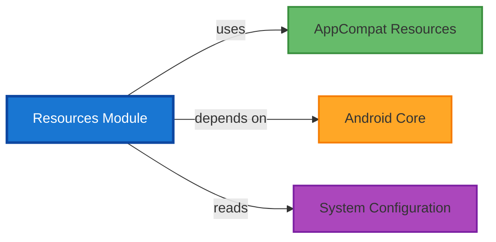

# Resources Module Documentation

## Overview

The Resources module is a foundational utility module in the Material Components library that provides essential resource resolution and management capabilities. It serves as a central hub for handling theme attributes, resource loading, text appearance configuration, and typeface utilities across all Material Design components.

## Purpose

The Resources module addresses critical needs in Android Material Design development:

- **Theme Attribute Resolution**: Provides robust utilities for resolving theme attributes with proper error handling
- **Resource Loading**: Handles loading of colors, drawables, and text appearances with backward compatibility
- **Font and Typography Management**: Manages text scaling, font loading, and typeface adjustments
- **Accessibility Support**: Ensures proper minimum touch target sizes and accessibility considerations

## Architecture

```mermaid
graph TD
    A[Resources Module] --> B[MaterialAttributes]
    A --> C[MaterialResources]
    A --> D[TextAppearanceConfig]
    A --> E[TypefaceUtils]
    
    B --> B1[Theme Attribute Resolution]
    B --> B2[Error Handling]
    B --> B3[Accessibility Utilities]
    
    C --> C1[ColorStateList Loading]
    C --> C2[Drawable Resolution]
    C --> C3[Text Appearance Processing]
    C --> C4[Font Scale Detection]
    C --> C5[Dimension Handling]
    
    D --> D1[Synchronous Font Loading]
    D --> D2[Testing Configuration]
    
    E --> E1[Font Weight Adjustment]
    E --> E2[Typeface Cloning]
    E --> E3[Configuration-based Adjustments]
    
    style A fill:#1976D2,stroke:#0D47A1,stroke-width:3px,color:#fff
    style B fill:#42A5F5,stroke:#1976D2,stroke-width:2px
    style C fill:#42A5F5,stroke:#1976D2,stroke-width:2px
    style D fill:#42A5F5,stroke:#1976D2,stroke-width:2px
    style E fill:#42A5F5,stroke:#1976D2,stroke-width:2px
```



## Core Components

### [MaterialAttributes](material-attributes.md)
A utility class that provides methods for resolving theme attributes with comprehensive error handling. It ensures that required attributes are present in the current theme and provides meaningful error messages when they are missing.

**Key Features:**
- Attribute resolution with null safety
- Typed value extraction (boolean, integer, dimension)
- Accessibility-aware dimension resolution
- Comprehensive error messaging for missing attributes

### [MaterialResources](material-resources.md)
A comprehensive resource utility that handles loading and processing of various resource types with backward compatibility and theme support.

**Key Features:**
- ColorStateList loading with AppCompat support
- Drawable resolution with vector compatibility
- Text appearance processing and scaling
- Font scale detection and handling
- Unscaled text size calculations for space-constrained components

### [TextAppearanceConfig](text-appearance-config.md)
A configuration utility for managing text appearance behavior, particularly for font loading synchronization in testing scenarios.

**Key Features:**
- Synchronous font loading control
- Testing environment configuration
- Deprecated in favor of internal TextAppearance optimizations

### [TypefaceUtils](typeface-utils.md)
A utility class for handling typeface modifications and adjustments based on system configuration.

**Key Features:**
- Font weight adjustment based on system settings
- Typeface cloning with weight modifications
- Configuration-aware font handling (API 31+)

## Module Dependencies



## Integration with Other Modules

The Resources module serves as a foundation for numerous other Material Components modules:

- **[Theme Module](theme.md)**: Uses MaterialAttributes for theme attribute resolution
- **[Color Module](color.md)**: Leverages MaterialResources for color loading and processing
- **[Text Field Module](text-field.md)**: Utilizes text appearance and typeface utilities
- **[Button Module](button.md)**: Depends on resource resolution for styling and theming
- **[Typography Components](typography.md)**: Uses TextAppearanceConfig and TypefaceUtils

## Usage Patterns

### Theme Attribute Resolution
```java
// Resolve required theme attribute
int colorPrimary = MaterialAttributes.resolveOrThrow(
    context, 
    R.attr.colorPrimary, 
    "Component requires colorPrimary"
);

// Resolve with default value
boolean isElevated = MaterialAttributes.resolveBoolean(
    context,
    R.attr.elevated,
    false // default value
);
```

### Resource Loading
```java
// Load ColorStateList with theme support
ColorStateList colors = MaterialResources.getColorStateList(
    context,
    attributes,
    R.styleable.Component_android_textColor
);

// Get dimension with proper scaling
int touchTargetSize = MaterialResources.getDimensionPixelSize(
    context,
    attributes,
    R.styleable.Component_minTouchTargetSize,
    defaultSize
);
```

### Font Scale Detection
```java
// Check font scale for accessibility
if (MaterialResources.isFontScaleAtLeast2_0(context)) {
    // Apply large text adaptations
}

// Get unscaled text size for space-constrained components
int unscaledSize = MaterialResources.getUnscaledTextSize(
    context,
    textAppearanceResId,
    defaultSize
);
```

## Accessibility Considerations

The Resources module provides several utilities for accessibility compliance:

- **Minimum Touch Target Size**: Ensures components meet accessibility guidelines
- **Font Scale Detection**: Allows components to adapt to user font preferences
- **Unscaled Text Options**: Provides alternatives for space-constrained scenarios

## Testing Support

The module includes specific support for testing environments:

- **Synchronous Font Loading**: Prevents test flakiness by loading fonts synchronously
- **Configuration-based Adjustments**: Allows testing different font weight scenarios

## Performance Optimizations

- **Cached Resolution**: Avoids repeated theme attribute lookups
- **Lazy Loading**: Resources are loaded only when needed
- **Backward Compatibility**: Uses efficient compatibility layers for older API levels

## Error Handling

The module implements comprehensive error handling:

- **Missing Attribute Detection**: Provides clear error messages for missing required attributes
- **Type Safety**: Ensures proper type conversion with fallback values
- **Resource Validation**: Validates resource existence before loading

This foundation module enables consistent theming and resource management across all Material Components while maintaining backward compatibility and accessibility standards.