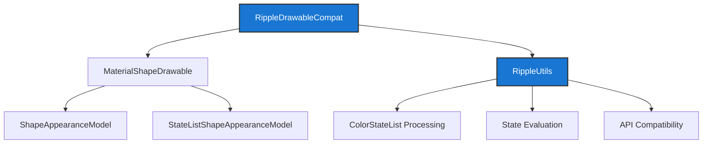
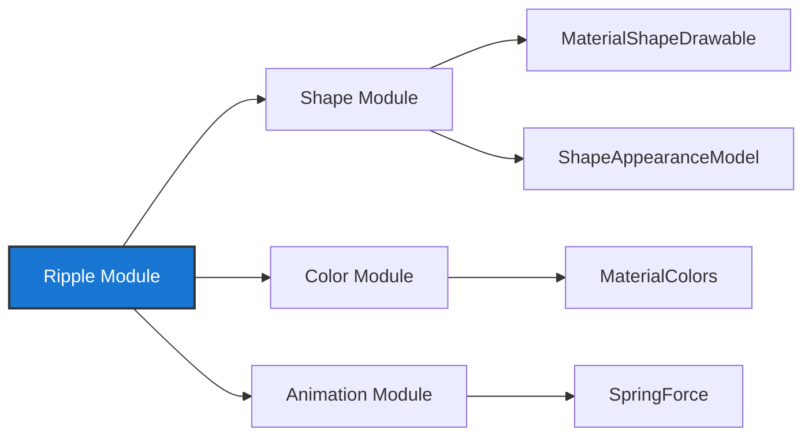
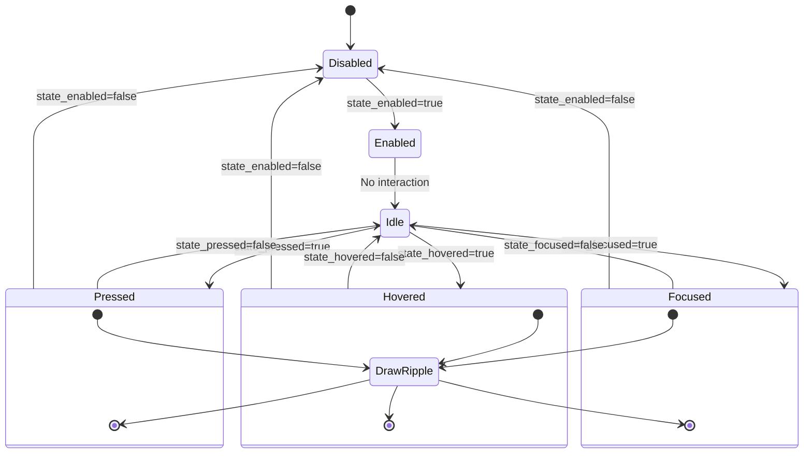
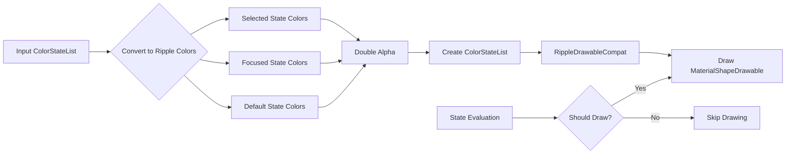

# Ripple Module Documentation

## Overview

The Ripple module provides Material Design ripple effects for Android applications, offering touch feedback through visual animations. It implements a compat ripple drawable system that works across different Android API levels, ensuring consistent ripple behavior and appearance throughout the application.

## Purpose

The primary purpose of the ripple module is to:
- Provide Material Design-compliant ripple effects for touch interactions
- Ensure backward compatibility with pre-Lollipop devices
- Offer customizable ripple animations that integrate with Material Design components
- Handle state-based color changes for interactive UI elements

## Architecture

The ripple module consists of two core components that work together to provide ripple functionality:



### Core Components

#### RippleDrawableCompat
The main drawable class that provides ripple functionality. It extends `Drawable` and implements `Shapeable` and `TintAwareDrawable` interfaces to integrate with Material Design's shape system and tinting capabilities.

**Key Features:**
- State-aware drawing (only draws when enabled and in interactive states)
- Shape customization through `ShapeAppearanceModel`
- Spring-based corner animations
- Tint and color filter support
- Backward compatibility for pre-Lollipop devices

#### RippleUtils
A utility class that provides helper methods for ripple color processing and state management.

**Key Features:**
- ColorStateList conversion for ripple effects
- State evaluation to determine when ripples should be drawn
- API-specific ripple creation for Lollipop devices
- Color alpha manipulation for proper ripple visibility

## Dependencies

The ripple module integrates with several other Material Design modules:



### Shape Module Integration
The ripple module heavily relies on the shape system for:
- `MaterialShapeDrawable` as the underlying drawable implementation
- `ShapeAppearanceModel` for customizable ripple shapes  
- `StateListShapeAppearanceModel` for state-based shape changes

### Color Module Integration
Integration with the [color module](color.md) provides:
- `MaterialColors` for theme-aware color handling (see [core-material-colors](core-material-colors.md))
- Color harmonization capabilities
- Dynamic color support

## Functionality

### State Management
The ripple system responds to various UI states:
- **Pressed**: Touch down state with primary ripple effect
- **Focused**: Keyboard navigation focus state
- **Hovered**: Mouse hover state (where supported)
- **Selected**: Selected state for toggleable components
- **Enabled/Disabled**: Component availability state

### Compatibility Features
- **Pre-Lollipop**: Uses custom drawable implementation
- **Lollipop+**: Leverages framework RippleDrawable with enhancements
- **API 21-22**: Special handling for ripple positioning bugs

### Customization Options
- Shape customization through `ShapeAppearanceModel`
- Color state lists for different interaction states
- Corner radius animations with spring physics
- Alpha and opacity control
- Tint and color filter support

## Usage Patterns

The ripple module is typically used as an overlay drawable on interactive components:

1. **Button Components**: Provides touch feedback for Material buttons
2. **Card Components**: Adds ripple effects to selectable cards
3. **List Items**: Enables ripple feedback for list selections
4. **Navigation Components**: Touch feedback for navigation items

## Performance Considerations

- **State Evaluation**: Efficient state change detection to minimize unnecessary redraws
- **Conditional Drawing**: Only draws when necessary (enabled + interactive state)
- **Constant State**: Proper constant state implementation for drawable recycling
- **Memory Management**: Efficient drawable state management and mutation handling

## Integration with Material Components

The ripple module serves as a foundational layer for many Material Design components, providing consistent touch feedback across:
- Buttons ([material-button](material-button.md), [material-button-group](material-button-group.md), [material-split-button](material-split-button.md))
- Cards ([card module](card.md))
- Navigation components ([navigation-bar](navigation-bar.md), [navigation-drawer](navigation-drawer.md))
- Bottom sheets ([bottom-sheet module](bottom-sheet.md))
- Chips ([chip-drawable](chip-drawable.md), [chip-group](chip-group.md))
- Text fields ([text-field module](text-field.md))

This ensures a cohesive user experience with standardized ripple behaviors throughout the application.

## Technical Implementation

### Ripple State Management

The ripple system uses a sophisticated state evaluation mechanism to determine when ripples should be visible:



### Color Processing Pipeline

The ripple module processes colors through a multi-step pipeline to ensure proper visual appearance:



## API Usage Examples

### Basic Ripple Creation
```java
// Create a ripple with custom shape
ShapeAppearanceModel shape = ShapeAppearanceModel.builder()
    .setAllCorners(CornerFamily.ROUNDED, 8dp)
    .build();
RippleDrawableCompat ripple = new RippleDrawableCompat(shape);
```

### Color State List Configuration
```java
// Create ripple colors for different states
int[][] states = {
    new int[]{android.R.attr.state_pressed},
    new int[]{android.R.attr.state_focused},
    new int[]{android.R.attr.state_hovered},
    new int[]{} // default
};
int[] colors = {pressedColor, focusedColor, hoveredColor, transparent};
ColorStateList rippleColors = new ColorStateList(states, colors);
```

### Integration with Material Components
```java
// Apply ripple to a MaterialButton
MaterialButton button = findViewById(R.id.button);
button.setRippleColor(rippleColors);
```

## Best Practices

### Performance Optimization
- Use `shouldDrawRippleCompat()` to avoid unnecessary drawing operations
- Implement proper `ConstantState` for drawable recycling
- Cache `ColorStateList` objects when possible
- Minimize state changes during animations

### Accessibility Considerations
- Ensure sufficient contrast between ripple colors and background
- Test ripple visibility in different lighting conditions
- Consider users with visual impairments when selecting ripple colors
- Provide alternative feedback methods for users who disable animations

### Design Guidelines
- Use consistent ripple colors across related components
- Match ripple shapes to component backgrounds for visual cohesion
- Consider the psychological impact of different ripple intensities
- Test ripple effects on various device sizes and screen densities