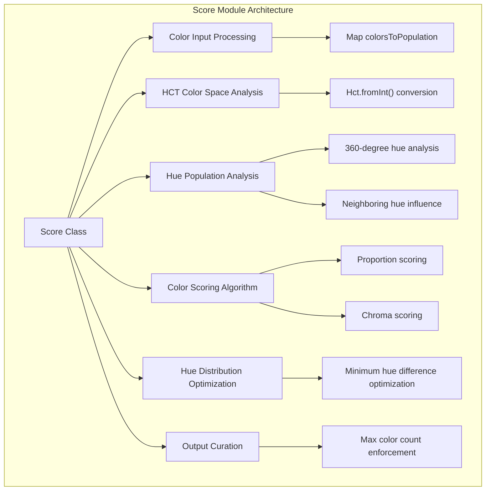
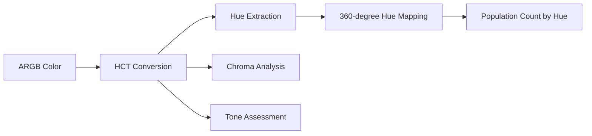
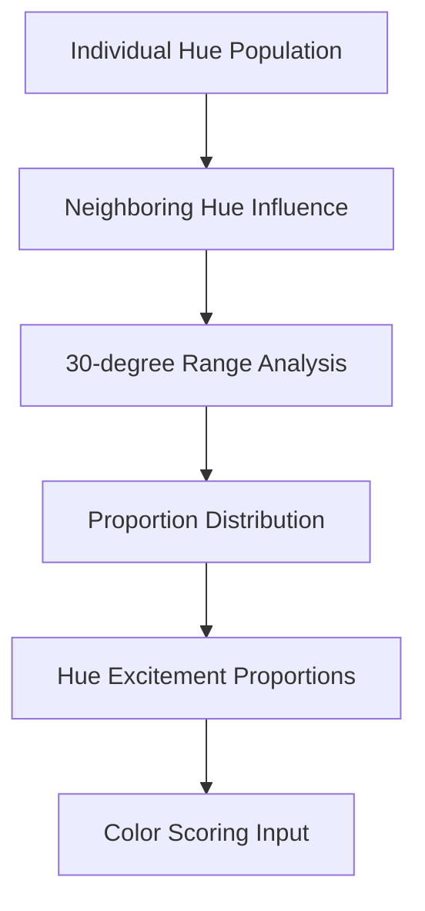
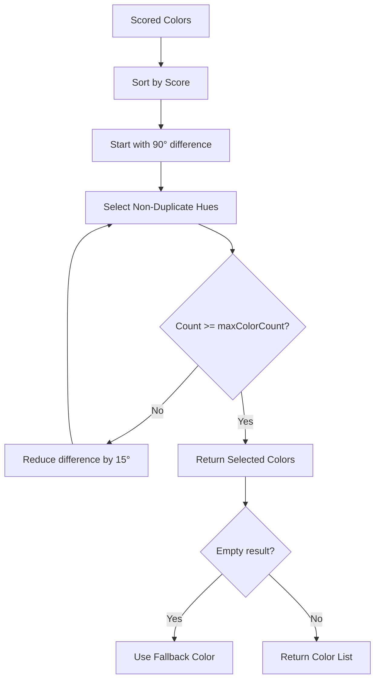
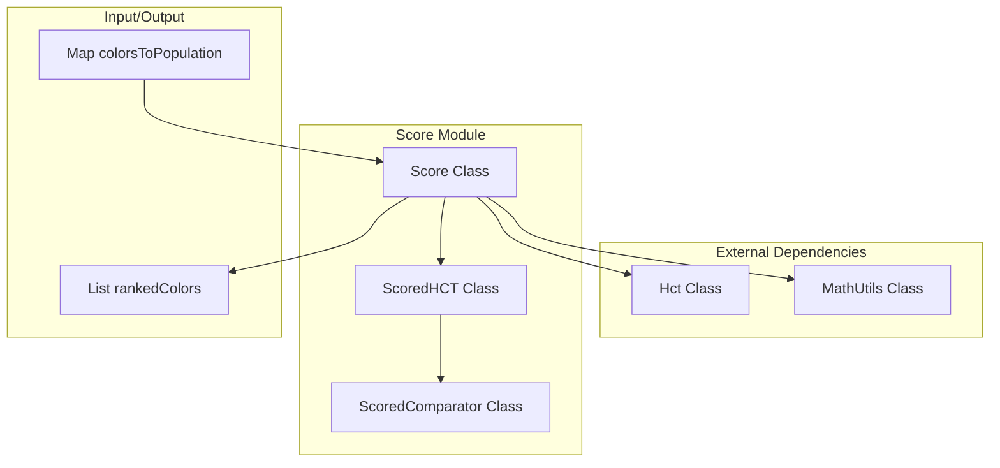
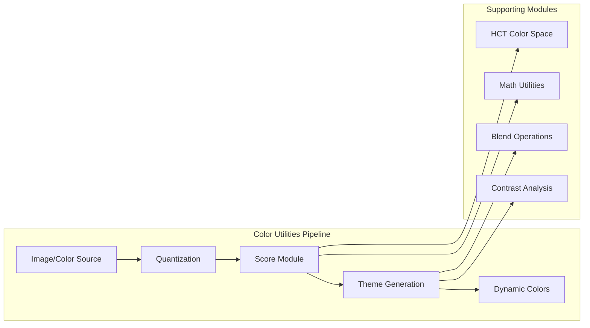

# Score Module Documentation

## Overview

The Score module is a critical component of the Material Design color utilities system, responsible for evaluating and ranking colors based on their suitability for UI themes. It provides intelligent color curation by filtering out unsuitable colors and ranking the remaining ones according to their thematic appropriateness.

## Purpose and Core Functionality

The Score module addresses a fundamental challenge in dynamic color generation: given a large set of colors extracted from an image or other source, it determines which colors are most suitable for creating cohesive UI themes. The module enables the use of high cluster counts during image quantization while intelligently curating the results to a manageable number of appropriate color choices.

### Key Capabilities

- **Color Filtering**: Removes colors with insufficient chroma or usage frequency
- **Intelligent Scoring**: Ranks colors based on usage proportion and chroma characteristics
- **Hue Distribution**: Ensures selected colors have optimal hue separation for visual harmony
- **Fallback Handling**: Provides default colors when no suitable options are available

## Architecture and Component Structure



## Core Algorithm Components

### 1. Color Space Conversion and Analysis

The module converts input colors to the HCT (Hue, Chroma, Tone) color space, which provides perceptually uniform color representation ideal for theme generation.



### 2. Hue Excitement Calculation

The algorithm analyzes color usage across the hue spectrum, considering the influence of neighboring hues within a 30-degree range to determine color prominence.



### 3. Color Scoring System

Colors are evaluated using a weighted scoring system that balances usage proportion against chroma characteristics:

- **Proportion Score**: `proportion * 100.0 * 0.7` (70% weight)
- **Chroma Score**: `(chroma - 48) * weight` (30% weight, variable based on target)
- **Target Chroma**: 48 (optimal for UI themes)
- **Filtering Thresholds**: Minimum chroma of 5, minimum excited proportion of 0.01

### 4. Hue Distribution Optimization

The module employs an iterative approach to select colors with optimal hue separation:



## Data Flow and Dependencies



## Integration with Color Utilities Ecosystem

The Score module serves as a critical component within the broader Material Design color utilities system:



## Key Configuration Parameters

| Parameter | Default Value | Purpose |
|-----------|---------------|---------|
| TARGET_CHROMA | 48.0 | Optimal chroma for UI themes |
| WEIGHT_PROPORTION | 0.7 | Weight given to color usage proportion |
| WEIGHT_CHROMA_ABOVE | 0.3 | Weight for chroma above target |
| WEIGHT_CHROMA_BELOW | 0.1 | Weight for chroma below target |
| CUTOFF_CHROMA | 5.0 | Minimum chroma threshold |
| CUTOFF_EXCITED_PROPORTION | 0.01 | Minimum usage proportion threshold |
| MAX_COLOR_COUNT | 4 | Default maximum colors to return |
| BLUE_500 | 0xff4285f4 | Default fallback color (Google Blue) |

## Usage Patterns and Best Practices

### Basic Usage
```java
// Score colors with default parameters
Map<Integer, Integer> colorsToPopulation = getColorsFromImage();
List<Integer> scoredColors = Score.score(colorsToPopulation);
```

### Advanced Configuration
```java
// Custom scoring with specific parameters
List<Integer> scoredColors = Score.score(
    colorsToPopulation,
    6,                    // maxColorCount
    0xFF000000,          // fallbackColorArgb
    false                 // filter disabled
);
```

## Performance Considerations

- **Time Complexity**: O(n log n) due to sorting operation
- **Space Complexity**: O(n) for storing intermediate scored colors
- **Optimization**: The module efficiently processes large color sets through early filtering

## Error Handling and Edge Cases

- **Empty Input**: Returns fallback color when no suitable colors are found
- **Insufficient Colors**: Provides fallback when filtering removes all colors
- **Single Color**: Handles monochromatic inputs gracefully
- **Invalid Colors**: Filters out colors that don't meet minimum thresholds

## Relationship to Other Modules

The Score module integrates with several other components in the Material Design system:

- **[HCT Color Space](hct-solver.md)**: Provides perceptually uniform color representation
- **[Math Utilities](math-utils.md)**: Offers degree sanitization and difference calculations
- **[Quantization Modules](quantizer-celebi.md)**: Supplies the color population data
- **[Dynamic Colors](dynamic-colors.md)**: Uses scored colors for theme generation

## Future Enhancements

The module is designed with extensibility in mind, supporting:

- Custom scoring algorithms through parameter adjustment
- Additional color space support beyond HCT
- Machine learning integration for improved color selection
- Accessibility-aware scoring based on contrast requirements

## Conclusion

The Score module represents a sophisticated approach to color curation, combining perceptual color science with practical UI design requirements. Its intelligent filtering and ranking capabilities ensure that dynamically generated color themes maintain visual harmony and accessibility standards while providing developers with flexible, high-quality color options for their applications.