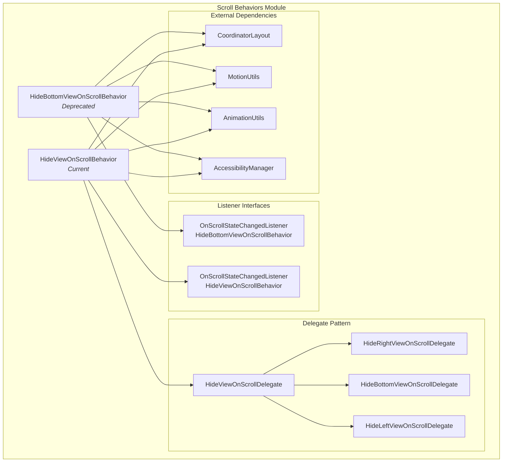
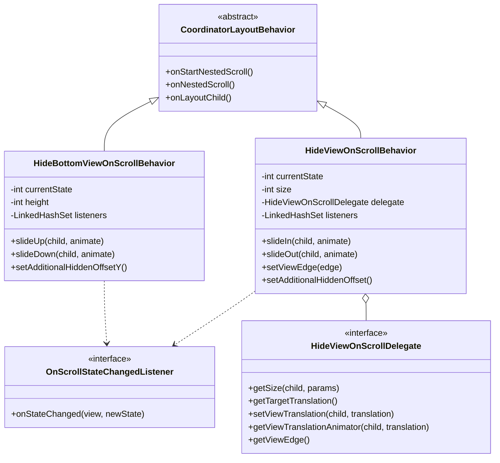
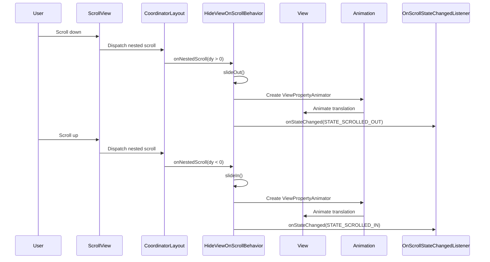
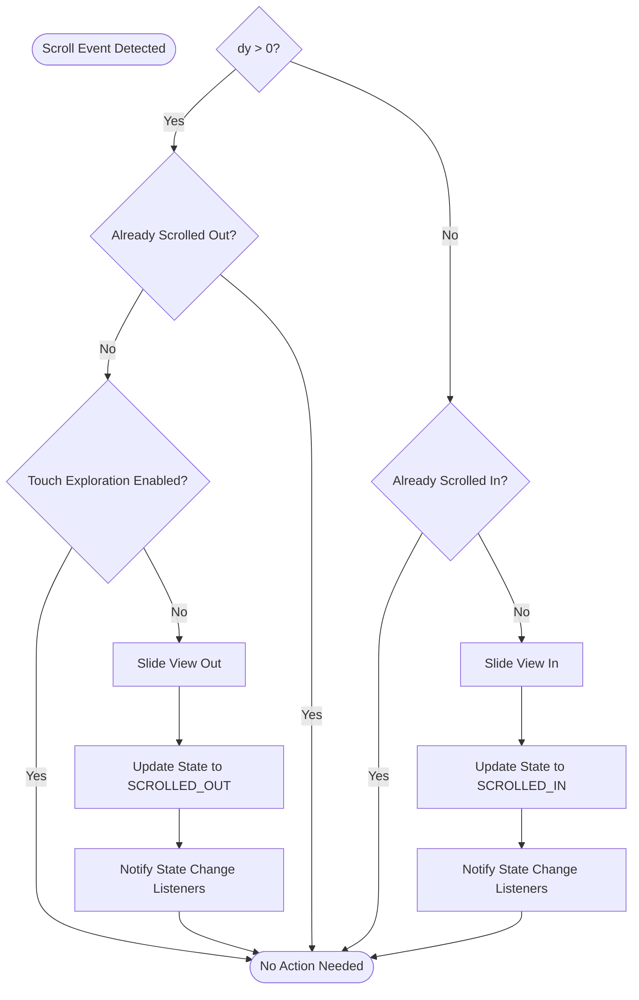

# Scroll Behaviors Module

The scroll-behaviors module provides CoordinatorLayout behaviors that automatically hide and show views based on scroll events. This module is essential for creating responsive UI patterns where elements dynamically appear or disappear as users scroll through content.

## Overview

The scroll-behaviors module contains two main behavior implementations that handle view visibility based on scroll direction:

- **HideBottomViewOnScrollBehavior** (deprecated): Hides views off the bottom edge when scrolling down
- **HideViewOnScrollBehavior**: Modern replacement supporting multiple edge directions (bottom, right, left)

These behaviors are designed to work with Material Design scrolling patterns, providing smooth animations and accessibility support.

## Core Components

### HideBottomViewOnScrollBehavior

**Status**: Deprecated (use HideViewOnScrollBehavior instead)

A CoordinatorLayout behavior that hides views off the bottom of the screen when scrolling down and shows them when scrolling up. This behavior is specifically designed for bottom-aligned views like BottomAppBar or bottom navigation components.

**Key Features:**
- Automatic scroll direction detection
- Smooth slide animations with customizable duration and interpolators
- Accessibility support with Touch Exploration integration
- State change notifications via listeners
- Additional offset support for custom positioning

**States:**
- `STATE_SCROLLED_UP`: View is visible on screen
- `STATE_SCROLLED_DOWN`: View is hidden off the bottom edge

### HideViewOnScrollBehavior

The modern replacement for HideBottomViewOnScrollBehavior with enhanced functionality and multi-directional support.

**Key Features:**
- Support for three screen edges: bottom, right, and left
- Automatic edge detection based on view gravity
- Manual edge override capability
- Enhanced animation system with delegate pattern
- Improved accessibility handling
- Utility method for behavior retrieval

**States:**
- `STATE_SCROLLED_IN`: View is visible on screen
- `STATE_SCROLLED_OUT`: View is hidden off the screen edge

**Supported Edges:**
- `EDGE_BOTTOM`: Slides vertically off the bottom edge
- `EDGE_RIGHT`: Slides horizontally off the right edge
- `EDGE_LEFT`: Slides horizontally off the left edge

## Architecture



## Component Relationships



## Data Flow



## Process Flow



## Integration with Other Modules

The scroll-behaviors module integrates with several other Material Design components:

### AppBar Integration
- Works seamlessly with [appbar-layout](appbar.md) components
- Coordinates with AppBarLayout behaviors for complex scrolling patterns
- Supports collapsing toolbar layouts

### Bottom App Bar Support
- Specifically designed for [bottom-app-bar](bottom-app-bar.md) components
- Provides automatic hiding behavior for bottom navigation
- Integrates with FloatingActionButton behaviors

### Motion System Integration
- Uses [motion](motion.md) utilities for consistent animation timing
- Respects Material motion guidelines and easing curves
- Theme-aware animation durations

## Usage Examples

### Basic Bottom View Hiding

```xml
<androidx.coordinatorlayout.widget.CoordinatorLayout>
    <!-- Your scrollable content -->
    <androidx.core.widget.NestedScrollView
        android:layout_width="match_parent"
        android:layout_height="match_parent">
        <!-- Content here -->
    </androidx.core.widget.NestedScrollView>
    
    <!-- Bottom view that will hide on scroll -->
    <com.google.android.material.bottomappbar.BottomAppBar
        android:layout_width="match_parent"
        android:layout_height="wrap_content"
        android:layout_gravity="bottom"
        app:layout_behavior="com.google.android.material.behavior.HideViewOnScrollBehavior" />
</androidx.coordinatorlayout.widget.CoordinatorLayout>
```

### Programmatic Control

```java
// Get the behavior instance
BottomAppBar bottomAppBar = findViewById(R.id.bottom_app_bar);
HideViewOnScrollBehavior<BottomAppBar> behavior = HideViewOnScrollBehavior.from(bottomAppBar);

// Add state change listener
behavior.addOnScrollStateChangedListener((view, newState) -> {
    if (newState == HideViewOnScrollBehavior.STATE_SCROLLED_IN) {
        // View is now visible
    } else {
        // View is now hidden
    }
});

// Manually control visibility
behavior.slideIn(bottomAppBar, true);  // With animation
behavior.slideOut(bottomAppBar, false); // Without animation
```

### Multi-Edge Configuration

```java
// Configure to hide from right edge
HideViewOnScrollBehavior<FloatingActionButton> behavior = 
    new HideViewOnScrollBehavior<>(HideViewOnScrollBehavior.EDGE_RIGHT);

// Or let it auto-detect based on gravity
CoordinatorLayout.LayoutParams params = 
    (CoordinatorLayout.LayoutParams) fab.getLayoutParams();
params.setBehavior(new HideViewOnScrollBehavior<>());
```

## Accessibility Features

The scroll-behaviors module includes comprehensive accessibility support:

### Touch Exploration Integration
- Automatically disables hiding behavior when Touch Exploration is enabled
- Prevents content from being obscured during accessibility navigation
- Provides state change listeners for accessibility services

### Accessibility Manager Integration
- Monitors Touch Exploration state changes
- Automatically shows hidden views when accessibility is activated
- Properly cleans up listeners when views are detached

### Content Padding Recommendations
When the hide behavior is disabled due to accessibility, the documentation recommends adding appropriate padding to ensure content remains accessible and unobstructed.

## Animation System

### Duration and Interpolation
- **Enter Animation**: 225ms (motionDurationLong2)
- **Exit Animation**: 175ms (motionDurationMedium4)
- **Easing**: Emphasized interpolator (motionEasingEmphasizedInterpolator)
- **Fallbacks**: Linear-out-slow-in for enter, fast-out-linear-in for exit

### Theme Integration
Animation properties are resolved from the current theme, allowing for:
- Consistent motion patterns across the application
- Theme-specific animation customization
- Dynamic animation property updates

## Migration Guide

### From HideBottomViewOnScrollBehavior to HideViewOnScrollBehavior

The newer `HideViewOnScrollBehavior` is the recommended replacement for the deprecated `HideBottomViewOnScrollBehavior`. Key migration steps:

1. **Update XML Layouts**:
   ```xml
   <!-- Old -->
   app:layout_behavior="com.google.android.material.behavior.HideBottomViewOnScrollBehavior"
   
   <!-- New -->
   app:layout_behavior="com.google.android.material.behavior.HideViewOnScrollBehavior"
   ```

2. **Update Code References**:
   ```java
   // Old
   HideBottomViewOnScrollBehavior behavior = 
       new HideBottomViewOnScrollBehavior();
   
   // New
   HideViewOnScrollBehavior behavior = 
       new HideViewOnScrollBehavior(HideViewOnScrollBehavior.EDGE_BOTTOM);
   ```

3. **Update State References**:
   ```java
   // Old
   STATE_SCROLLED_UP -> STATE_SCROLLED_IN
   STATE_SCROLLED_DOWN -> STATE_SCROLLED_OUT
   ```

4. **Update Method Names**:
   ```java
   // Old
   slideUp() -> slideIn()
   slideDown() -> slideOut()
   isScrolledUp() -> isScrolledIn()
   isScrolledDown() -> isScrolledOut()
   ```

## Best Practices

### Performance Considerations
- Behaviors are automatically managed by CoordinatorLayout
- Animation cancellation is handled properly to prevent conflicts
- View state is preserved during configuration changes

### State Management
- Always check current state before performing animations
- Use state change listeners to coordinate with other UI updates
- Consider accessibility implications when customizing behavior

### Edge Case Handling
- Handle rapid scroll direction changes gracefully
- Account for view size changes during runtime
- Properly clean up listeners when views are destroyed

## Related Documentation

- [AppBar Layout](appbar.md) - Integration with app bar scrolling patterns
- [Bottom App Bar](bottom-app-bar.md) - Common usage scenario for scroll behaviors
- [Motion System](motion.md) - Animation timing and interpolation details
- [CoordinatorLayout](coordinatorlayout.md) - Parent layout that manages behaviors