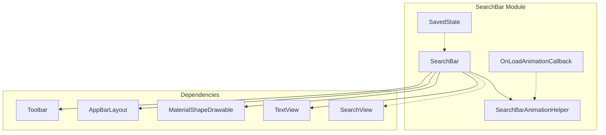
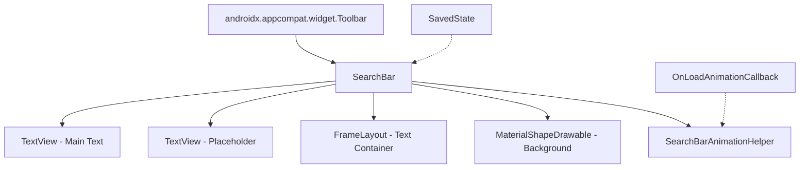
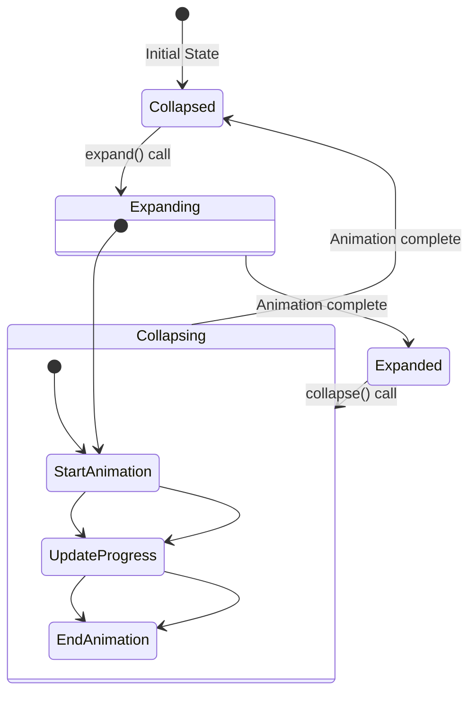
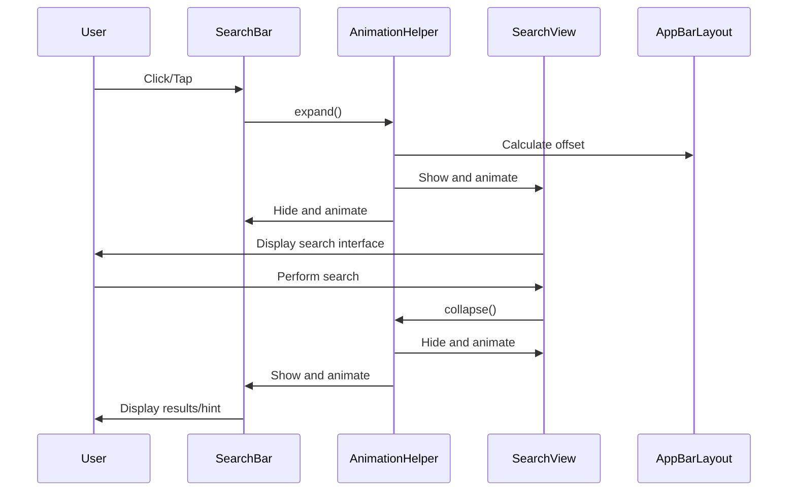
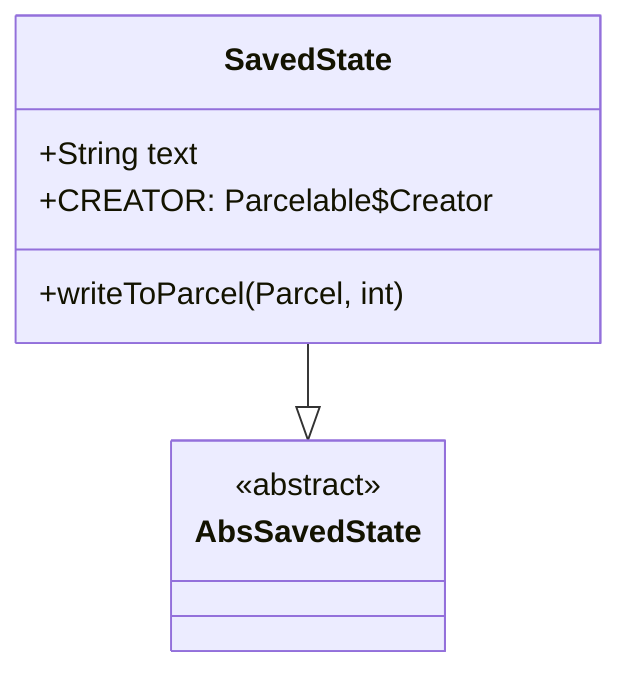

# Search Bar Module Documentation

## Overview

The search-bar module provides a Material Design search interface component that represents a floating search field with affordances for search and navigation. The SearchBar is designed to work seamlessly with AppBarLayout and SearchView components to create a cohesive search experience in Android applications.

## Purpose and Core Functionality

The SearchBar module serves as the primary entry point for search functionality within the Material Design system. It extends Toolbar to provide:

- **Search Input Interface**: A text field with hint support for search queries
- **Navigation Integration**: Built-in navigation icon support with customizable behavior
- **Animation Support**: Expand/collapse animations for transitioning between search states
- **AppBar Integration**: Seamless integration with AppBarLayout for scroll behaviors
- **Accessibility**: Full accessibility support with proper semantic markup
- **Theming**: Material Design 3 theming support with customizable colors and shapes

## Architecture and Component Relationships

### Core Components



### Component Hierarchy



## Key Features and Capabilities

### 1. Search Interface
- **Text Input**: Primary text field for search queries with hint support
- **Placeholder Text**: Secondary text view for placeholder content
- **Text Centering**: Optional text centering within the search bar
- **Hint Management**: Dynamic hint text that adapts to search state

### 2. Visual Customization
- **Shape Appearance**: Material Design shape system integration
- **Color Theming**: Support for background tint, stroke color, and elevation
- **Adaptive Width**: Responsive width behavior based on parent container size
- **Navigation Icon**: Customizable navigation icon with tinting support

### 3. Animation System
- **On Load Animation**: Fade-in animation from center view to hint text
- **Expand Animation**: Transition from SearchBar to expanded view (e.g., SearchView)
- **Collapse Animation**: Transition from expanded view back to SearchBar
- **Animation Callbacks**: Listener system for animation lifecycle events

### 4. AppBar Integration
- **Scroll Flags**: Default scroll behavior integration with AppBarLayout
- **Lift on Scroll**: Dynamic elevation and color changes on scroll
- **Scrolling View Behavior**: Custom behavior for scroll-away mode
- **Transparent AppBar**: Automatic AppBarLayout transparency setup

## Data Flow and Interactions

### Search State Transitions



### Component Interaction Flow



## Integration Patterns

### Basic SearchBar Setup

```xml
<com.google.android.material.appbar.AppBarLayout
    android:layout_width="match_parent"
    android:layout_height="wrap_content">
    <com.google.android.material.search.SearchBar
        android:id="@+id/search_bar"
        android:layout_width="match_parent"
        android:layout_height="wrap_content"
        android:hint="@string/search_hint" />
</com.google.android.material.appbar.AppBarLayout>
```

### SearchBar with SearchView Integration

```xml
<androidx.coordinatorlayout.widget.CoordinatorLayout>
    <androidx.core.widget.NestedScrollView
        app:layout_behavior="@string/searchbar_scrolling_view_behavior">
        <!-- Content -->
    </androidx.core.widget.NestedScrollView>
    
    <com.google.android.material.search.SearchView
        android:layout_width="match_parent"
        android:layout_height="match_parent"
        app:layout_anchor="@id/search_bar">
        <!-- Search suggestions/results -->
    </com.google.android.material.search.SearchView>
</androidx.coordinatorlayout.widget.CoordinatorLayout>
```

## Dependencies and Related Modules

### Direct Dependencies
- **[appbar-layout](appbar-layout.md)**: Integration with AppBarLayout for scroll behaviors and lift-on-scroll functionality
- **[material-shape](shape.md)**: MaterialShapeDrawable for background rendering and elevation
- **[theme](theme.md)**: Material theme integration and color system
- **[resources](resources.md)**: Material resources and attribute resolution

### Related Modules
- **[search-view](search-view.md)**: Companion component for expanded search interface
- **[animation](common-utils.md)**: Animation utilities and helpers
- **[internal](internal.md)**: Internal utilities for theme enforcement and toolbar operations

## State Management

### SavedState Implementation
The SearchBar implements custom state persistence to maintain text content across configuration changes:



### Animation State Tracking
- **Expansion State**: Tracks whether the SearchBar is expanding, expanded, collapsing, or collapsed
- **Animation Progress**: Monitors animation progress for smooth transitions
- **Callback Management**: Maintains lists of animation callbacks for lifecycle events

## Accessibility Features

### Accessibility Implementation
- **Semantic Markup**: Reports as EditText to accessibility services
- **Hint Text**: Proper hint text exposure for screen readers
- **Editable State**: Correctly reports editable state based on enabled status
- **Handwriting Support**: Android 14+ handwriting bounds optimization

### Keyboard Navigation
- **Focus Management**: Proper focus handling for navigation and interaction
- **Clickable State**: Dynamic clickable state based on navigation icon behavior
- **Decorative Icons**: Navigation icons can be marked as decorative to improve accessibility

## Performance Considerations

### Optimization Strategies
- **View Recycling**: Efficient view measurement and layout for adaptive width
- **Animation Batching**: Coordinated animations to minimize layout passes
- **State Caching**: Cached state for frequently accessed properties
- **Background Optimization**: Efficient background drawable with elevation overlay

### Memory Management
- **Listener Cleanup**: Proper removal of listeners on detach
- **Drawable Recycling**: Efficient drawable tinting and wrapping
- **Animation Cleanup**: Proper animation cleanup to prevent memory leaks

## Best Practices

### Implementation Guidelines
1. **Use with AppBarLayout**: Always place SearchBar within AppBarLayout for proper scroll behavior
2. **Enable Default Scroll Flags**: Use default scroll flags for consistent Material Design behavior
3. **Handle Configuration Changes**: Implement proper state saving for text content
4. **Theme Appropriately**: Use Material theme attributes for consistent styling
5. **Accessibility First**: Ensure proper accessibility implementation for all users

### Common Patterns
- **Search with Results**: Combine with SearchView for full search experience
- **Navigation Integration**: Use navigation icon for drawer or back navigation
- **Dynamic Content**: Update hint text based on context or user actions
- **Animation Coordination**: Coordinate animations with other UI elements

## API Reference

### Key Methods
- `setText(CharSequence)`: Set search text content
- `setHint(CharSequence)`: Set hint text
- `expand(View, AppBarLayout, boolean)`: Start expand animation
- `collapse(View, AppBarLayout, boolean)`: Start collapse animation
- `setLiftOnScroll(boolean)`: Enable lift-on-scroll behavior
- `setTextCentered(boolean)`: Center text within SearchBar

### XML Attributes
- `android:hint`: Search hint text
- `android:text`: Initial search text
- `app:backgroundTint`: Background color
- `app:elevation`: Shadow elevation
- `app:strokeColor`: Outline stroke color
- `app:strokeWidth`: Outline stroke width
- `app:textCentered`: Center text horizontally
- `app:liftOnScroll`: Enable lift-on-scroll behavior

This documentation provides a comprehensive overview of the search-bar module's architecture, functionality, and integration patterns within the Material Design system.