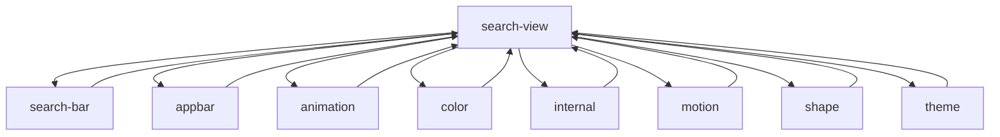
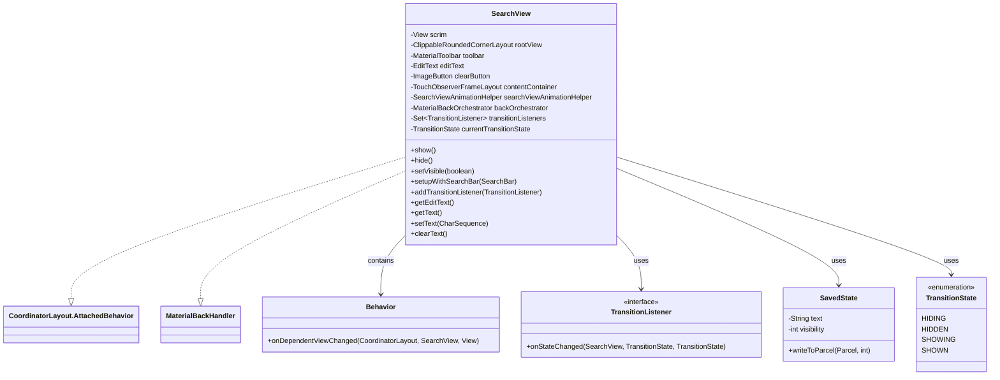
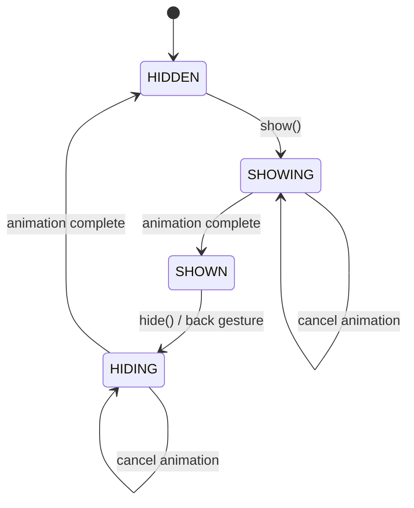
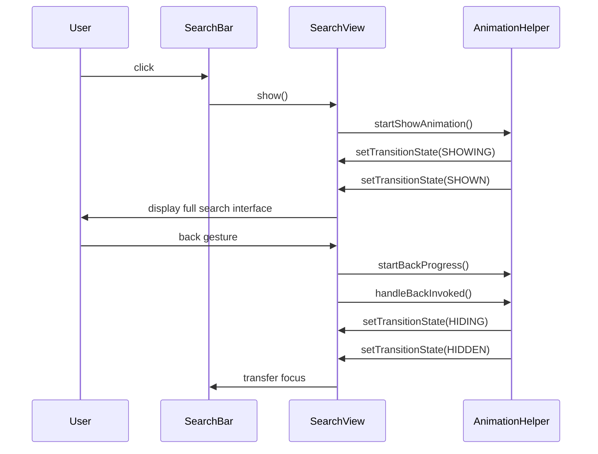
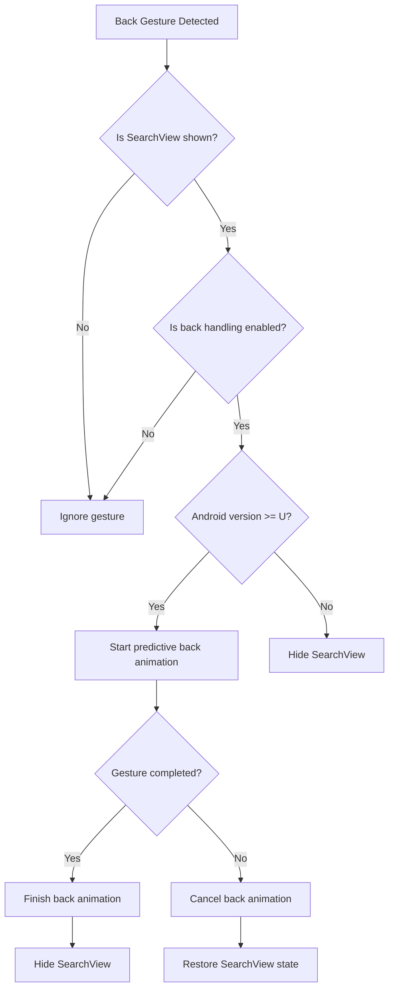
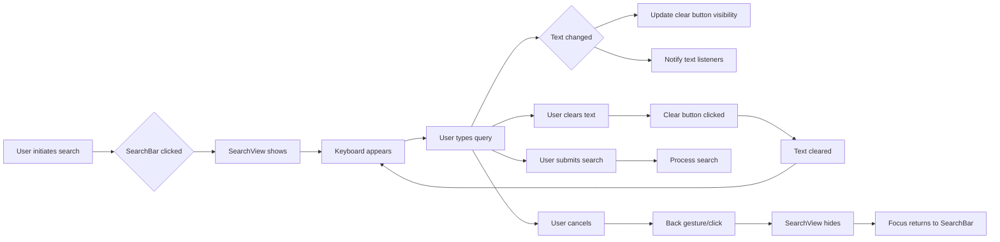
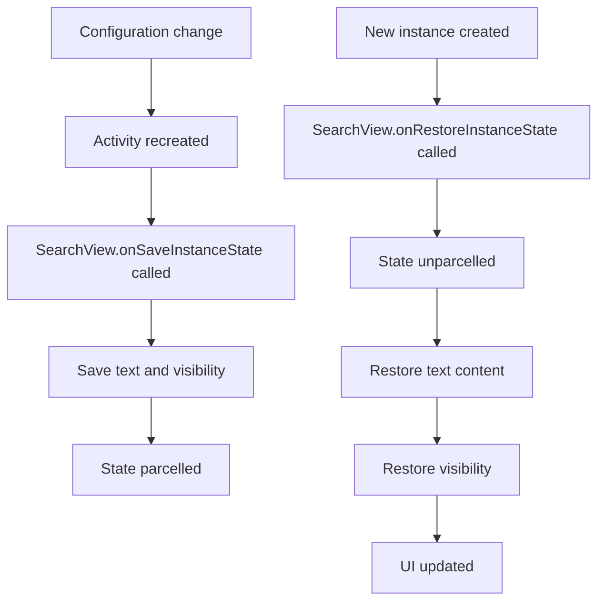

# Search View Module Documentation

## Overview

The search-view module provides a comprehensive full-screen search interface component for Android applications following Material Design principles. It implements the `SearchView` class that offers an immersive search experience with smooth animations, gesture handling, and seamless integration with the search-bar module.

## Purpose and Core Functionality

The SearchView module serves as the primary interface for full-screen search interactions within the Material Design component library. It provides:

- **Full-screen search interface**: A dedicated search view that overlays the entire screen
- **Seamless integration with SearchBar**: Automatic coordination with SearchBar components for expand/collapse animations
- **Gesture support**: Back gesture handling and predictive back navigation
- **Accessibility features**: Comprehensive accessibility support including modal behavior and keyboard navigation
- **Customizable appearance**: Support for themes, colors, and custom layouts
- **State management**: Robust state handling for visibility, text content, and transition states

## Architecture and Component Relationships

### Core Components

The search-view module consists of three primary components:

1. **SearchView.Behavior**: CoordinatorLayout behavior for automatic SearchBar integration
2. **SearchView.TransitionListener**: Interface for monitoring transition state changes
3. **SearchView.SavedState**: Parcelable state preservation for configuration changes

### Module Dependencies



### Component Architecture



## Data Flow and Component Interaction

### SearchView State Management Flow



### Integration with SearchBar



### Back Gesture Handling



## Key Features and Implementation Details

### Animation System

The SearchView employs a sophisticated animation system through `SearchViewAnimationHelper` that handles:

- **Show/Hide animations**: Smooth transitions between hidden and shown states
- **Back gesture animations**: Predictive back navigation with progress tracking
- **Navigation icon morphing**: Animated transitions between SearchBar and SearchView navigation icons
- **Menu item animations**: Coordinated animation of toolbar menu items

### Accessibility Features

The module implements comprehensive accessibility support:

- **Modal behavior**: Prevents interaction with background content when shown
- **Keyboard navigation**: Full keyboard accessibility with proper focus management
- **Screen reader support**: Proper content descriptions and accessibility events
- **Focus management**: Automatic focus transfer between SearchBar and SearchView

### Window Insets Handling

SearchView properly handles system window insets:

- **Status bar spacer**: Automatic adjustment for translucent status bars
- **Toolbar padding**: Dynamic padding based on system bars and display cutouts
- **Divider margins**: Proper margin adjustment for system insets
- **Keyboard management**: Coordination with soft keyboard appearance/disappearance

### State Preservation

The SavedState implementation ensures:

- **Text content preservation**: Search text is maintained across configuration changes
- **Visibility state**: Current visibility state is preserved
- **Parcelable implementation**: Efficient state serialization

## Integration Patterns

### Basic Integration with SearchBar

```xml
<androidx.coordinatorlayout.widget.CoordinatorLayout>
    <com.google.android.material.appbar.AppBarLayout>
        <com.google.android.material.search.SearchBar
            android:id="@+id/search_bar" />
    </com.google.android.material.appbar.AppBarLayout>
    
    <com.google.android.material.search.SearchView
        android:id="@+id/search_view"
        app:layout_anchor="@id/search_bar" />
</androidx.coordinatorlayout.widget.CoordinatorLayout>
```

### Programmatic Setup

```java
SearchBar searchBar = findViewById(R.id.search_bar);
SearchView searchView = findViewById(R.id.search_view);

// Automatic setup via CoordinatorLayout
searchView.setupWithSearchBar(searchBar);

// Manual transition control
searchView.addTransitionListener(new SearchView.TransitionListener() {
    @Override
    public void onStateChanged(@NonNull SearchView searchView, 
                             @NonNull SearchView.TransitionState previousState,
                             @NonNull SearchView.TransitionState newState) {
        // Handle state changes
    }
});
```

## Related Documentation

- [search-bar.md](search-bar.md) - SearchBar component documentation
- [appbar.md](appbar.md) - AppBarLayout integration
- [animation.md](animation.md) - Animation system details
- [motion.md](motion.md) - Motion and gesture handling
- [internal.md](internal.md) - Internal utilities and helpers

## Process Flows

### Search Interaction Flow



### Configuration Change Handling



This comprehensive documentation provides developers with a complete understanding of the search-view module's architecture, functionality, and integration patterns within the Material Design component system.