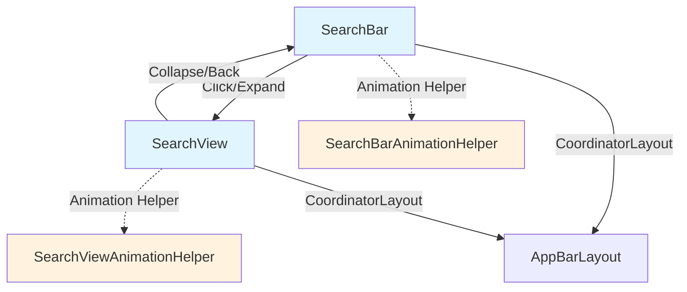

# Search Module Documentation

## Overview

The Search module provides a comprehensive search interface implementation for Android applications using Material Design components. It consists of two primary components: `SearchBar` and `SearchView`, which work together to create a seamless search experience with smooth animations and transitions.

## Architecture

The search module follows a coordinated architecture where the SearchBar serves as the entry point and the SearchView provides the full search interface. The components are designed to work together within a CoordinatorLayout to enable smooth expand/collapse animations.



## Core Components

### SearchBar
The `SearchBar` is a floating search field that extends `Toolbar` and provides affordances for search and navigation. It features:

- Material Design 3 styling with customizable shape appearance
- Lift-on-scroll behavior when used with AppBarLayout
- Expand/collapse animations to transition to SearchView
- Customizable text, hint, stroke, and background properties
- Support for center views and menu items
- Adaptive width behavior for different screen sizes

### SearchView
The `SearchView` provides a full-screen search interface that can be anchored to a SearchBar. It includes:

- Full-screen search interface with EditText for input
- Back navigation and clear text functionality
- Header layout support for additional content
- Material back handling for gesture navigation
- Accessibility support with modal behavior
- Status bar spacer for translucent status bars

## Sub-modules

### [SearchBar Core](searchbar-core.md)
Core SearchBar functionality including state management, text handling, and basic animations. This sub-module covers the fundamental SearchBar components that handle user interaction, text display, and state persistence.

### [SearchView Core](searchview-core.md)
Core SearchView functionality including text input, navigation, and state management. This sub-module documents the essential SearchView components that provide the full-screen search interface and coordinate with SearchBar.

### [Animation System](animation-system.md)
Comprehensive animation framework for expand/collapse transitions and load animations. This sub-module details the animation helper classes that manage smooth transitions between SearchBar and SearchView states.

### Behavior System
CoordinatorLayout behaviors for integrating SearchBar and SearchView with the app bar system. The behaviors handle automatic setup and coordination between search components within the CoordinatorLayout ecosystem.

## Key Features

### Expand/Collapse Animation
The search module provides smooth expand and collapse animations between SearchBar and SearchView states. The animation system handles:

- Morphing between SearchBar and SearchView shapes
- Fade transitions for navigation icons and menu items
- Elevation and background color transitions
- Text field expansion and contraction

### Material Back Handling
On Android 14+ (API 34+), the SearchView supports Material back handling for gesture navigation, providing a seamless back experience.

### Accessibility
The search module includes comprehensive accessibility features:

- Modal behavior for SearchView to prevent focus on background content
- Proper screen reader announcements
- Keyboard navigation support
- Handwriting input delegation (Android 14+)

### CoordinatorLayout Integration
Both SearchBar and SearchView are designed to work seamlessly within CoordinatorLayout:

- SearchBar integrates with AppBarLayout for scroll behavior
- SearchView can be anchored to SearchBar for automatic setup
- Behaviors handle automatic coordination between components

## Usage Patterns

### Basic Setup
```xml
<androidx.coordinatorlayout.widget.CoordinatorLayout>
    <androidx.core.widget.NestedScrollView
        app:layout_behavior="@string/searchbar_scrolling_view_behavior">
        <!-- Content -->
    </androidx.core.widget.NestedScrollView>
    
    <com.google.android.material.appbar.AppBarLayout>
        <com.google.android.material.search.SearchBar
            android:id="@+id/search_bar"
            android:hint="@string/search_hint" />
    </com.google.android.material.appbar.AppBarLayout>
    
    <com.google.android.material.search.SearchView
        android:id="@+id/search_view"
        app:layout_anchor="@id/search_bar" />
</androidx.coordinatorlayout.widget.CoordinatorLayout>
```

### Programmatic Control
```java
SearchBar searchBar = findViewById(R.id.search_bar);
SearchView searchView = findViewById(R.id.search_view);

// Setup coordination
searchView.setupWithSearchBar(searchBar);

// Control animations
searchBar.expand(searchView);
searchView.hide();

// Handle text input
searchView.getEditText().addTextChangedListener(textWatcher);
```

## Dependencies

The search module integrates with several other Material Design components:

- **AppBarLayout**: For scroll behavior and lift-on-scroll functionality
- **MaterialToolbar**: Base implementation for SearchView toolbar
- **MaterialShapeDrawable**: For customizable backgrounds and shapes
- **CoordinatorLayout**: For coordinated animations and behaviors
- **MaterialColors**: For theme-aware color handling

## State Management

Both SearchBar and SearchView implement proper state saving and restoration:

- Text content is preserved across configuration changes
- Visibility states are maintained
- Animation states are properly handled
- Accessibility states are restored

## Performance Considerations

- Animations use hardware acceleration when available
- View recycling is implemented for efficient memory usage
- Background processing is minimized during animations
- Status bar spacer height is calculated efficiently

## Customization

The search module provides extensive customization options:

- Shape appearance and corner radius
- Background colors and elevation
- Stroke width and color
- Text appearance and alignment
- Animation timing and interpolation
- Navigation icon customization
- Menu item integration

For detailed information about specific sub-modules, refer to their individual documentation files.