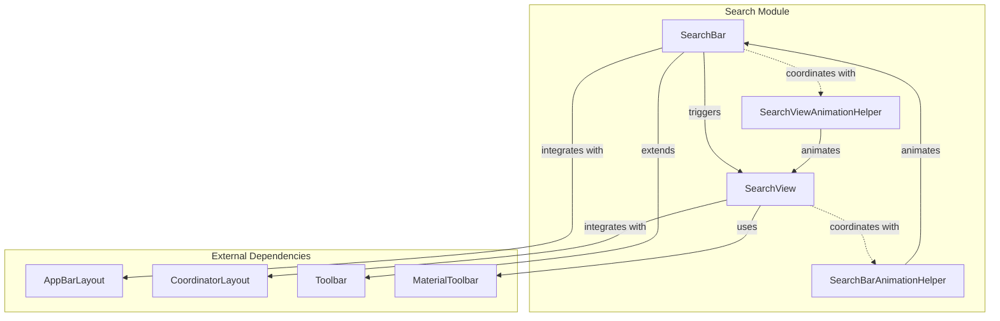
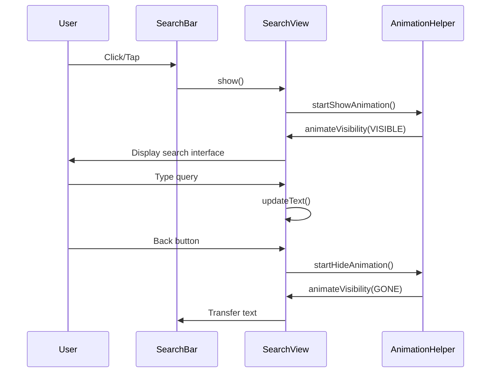

# Search Module Documentation

## Overview

The Search module provides Material Design search functionality for Android applications, offering a comprehensive set of components for implementing search interfaces. The module includes search bars, search views, and supporting animation helpers that work together to create smooth, intuitive search experiences.

## Architecture

The Search module follows a component-based architecture with clear separation of concerns:


```mermaid
graph TB
    subgraph "Search Module"
        SB[SearchBar]
        SV[SearchView]
        SBAH[SearchBarAnimationHelper]
        SVAH[SearchViewAnimationHelper]
    end
    
    SB -->|"triggers"| SV
    SBAH -->|"animates"| SB
    SVAH -->|"animates"| SV
    SB -.->|"coordinates with"| SVAH
    SV -.->|"coordinates with"| SBAH
    
    subgraph "External Dependencies"
        ABL[AppBarLayout]
        CL[CoordinatorLayout]
        TB[Toolbar]
        MT[MaterialToolbar]
    end
    
    SB -->|"extends"| TB
    SV -->|"uses"| MT
    SB -->|"integrates with"| ABL
    SV -->|"integrates with"| CL
```

## Core Components

### SearchBar
The `SearchBar` is the primary search input component that extends `Toolbar` to provide a floating search field with Material Design styling. It supports:

- **Text Input**: Hint and text management with centered text support
- **Navigation Integration**: Custom navigation icon handling with tinting
- **Animation Support**: Expand/collapse animations with `SearchBarAnimationHelper`
- **AppBarLayout Integration**: Lift-on-scroll behavior and scroll flags
- **Adaptive Width**: Responsive design with breakpoint-based width adjustment
- **Accessibility**: Full accessibility support with proper node information

Key features:
- Material shape drawable background with elevation and stroke support
- Ripple effect integration
- Center view support for custom content
- State persistence through `SavedState`
- Handwriting input support (Android U+)

### SearchView
The `SearchView` provides a full-screen search interface that can be used standalone or in conjunction with `SearchBar`. It features:

- **Full-screen Layout**: Comprehensive search interface with toolbar, edit text, and content areas
- **Back Navigation**: Material back handling with gesture support
- **Keyboard Management**: Automatic keyboard show/hide with multiple soft input modes
- **Animation System**: Smooth transitions with `SearchViewAnimationHelper`
- **Accessibility**: Modal accessibility mode and proper focus management
- **Window Integration**: Status bar spacer and window inset handling

Key features:
- Search prefix text support
- Clear button with text change monitoring
- Header view support for custom content
- Back gesture support (Android U+)
- State persistence through `SavedState`

### Animation Helpers

#### SearchBarAnimationHelper
Manages complex animations for the SearchBar:
- **On-load Animation**: Center view to text view transition
- **Expand Animation**: SearchBar to expanded view morphing
- **Collapse Animation**: Expanded view to SearchBar transition
- **Progress Tracking**: Animation state management

#### SearchViewAnimationHelper
Handles SearchView-specific animations:
- **Show/Hide Animations**: Smooth visibility transitions
- **Back Progress**: Gesture-based animation progress
- **Keyboard Coordination**: Synchronized keyboard animations

## Sub-modules

The Search module is organized into several logical sub-modules:

### Search Bar Components
- **SearchBar**: Main search input component - see [search-bar.md](search-bar.md) for detailed documentation
- **SearchBarAnimationHelper**: Animation management for SearchBar

### Search View Components  
- **SearchView**: Full-screen search interface - see [search-view.md](search-view.md) for detailed documentation
- **SearchViewAnimationHelper**: Animation management for SearchView

### Supporting Components
- **SavedState Classes**: State persistence for configuration changes
- **Behavior Classes**: CoordinatorLayout integration
- **Callback Interfaces**: Animation and transition callbacks

## Integration Patterns

### Basic SearchBar Setup
```xml
<com.google.android.material.appbar.AppBarLayout>
    <com.google.android.material.search.SearchBar
        android:id="@+id/search_bar"
        android:layout_width="match_parent"
        android:layout_height="wrap_content"
        android:hint="@string/search_hint" />
</com.google.android.material.appbar.AppBarLayout>
```

### SearchBar with SearchView
```xml
<androidx.coordinatorlayout.widget.CoordinatorLayout>
    <com.google.android.material.search.SearchBar
        android:id="@+id/search_bar" />
    <com.google.android.material.search.SearchView
        android:id="@+id/search_view"
        app:layout_anchor="@id/search_bar" />
</androidx.coordinatorlayout.widget.CoordinatorLayout>
```

## Dependencies

The Search module integrates with several other Material Design components:

- **[AppBarLayout](appbar.md)**: For scroll behavior and lift-on-scroll effects
- **[CoordinatorLayout](coordinatorlayout.md)**: For layout coordination and behaviors
- **[MaterialToolbar](appbar.md)**: For toolbar functionality in SearchView
- **[MaterialShapeDrawable](shape.md)**: For background styling and elevation
- **[AnimationUtils](common-utils.md)**: For animation interpolators and utilities

## Data Flow


```mermaid
sequenceDiagram
    participant User
    participant SearchBar
    participant SearchView
    participant AnimationHelper
    
    User->>SearchBar: Click/Tap
    SearchBar->>SearchView: show()
    SearchView->>AnimationHelper: startShowAnimation()
    AnimationHelper->>SearchView: animateVisibility(VISIBLE)
    SearchView->>User: Display search interface
    
    User->>SearchView: Type query
    SearchView->>SearchView: updateText()
    
    User->>SearchView: Back button
    SearchView->>AnimationHelper: startHideAnimation()
    AnimationHelper->>SearchView: animateVisibility(GONE)
    SearchView->>SearchBar: Transfer text
```

## Key Features

### Material Design Compliance
- Follows Material Design 3 guidelines
- Proper elevation and shadow handling
- Color scheme integration with theme attributes
- Ripple effects and touch feedback

### Accessibility
- Full screen reader support
- Proper focus management
- Keyboard navigation support
- Handwriting input support (Android U+)

### Performance
- Efficient animation systems
- State persistence across configuration changes
- Memory-conscious design
- Optimized layout measurements

### Customization
- Extensive theming support
- Custom animation callbacks
- Configurable behaviors
- Adaptive width support

## Usage Guidelines

### When to Use SearchBar
- Primary search input in app bars
- Floating search fields
- Quick search access
- Integration with scrolling content

### When to Use SearchView
- Full-screen search experiences
- Complex search interfaces
- Search with suggestions/results
- Standalone search pages

### Best Practices
1. Always provide proper hints for accessibility
2. Use appropriate scroll flags with AppBarLayout
3. Handle configuration changes with SavedState
4. Implement proper back navigation
5. Consider keyboard behavior and soft input modes

## Related Documentation

- [AppBar Module](appbar.md) - For scroll behavior integration
- [Animation Module](common-utils.md) - For animation utilities
- [Shape Module](shape.md) - For background styling
- [Theme Module](theme.md) - For styling and theming