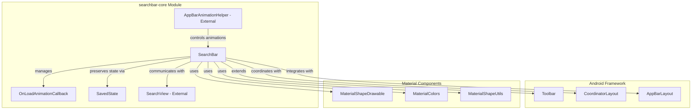
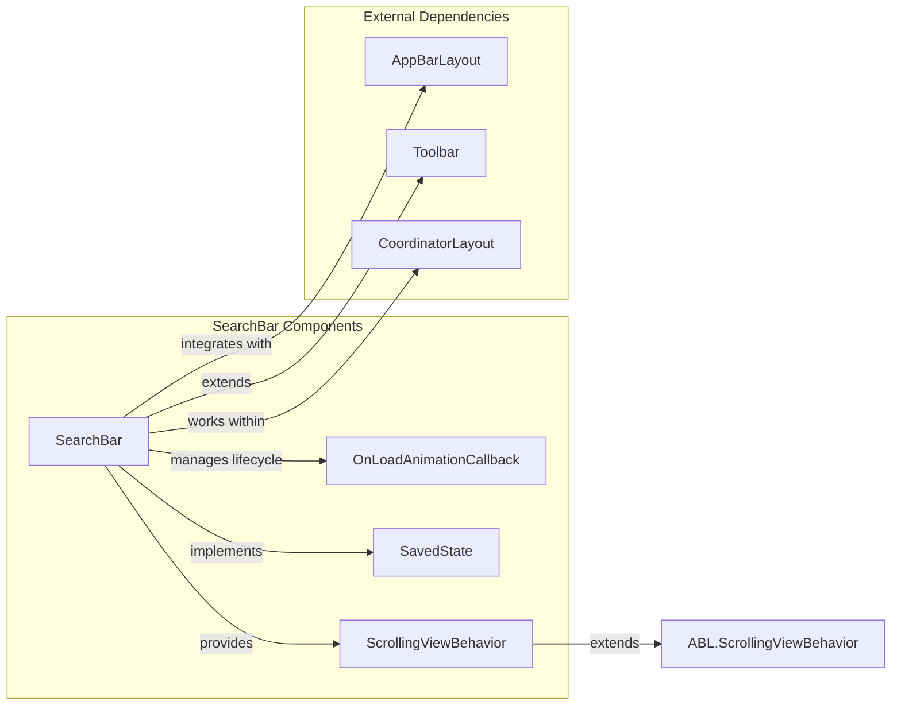
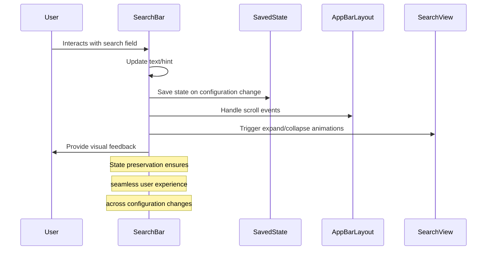
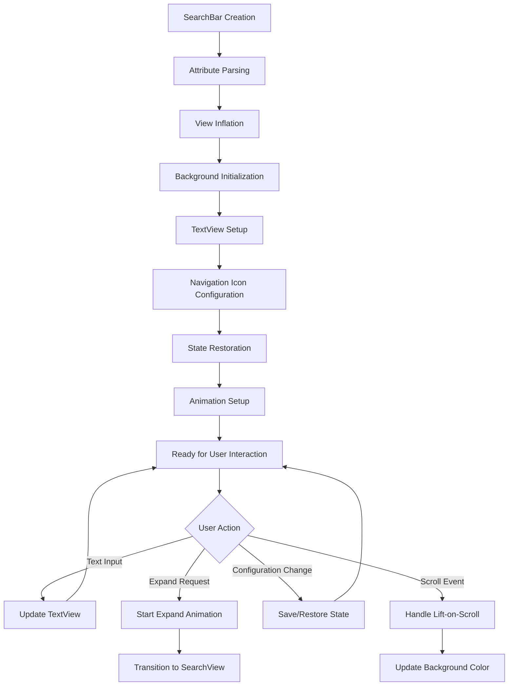

# SearchBar Core Module Documentation

## Overview

The searchbar-core module provides the foundational components for implementing Material Design search bars in Android applications. This module contains the core `SearchBar` class and its essential supporting components, offering a floating search field with affordances for search and navigation functionality.

## Module Purpose

The searchbar-core module serves as the primary entry point for search functionality within the Material Design Components library. It provides:

- A customizable search bar widget that extends `Toolbar`
- State management for search bar persistence
- Animation callback system for load animations
- Integration with AppBarLayout for scroll behaviors
- Material Design theming and styling support

## Core Components

### SearchBar Class
The main component of this module, `SearchBar` extends `Toolbar` to provide search-specific functionality while maintaining compatibility with the existing Android toolbar ecosystem.

### OnLoadAnimationCallback
An abstract callback class that allows developers to hook into the search bar's load animation lifecycle, providing `onAnimationStart()` and `onAnimationEnd()` methods.

### SavedState
A `Parcelable` implementation that preserves search bar state across configuration changes, maintaining the current text content.

## Architecture



## Component Relationships



## Data Flow



## Key Features

### 1. Material Design Integration
- Extends `Toolbar` for seamless integration with existing Android UI patterns
- Supports Material Design theming, colors, and elevation
- Implements Material shape drawable for customizable backgrounds

### 2. State Management
- `SavedState` class preserves search text during configuration changes
- Automatic state restoration without developer intervention
- Parcelable implementation for efficient state serialization

### 3. Animation System
- `OnLoadAnimationCallback` provides hooks for custom animations
- Integration with `SearchBarAnimationHelper` for complex transitions
- Support for expand/collapse animations between SearchBar and SearchView

### 4. AppBarLayout Integration
- Custom `ScrollingViewBehavior` for transparent AppBarLayout handling
- Lift-on-scroll functionality with color transitions
- Automatic scroll flag management

### 5. Accessibility
- Proper accessibility node information for screen readers
- Handwriting bounds support for stylus input
- Semantic labeling for search functionality

## Process Flow



## Integration Patterns

### Basic Usage
```xml
<com.google.android.material.appbar.AppBarLayout>
    <com.google.android.material.search.SearchBar
        android:id="@+id/search_bar"
        android:layout_width="match_parent"
        android:layout_height="wrap_content"
        android:hint="@string/search_hint" />
</com.google.android.material.appbar.AppBarLayout>
```

### With SearchView
```xml
<com.google.android.material.search.SearchView
    android:layout_width="match_parent"
    android:layout_height="match_parent"
    android:hint="@string/search_hint"
    app:layout_anchor="@id/search_bar" />
```

### Programmatic Interaction
```java
SearchBar searchBar = findViewById(R.id.search_bar);
searchBar.setHint("Search products");
searchBar.setText("user query");
searchBar.addOnLoadAnimationCallback(new SearchBar.OnLoadAnimationCallback() {
    @Override
    public void onAnimationStart() {
        // Custom animation start logic
    }
    
    @Override
    public void onAnimationEnd() {
        // Custom animation end logic
    }
});
```

## Dependencies

### Internal Dependencies
- **animation-system**: For animation helper functionality
- **searchview-core**: For expand/collapse coordination

### External Dependencies
- **appbarlayout-core**: For scroll behavior and lift-on-scroll functionality
- **material-colors**: For color theming and elevation overlays
- **shape-definition**: For background shape customization

## Related Modules

- [searchview-core.md](searchview-core.md) - Companion search view implementation
- [animation-system.md](animation-system.md) - Animation framework integration
- [appbarlayout-core.md](appbarlayout-core.md) - App bar layout integration

## Best Practices

1. **State Management**: Rely on the built-in `SavedState` for configuration changes rather than manual state handling
2. **Animation Callbacks**: Use `OnLoadAnimationCallback` for coordinating custom animations with the search bar lifecycle
3. **Theming**: Leverage Material Design attributes for consistent styling across your application
4. **Accessibility**: The search bar automatically provides proper accessibility information - avoid overriding these behaviors
5. **Performance**: Use the adaptive max width feature for responsive layouts on larger screens

## API Reference

### Key Methods
- `setText(CharSequence)` / `getText()` - Manage search text content
- `setHint(CharSequence)` / `getHint()` - Set placeholder text
- `startOnLoadAnimation()` / `stopOnLoadAnimation()` - Control load animations
- `expand(View)` / `collapse(View)` - Transition to/from SearchView
- `addOnLoadAnimationCallback()` - Register animation callbacks

### XML Attributes
- `android:hint` - Placeholder text
- `android:text` - Initial search text
- `app:backgroundTint` - Background color
- `app:liftOnScroll` - Enable lift-on-scroll behavior
- `app:strokeWidth` / `app:strokeColor` - Outline customization

This documentation provides a comprehensive overview of the searchbar-core module, enabling developers to effectively integrate and customize search functionality within their Material Design applications.