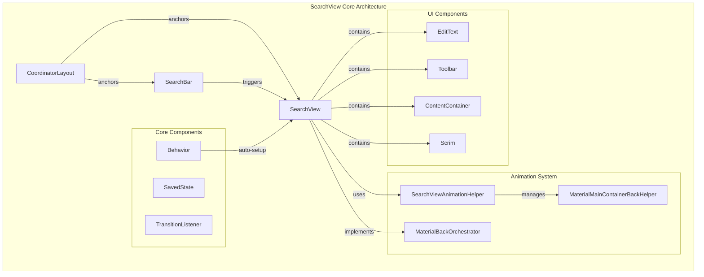
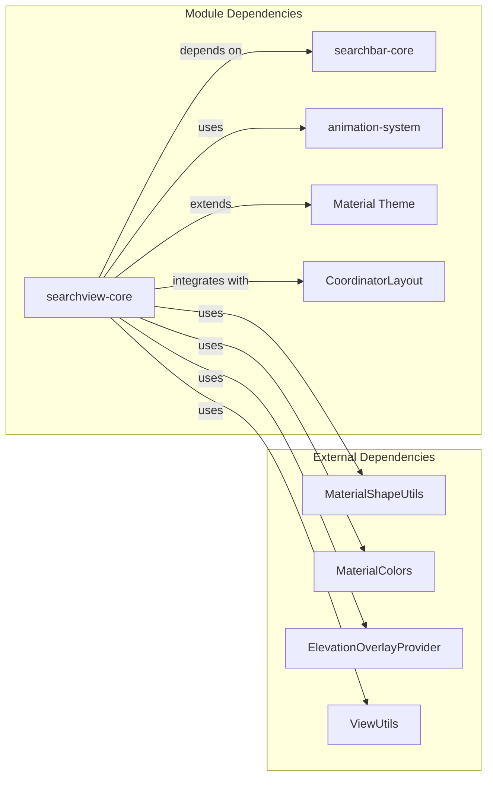
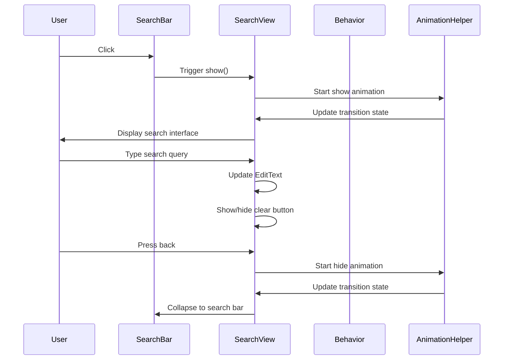
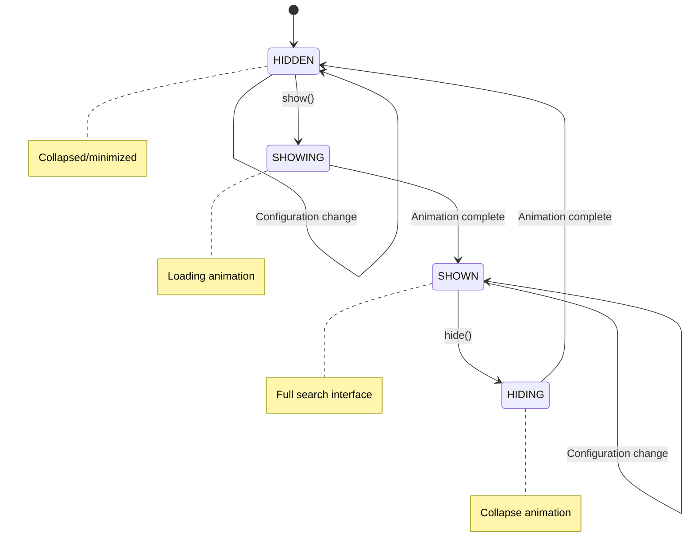
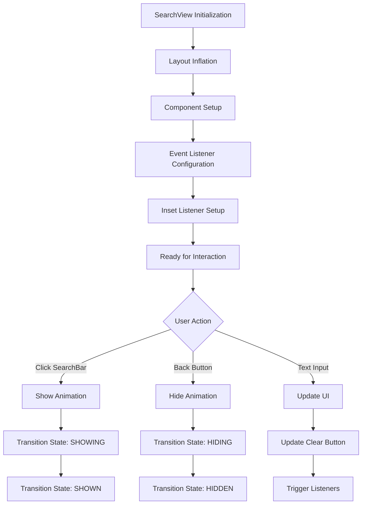

# SearchView Core Module Documentation

## Overview

The searchview-core module provides the core functionality for Material Design SearchView components, implementing a full-screen search interface that can be used in conjunction with SearchBar components. This module handles the complex animation system, state management, and user interaction patterns required for modern search experiences.

## Core Components

### SearchView.Behavior
A CoordinatorLayout.Behavior implementation that automatically sets up SearchView with SearchBar components when they are anchored together in a CoordinatorLayout. This behavior enables seamless integration between the search bar and search view without manual configuration.

### SearchView.SavedState
Handles state persistence for SearchView instances, preserving search text content and visibility state across configuration changes like screen rotations or activity recreation.

### SearchView.TransitionListener
Interface for monitoring SearchView transition states, allowing developers to respond to show/hide animations and state changes with custom logic.

## Architecture



## Component Relationships



## Data Flow



## State Management



## Process Flow



## Key Features

### Animation System
The SearchView implements sophisticated animation capabilities through the SearchViewAnimationHelper, supporting:
- Expand/collapse animations
- Back gesture handling (Android 14+)
- Navigation icon morphing
- Menu item transitions
- Keyboard synchronization

### State Persistence
SavedState mechanism ensures:
- Search text preservation
- Visibility state maintenance
- Seamless configuration changes

### Accessibility
Comprehensive accessibility support including:
- Modal behavior for screen readers
- Keyboard navigation
- Focus management
- TalkBack compatibility

### CoordinatorLayout Integration
Automatic behavior setup when used with SearchBar in CoordinatorLayout, eliminating manual configuration requirements.

## Integration Patterns

### Basic Usage
```xml
<androidx.coordinatorlayout.widget.CoordinatorLayout>
    <com.google.android.material.appbar.AppBarLayout>
        <com.google.android.material.search.SearchBar android:id="@+id/search_bar" />
    </com.google.android.material.appbar.AppBarLayout>
    
    <com.google.android.material.search.SearchView
        app:layout_anchor="@id/search_bar">
        <!-- Search content -->
    </com.google.android.material.search.SearchView>
</androidx.coordinatorlayout.widget.CoordinatorLayout>
```

### Programmatic Control
```java
SearchView searchView = findViewById(R.id.search_view);
searchView.addTransitionListener(new SearchView.TransitionListener() {
    @Override
    public void onStateChanged(SearchView searchView, 
                             TransitionState previousState, 
                             TransitionState newState) {
        // Handle state changes
    }
});
```

## Related Documentation

- [SearchBar Core Documentation](searchbar-core.md) - Companion search bar component
- [Animation System Documentation](animation-system.md) - Animation framework details
- [Material Design Search Guidelines](https://material.io/components/search/overview) - Design principles and usage patterns

## Technical Considerations

### Performance
- Efficient state management prevents unnecessary redraws
- Animation system uses hardware acceleration when available
- Memory optimization through view recycling

### Compatibility
- Supports Android API 21+ (Lollipop)
- Back gesture handling for Android 14+ (API 34+)
- Graceful degradation on older platforms

### Customization
- Extensive theming support through MaterialThemeOverlay
- Custom header layouts
- Configurable animation behaviors
- Flexible content areas for search results