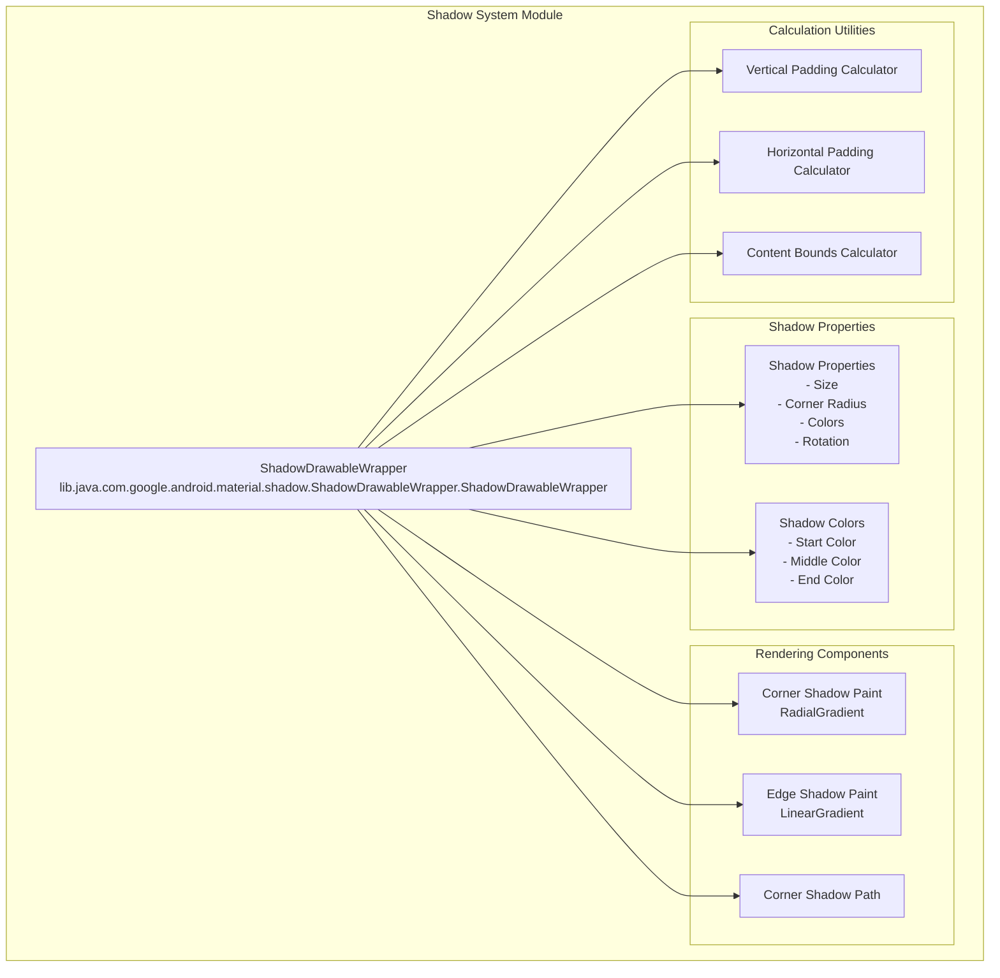
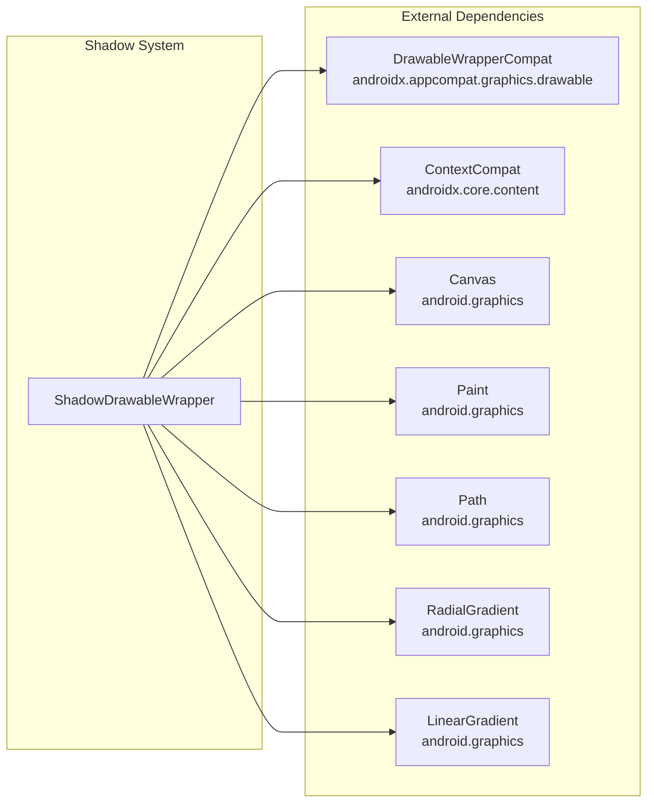
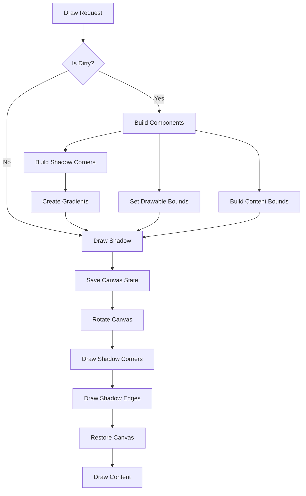
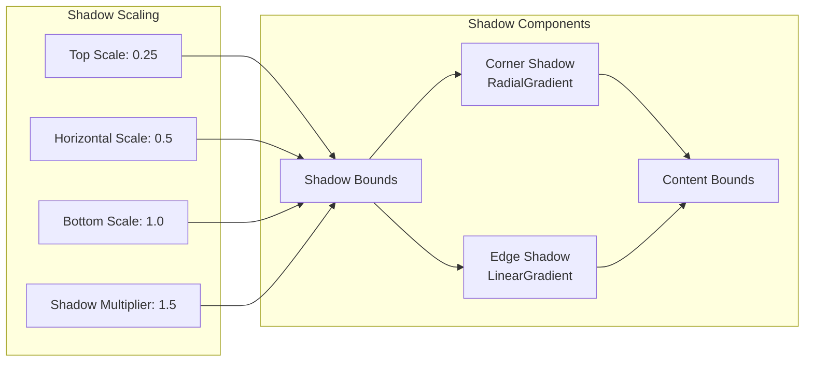
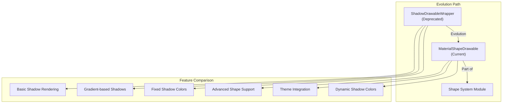
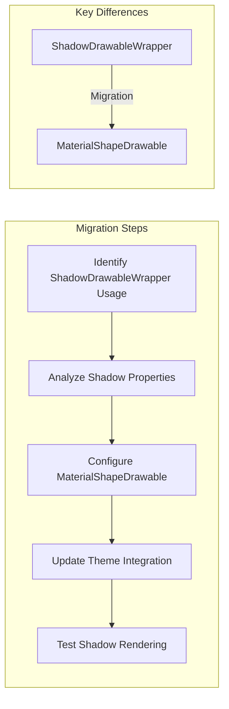

# Shadow System Module Documentation

## Introduction

The shadow-system module provides shadow rendering capabilities for Material Design components in Android applications. This module is part of the Material Components for Android library and offers a deprecated shadow implementation that has been superseded by the more advanced shape system. Despite its deprecated status, understanding this module is crucial for maintaining legacy applications and understanding the evolution of Material Design's shadow rendering approach.

## Module Overview

The shadow-system module is a specialized component within the Material Design system that focuses on creating realistic shadow effects around UI elements. It provides a `ShadowDrawableWrapper` class that can wrap existing drawables and add shadow effects with customizable properties such as shadow size, corner radius, and shadow colors.

### Key Characteristics

- **Deprecated Status**: The module is marked as deprecated in favor of `MaterialShapeDrawable`
- **Legacy Support**: Maintains backward compatibility for existing applications
- **Custom Shadow Rendering**: Implements custom shadow drawing algorithms
- **Gradient-based Shadows**: Uses radial and linear gradients for realistic shadow effects

## Core Architecture

### Component Structure



### System Dependencies



## Core Component: ShadowDrawableWrapper

### Class Overview

The `ShadowDrawableWrapper` is the primary component of the shadow-system module. It extends `DrawableWrapperCompat` to add shadow rendering capabilities to any existing drawable.

### Key Features

- **Shadow Wrapping**: Wraps existing drawables with shadow effects
- **Customizable Shadow Properties**: Allows configuration of shadow size, corner radius, and colors
- **Gradient-based Rendering**: Uses radial gradients for corners and linear gradients for edges
- **Rotation Support**: Supports shadow rotation for dynamic effects
- **Padding Calculation**: Automatically calculates required padding for shadow display

### Shadow Rendering Algorithm



### Shadow Geometry

The shadow system uses a sophisticated approach to create realistic shadow effects:

1. **Corner Shadows**: Radial gradients create soft corner shadows
2. **Edge Shadows**: Linear gradients create smooth edge transitions
3. **Shadow Scaling**: Different scaling factors for top, horizontal, and bottom shadows
4. **Offset Calculations**: Precise offset calculations for realistic shadow positioning



## Shadow Properties and Configuration

### Shadow Size Management

The shadow system provides precise control over shadow dimensions:

- **Raw Shadow Size**: The actual shadow size set by the developer
- **Effective Shadow Size**: The processed shadow size (rounded to even numbers)
- **Maximum Shadow Size**: Upper limit for shadow dimensions
- **Shadow Multiplier**: Factor applied to create shadow offset effects

### Color Configuration

Shadow colors are predefined and loaded from resources:

- **Shadow Start Color**: The innermost shadow color
- **Shadow Middle Color**: Transition color for gradient effects
- **Shadow End Color**: The outermost shadow color (transparent)

### Corner Radius Handling

The system supports rounded corners with proper shadow interpolation:

- **Corner Radius**: Radius for rounded corners
- **Corner Shadow Path**: Custom path for corner shadow rendering
- **Padding Calculations**: Automatic padding adjustment for corner shadows

## Integration with Material Design System

### Relationship to Shape System



### Common Usage Patterns

The shadow system integrates with various Material Design components:

- **Floating Action Buttons**: Primary use case for shadow effects
- **Cards**: Shadow effects for elevation representation
- **Buttons**: Shadow effects for interactive elements
- **Dialogs**: Shadow effects for modal overlays

## Performance Considerations

### Rendering Optimization

- **Dirty State Management**: Only rebuilds components when necessary
- **Canvas State Management**: Efficient save/restore operations
- **Gradient Caching**: Reuses gradient objects when possible
- **Path Optimization**: Efficient path calculations for corners

### Memory Management

- **Paint Object Reuse**: Reuses Paint objects to reduce allocations
- **RectF Recycling**: Uses RectF objects efficiently
- **Gradient Management**: Proper gradient lifecycle management

## Migration Path

### From ShadowDrawableWrapper to MaterialShapeDrawable



### Deprecated Features

- **Fixed Shadow Colors**: Hardcoded color resources
- **Limited Shape Support**: Only supports rectangular shapes with rounded corners
- **No Theme Integration**: Shadow colors not integrated with theme system
- **Basic Shadow Algorithm**: Simple gradient-based approach

## Best Practices

### When to Use ShadowDrawableWrapper

- **Legacy Application Maintenance**: When maintaining existing codebases
- **Simple Shadow Requirements**: For basic shadow effects on rectangular elements
- **Performance-Critical Scenarios**: When minimal overhead is required

### When to Avoid ShadowDrawableWrapper

- **New Development**: Use MaterialShapeDrawable for new projects
- **Complex Shapes**: When non-rectangular shapes are required
- **Theme Integration**: When dynamic theming is needed
- **Advanced Features**: When advanced shadow customization is required

## Technical Implementation Details

### Shadow Calculation Formulas

The shadow system uses mathematical formulas for precise shadow positioning:

```
Vertical Padding = maxShadowSize * SHADOW_MULTIPLIER + (1 - COS_45) * cornerRadius
Horizontal Padding = maxShadowSize + (1 - COS_45) * cornerRadius
Shadow Offset = rawShadowSize * shadowScaleFactor
```

### Gradient Creation

- **Radial Gradients**: Used for corner shadows with multiple color stops
- **Linear Gradients**: Used for edge shadows with smooth transitions
- **Color Interpolation**: Precise color interpolation for realistic effects

### Canvas Transformations

The shadow rendering involves complex canvas transformations:

- **Rotation**: Support for shadow rotation effects
- **Scaling**: Different scaling factors for various shadow components
- **Translation**: Precise positioning of shadow elements
- **State Management**: Proper canvas state save/restore operations

## Conclusion

The shadow-system module represents an important piece of Material Design's evolution, providing foundational shadow rendering capabilities that have since been superseded by more advanced systems. While deprecated, it remains relevant for understanding the principles of shadow rendering in Material Design and maintaining legacy applications. Developers should consider migrating to the modern shape system for new development while appreciating the solid foundation that the shadow-system module provided for Material Design's visual language.

For current shadow implementation details, refer to the [shape-system](shape-system.md) documentation, which provides comprehensive coverage of the modern approach to shadow and shape rendering in Material Design.