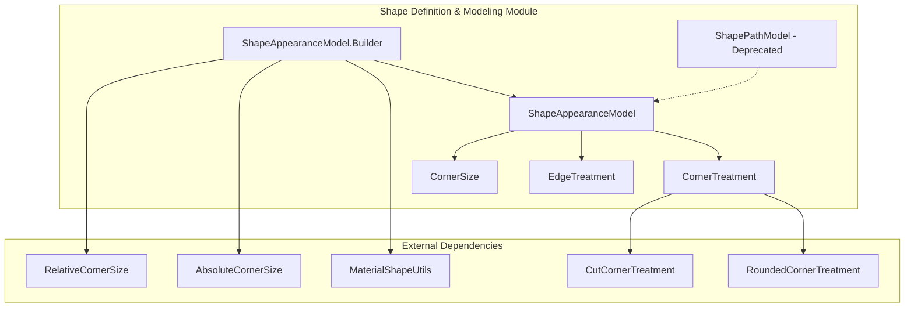
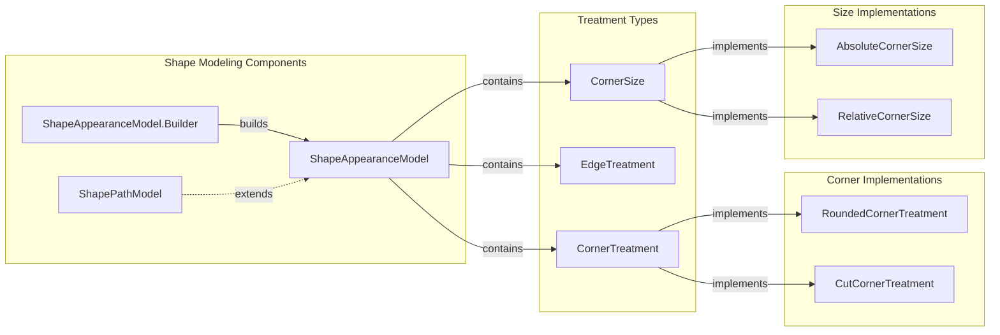
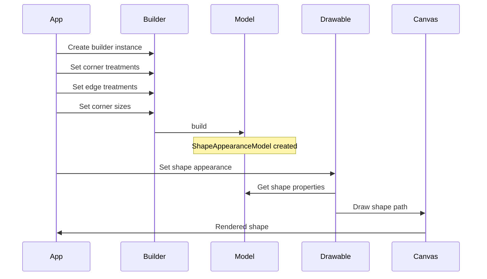
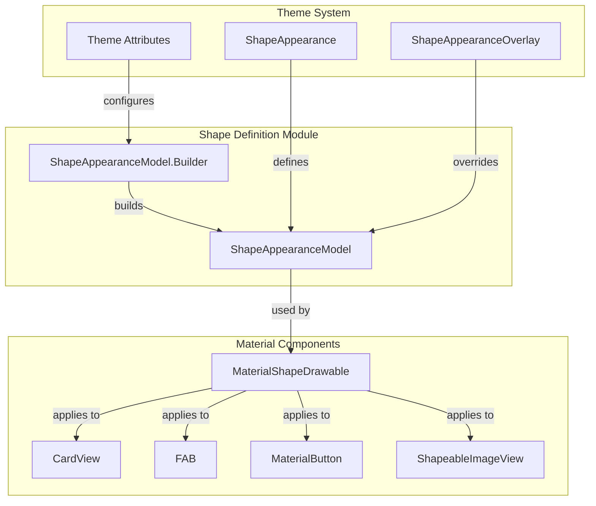
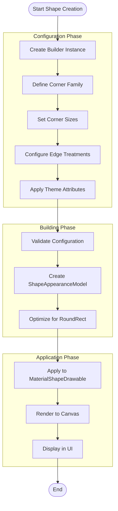
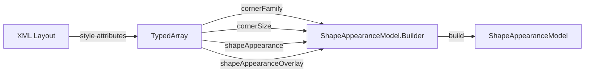

# Shape Definition and Modeling Module

## Introduction

The shape-definition-and-modeling module is a core component of the Material Design Components library that provides the foundational framework for defining, modeling, and managing custom shapes in Android applications. This module enables developers to create sophisticated geometric shapes with customizable corners and edges, forming the basis for Material Design's signature visual elements.

The module serves as the central hub for shape configuration, offering a comprehensive API for defining corner treatments, edge treatments, and shape appearance models that can be applied to various Material Design components throughout the system.

## Architecture Overview

The shape-definition-and-modeling module is built around a builder pattern architecture that provides a flexible and intuitive way to construct complex shapes. The architecture consists of several key components that work together to define and manage shape properties.



## Core Components

### ShapeAppearanceModel

The `ShapeAppearanceModel` class is the central component of the shape definition system. It models the edges and corners of a shape, which are used by `MaterialShapeDrawable` to generate and render the shape for a view's background. This class implements the `ShapeAppearance` interface and provides a comprehensive model for shape configuration.

**Key Features:**
- Manages four corner treatments (top-left, top-right, bottom-right, bottom-left)
- Manages four edge treatments (left, top, right, bottom)
- Supports individual corner and edge customization
- Provides state management for shape appearance
- Includes optimization methods for common shape types

### ShapeAppearanceModel.Builder

The `Builder` class provides a fluent API for constructing `ShapeAppearanceModel` instances. It offers extensive customization options for both corners and edges, with support for various corner families and size specifications.

**Builder Capabilities:**
- Set individual corner treatments and sizes
- Set individual edge treatments
- Apply bulk operations (all corners, all edges)
- Support for both absolute and relative corner sizes
- Integration with XML attributes and themes
- Backward compatibility handling

### ShapePathModel (Deprecated)

The `ShapePathModel` class is a deprecated component that extends `ShapeAppearanceModel` for backward compatibility. It provides legacy setter methods that directly manipulate shape properties, but developers are encouraged to use `ShapeAppearanceModel` instead.

## Component Relationships



## Data Flow Architecture



## Integration with Material Design System

The shape-definition-and-modeling module integrates seamlessly with various Material Design components to provide consistent shape theming across the application.



## Process Flow

### Shape Creation Process



### XML Attribute Processing



## Key Features and Capabilities

### Corner Customization
- **Corner Families**: Support for rounded and cut corner families
- **Individual Corner Control**: Independent configuration of each corner
- **Size Types**: Both absolute (pixel) and relative (percentage) sizing
- **Bulk Operations**: Apply settings to all corners simultaneously

### Edge Customization
- **Edge Treatments**: Customizable edge treatments for all four edges
- **Individual Edge Control**: Independent configuration of each edge
- **Bulk Operations**: Apply edge treatments to all edges

### Theme Integration
- **Style Resource Support**: Integration with Android's style system
- **Attribute Processing**: Automatic processing of shape-related XML attributes
- **Theme Overlay Support**: Dynamic theme application and overrides

### Performance Optimizations
- **RoundRect Detection**: Automatic detection of simple rounded rectangle shapes
- **Path Optimization**: Optimized drawing for standard shapes
- **State Management**: Efficient handling of shape state changes

## Dependencies

The shape-definition-and-modeling module relies on several external components:

### Internal Dependencies
- **MaterialShapeUtils**: Utility functions for creating default treatments
- **CornerTreatment**: Base class for corner implementations
- **EdgeTreatment**: Base class for edge implementations
- **CornerSize**: Interface for corner size specifications

### Related Modules
- [shape-utilities-and-helpers](shape-utilities-and-helpers.md): Provides utility functions and helper classes
- [shape-rendering-and-animation](shape-rendering-and-animation.md): Handles shape rendering and animation
- [pre-defined-shapes](pre-defined-shapes.md): Offers pre-configured shape templates

## Usage Examples

### Basic Shape Creation
```java
ShapeAppearanceModel shape = ShapeAppearanceModel.builder()
    .setAllCorners(CornerFamily.ROUNDED, 16dp)
    .build();
```

### Advanced Shape Configuration
```java
ShapeAppearanceModel shape = ShapeAppearanceModel.builder()
    .setTopLeftCorner(CornerFamily.CUT, 8dp)
    .setTopRightCorner(CornerFamily.ROUNDED, 16dp)
    .setBottomRightCorner(CornerFamily.CUT, 12dp)
    .setBottomLeftCorner(CornerFamily.ROUNDED, 20dp)
    .setAllEdges(customEdgeTreatment)
    .build();
```

### XML-Based Configuration
```xml
<style name="CustomShapeAppearance">
    <item name="cornerFamily">rounded</item>
    <item name="cornerSize">16dp</item>
    <item name="cornerFamilyTopLeft">cut</item>
    <item name="cornerSizeTopLeft">8dp</item>
</style>
```

## Best Practices

1. **Use Builder Pattern**: Always use the builder pattern for creating shapes
2. **Leverage Theme Integration**: Utilize XML attributes for consistent theming
3. **Consider Performance**: Use `isRoundRect()` for optimization opportunities
4. **Handle Deprecation**: Avoid using deprecated `ShapePathModel`
5. **Test Corner Cases**: Verify shape behavior with different sizes and treatments

## Migration Guide

### From ShapePathModel to ShapeAppearanceModel

The deprecated `ShapePathModel` class has been replaced by `ShapeAppearanceModel`. Key migration points:

- **Direct Property Access**: Replace direct property manipulation with builder pattern
- **Setter Methods**: Convert setter calls to builder method calls
- **State Management**: Use immutable `ShapeAppearanceModel` instead of mutable `ShapePathModel`

### Example Migration
```java
// Old (deprecated)
ShapePathModel model = new ShapePathModel();
model.setAllCorners(new RoundedCornerTreatment(16));

// New (recommended)
ShapeAppearanceModel model = ShapeAppearanceModel.builder()
    .setAllCorners(CornerFamily.ROUNDED, 16)
    .build();
```

This comprehensive documentation provides developers with the knowledge needed to effectively utilize the shape-definition-and-modeling module in their Material Design applications, ensuring consistent and visually appealing shape implementations across their user interfaces.