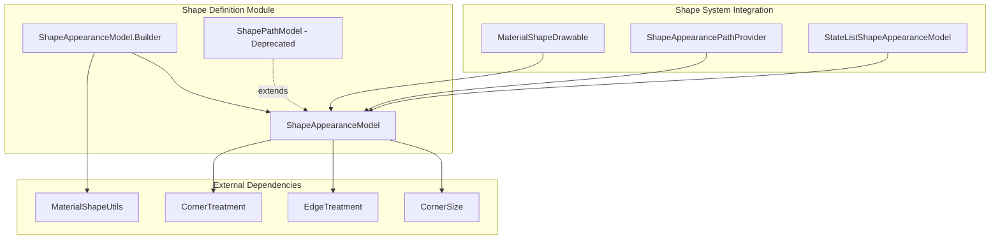
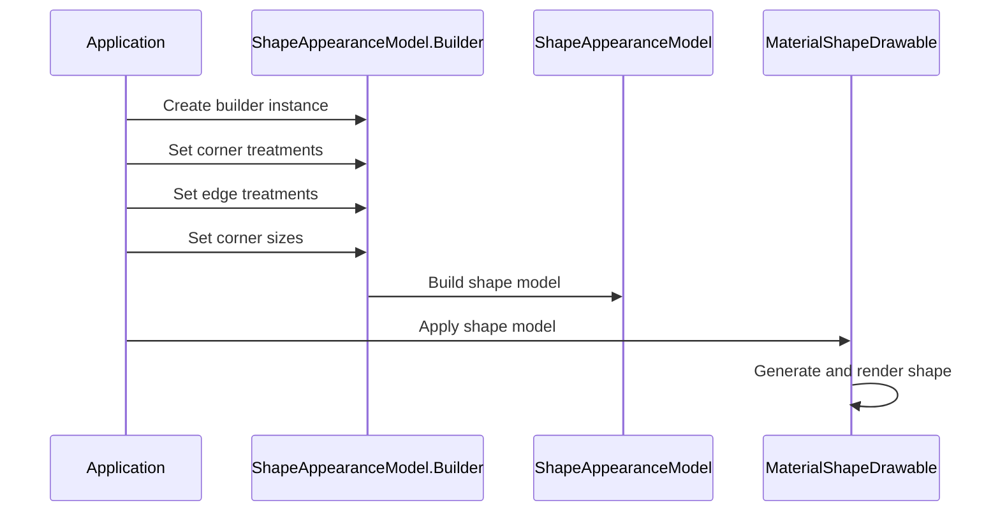
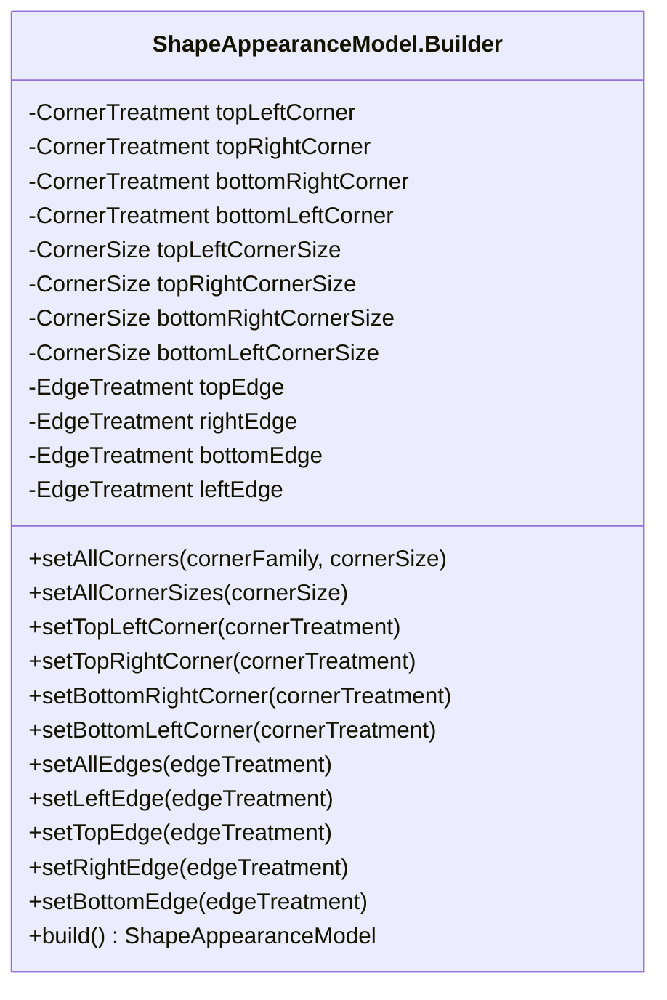
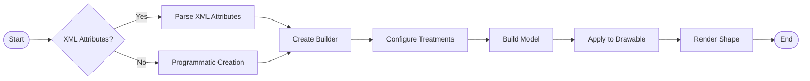
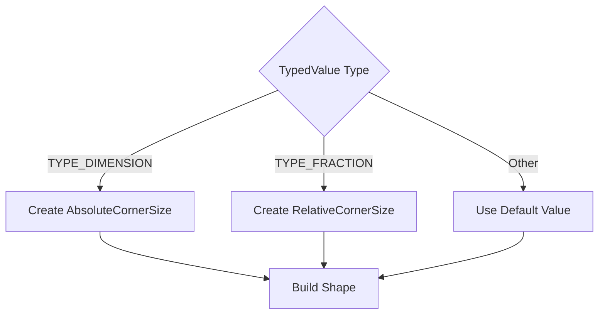
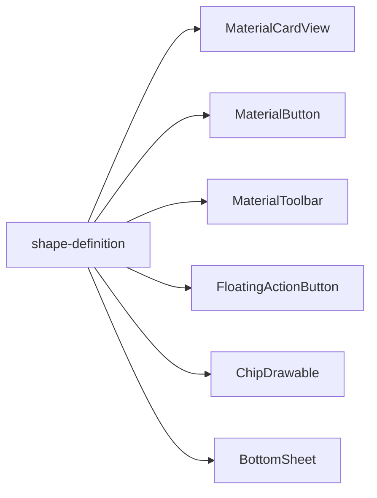

# Shape Definition Module Documentation

## Overview

The shape-definition module is a core component of the Material Design shape system, providing the foundational classes for defining and building custom shapes. This module enables developers to create complex geometric shapes with customizable corners and edges, forming the basis for Material Design's expressive shape language.

## Purpose and Core Functionality

The shape-definition module serves as the primary API for constructing shape definitions that can be applied to Material Design components. It provides:

- **ShapeAppearanceModel.Builder**: A comprehensive builder pattern for creating shape definitions
- **ShapePathModel**: A deprecated legacy class maintained for backward compatibility
- **Corner and Edge Treatment Configuration**: Fine-grained control over shape geometry
- **XML Attribute Processing**: Seamless integration with Android's styling system

## Architecture and Component Relationships

### Core Architecture



### Component Interaction Flow



## Detailed Component Analysis

### ShapeAppearanceModel.Builder

The `ShapeAppearanceModel.Builder` is the primary entry point for creating shape definitions. It implements a fluent builder pattern that allows for method chaining and provides comprehensive control over shape geometry.

#### Key Features:

- **Corner Treatment Configuration**: Support for rounded, cut, and custom corner treatments
- **Edge Treatment Configuration**: Customizable edge treatments for all four edges
- **Size Management**: Both absolute and relative corner sizing
- **Batch Operations**: Set all corners/edges simultaneously or individually
- **XML Integration**: Parse shape definitions from XML attributes

#### Builder Pattern Implementation:



### ShapePathModel (Deprecated)

The `ShapePathModel` class serves as a legacy compatibility layer, extending `ShapeAppearanceModel` while providing the deprecated mutable API that was used in earlier versions of the Material Design Components library.

#### Deprecation Strategy:
- Maintains backward compatibility for existing codebases
- Provides setter methods instead of the immutable builder pattern
- All functionality is now available through `ShapeAppearanceModel.Builder`

## Data Flow and Processing

### Shape Creation Process



### XML Attribute Processing

The module supports comprehensive XML attribute processing through multiple builder factory methods:

1. **Basic XML Parsing**: `builder(context, attrs, defStyleAttr, defStyleRes)`
2. **With Default Corner Size**: Extended version with default corner size parameter
3. **Resource-based**: `builder(context, shapeAppearanceResId, shapeAppearanceOverlayResId)`

### Corner Size Resolution



## Integration with Material Design System

### Relationship to Other Shape Modules

The shape-definition module serves as the foundation for the entire shape system:

- **[shape-utilities](shape-utilities.md)**: Provides utility functions used by the builder
- **[path-generation](path-generation.md)**: Uses ShapeAppearanceModel to generate actual drawing paths
- **[state-based-shapes](state-based-shapes.md)**: Builds upon ShapeAppearanceModel for state-dependent shapes
- **[edge-treatments](edge-treatments.md)**: Provides specialized edge treatments that can be applied

### Usage Across Material Components

ShapeAppearanceModel is utilized throughout the Material Design Components library:



## API Design Principles

### Immutability and Thread Safety

The `ShapeAppearanceModel` class is immutable once constructed, ensuring thread safety and predictable behavior. All modifications are performed through the builder pattern.

### Fluent Interface

The builder implements a fluent interface with method chaining support, enabled by `@CanIgnoreReturnValue` annotations and consistent return types.

### Backward Compatibility

The module maintains backward compatibility through:
- Deprecated `ShapePathModel` class
- Compatibility methods for legacy corner treatments
- Support for both old and new corner size specifications

## Performance Considerations

### Memory Efficiency

- Immutable design allows for safe sharing of shape instances
- Builder pattern enables efficient construction without intermediate objects
- Lazy initialization of complex treatments

### Rendering Optimization

The module includes optimization methods:
- `isRoundRect()`: Determines if shape can be drawn using optimized canvas operations
- `hasRoundedCorners()`: Checks for rounded corner uniformity
- `PILL` constant: Pre-defined pill shape for common use cases

## Error Handling and Validation

### Input Validation

- Non-null parameter validation using `@NonNull` annotations
- Dimension validation for corner sizes
- Type safety through enumerated corner families

### Graceful Degradation

- Default treatments when invalid configurations are provided
- Fallback to basic shapes when complex treatments fail
- XML attribute validation with sensible defaults

## Extension Points

### Custom Corner Treatments

Developers can extend the system by:
- Implementing `CornerTreatment` interface
- Using `MaterialShapeUtils.createCornerTreatment()` for custom families
- Providing custom `CornerSize` implementations

### Custom Edge Treatments

Edge treatments can be customized by:
- Extending `EdgeTreatment` class
- Implementing custom edge rendering logic
- Using builder methods to apply custom treatments

## Best Practices

### Shape Definition Guidelines

1. **Use the Builder Pattern**: Always use `ShapeAppearanceModel.Builder` for new code
2. **Leverage XML Attributes**: Define shapes in XML for consistency and theming
3. **Consider Performance**: Use `isRoundRect()` checks for optimization opportunities
4. **Maintain Immutability**: Treat `ShapeAppearanceModel` instances as immutable

### Common Patterns

```java
// Simple rounded corners
ShapeAppearanceModel.builder()
    .setAllCorners(CornerFamily.ROUNDED, 16dp)
    .build();

// Mixed corner treatments
ShapeAppearanceModel.builder()
    .setTopLeftCorner(CornerFamily.CUT, 8dp)
    .setTopRightCorner(CornerFamily.ROUNDED, 16dp)
    .setBottomRightCorner(CornerFamily.CUT, 8dp)
    .setBottomLeftCorner(CornerFamily.ROUNDED, 16dp)
    .build();

// XML-based creation
ShapeAppearanceModel.builder(context, attrs, R.attr.shapeAppearance, 0)
    .build();
```

## Migration Guide

### From ShapePathModel to ShapeAppearanceModel

```java
// Old approach (deprecated)
ShapePathModel model = new ShapePathModel();
model.setAllCorners(new RoundedCornerTreatment(16f));

// New approach (recommended)
ShapeAppearanceModel model = ShapeAppearanceModel.builder()
    .setAllCorners(CornerFamily.ROUNDED, 16f)
    .build();
```

## Conclusion

The shape-definition module provides a robust, flexible foundation for Material Design's shape system. Its builder-based API, comprehensive XML integration, and performance optimizations make it suitable for both simple and complex shape definitions across the entire Material Design Components library. The module's design emphasizes immutability, thread safety, and backward compatibility while providing extensive customization capabilities for modern Android applications.