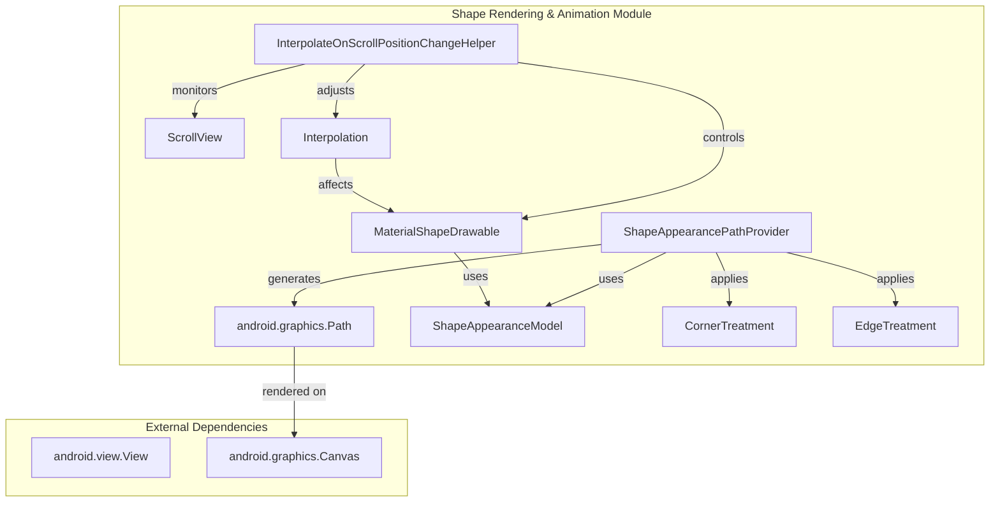
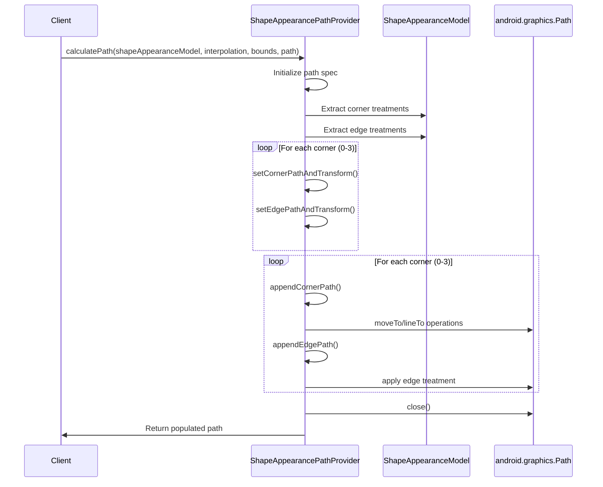
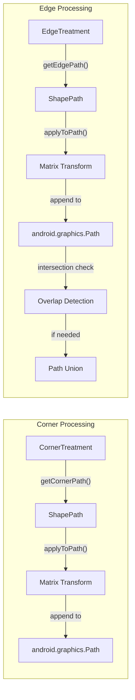
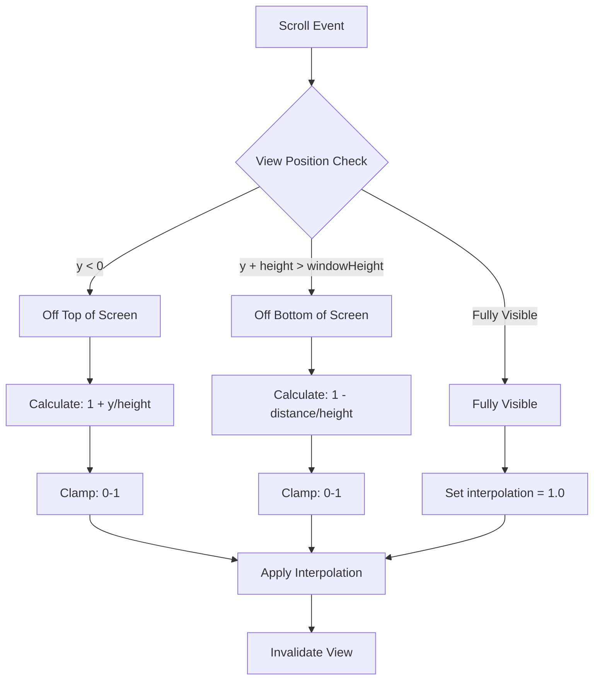
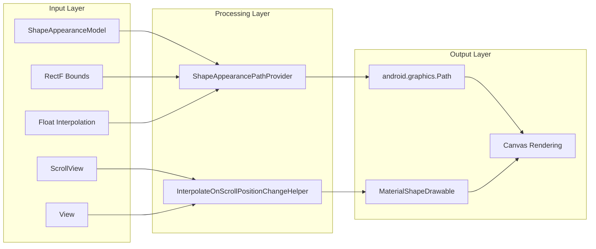
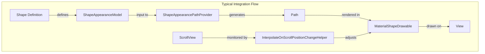

# Shape Rendering and Animation Module

## Introduction

The shape-rendering-and-animation module is a critical component of the Material Design Components library that handles the conversion of abstract shape definitions into renderable graphics paths and manages dynamic shape transformations based on scroll interactions. This module serves as the bridge between shape modeling and actual visual rendering, providing both static path generation and dynamic animation capabilities.

## Core Functionality

The module provides two primary capabilities:

1. **Shape Path Generation**: Converts `ShapeAppearanceModel` definitions into Android `Path` objects that can be rendered on canvas
2. **Scroll-based Shape Interpolation**: Dynamically adjusts shape appearance based on view position within scrollable containers

## Architecture Overview



## Component Details

### ShapeAppearancePathProvider

The `ShapeAppearancePathProvider` is the core path generation engine that converts shape appearance models into actual Android Path objects. It implements a singleton pattern for efficient resource usage and provides comprehensive path calculation capabilities.

#### Key Features:
- **Singleton Pattern**: Uses lazy initialization for performance optimization
- **Corner Treatment Processing**: Handles all four corners (top-right, bottom-right, bottom-left, top-left)
- **Edge Treatment Processing**: Processes all four edges with intersection detection
- **Interpolation Support**: Supports dynamic shape interpolation for animations
- **Path Optimization**: Includes edge intersection checking and overlap resolution

#### Path Generation Process:



#### Corner and Edge Processing:



### InterpolateOnScrollPositionChangeHelper

The `InterpolateOnScrollPositionChangeHelper` manages dynamic shape interpolation based on scroll position, enabling the popular "material healing" effect where shapes morph as they enter or exit the viewport.

#### Key Features:
- **Scroll Position Monitoring**: Listens to scroll changes via ViewTreeObserver
- **Interpolation Calculation**: Computes interpolation values based on view position
- **MaterialShapeDrawable Control**: Directly controls drawable interpolation
- **View Invalidation**: Triggers view redraws for smooth animations

#### Scroll-based Interpolation Logic:



## Data Flow Architecture



## Integration with Other Modules

The shape-rendering-and-animation module integrates with several other modules in the Material Design Components library:

### Dependencies:
- **[shape-definition-and-modeling](shape-definition-and-modeling.md)**: Uses `ShapeAppearanceModel` as input for path generation
- **[material-shape-drawable](material-shape-drawable.md)**: Controls interpolation of `MaterialShapeDrawable` instances
- **[appbar](appbar.md)**: Often used in conjunction with scrolling app bars for coordinated animations

### Usage Patterns:



## Performance Considerations

### Optimization Strategies:
1. **Singleton Pattern**: `ShapeAppearancePathProvider` uses lazy initialization to avoid multiple instances
2. **Object Reuse**: Pre-allocates and reuses `Path`, `Matrix`, and `PointF` objects
3. **Intersection Optimization**: Includes edge intersection checking to prevent unnecessary path operations
4. **Incremental Updates**: Scroll interpolation only updates when necessary

### Memory Management:
- Reuses pre-allocated arrays and objects during path calculation
- Minimizes object allocation during scroll events
- Uses efficient path operations (union, difference, intersection)

## Usage Examples

### Basic Path Generation:
```java
ShapeAppearancePathProvider provider = ShapeAppearancePathProvider.getInstance();
Path path = new Path();
RectF bounds = new RectF(0, 0, 100, 100);

provider.calculatePath(shapeAppearanceModel, 1.0f, bounds, path);
// path now contains the rendered shape
```

### Scroll-based Interpolation:
```java
InterpolateOnScrollPositionChangeHelper helper = 
    new InterpolateOnScrollPositionChangeHelper(view, materialShapeDrawable, scrollView);

helper.startListeningForScrollChanges(view.getViewTreeObserver());
// MaterialShapeDrawable will now automatically interpolate based on scroll position
```

## Error Handling

The module includes several safety mechanisms:
- **Null Checks**: Validates input parameters before processing
- **State Validation**: Ensures ScrollView contains children before interpolation
- **Bounds Checking**: Clamps interpolation values to valid ranges (0.0-1.0)
- **Path Validation**: Checks for empty or invalid paths before operations

## Thread Safety

- **UI Thread Only**: `ShapeAppearancePathProvider.getInstance()` is annotated with `@UiThread`
- **View Tree Observer**: Scroll listeners are properly added/removed to prevent leaks
- **State Management**: Internal state is reset between path calculations

This module provides the essential bridge between abstract shape definitions and their visual representation, enabling both static rendering and dynamic animations that are fundamental to Material Design's expressive UI components.