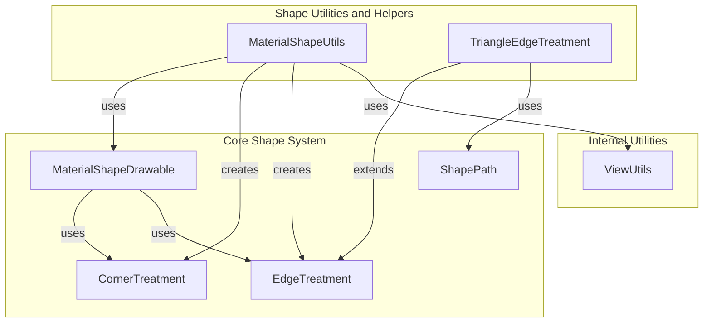
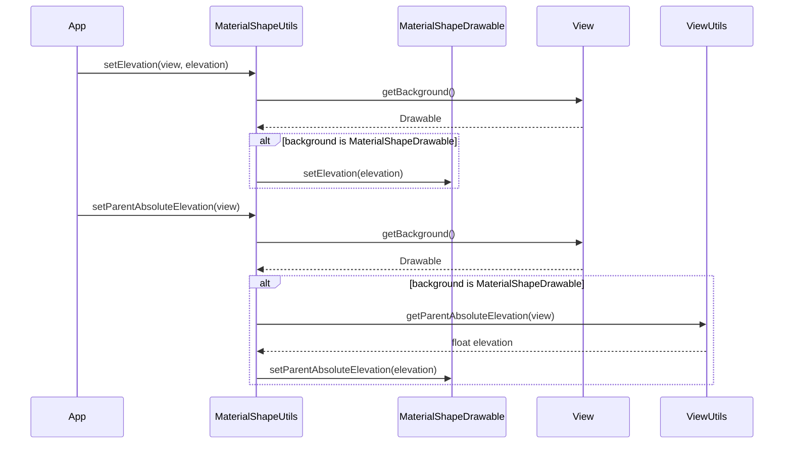
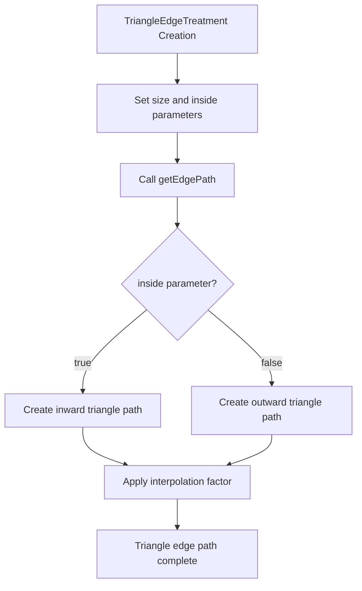

# Shape Utilities and Helpers Module

## Introduction

The shape-utilities-and-helpers module provides essential utility functions and helper classes for working with Material Design shapes. This module serves as a foundational layer that supports the creation, manipulation, and rendering of custom shapes throughout the Material Design Components library. It offers convenient methods for shape creation, elevation management, and specialized edge treatments that enhance the visual design capabilities of Material Design applications.

## Module Overview

The shape-utilities-and-helpers module is part of the larger shape system within Material Design Components. It provides two primary categories of functionality:

1. **Shape Utilities** - Helper methods for common shape operations
2. **Edge Treatments** - Specialized edge treatments for creating unique visual effects

## Core Components

### MaterialShapeUtils

`MaterialShapeUtils` is a utility class that provides static helper methods for working with `MaterialShapeDrawable` instances. It serves as a central hub for common shape-related operations, particularly focusing on elevation management and corner/edge treatment creation.

#### Key Features:
- **Elevation Management**: Methods to set and manage elevation for MaterialShapeDrawable backgrounds
- **Corner Treatment Creation**: Factory methods for creating different types of corner treatments
- **Edge Treatment Creation**: Factory methods for creating default edge treatments
- **Parent Elevation Handling**: Utilities for managing elevation inheritance from parent views

#### Public Methods:

```java
// Elevation Management
public static void setElevation(@NonNull View view, float elevation)
public static void setParentAbsoluteElevation(@NonNull View view)
public static void setParentAbsoluteElevation(@NonNull View view, @NonNull MaterialShapeDrawable materialShapeDrawable)

// Factory Methods (package-private)
static CornerTreatment createCornerTreatment(@CornerFamily int cornerFamily)
static CornerTreatment createDefaultCornerTreatment()
static EdgeTreatment createDefaultEdgeTreatment()
```

### TriangleEdgeTreatment

`TriangleEdgeTreatment` is a specialized edge treatment that creates triangular patterns along the edges of shapes. This class extends `EdgeTreatment` and provides a way to add triangular indentations or protrusions to shape edges, enabling creative visual effects for UI components.

#### Key Features:
- **Bidirectional Triangles**: Support for both inward-facing (cut-out) and outward-facing (protruding) triangles
- **Size Control**: Configurable triangle size that affects both depth and width
- **Smooth Integration**: Seamless integration with the shape path system

#### Constructor and Usage:

```java
public TriangleEdgeTreatment(float size, boolean inside)
```

- `size`: Controls the triangle dimensions (extends `size` pixels into/out of shape, with base width of 2×`size`)
- `inside`: Determines triangle direction (true = inward/cut-out, false = outward/protruding)

## Architecture

### Component Relationships



### Data Flow



### Edge Treatment Process Flow



## Integration with Other Modules

### Dependencies

The shape-utilities-and-helpers module has several key dependencies within the Material Design Components ecosystem:

1. **Internal Utilities Module**: Utilizes `ViewUtils` for elevation calculations
2. **Core Shape System**: Integrates with `MaterialShapeDrawable`, `EdgeTreatment`, and `CornerTreatment`
3. **Shape Definition Module**: Works in conjunction with shape modeling components

### Usage Patterns

#### Elevation Management
```java
// Set elevation on a view with MaterialShapeDrawable background
MaterialShapeUtils.setElevation(myView, 8f);

// Update parent absolute elevation
MaterialShapeUtils.setParentAbsoluteElevation(myView);
```

#### Triangle Edge Treatment
```java
// Create inward-facing triangles
TriangleEdgeTreatment inwardTriangles = new TriangleEdgeTreatment(12f, true);

// Create outward-facing triangles  
TriangleEdgeTreatment outwardTriangles = new TriangleEdgeTreatment(8f, false);
```

## Best Practices

### Performance Considerations

1. **Elevation Updates**: Use `setParentAbsoluteElevation()` when parent elevation changes to ensure proper shadow rendering
2. **Triangle Size**: Keep triangle sizes reasonable to avoid performance issues during path generation
3. **Background Checks**: The utility methods safely handle non-MaterialShapeDrawable backgrounds

### Design Guidelines

1. **Triangle Usage**: Use `TriangleEdgeTreatment` for decorative effects rather than functional UI elements
2. **Size Consistency**: Maintain consistent triangle sizes within the same visual context
3. **Direction Consistency**: Choose either inward or outward triangles based on the overall design language

## Related Documentation

- [Shape Definition and Modeling](shape-definition-and-modeling.md) - For shape creation and modeling
- [Shape Rendering and Animation](shape-rendering-and-animation.md) - For rendering and animation aspects
- [Pre-defined Shapes](pre-defined-shapes.md) - For ready-to-use shape implementations
- [Internal Utilities](internal.md) - For ViewUtils and other internal helpers

## API Reference

### MaterialShapeUtils

| Method | Description |
|--------|-------------|
| `setElevation(View, float)` | Sets elevation on MaterialShapeDrawable background |
| `setParentAbsoluteElevation(View)` | Updates parent absolute elevation from view hierarchy |
| `setParentAbsoluteElevation(View, MaterialShapeDrawable)` | Updates parent absolute elevation for specific drawable |

### TriangleEdgeTreatment

| Constructor | Description |
|-------------|-------------|
| `TriangleEdgeTreatment(float, boolean)` | Creates triangle edge treatment with specified size and direction |

| Parameter | Type | Description |
|-----------|------|-------------|
| `size` | float | Triangle size in pixels |
| `inside` | boolean | Triangle direction (true = inward, false = outward) |