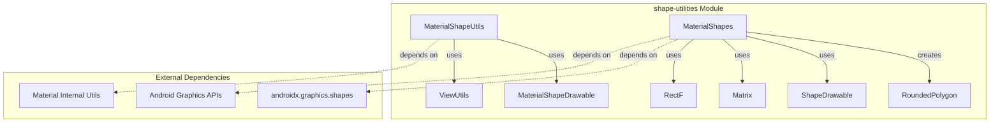
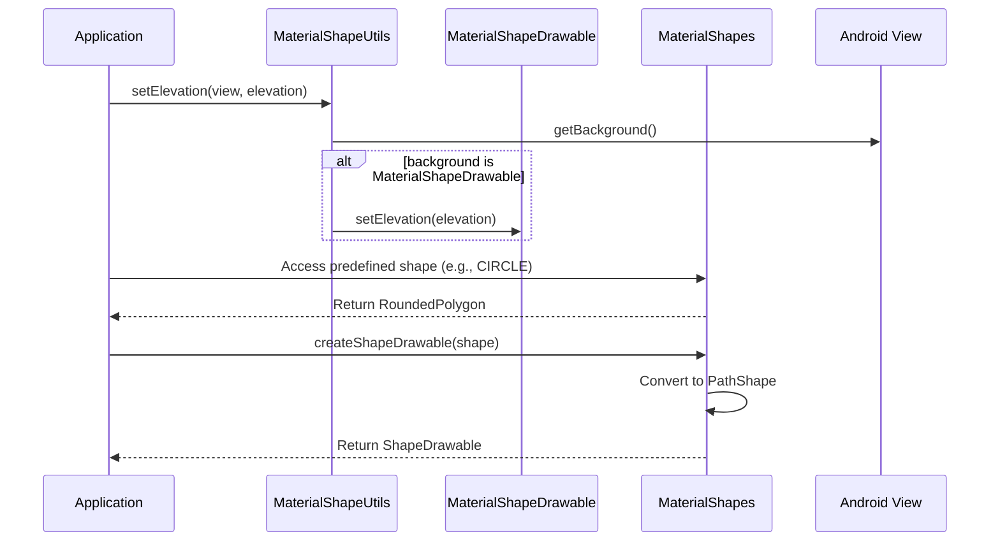
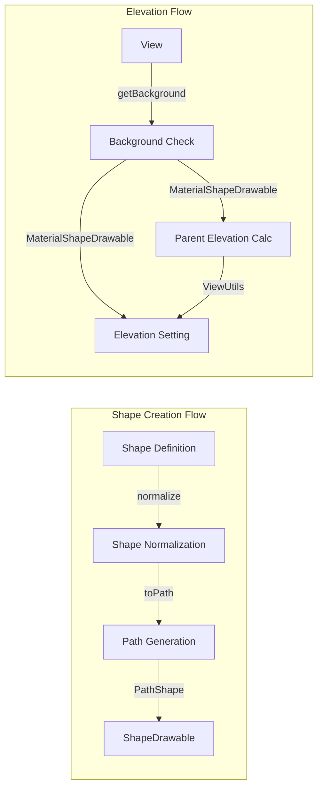

# Shape Utilities Module

The shape-utilities module provides essential utility functions and pre-defined Material Design shapes for the Android Material Components library. This module serves as the foundation for creating and manipulating custom shapes throughout the Material Design system.

## Overview

The shape-utilities module contains two primary utility classes that work together to provide comprehensive shape functionality:

- **MaterialShapeUtils**: Utility methods for MaterialShapeDrawable operations and elevation handling
- **MaterialShapes**: A comprehensive collection of pre-defined Material Design shapes using the androidx.graphics.shapes library

## Architecture



## Core Components

### MaterialShapeUtils

`MaterialShapeUtils` provides static utility methods for working with MaterialShapeDrawable instances and view elevation. This class serves as a bridge between views and their MaterialShapeDrawable backgrounds.

#### Key Responsibilities:
- **Elevation Management**: Set and manage elevation for views with MaterialShapeDrawable backgrounds
- **Corner Treatment Creation**: Factory methods for creating different corner treatments (rounded, cut)
- **Parent Elevation Handling**: Calculate and apply parent absolute elevation for proper shadow rendering

#### Public API Methods:

```java
// Elevation management
public static void setElevation(@NonNull View view, float elevation)
public static void setParentAbsoluteElevation(@NonNull View view)
public static void setParentAbsoluteElevation(@NonNull View view, @NonNull MaterialShapeDrawable materialShapeDrawable)

// Corner treatment factories
static CornerTreatment createCornerTreatment(@CornerFamily int cornerFamily)
static CornerTreatment createDefaultCornerTreatment()
static EdgeTreatment createDefaultEdgeTreatment()
```

### MaterialShapes

`MaterialShapes` is a comprehensive utility class that provides pre-defined Material Design shapes using the androidx.graphics.shapes library. It contains over 40 pre-built shapes that follow Material Design guidelines.

#### Shape Categories:

**Basic Geometric Shapes:**
- `CIRCLE` - Perfect circle with 10 vertices
- `SQUARE` - Rounded square with 30% corner rounding
- `TRIANGLE` - Equilateral triangle with 20% corner rounding
- `DIAMOND` - Diamond shape with custom rounding
- `OVAL` - Elliptical shape
- `PILL` - Capsule/pill shape

**Advanced Shapes:**
- `SLANTED_SQUARE` - Rotated square with asymmetric rounding
- `ARCH` - Architectural arch shape
- `FAN` - Fan-like shape
- `ARROW` - Directional arrow shape
- `SEMI_CIRCLE` - Half-circle shape

**Complex Material Shapes:**
- `SUNNY`, `VERY_SUNNY` - Star-like shapes
- `COOKIE_4`, `COOKIE_6`, `COOKIE_7`, `COOKIE_9`, `COOKIE_12` - Cookie/star shapes with different vertex counts
- `CLOVER_4`, `CLOVER_8` - Clover leaf shapes
- `BURST`, `SOFT_BURST` - Explosion/burst shapes
- `BOOM`, `SOFT_BOOM` - Dynamic burst shapes
- `FLOWER` - Floral shape
- `PUFFY`, `PUFFY_DIAMOND` - Inflated shapes
- `HEART` - Heart shape
- `GHOSTISH` - Ghost-like shape

#### Utility Methods:

```java
// Shape creation and transformation
public static ShapeDrawable createShapeDrawable(@NonNull RoundedPolygon shape)
public static RoundedPolygon normalize(@NonNull RoundedPolygon shape, boolean radial)
public static RoundedPolygon normalize(@NonNull RoundedPolygon shape, boolean radial, @NonNull RectF dstBounds)

// Matrix creation utilities
static Matrix createScaleMatrix(float scaleX, float scaleY)
static Matrix createRotationMatrix(float degrees)
static Matrix createSkewMatrix(float kx, float ky)
```

## Data Flow



## Component Interactions



## Integration with Other Modules

The shape-utilities module integrates with several other Material Design modules:

### Dependencies on Other Modules:
- **[material-internal](material-internal.md)**: Uses ViewUtils for parent elevation calculations
- **[shape-definition](shape-definition.md)**: Works with ShapeAppearanceModel and ShapePathModel
- **[path-generation](path-generation.md)**: Utilizes ShapeAppearancePathProvider for path operations

### Modules Depending on shape-utilities:
- **[card](card.md)**: Uses shape utilities for card corner and elevation handling
- **[button](button.md)**: Leverages shape utilities for button shape customization
- **[floatingactionbutton](floatingactionbutton.md)**: Depends on shape utilities for FAB shape and elevation
- **[textfield](textfield.md)**: Uses shape utilities for text field outline shapes

## Usage Examples

### Basic Shape Usage

```java
// Get a predefined shape
RoundedPolygon circle = MaterialShapes.CIRCLE;

// Create a ShapeDrawable from the shape
ShapeDrawable shapeDrawable = MaterialShapes.createShapeDrawable(circle);

// Apply to a view
view.setBackground(shapeDrawable);
```

### Elevation Management

```java
// Set elevation for a view with MaterialShapeDrawable background
MaterialShapeUtils.setElevation(view, 8f);

// Set parent absolute elevation for proper shadow rendering
MaterialShapeUtils.setParentAbsoluteElevation(view);
```

### Custom Shape Normalization

```java
// Normalize a shape to fit in a specific bounds
RectF bounds = new RectF(0, 0, 100, 100);
RoundedPolygon normalizedShape = MaterialShapes.normalize(customShape, true, bounds);
```

## Best Practices

1. **Elevation Handling**: Always use `MaterialShapeUtils.setParentAbsoluteElevation()` when working with nested views to ensure proper shadow rendering
2. **Shape Reuse**: Use predefined shapes from `MaterialShapes` for consistency with Material Design guidelines
3. **Normalization**: Always normalize custom shapes before creating drawables to ensure proper scaling and positioning
4. **Performance**: Cache normalized shapes when used repeatedly to avoid redundant calculations

## Thread Safety

All methods in the shape-utilities module are thread-safe as they either:
- Work with immutable objects (predefined shapes)
- Operate on thread-local data
- Use synchronized Android framework methods

## Performance Considerations

- **Shape Creation**: Creating ShapeDrawable instances is relatively expensive; cache when possible
- **Normalization**: The normalization process involves matrix transformations and bounds calculations
- **Elevation Updates**: Frequent elevation changes trigger redraws; batch updates when possible

## Related Documentation

- [Shape Definition Module](shape-definition.md) - For creating custom shape definitions
- [Path Generation Module](path-generation.md) - For advanced path manipulation
- [Material Shape Drawable](material-shape-drawable.md) - For the drawable implementation
- [View Utils](view-utils.md) - For elevation calculation utilities