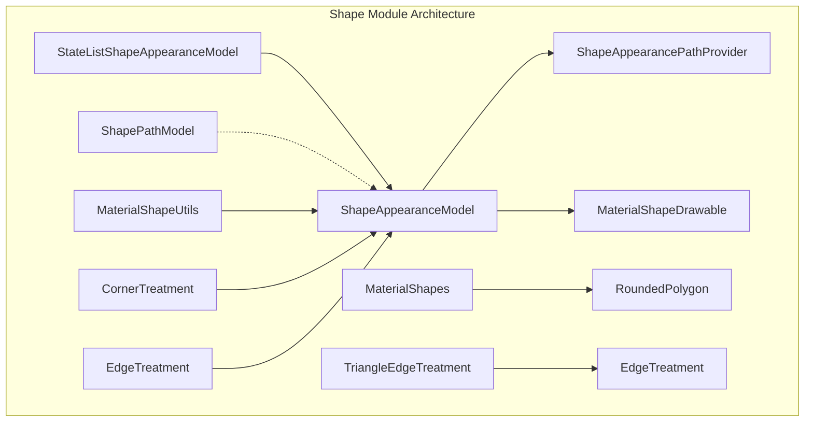
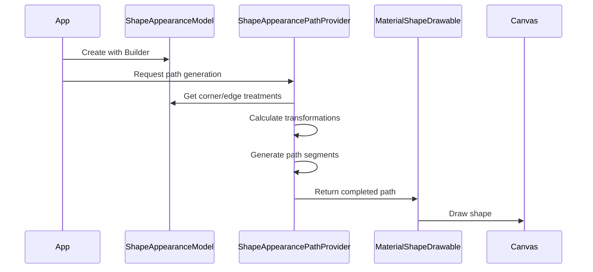

# Shape Module Documentation

## Overview

The Shape module is a fundamental component of the Material Design Components library that provides a comprehensive system for creating, customizing, and managing shapes in Android applications. It serves as the backbone for Material Design's shape theming system, enabling developers to create visually consistent and customizable UI components with various corner treatments, edge styles, and complex geometric forms.

## Purpose and Core Functionality

The Shape module enables:
- **Shape Definition**: Create and customize shapes with various corner treatments (rounded, cut) and edge styles
- **Material Theming**: Implement Material Design's shape theming system with consistent corner sizes and families
- **Dynamic Shapes**: Support for state-based shape changes and animations
- **Complex Geometry**: Generate sophisticated shapes beyond basic rectangles using the `androidx.graphics.shapes` library
- **Path Generation**: Convert shape definitions into Android `Path` objects for rendering

## Architecture Overview



## Core Components

### 1. Shape Definition and Modeling

#### ShapeAppearanceModel
The central class that models the edges and corners of a shape. It provides:
- Corner treatments (rounded, cut) for all four corners
- Edge treatments for all four edges
- Builder pattern for easy configuration
- Support for both absolute and relative corner sizes

#### ShapeAppearanceModel.Builder
A comprehensive builder that allows:
- Setting individual corner treatments and sizes
- Configuring edge treatments
- Applying shape appearance from XML attributes
- Support for Material Design theme attributes

For detailed documentation, see [Shape Definition and Modeling](shape-definition.md).

### 2. Shape Utilities and Helpers

#### MaterialShapeUtils
Utility class providing:
- Corner treatment creation based on corner family
- Elevation management for MaterialShapeDrawable
- Default corner and edge treatment creation

#### MaterialShapes
Advanced shape creation using `androidx.graphics.shapes` library:
- Pre-defined Material Design shapes (circle, square, triangle, etc.)
- Complex geometric shapes (arch, fan, arrow, etc.)
- Utility methods for shape normalization and transformation
- Support for custom polygon creation

For detailed documentation, see [Shape Utilities](shape-utilities.md).

### 3. Path Generation and Rendering

#### ShapeAppearancePathProvider
Converts ShapeAppearanceModel to Android Path objects:
- Singleton pattern for efficient path generation
- Support for interpolation and animation
- Path overlap detection and handling
- Corner and edge transformation calculations

For detailed documentation, see [Path Generation](path-generation.md).

### 4. State-Based Shapes

#### StateListShapeAppearanceModel
Implements state-based shape changes:
- XML-defined state lists for different component states
- Dynamic corner size overrides based on state
- Integration with Android's state system
- Support for pressed, focused, selected, and custom states

For detailed documentation, see [State-Based Shapes](state-based-shapes.md).

### 5. Legacy Support

#### ShapePathModel
Deprecated class maintained for backward compatibility:
- Legacy API support
- Migration path to ShapeAppearanceModel

### 6. Edge Treatments

#### TriangleEdgeTreatment
Specialized edge treatment for creating triangular effects:
- Inward or outward facing triangles
- Configurable size and position
- Integration with edge treatment system

For detailed documentation, see [Edge Treatments](edge-treatments.md).

## Data Flow



## Integration with Other Modules

The Shape module integrates with various Material Design components:

- **[Button Module](button.md)**: Provides shape theming for MaterialButton
- **[Card Module](card.md)**: Enables customizable card shapes
- **[AppBar Module](appbar.md)**: Supports AppBarLayout shape customization
- **[FloatingActionButton Module](floatingactionbutton.md)**: Defines FAB shapes
- **[BottomSheet Module](bottomsheet.md)**: Creates bottom sheet shapes

## Key Features

### Material Design Compliance
- Full support for Material Design shape theming
- Consistent corner families and sizes
- Theme attribute integration

### Flexibility
- Custom corner and edge treatments
- State-based shape changes
- Animation support through interpolation

### Performance
- Efficient path caching
- Singleton pattern for path provider
- Optimized shape calculations

### Extensibility
- Custom corner treatment creation
- Edge treatment inheritance
- Shape appearance model composition

## Usage Examples

### Basic Shape Creation
```java
ShapeAppearanceModel shapeAppearanceModel = ShapeAppearanceModel.builder()
    .setAllCorners(CornerFamily.ROUNDED, 16dp)
    .setTopEdge(new TriangleEdgeTreatment(8dp, true))
    .build();
```

### State-Based Shapes
```xml
<selector xmlns:android="http://schemas.android.com/apk/res/android">
    <item android:state_pressed="true"
          app:shapeAppearance="@style/PressedShape" />
    <item app:shapeAppearance="@style/DefaultShape" />
</selector>
```

### Complex Shapes
```java
RoundedPolygon heartShape = MaterialShapes.HEART;
ShapeDrawable drawable = MaterialShapes.createShapeDrawable(heartShape);
```

## Best Practices

1. **Use ShapeAppearanceModel**: Prefer ShapeAppearanceModel over deprecated ShapePathModel
2. **Leverage State Lists**: Use StateListShapeAppearanceModel for interactive components
3. **Cache Paths**: Reuse ShapeAppearancePathProvider instance for performance
4. **Theme Integration**: Use theme attributes for consistent theming
5. **Animation Support**: Utilize interpolation for smooth shape transitions

## Related Documentation

- [Material Design Shape Guidelines](https://material.io/design/shape/about-shape.html)
- [Shape Theming Guide](shape-theming.md)
- [Component Integration Guide](component-integration.md)
- [Animation and Transitions](animation.md)