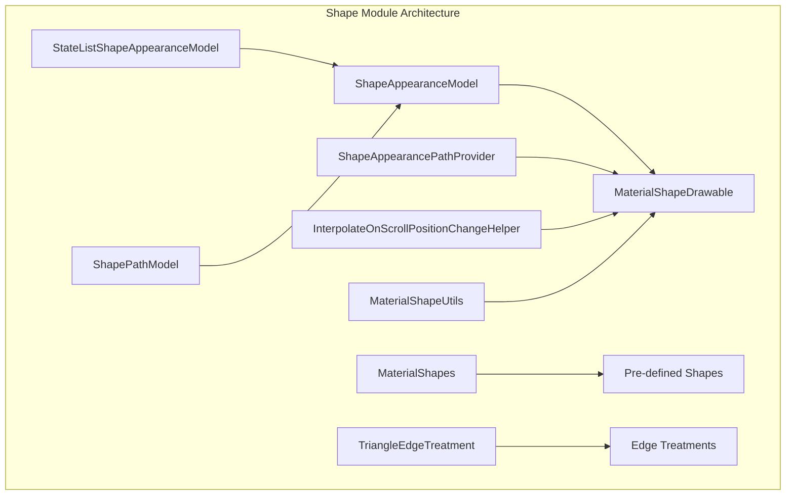

# Shape Module Documentation

## Overview

The Shape module is a fundamental component of the Material Design Components library that provides comprehensive shape customization capabilities for Android UI elements. It enables developers to create custom shapes, define corner and edge treatments, and implement dynamic shape transformations that align with Material Design principles.

## Purpose and Core Functionality

The Shape module serves as the foundation for creating and managing custom shapes in Material Design applications. It provides:

- **Shape Definition**: Tools for defining custom shapes with various corner and edge treatments
- **Shape Rendering**: Path generation and rendering capabilities for MaterialShapeDrawable
- **Shape Interpolation**: Dynamic shape morphing and animation support
- **State-based Shapes**: Support for different shapes based on component states
- **Pre-defined Shapes**: A comprehensive library of Material-endorsed shapes

## Architecture Overview


```mermaid
graph TB
    subgraph "Shape Module Architecture"
        A[ShapeAppearanceModel] --> B[MaterialShapeDrawable]
        C[ShapeAppearancePathProvider] --> B
        D[MaterialShapes] --> E[Pre-defined Shapes]
        F[InterpolateOnScrollPositionChangeHelper] --> B
        G[StateListShapeAppearanceModel] --> A
        H[ShapePathModel] --> A
        I[TriangleEdgeTreatment] --> J[Edge Treatments]
        K[MaterialShapeUtils] --> B
    end
```

## Core Components

### 1. ShapeAppearanceModel
The central class that models the edges and corners of a shape. It provides a builder pattern for creating shape definitions with customizable corner treatments, edge treatments, and sizes.

**Key Features:**
- Corner treatment configuration (rounded, cut, custom)
- Edge treatment configuration
- Corner size management (absolute and relative)
- State-based shape variations
- XML attribute parsing support

### 2. ShapeAppearancePathProvider
Converts ShapeAppearanceModel instances into Android Path objects that can be rendered. This class handles the complex mathematics of path generation and intersection detection.

**Key Features:**
- Path generation from shape models
- Corner and edge transformation calculations
- Intersection detection and handling
- Path optimization for rendering

### 3. MaterialShapes
A utility class providing a comprehensive collection of pre-defined Material-endorsed shapes using the androidx.graphics.shapes library.

**Available Shapes:**
- Basic shapes: Circle, Square, Triangle, Oval, Pentagon
- Complex shapes: Arrow, Diamond, Gem, Heart, Flower
- Decorative shapes: Sunny, Cookie variants, Clover variants
- Specialized shapes: Arch, Fan, Pill, Ghostish

### 4. InterpolateOnScrollPositionChangeHelper
Enables dynamic shape interpolation based on scroll position, allowing shapes to morph as they enter or exit the viewport.

**Key Features:**
- Scroll-based shape interpolation
- Viewport position calculations
- Smooth shape transitions
- Integration with ScrollView components

### 5. StateListShapeAppearanceModel
Provides state-based shape variations, similar to ColorStateList but for shapes. Allows different shapes for different component states (pressed, focused, disabled, etc.).

**Key Features:**
- State-based shape selection
- XML resource parsing
- Corner size overrides per state
- Wildcard state support

## Sub-modules

### [Shape Definition and Modeling](shape-definition-and-modeling.md)
- **ShapeAppearanceModel.Builder**: Comprehensive shape building capabilities
- **ShapePathModel**: Deprecated legacy shape model (use ShapeAppearanceModel instead)

### [Shape Utilities and Helpers](shape-utilities-and-helpers.md)
- **MaterialShapeUtils**: Utility methods for MaterialShapeDrawable operations
- **TriangleEdgeTreatment**: Specialized edge treatment for triangular edges

### [Shape Rendering and Animation](shape-rendering-and-animation.md)
- **ShapeAppearancePathProvider.Lazy**: Singleton instance management
- **InterpolateOnScrollPositionChangeHelper**: Scroll-based shape interpolation

### [Pre-defined Shapes](pre-defined-shapes.md)
- **MaterialShapes**: Comprehensive library of Material-endorsed shapes

## Integration with Other Modules

The Shape module integrates extensively with other Material Design Components:

- **[MaterialShapeDrawable](material-shape-drawable.md)**: Primary consumer of shape definitions
- **[Theme System](theme.md)**: Shape theming and customization
- **[Animation System](animation.md)**: Shape morphing and transitions
- **[Component Library](components.md)**: Shapes used across all Material components

## Usage Patterns

### Basic Shape Creation
```java
ShapeAppearanceModel shapeAppearanceModel = ShapeAppearanceModel.builder()
    .setAllCorners(CornerFamily.ROUNDED, 16dp)
    .setTopEdge(new TriangleEdgeTreatment(8dp, true))
    .build();
```

### Pre-defined Shape Usage
```java
RoundedPolygon heartShape = MaterialShapes.HEART;
ShapeDrawable heartDrawable = MaterialShapes.createShapeDrawable(heartShape);
```

### State-based Shapes
```xml
<selector xmlns:android="http://schemas.android.com/apk/res/android">
    <item android:state_pressed="true" app:shapeAppearance="@style/PressedShape" />
    <item app:shapeAppearance="@style/DefaultShape" />
</selector>
```

## Best Practices

1. **Use ShapeAppearanceModel**: Prefer ShapeAppearanceModel over deprecated ShapePathModel
2. **Leverage Pre-defined Shapes**: Use MaterialShapes for consistent Material Design shapes
3. **Consider Performance**: Complex shapes may impact rendering performance
4. **State Management**: Use StateListShapeAppearanceModel for interactive components
5. **Scroll Integration**: Use InterpolateOnScrollPositionChangeHelper for dynamic scroll effects

## Performance Considerations

- Path generation is computationally expensive; cache when possible
- Complex edge treatments may impact rendering performance
- State-based shapes should minimize state combinations
- Scroll interpolation should be optimized for smooth performance

## Future Enhancements

- Additional pre-defined shapes
- Enhanced animation capabilities
- Performance optimizations for complex shapes
- Expanded state-based shape support
- Integration with motion design system