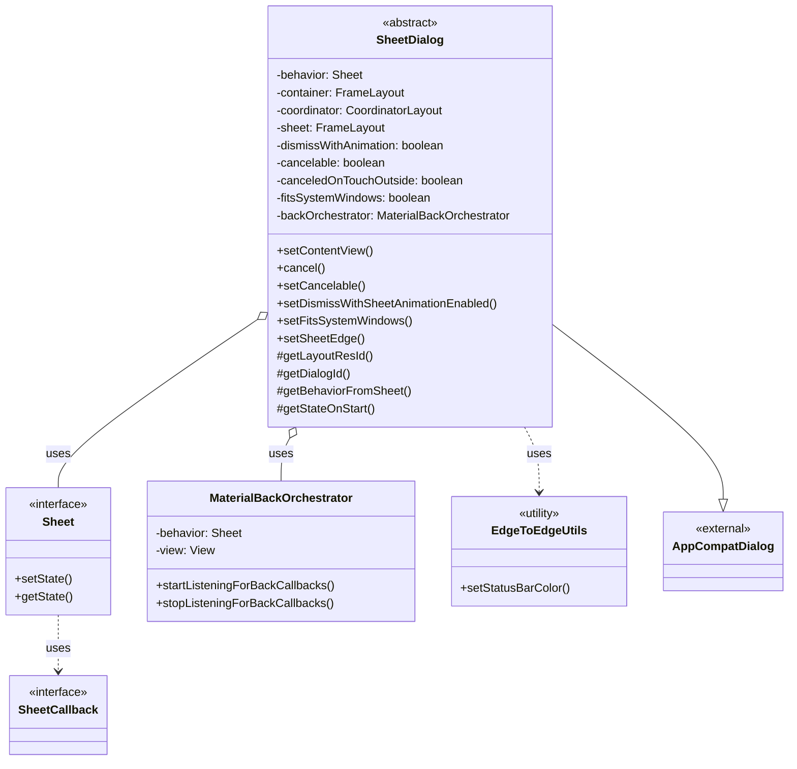
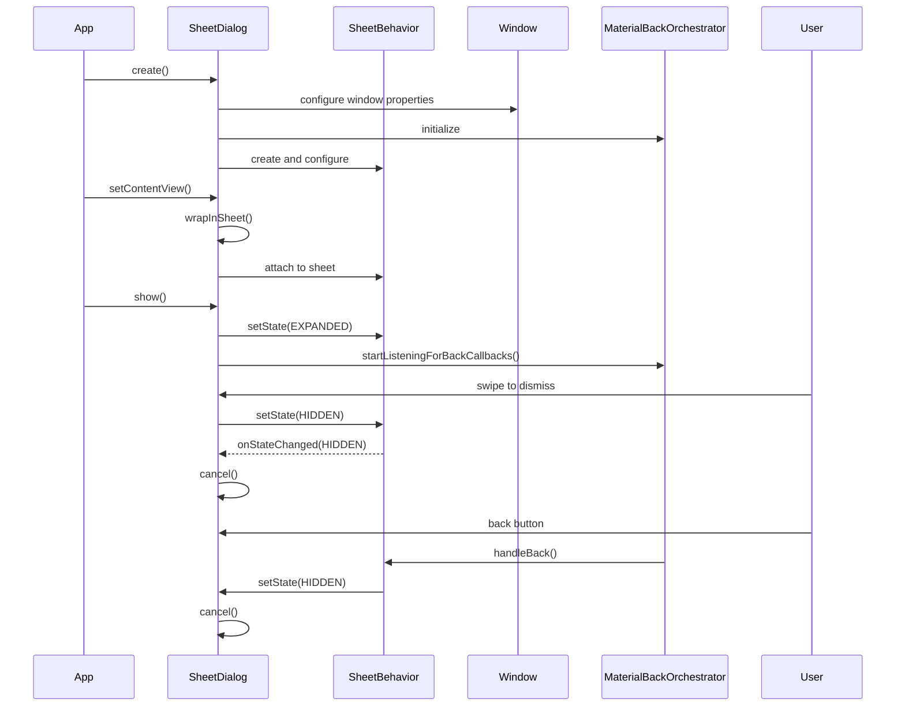
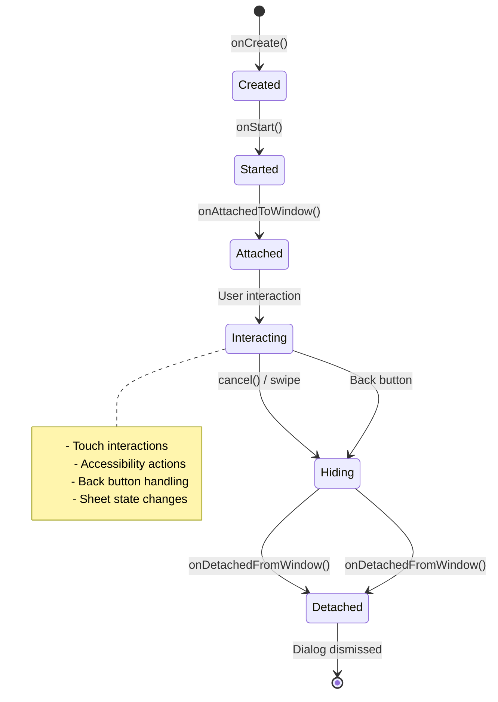
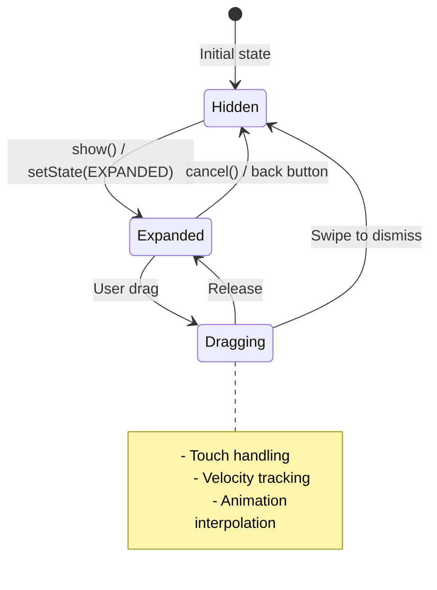
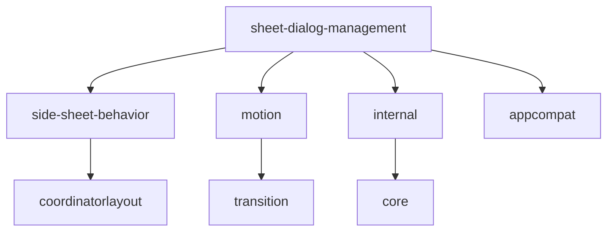

# Sheet Dialog Management Module

## Introduction

The Sheet Dialog Management module provides the foundational infrastructure for creating and managing sheet-based dialogs in the Material Design Components library. This module implements the core `SheetDialog` class, which serves as the base class for various sheet dialog implementations such as side sheets and bottom sheets. It handles the complex interactions between dialog lifecycle, sheet behaviors, animations, and system window management.

## Module Overview

The sheet-dialog-management module is part of the larger side-sheet module family and provides essential functionality for:
- Creating sheet-based dialog containers with proper theming and styling
- Managing sheet dialog lifecycle and state transitions
- Handling touch interactions and accessibility features
- Coordinating animations and window management
- Integrating with Material Design motion patterns

## Core Architecture

### Component Structure



### Key Components

#### SheetDialog Class
The `SheetDialog` is an abstract base class that extends `AppCompatDialog` and provides the core functionality for sheet-based dialogs. It manages the complex interactions between the dialog framework and sheet behaviors.

**Key Responsibilities:**
- Dialog lifecycle management (creation, showing, dismissal)
- Sheet behavior integration and state management
- Window configuration and system UI integration
- Touch interaction handling and accessibility
- Animation coordination between dialog and sheet transitions

**Core Properties:**
- `behavior`: The sheet behavior instance that controls sheet state and interactions
- `container`: The root FrameLayout that contains the entire dialog structure
- `coordinator`: CoordinatorLayout for managing sheet positioning and interactions
- `sheet`: The FrameLayout that contains the actual dialog content
- `dismissWithAnimation`: Controls whether to use sheet animations or window animations for dismissal

### Architecture Flow



## Component Interactions

### Dialog Lifecycle Integration



### Sheet State Management

The module integrates with the sheet behavior system to manage different states:



## Key Features

### 1. Window Management and Edge-to-Edge Support

The module provides comprehensive window configuration for modern Android applications:

- **Status Bar Handling**: Transparent status bar with proper icon color management
- **System Window Integration**: Configurable `fitsSystemWindows` behavior
- **Edge-to-Edge Rendering**: Full-screen content with proper insets handling
- **Window Animation Coordination**: Seamless transitions between dialog and sheet animations

```java
// Window configuration in onCreate()
EdgeToEdgeUtils.setStatusBarColor(window, 0);
window.addFlags(LayoutParams.FLAG_DRAWS_SYSTEM_BAR_BACKGROUNDS);
WindowCompat.setDecorFitsSystemWindows(window, fitsSystemWindows);
```

### 2. Animation System Integration

The module supports two animation modes for dismissal:

- **Sheet Animation**: Uses the sheet behavior's built-in animations (swipe-to-dismiss)
- **Window Animation**: Uses standard dialog window animations
- **Runtime Configuration**: Animations can be configured per dialog instance

### 3. Accessibility Support

Comprehensive accessibility features are built-in:

- **Dismiss Action**: Accessibility services can dismiss the dialog
- **Screen Reader Support**: Proper content descriptions and navigation
- **Keyboard Navigation**: Full keyboard accessibility support
- **Touch Exploration**: Proper touch target sizing and feedback

### 4. Back Button Handling

Integration with Material Design's back button patterns:

- **MaterialBackOrchestrator**: Coordinates back button behavior with sheet state
- **Conditional Handling**: Back button only functions when dialog is cancelable
- **State Synchronization**: Back button actions properly update sheet state

## Integration with Other Modules

### Dependencies

The sheet-dialog-management module integrates with several other Material Design modules:



### Related Modules

- **[side-sheet-behavior](side-sheet-behavior.md)**: Provides the sheet behavior implementation that controls state management and interactions
- **[motion](motion.md)**: Supplies the MaterialBackOrchestrator for back button handling
- **[internal](internal.md)**: Contains EdgeToEdgeUtils for system window management
- **[bottom-sheet](bottom-sheet.md)**: Similar module for bottom sheet dialogs (parallel implementation)

## Usage Patterns

### Basic Implementation

```java
public class CustomSheetDialog extends SheetDialog<SheetCallback> {
    
    public CustomSheetDialog(Context context) {
        super(context, 0, R.attr.customSheetDialogTheme, R.style.Theme_Material3_SheetDialog);
    }
    
    @Override
    void addSheetCancelOnHideCallback(Sheet<SheetCallback> behavior) {
        behavior.addCallback(new SheetCallback() {
            @Override
            public void onStateChanged(@NonNull View sheet, int newState) {
                if (newState == Sheet.STATE_HIDDEN) {
                    dismiss();
                }
            }
        });
    }
    
    @LayoutRes
    @Override
    int getLayoutResId() {
        return R.layout.custom_sheet_dialog;
    }
    
    @IdRes
    @Override
    int getDialogId() {
        return R.id.custom_sheet;
    }
    
    @NonNull
    @Override
    Sheet<SheetCallback> getBehaviorFromSheet(@NonNull FrameLayout sheet) {
        return CustomSheetBehavior.from(sheet);
    }
    
    @StableSheetState
    @Override
    int getStateOnStart() {
        return Sheet.STATE_EXPANDED;
    }
}
```

### Configuration Options

```java
// Create and configure the dialog
CustomSheetDialog dialog = new CustomSheetDialog(context);

// Enable sheet animations for dismissal
dialog.setDismissWithSheetAnimationEnabled(true);

// Configure system window behavior
dialog.setFitsSystemWindows(true);

// Set the edge for side sheet
dialog.setSheetEdge(Gravity.END);

// Standard dialog configuration
dialog.setCancelable(true);
dialog.setCanceledOnTouchOutside(true);
```

## Technical Implementation Details

### Layout Structure

The module creates a specific view hierarchy for proper sheet behavior:

```
FrameLayout (container)
├── CoordinatorLayout (coordinator)
│   ├── View (touch_outside) - handles touch outside
│   └── FrameLayout (sheet) - contains dialog content
│       └── [User Content View]
```

### State Synchronization

The module ensures proper synchronization between dialog state and sheet behavior:

1. **Dialog Show**: Triggers sheet expansion to configured state
2. **Sheet Hide**: Triggers dialog dismissal when sheet reaches hidden state
3. **Back Button**: Coordinated through MaterialBackOrchestrator
4. **Touch Outside**: Handled through touch interceptor view

### Window Animation Selection

Window animations are dynamically selected based on sheet edge and layout direction:

```java
int absoluteGravity = Gravity.getAbsoluteGravity(layoutParams.gravity, sheet.getLayoutDirection());
window.setWindowAnimations(
    absoluteGravity == Gravity.LEFT
        ? R.style.Animation_Material3_SideSheetDialog_Left
        : R.style.Animation_Material3_SideSheetDialog_Right);
```

## Best Practices

### 1. Theme Configuration

Always use appropriate Material Design themes for consistent styling:

```xml
<style name="Theme.Custom.SheetDialog" parent="Theme.Material3.SheetDialog">
    <item name="colorSurface">@color/surface_color</item>
    <item name="sheetCornerRadius">16dp</item>
    <item name="sheetElevation">8dp</item>
</style>
```

### 2. Accessibility Considerations

Ensure proper accessibility support:

- Provide meaningful content descriptions
- Test with screen readers
- Ensure proper focus management
- Validate keyboard navigation

### 3. Performance Optimization

- Reuse dialog instances when possible
- Properly handle configuration changes
- Clean up resources in `onDetachedFromWindow()`
- Use appropriate animation durations

### 4. Edge Case Handling

- Handle rapid show/dismiss cycles
- Manage configuration changes properly
- Test with different system window insets
- Validate behavior across different Android versions

## Conclusion

The sheet-dialog-management module provides a robust foundation for implementing sheet-based dialogs in Material Design applications. Its abstract design allows for flexible implementations while handling the complex interactions between dialog lifecycle, sheet behaviors, window management, and user interactions. By leveraging this module, developers can create consistent, accessible, and performant sheet dialog experiences that integrate seamlessly with the broader Material Design ecosystem.