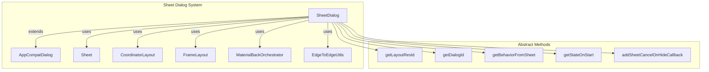
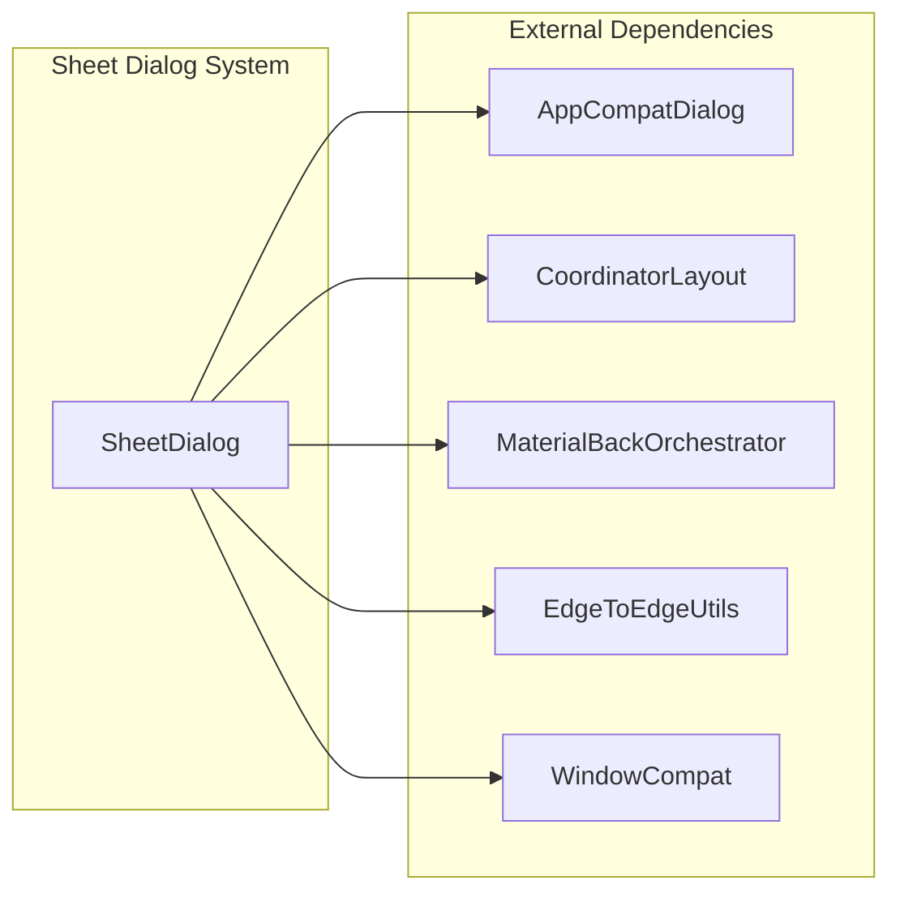
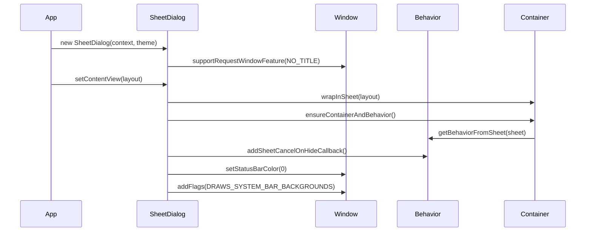
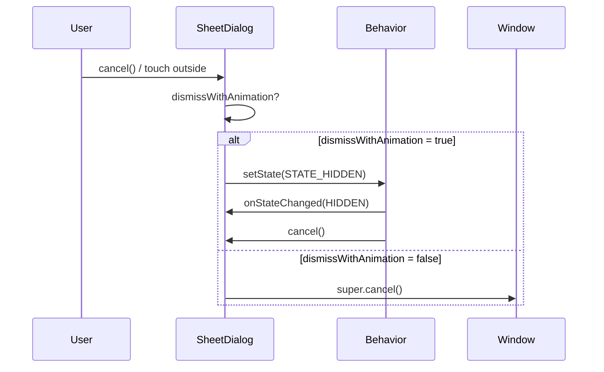
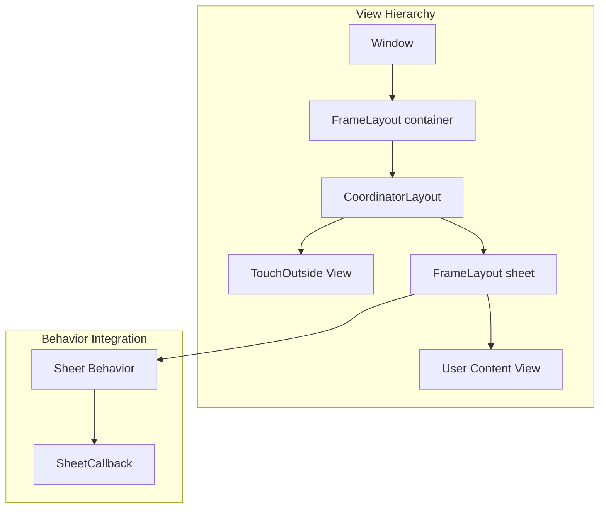
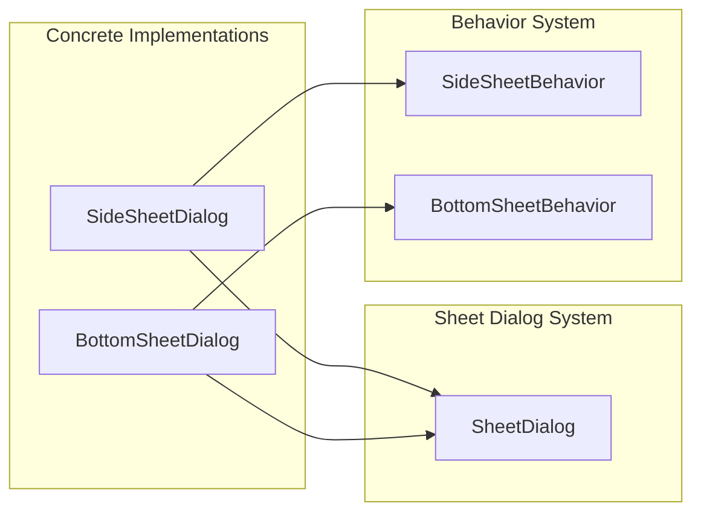

# Sheet Dialog System Documentation

## Introduction

The sheet-dialog-system module provides the foundational architecture for implementing sheet-based dialogs in Android Material Design applications. This abstract base class serves as the core framework for creating side sheets, bottom sheets, and other sheet-style dialog components that slide in from screen edges with smooth animations and interactive behaviors.

## Module Overview

The sheet-dialog-system is part of the larger sidesheet module ecosystem and provides the essential infrastructure for sheet-based dialog implementations. It extends AppCompatDialog to deliver Material Design-compliant sheet dialogs with advanced features like edge-to-edge display, system window integration, and sophisticated animation controls.

## Core Architecture

### Component Structure



### Key Components

#### SheetDialog Class
The `SheetDialog<C extends SheetCallback>` is an abstract base class that provides:

- **Window Management**: Handles system window integration with edge-to-edge display
- **Animation Control**: Manages sheet animations vs window animations for dismiss operations
- **Touch Handling**: Implements touch-outside-to-dismiss functionality
- **Accessibility**: Provides comprehensive accessibility support
- **Back Navigation**: Integrates with Material Back Orchestrator for gesture navigation

#### Core Dependencies



## Data Flow Architecture

### Dialog Creation Flow



### Dismiss Flow



## Component Interactions

### Layout Structure



### State Management

The SheetDialog manages several key states:

- **Cancelable State**: Controls whether the dialog can be dismissed
- **Animation State**: Determines whether to use sheet or window animations
- **System Windows**: Manages edge-to-edge display and system bar integration
- **Back Navigation**: Handles Material back gesture integration

## Key Features

### 1. Edge-to-Edge Display
```java
// Automatic status bar handling
EdgeToEdgeUtils.setStatusBarColor(window, 0);
window.addFlags(LayoutParams.FLAG_DRAWS_SYSTEM_BAR_BACKGROUNDS);
```

### 2. Animation Control
- **Sheet Animation**: Uses behavior state changes for smooth sheet animations
- **Window Animation**: Falls back to standard window animations
- **Direction-Aware**: Adapts animations based on sheet gravity (left/right)

### 3. Accessibility Support
- **Dismiss Action**: Adds accessibility dismiss action
- **Screen Reader**: Proper accessibility node information
- **Keyboard Navigation**: Full keyboard support

### 4. Back Gesture Integration
```java
backOrchestrator = new MaterialBackOrchestrator(behavior, sheet);
```

## Integration with Other Modules

### Related Modules

- **[behavior-system.md](behavior-system.md)**: Provides the foundational behavior system that SheetDialog extends
- **[sidesheet-behavior-system.md](sidesheet-behavior-system.md)**: Implements the specific SideSheetBehavior used by sheet dialogs
- **[material-back-orchestrator.md](material-back-orchestrator.md)**: Handles Material Design back gesture integration

### Usage Patterns



## Configuration Options

### Public API Methods

| Method | Purpose |
|--------|---------|
| `setDismissWithSheetAnimationEnabled(boolean)` | Control animation type for dismiss |
| `setFitsSystemWindows(boolean)` | Enable edge-to-edge display |
| `setSheetEdge(@GravityInt int)` | Set sheet origin edge (left/right) |
| `setCancelable(boolean)` | Control dialog cancelability |
| `setCanceledOnTouchOutside(boolean)` | Control touch-outside dismiss |

### Protected Abstract Methods

| Method | Purpose |
|--------|---------|
| `getLayoutResId()` | Provide container layout resource |
| `getDialogId()` | Provide sheet view ID |
| `getBehaviorFromSheet()` | Extract behavior from sheet view |
| `getStateOnStart()` | Define initial sheet state |
| `addSheetCancelOnHideCallback()` | Configure behavior callbacks |

## Best Practices

### 1. Theme Configuration
Always use appropriate Material Design themes:
```java
SheetDialog(context, theme, R.attr.sideSheetDialogTheme, R.style.Theme_Material3_SideSheetDialog)
```

### 2. Animation Selection
- Use sheet animations for Material Design compliance
- Reserve window animations for specific edge cases
- Consider user expectations for dismiss behavior

### 3. Accessibility
- Always test with screen readers
- Ensure proper focus management
- Provide meaningful content descriptions

### 4. Edge-to-Edge
- Enable by default for modern Android versions
- Test on devices with notches and cutouts
- Handle system bar color changes appropriately

## Error Handling

### Common Issues

1. **IllegalStateException**: Sheet edge changes after layout
2. **NullPointerException**: Missing sheet or behavior references
3. **Window Leaks**: Proper lifecycle management required

### Validation
- Sheet edge validation before layout
- Behavior existence checks
- Window state validation

## Performance Considerations

### Memory Management
- Proper cleanup in `onDetachedFromWindow()`
- Back orchestrator lifecycle management
- View hierarchy optimization

### Animation Performance
- Hardware acceleration for smooth animations
- Proper view recycling
- Efficient state change handling

## Future Considerations

### Extensibility
The abstract design allows for:
- Custom sheet implementations
- New animation types
- Additional edge configurations
- Enhanced accessibility features

### Material Design Evolution
The system is designed to adapt to:
- New Material Design specifications
- Updated animation guidelines
- Enhanced accessibility requirements
- Platform behavior changes

---

This documentation provides a comprehensive overview of the sheet-dialog-system module. For specific implementation details of concrete sheet dialog types, refer to the respective module documentation for side sheets and bottom sheets.