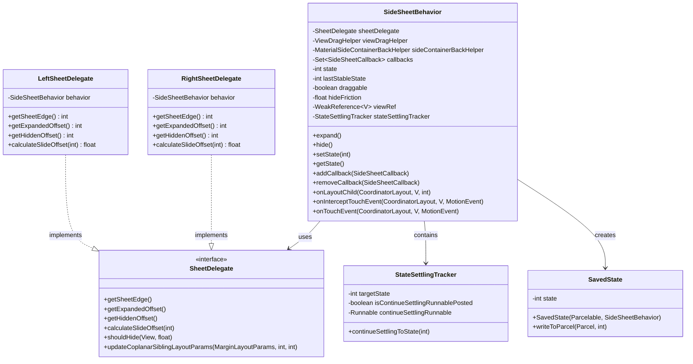
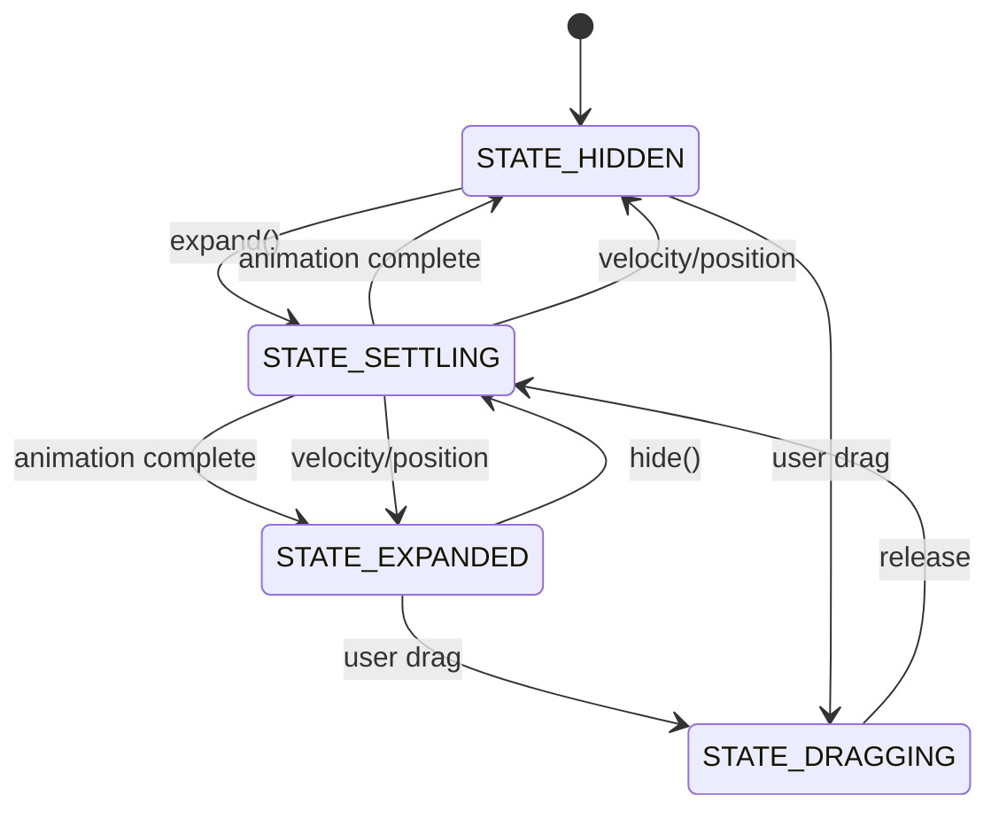
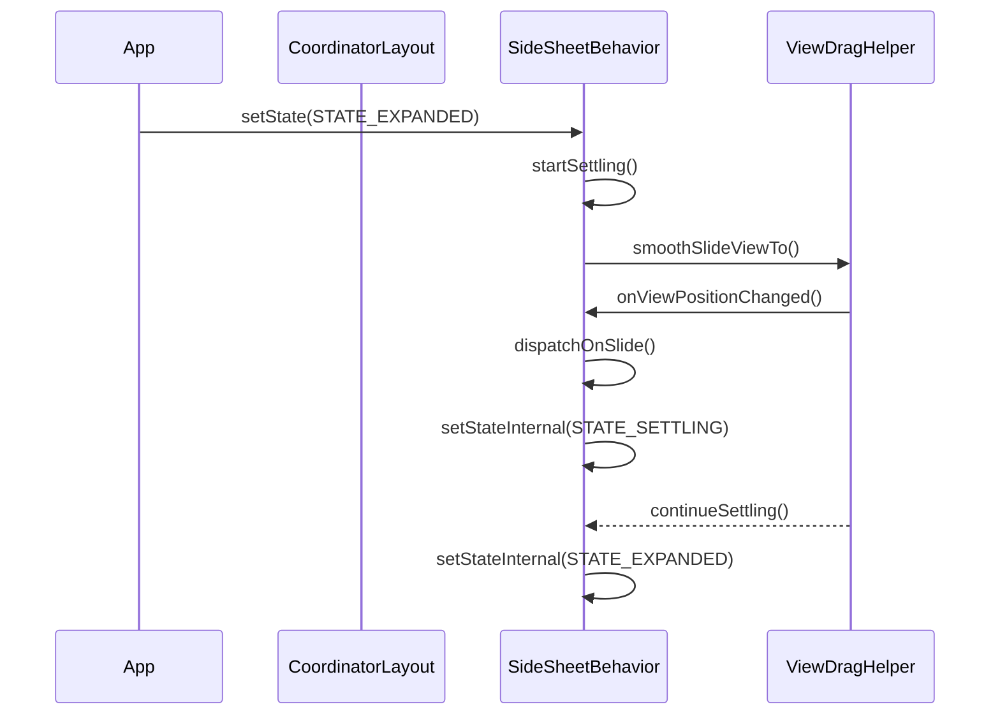
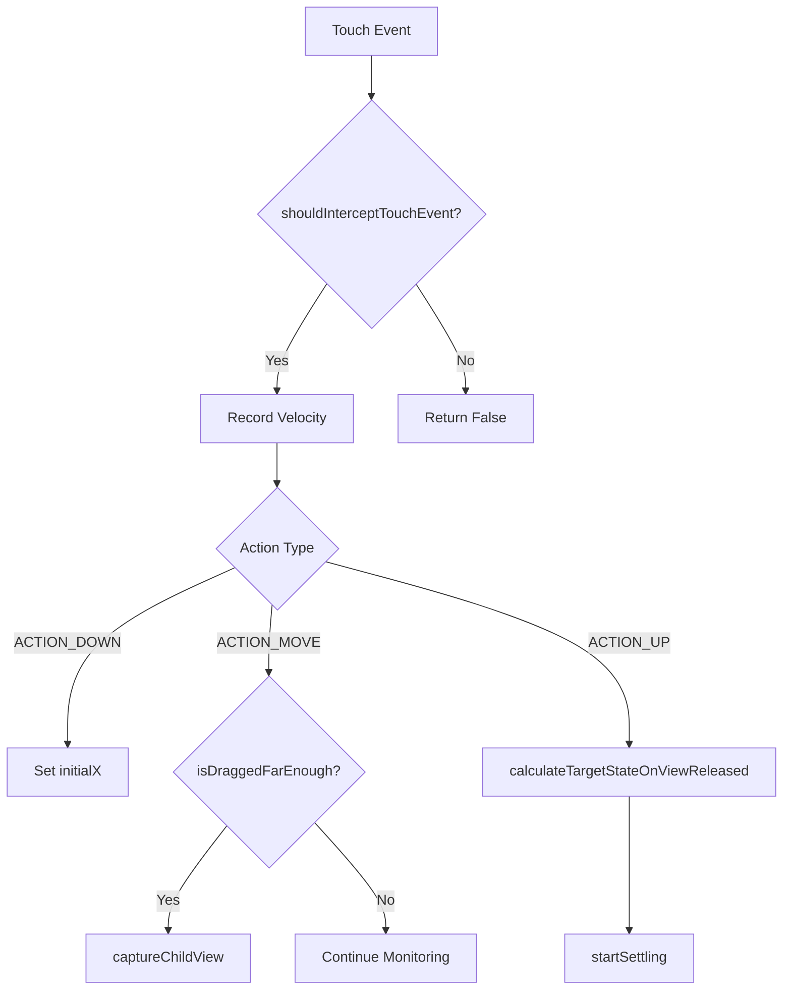
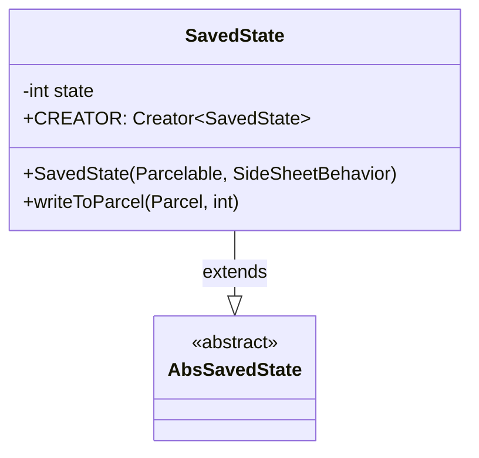

# Side Sheet Behavior Module

## Overview

The side-sheet-behavior module provides the core interaction behavior for Material Design side sheets, enabling horizontal sliding panels that can be expanded and collapsed from either the left or right edge of the screen. This module implements the `SideSheetBehavior` class, which serves as a CoordinatorLayout behavior plugin to make child views function as side sheets.

## Purpose and Core Functionality

The side-sheet-behavior module is responsible for:

- **Gesture Handling**: Managing touch interactions, drag detection, and velocity tracking for smooth sheet animations
- **State Management**: Controlling sheet states (expanded, hidden, dragging, settling) with proper state transitions
- **Layout Coordination**: Integrating with CoordinatorLayout to handle child view positioning and coplanar sibling relationships
- **Accessibility**: Providing proper accessibility support with pane titles and actions
- **Back Navigation**: Supporting predictive back gestures and system back button handling
- **Animation Control**: Managing smooth transitions between states with customizable friction and thresholds

## Architecture

### Core Components



### State Management



## Component Relationships

### Integration with CoordinatorLayout



### Touch Event Processing



## Key Features

### 1. Edge-based Positioning
The behavior automatically determines sheet positioning based on layout gravity:
- `Gravity.LEFT` → LeftSheetDelegate
- `Gravity.RIGHT` → RightSheetDelegate

### 2. Coplanar Sibling Support
Sheets can be configured to work with sibling views that adjust their layout during expansion/collapse:
```java
// Set by ID
setCoplanarSiblingViewId(R.id.main_content)

// Set by reference
setCoplanarSiblingView(mainContentView)
```

### 3. Back Gesture Integration
Full support for Android's predictive back gestures:
- `startBackProgress()` - Initialize back gesture
- `updateBackProgress()` - Update animation during gesture
- `handleBackInvoked()` - Complete back action
- `cancelBackProgress()` - Cancel gesture

### 4. Accessibility Features
- Automatic pane title setting for TalkBack
- Expand/Collapse accessibility actions
- Proper visibility management
- Screen reader support

## State Persistence

The `SavedState` class handles configuration changes:



## Configuration Options

### XML Attributes
- `behavior_draggable` - Enable/disable drag interactions
- `backgroundTint` - Background color tint
- `shapeAppearance` - Shape appearance model
- `coplanarSiblingViewId` - Sibling view for coplanar expansion
- `android:elevation` - Sheet elevation

### Programmatic Configuration
- `setDraggable(boolean)` - Control drag behavior
- `setHideFriction(float)` - Adjust swipe sensitivity
- `addCallback(SideSheetCallback)` - Listen to state changes
- `setCoplanarSiblingView(View)` - Configure coplanar relationships

## Dependencies

The side-sheet-behavior module integrates with several other Material Design components:

- **[CoordinatorLayout](coordinator-layout.md)** - Parent layout for behavior integration
- **[MaterialShapeDrawable](shape.md)** - Background shape rendering
- **[ViewDragHelper](appbar-behaviors.md)** - Drag gesture processing
- **[MaterialSideContainerBackHelper](motion.md)** - Back gesture support
- **[Sheet](sheet.md)** - Common sheet interface

## Usage Examples

### Basic Setup
```xml
<androidx.coordinatorlayout.widget.CoordinatorLayout>
    <LinearLayout
        android:layout_width="300dp"
        android:layout_height="match_parent"
        android:layout_gravity="start"
        app:layout_behavior="com.google.android.material.sidesheet.SideSheetBehavior"
        app:behavior_draggable="true">
        <!-- Side sheet content -->
    </LinearLayout>
</androidx.coordinatorlayout.widget.CoordinatorLayout>
```

### Programmatic Control
```java
SideSheetBehavior<LinearLayout> behavior = SideSheetBehavior.from(sideSheetView);
behavior.addCallback(new SideSheetCallback() {
    @Override
    public void onStateChanged(@NonNull View sheet, int newState) {
        // Handle state changes
    }
    
    @Override
    public void onSlide(@NonNull View sheet, float slideOffset) {
        // Handle slide progress
    }
});

// Expand the sheet
behavior.expand();

// Hide the sheet
behavior.hide();
```

## Performance Considerations

- **View Recycling**: Uses WeakReference for view references to prevent memory leaks
- **Velocity Tracking**: Efficient velocity calculation for smooth animations
- **State Optimization**: Minimal state transitions and layout passes
- **Animation Performance**: Hardware-accelerated animations with proper invalidation

## Testing

The module provides several testing utilities:
- `getBackHelper()` - Access back gesture helper for testing
- `shouldSkipSmoothAnimation()` - Control animation behavior in tests
- `getLastStableState()` - Verify state persistence

## Related Documentation

- [Sheet Dialog Management](sheet-dialog-management.md) - Dialog-based side sheets
- [Sheet Utilities](sheet-utilities.md) - Utility functions for sheet operations
- [Material Motion](motion.md) - Animation and transition system
- [Shape System](shape.md) - Shape appearance and customization