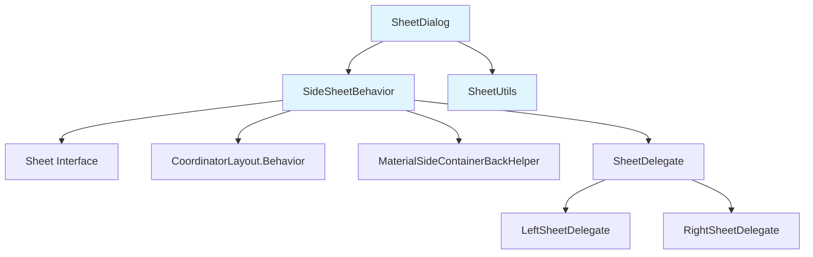
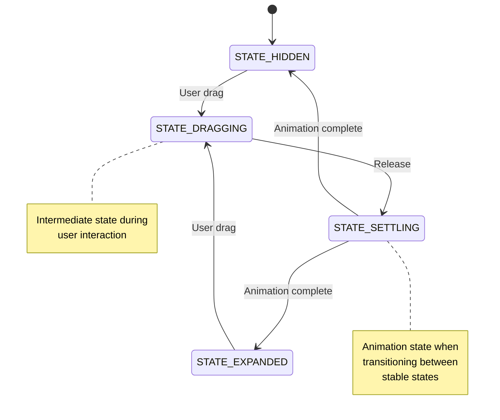

# Side Sheet Module Documentation

## Overview

The side-sheet module provides Material Design-compliant side sheet components that slide in from the left or right edge of the screen. Side sheets are supplementary surfaces that display contextual content and actions while maintaining the primary context of the underlying interface.

## Architecture



## Core Components

### SheetDialog
The abstract base class for sheet-style dialogs, providing common functionality for side sheets and bottom sheets. Handles window management, animations, and user interactions.

**Key Features:**
- Window animation management based on layout direction
- Touch-outside-to-dismiss functionality
- Accessibility support with pane titles
- Material back gesture integration
- System window insets handling

### SideSheetBehavior
The core behavior implementation that extends CoordinatorLayout.Behavior to provide side sheet functionality. Manages drag interactions, state transitions, and animations.

**Key Features:**
- Left and right edge positioning
- Drag-to-dismiss with velocity-based animations
- Coplanar sibling view support for coordinated animations
- Material Design motion guidelines compliance
- Accessibility actions for expand/collapse

### SheetUtils
Utility class providing helper methods for sheet calculations and gesture detection.

**Key Features:**
- Swipe direction detection (horizontal vs vertical)
- Velocity threshold calculations
- Mathematical utilities for sheet positioning

## Sub-modules

### [Sheet Dialog Management](sheet-dialog-management.md)
Handles the dialog wrapper functionality for side sheets, including window management, animations, and lifecycle events.

**Components:**
- `SheetDialog.SheetDialog` - Abstract base dialog class

### [Side Sheet Behavior](side-sheet-behavior.md)
Implements the core interaction behavior for side sheets, including drag handling, state management, and animations.

**Components:**
- `SideSheetBehavior.SavedState` - State persistence for configuration changes

### [Sheet Utilities](sheet-utilities.md)
Provides mathematical and utility functions for sheet calculations and gesture recognition.

**Components:**
- `SheetUtils.SheetUtils` - Utility methods for sheet operations

## Integration Patterns

### Basic Implementation
```xml
<androidx.coordinatorlayout.widget.CoordinatorLayout>
    <LinearLayout
        android:layout_width="match_parent"
        android:layout_height="match_parent"
        android:orientation="vertical">
        <!-- Main content -->
    </LinearLayout>
    
    <FrameLayout
        android:layout_width="320dp"
        android:layout_height="match_parent"
        android:layout_gravity="end"
        app:layout_behavior="com.google.android.material.sidesheet.SideSheetBehavior">
        <!-- Side sheet content -->
    </FrameLayout>
</androidx.coordinatorlayout.widget.CoordinatorLayout>
```

### Programmatic Usage
```java
SideSheetBehavior<FrameLayout> behavior = SideSheetBehavior.from(sideSheetView);
behavior.addCallback(new SideSheetCallback() {
    @Override
    public void onStateChanged(@NonNull View sheet, int newState) {
        // Handle state changes
    }
    
    @Override
    public void onSlide(@NonNull View sheet, float slideOffset) {
        // Handle slide events
    }
});

// Expand the side sheet
behavior.expand();

// Hide the side sheet
behavior.hide();
```

## State Management

The side sheet supports four primary states:



## Material Design Integration

The side sheet module integrates with several other Material Design components:

- **[Bottom Sheet](bottom-sheet.md)**: Shares common sheet behavior patterns and animations
- **[Motion System](transition.md)**: Utilizes Material motion curves and transitions
- **[Shape System](shape.md)**: Supports customizable corner radii and shapes
- **[Theme System](theme.md)**: Respects Material theming for colors and elevation

## Accessibility

The side sheet provides comprehensive accessibility support:

- **Pane Titles**: Automatic accessibility pane titles for screen readers
- **Actions**: Expand/collapse actions for assistive technologies
- **Focus Management**: Proper focus handling during state transitions
- **Keyboard Navigation**: Support for keyboard-based interaction

## Performance Considerations

- **View Recycling**: Efficient view reference management with WeakReference
- **Animation Optimization**: Hardware-accelerated animations with proper invalidation
- **Memory Management**: Automatic cleanup of resources and listeners
- **State Persistence**: Efficient state saving and restoration during configuration changes

## Related Documentation

- [Bottom Sheet Module](bottom-sheet.md) - For understanding shared sheet patterns
- [Motion System](transition.md) - For animation and transition details
- [Shape System](shape.md) - For customization of sheet appearance
- [Theme System](theme.md) - For theming and styling guidelines