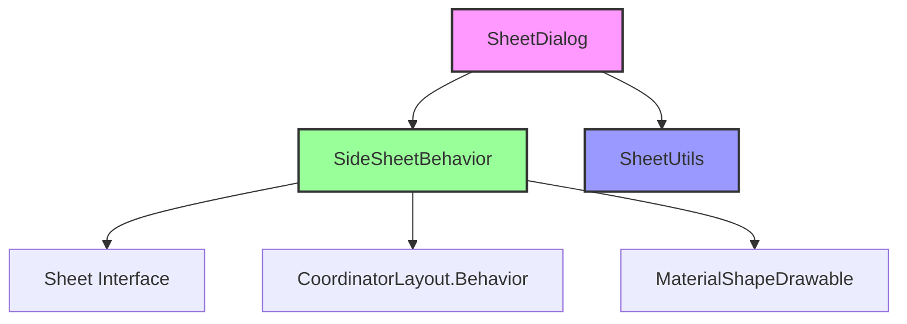

# SideSheet Module Documentation

## Overview

The SideSheet module provides a comprehensive implementation of side sheet components for Android applications, following Material Design guidelines. Side sheets are surfaces that slide in from the left or right edge of the screen to display supplementary content or navigation options without leaving the current context.

## Architecture

The SideSheet module is built around a flexible architecture that separates concerns between dialog management, behavior control, and utility functions:



## Core Components

### 1. SheetDialog
The `SheetDialog` class serves as the base implementation for sheet-based dialogs. It provides:
- Window management and theming
- Touch handling and dismissal logic
- Animation coordination
- Accessibility support
- Edge-to-edge display capabilities

Key features:
- Configurable sheet edge (left/right)
- System window integration
- Back gesture handling via MaterialBackOrchestrator
- Touch-outside-to-dismiss functionality

### 2. SideSheetBehavior
The `SideSheetBehavior` class implements the core interaction behavior for side sheets:
- Drag and swipe gesture handling
- State management (expanded, hidden, dragging, settling)
- Animation coordination
- Coplanar sibling view support
- Material Design motion patterns

Key capabilities:
- Horizontal drag detection and processing
- Velocity-based state transitions
- Coplanar view animation during expansion/collapse
- Back gesture support with predictive animations
- Accessibility actions for expand/collapse

### 3. SheetUtils
Utility class providing helper functions for sheet calculations:
- Swipe direction detection
- Velocity threshold calculations

## Sub-modules

The SideSheet module can be divided into several logical sub-modules:

### [Sheet Dialog System](sheet-dialog-system.md)
Handles the dialog presentation layer, window management, and user interaction coordination. This sub-module provides the foundational `SheetDialog` class that serves as the base for all sheet-based dialog implementations.

### [Behavior System](behavior-system.md)
Manages the core interaction patterns, state transitions, and animation logic. Contains the `SideSheetBehavior` implementation that handles drag gestures, state management, and coplanar animations.

### [Utility Components](utility-components.md)
Provides supporting functions and calculations used across the module. Includes utility classes like `SheetUtils` that offer helper functions for swipe detection and velocity calculations.

## Integration with Other Modules

The SideSheet module integrates with several other Material Design components:

- **[CoordinatorLayout](coordinator.md)**: Uses CoordinatorLayout.Behavior for layout coordination
- **[Shape System](shape.md)**: Leverages MaterialShapeDrawable for customizable backgrounds
- **[Motion System](transition.md)**: Integrates with MaterialBackOrchestrator for gesture handling
- **[Animation System](animation.md)**: Uses AnimationUtils for smooth transitions

## Key Features

### State Management
The side sheet supports four distinct states:
- **STATE_EXPANDED**: Sheet is fully visible
- **STATE_HIDDEN**: Sheet is completely off-screen
- **STATE_DRAGGING**: User is actively dragging the sheet
- **STATE_SETTLING**: Sheet is animating to a stable state

### Edge Support
Sheets can originate from either the left or right edge of the screen, with appropriate animations and layout adjustments.

### Coplanar Sibling Support
The side sheet can animate adjacent views during expansion and collapse, creating a cohesive visual experience.

### Accessibility
Comprehensive accessibility support including:
- Screen reader announcements
- Keyboard navigation
- Accessibility actions for expand/collapse
- Pane title announcements

### Back Gesture Support
Integration with Android's back gesture system for intuitive dismissal, including predictive back animations on supported devices.

## Usage Patterns

### Basic Implementation
```java
// Create a side sheet dialog
SideSheetDialog dialog = new SideSheetDialog(context);
dialog.setContentView(R.layout.side_sheet_content);
dialog.show();

// Or use SideSheetBehavior with existing views
SideSheetBehavior<View> behavior = SideSheetBehavior.from(view);
behavior.setState(SideSheetBehavior.STATE_EXPANDED);
```

### Advanced Configuration
```java
// Configure behavior
behavior.setDraggable(true);
behavior.setHideFriction(0.1f);
behavior.setCoplanarSiblingView(adjacentView);

// Add callbacks
behavior.addCallback(new SideSheetCallback() {
    @Override
    public void onStateChanged(@NonNull View sheet, int newState) {
        // Handle state changes
    }
    
    @Override
    public void onSlide(@NonNull View sheet, float slideOffset) {
        // Handle slide events
    }
});
```

## Performance Considerations

- Uses ViewDragHelper for efficient touch handling
- Implements proper view recycling and cleanup
- Minimizes layout passes during animations
- Optimizes accessibility updates

## Future Enhancements

The modular architecture allows for potential extensions such as:
- Multi-state support (partially expanded states)
- Vertical side sheet variants
- Enhanced coplanar animations
- Custom transition patterns