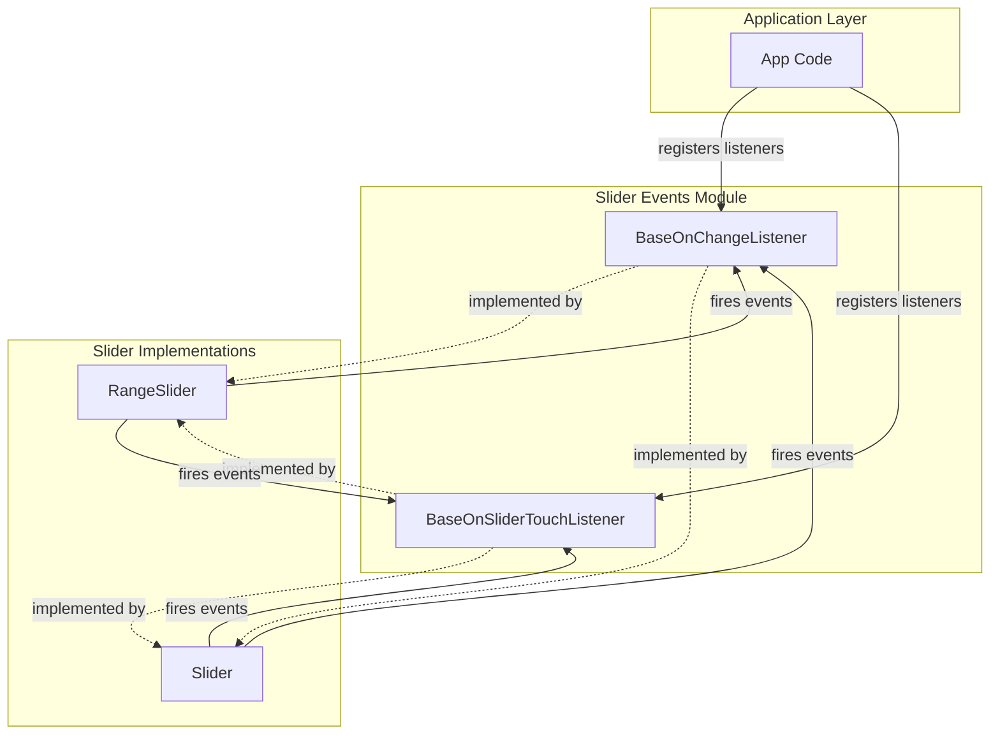
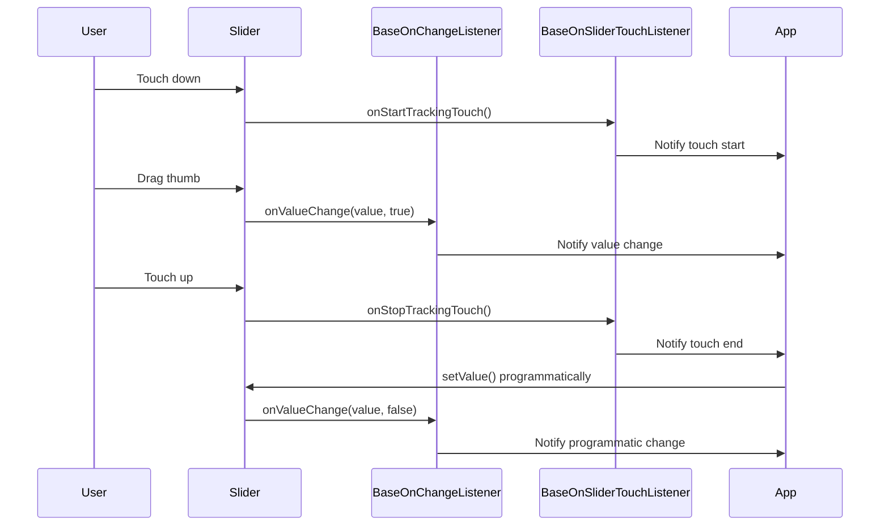
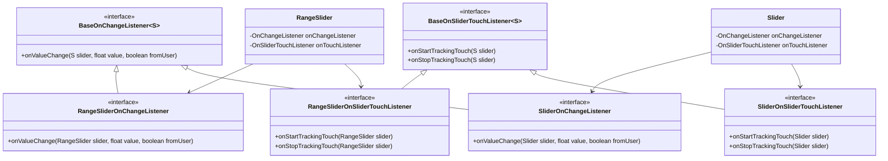
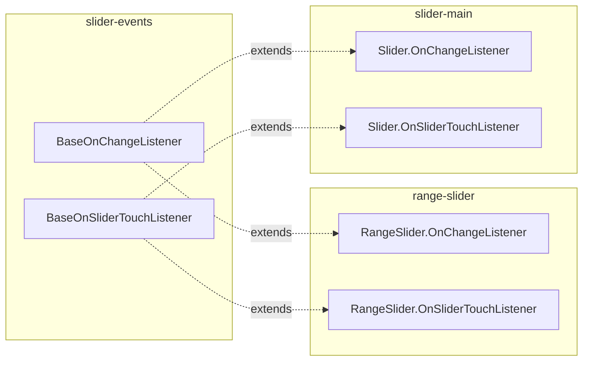

# Slider Events Module Documentation

## Introduction

The slider-events module provides the foundational event handling interfaces for Material Design slider components. This module defines the core callback interfaces that enable developers to respond to user interactions with slider controls, including value changes and touch events. As part of the larger slider component ecosystem, these interfaces serve as the contract between slider implementations and application code that needs to react to slider state changes.

## Architecture Overview

The slider-events module implements a generic, type-safe event handling pattern using Java generics. This design allows the same event interfaces to be used across different slider implementations (both single-value Slider and dual-thumb RangeSlider components) while maintaining type safety and consistency.



## Core Components

### BaseOnChangeListener<S>

The `BaseOnChangeListener<S>` interface defines the contract for handling slider value change events. This generic interface uses a type parameter `S` to represent the specific slider type, ensuring type safety when implementing custom listeners.

**Key Features:**
- Generic interface supporting any slider type
- Provides value change notification with user interaction context
- Includes `fromUser` flag to distinguish programmatic vs. user-initiated changes
- Restricted to library group usage for internal consistency

**Method:**
- `onValueChange(@NonNull S slider, float value, boolean fromUser)` - Called when the slider's value changes

### BaseOnSliderTouchListener<S>

The `BaseOnSliderTouchListener<S>` interface handles touch interaction events, providing callbacks for when users start and stop interacting with slider controls.

**Key Features:**
- Generic interface for touch event handling
- Provides start/stop tracking for touch interactions
- Enables custom behaviors during user interaction
- Restricted to library group usage

**Methods:**
- `onStartTrackingTouch(@NonNull S slider)` - Called when user starts touching the slider
- `onStopTrackingTouch(@NonNull S slider)` - Called when user stops touching the slider

## Data Flow



## Component Relationships



## Integration with Slider Module

The slider-events module serves as the foundation for the complete slider implementation. The base interfaces defined here are extended by specific listener types in the [range-slider](range-slider.md) and main slider modules.



## Usage Patterns

### Value Change Handling

Applications implement the base interfaces to respond to slider value changes:

```java
// Example implementation for a custom slider listener
BaseOnChangeListener<Slider> listener = new BaseOnChangeListener<Slider>() {
    @Override
    public void onValueChange(@NonNull Slider slider, float value, boolean fromUser) {
        if (fromUser) {
            // Handle user-initiated change
            updateUI(value);
        } else {
            // Handle programmatic change
            syncWithModel(value);
        }
    }
};
```

### Touch Event Handling

Touch listeners enable custom behaviors during user interaction:

```java
BaseOnSliderTouchListener<Slider> touchListener = new BaseOnSliderTouchListener<Slider>() {
    @Override
    public void onStartTrackingTouch(@NonNull Slider slider) {
        // Pause animations or other UI updates
        pauseUIUpdates();
    }
    
    @Override
    public void onStopTrackingTouch(@NonNull Slider slider) {
        // Resume normal operation
        resumeUIUpdates();
        // Commit final value
        commitValue(slider.getValue());
    }
};
```

## Design Principles

### Type Safety
The use of generics ensures compile-time type checking, preventing runtime errors when working with different slider types.

### Consistency
Both interfaces follow similar naming patterns and parameter structures, providing a consistent API across different event types.

### Extensibility
The generic design allows for easy extension to support new slider variants without modifying the base interfaces.

### Library Internal Design
The `@RestrictTo(Scope.LIBRARY_GROUP)` annotation ensures these interfaces are used consistently within the Material Components library while allowing specific implementations to expose public APIs.

## Related Modules

- [range-slider](range-slider.md) - Extends these base interfaces for dual-thumb slider functionality
- [slider-orientation](slider-orientation.md) - Provides orientation support for slider components
- Main slider module - Implements the complete slider component using these event interfaces

## Best Practices

1. **Implement Both Interfaces**: For complete slider interaction handling, implement both change and touch listeners
2. **Check fromUser Flag**: Use the `fromUser` parameter to distinguish between user interactions and programmatic changes
3. **Handle Touch States**: Implement touch tracking for scenarios requiring interaction state awareness
4. **Type Safety**: Use the appropriate listener type for your specific slider implementation
5. **Performance**: Keep listener implementations lightweight to maintain smooth UI interactions