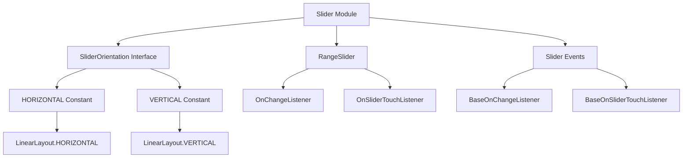
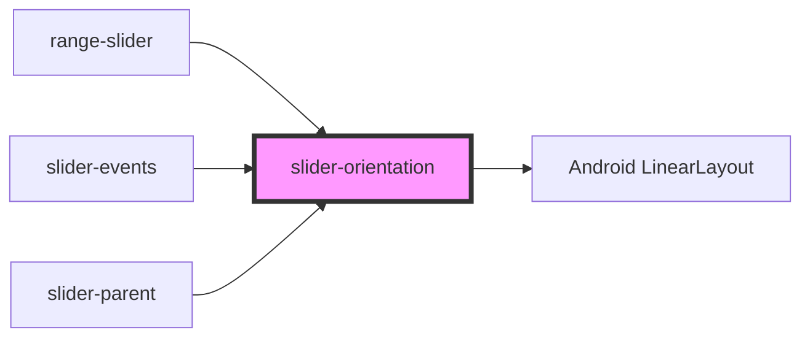
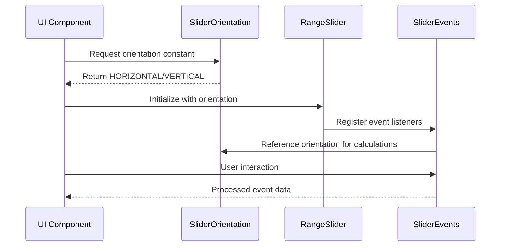

# Slider Orientation Module Documentation

## Introduction

The slider-orientation module provides the fundamental orientation constants and interface definition for Material Design sliders. This module defines the basic orientation properties that determine whether a slider operates horizontally or vertically, serving as a foundational component for all slider implementations within the Material Design Components library.

## Core Functionality

The module's primary purpose is to standardize orientation behavior across different slider components by providing a consistent interface and orientation constants. It abstracts the orientation concept from Android's LinearLayout system while maintaining compatibility with existing Android layout paradigms.

## Architecture

### Component Structure



### Module Dependencies



## Core Components

### SliderOrientation Interface

The `SliderOrientation` interface serves as the central contract for orientation behavior in Material Design sliders. It provides a standardized way to define and reference slider orientations throughout the component library.

**Key Features:**
- Defines orientation constants that align with Android's LinearLayout orientation system
- Provides a consistent interface for orientation-based operations
- Ensures compatibility across different slider implementations

**Constants:**
- `HORIZONTAL`: Maps to `LinearLayout.HORIZONTAL` for horizontal slider orientation
- `VERTICAL`: Maps to `LinearLayout.VERTICAL` for vertical slider orientation

## Integration with Slider Module

The slider-orientation module acts as a foundational component that other slider-related modules depend upon:

### Relationship with Range Slider
[Range slider components](range-slider.md) utilize the orientation constants to determine the layout direction of dual-thumb sliders, affecting how the range selection behaves visually and interactively.

### Relationship with Slider Events
[Slider event components](slider-events.md) reference orientation constants when handling touch events and value changes, ensuring that gesture recognition and value calculations align with the slider's physical orientation.

## Data Flow



## Usage Patterns

### Basic Implementation
```java
// Using orientation constants
int orientation = SliderOrientation.HORIZONTAL;
// or
int orientation = SliderOrientation.VERTICAL;
```

### Integration with Slider Components
The orientation constants are typically used during slider initialization and configuration:
- Layout parameter setup
- Touch event handling
- Value calculation algorithms
- Visual rendering decisions

## Design Considerations

### Compatibility
The module maintains direct compatibility with Android's LinearLayout orientation system, ensuring that existing Android development patterns remain valid while providing Material Design-specific standardization.

### Extensibility
While the current implementation provides only horizontal and vertical orientations, the interface-based design allows for potential future extensions without breaking existing implementations.

### Performance
The use of primitive integer constants ensures minimal memory overhead and optimal performance across all slider implementations.

## Related Documentation

- [Range Slider Module](range-slider.md) - For dual-thumb slider implementations that utilize orientation
- [Slider Events Module](slider-events.md) - For event handling that references orientation constants
- [Slider Parent Module](slider.md) - For the main slider implementation that depends on orientation

## API Reference

### SliderOrientation Interface

**Package:** `com.google.android.material.slider`

**Constants:**
- `int HORIZONTAL = LinearLayout.HORIZONTAL` - Horizontal orientation constant
- `int VERTICAL = LinearLayout.VERTICAL` - Vertical orientation constant

**Usage:**
These constants are used throughout the slider ecosystem to determine layout direction, touch handling behavior, and visual presentation of slider components.