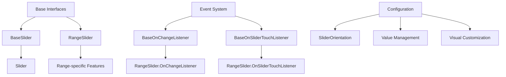
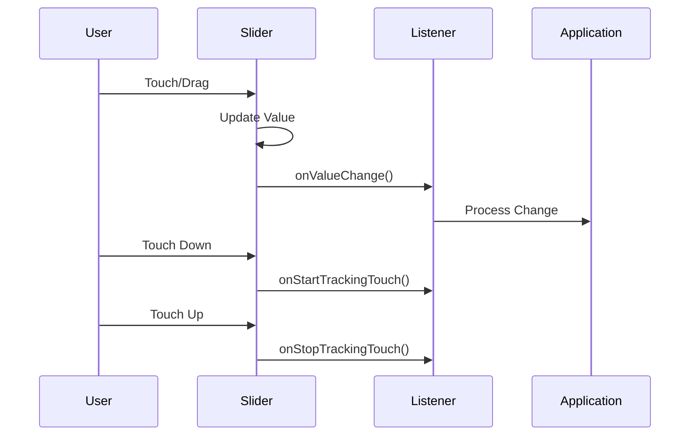

# Slider Module Documentation

## Overview

The Slider module provides Material Design-compliant slider components for Android applications, offering both single-value and range selection capabilities. This module implements touch-interactive sliders that allow users to select values from a continuous or discrete range, following Material Design guidelines for consistent user experience across Android applications.

## Architecture

The slider module is built around a hierarchical architecture with base abstractions and specialized implementations:



## Core Components

### Base Abstractions

#### BaseOnChangeListener
- **Purpose**: Defines the contract for value change notifications
- **Location**: `lib.java.com.google.android.material.slider.BaseOnChangeListener`
- **Key Features**:
  - Generic interface for all slider types
  - Provides value change events with user interaction context
  - Restricted to library group usage

#### BaseOnSliderTouchListener
- **Purpose**: Handles touch interaction lifecycle events
- **Location**: `lib.java.com.google.android.material.slider.BaseOnSliderTouchListener`
- **Key Features**:
  - Monitors touch start and stop events
  - Enables custom touch handling behaviors
  - Generic design for extensibility

### Specialized Implementations

#### RangeSlider
- **Purpose**: Multi-thumb slider for selecting value ranges
- **Location**: `lib.java.com.google.android.material.slider.RangeSlider`
- **Key Features**:
  - Multiple thumb support for range selection
  - Minimum separation constraints between thumbs
  - Custom thumb drawables per value
  - State persistence and restoration

#### SliderOrientation
- **Purpose**: Defines orientation constants for slider layout
- **Location**: `lib.java.com.google.android.material.slider.SliderOrientation`
- **Key Features**:
  - Horizontal and vertical orientation support
  - Integration with LinearLayout constants
  - Extensible for future orientation types

## Event System Architecture



## Value Management

The slider module implements sophisticated value management:

- **Continuous Values**: Support for floating-point value ranges
- **Discrete Values**: Step-based value selection
- **Multi-value Support**: RangeSlider handles multiple simultaneous values
- **Value Constraints**: Minimum/maximum bounds with separation requirements
- **State Persistence**: Complete state saving and restoration

## Visual Customization

### Thumb Customization
- Custom drawable support for individual thumbs
- Programmatic drawable assignment
- Resource-based drawable configuration
- Per-value custom thumb support in RangeSlider

### Orientation Support
- Horizontal layout (default)
- Vertical layout support
- LinearLayout integration for consistent behavior

## Integration Points

### Material Design System Integration
- Theme-aware styling
- Material Design elevation and shadows
- Consistent color theming
- Touch feedback and animations

### Accessibility
- Screen reader support
- Touch target sizing
- Value announcement
- Keyboard navigation support

## Usage Patterns

### Single Value Selection
```xml
<com.google.android.material.slider.Slider
    android:layout_width="match_parent"
    android:layout_height="wrap_content"
    android:valueFrom="0"
    android:valueTo="100"
    android:stepSize="1" />
```

### Range Selection
```xml
<com.google.android.material.slider.RangeSlider
    android:layout_width="match_parent"
    android:layout_height="wrap_content"
    android:valueFrom="0"
    android:valueTo="100"
    app:values="@array/initial_range_values"
    app:minSeparation="10" />
```

## Performance Considerations

- Efficient touch event handling
- Optimized value calculation algorithms
- Memory-efficient state management
- Smooth animation performance
- Minimal layout recalculations

## Dependencies

The slider module has minimal external dependencies:
- AndroidX annotation library
- Material Design theming system
- Core Android UI framework
- Theme enforcement utilities

## Related Documentation

- [Material Design Slider Guidelines](https://material.io/components/sliders)
- [Android Slider Component Guide](button.md) - For button-like interactions
- [Touch Behavior System](behavior.md) - For scroll and touch behaviors
- [Theme and Styling](color.md) - For visual customization options

## Sub-modules

For detailed information about specific slider implementations and advanced features, refer to:

- [Range Slider Implementation](range-slider.md) - Detailed RangeSlider documentation with multi-thumb support and value separation
- [Event System](slider-events.md) - Comprehensive event handling documentation covering touch interactions and value changes
- [Slider Orientation](slider-orientation.md) - Layout and orientation configuration options