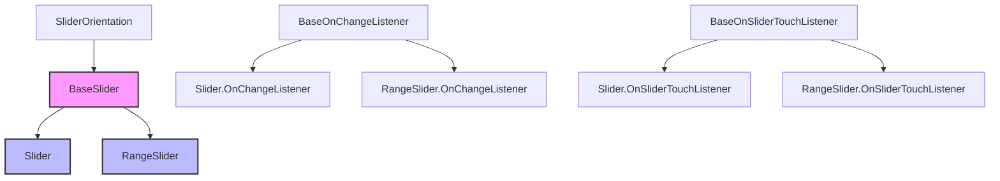

# Slider Module Documentation

## Overview

The Slider module provides Material Design-compliant slider components for Android applications, enabling users to select values from a continuous or discrete range. The module offers both single-value sliders and range sliders with multiple thumbs, supporting various interaction patterns and customization options.

## Architecture

The slider module is built around a hierarchical architecture with base classes providing common functionality and specialized implementations for different slider types.


```mermaid
graph TD
    A[BaseSlider] --> B[Slider]
    A --> C[RangeSlider]
    D[BaseOnChangeListener] --> E[Slider.OnChangeListener]
    D --> F[RangeSlider.OnChangeListener]
    G[BaseOnSliderTouchListener] --> H[Slider.OnSliderTouchListener]
    G --> I[RangeSlider.OnSliderTouchListener]
    J[SliderOrientation] --> A
    
    style A fill:#f9f,stroke:#333,stroke-width:2px
    style B fill:#bbf,stroke:#333,stroke-width:2px
    style C fill:#bbf,stroke:#333,stroke-width:2px
```

## Core Components

### Base Interfaces

#### BaseOnChangeListener
- **Purpose**: Defines the contract for value change callbacks
- **Key Method**: `onValueChange(S slider, float value, boolean fromUser)`
- **Usage**: Notifies listeners when slider values change, indicating whether the change was initiated by user interaction
- **Detailed Documentation**: [base-listeners.md](base-listeners.md)

#### BaseOnSliderTouchListener
- **Purpose**: Handles touch interaction events
- **Key Methods**: 
  - `onStartTrackingTouch(S slider)` - Called when user begins interacting
  - `onStopTrackingTouch(S slider)` - Called when user finishes interaction
- **Usage**: Provides fine-grained control over touch interactions for custom behaviors
- **Detailed Documentation**: [base-listeners.md](base-listeners.md)

#### SliderOrientation
- **Purpose**: Defines orientation constants for slider layout
- **Values**: `HORIZONTAL` and `VERTICAL`
- **Usage**: Standardizes orientation configuration across the module
- **Detailed Documentation**: [orientation.md](orientation.md)

### Slider Types

#### RangeSlider
- **Purpose**: Multi-thumb slider for selecting ranges or multiple values
- **Key Features**:
  - Support for multiple values simultaneously
  - Minimum separation between thumbs
  - Custom thumb drawables per value
  - State persistence and restoration
- **XML Attributes**: `app:values`, `app:minSeparation`
- **Detailed Documentation**: [range-slider.md](range-slider.md)

## Module Structure

The slider module is organized into several key areas:

### Core Functionality
- **Base listener interfaces** that define the callback contracts
- **Orientation handling** for both horizontal and vertical layouts
- **State management** for configuration persistence

### Specialized Implementations
- **RangeSlider** for multi-value selection scenarios
- **Touch handling** for user interaction tracking
- **Value change notifications** for real-time updates

## Integration with Material Design

The slider module integrates with the broader Material Design system through:

- **Theme enforcement** via `ThemeEnforcement` utility
- **State persistence** following Android's saved state pattern
- **Accessibility support** built into the base classes
- **Customization options** for thumb drawables and styling

## Usage Patterns

### Basic Value Selection
```xml
<com.google.android.material.slider.Slider
    android:layout_width="match_parent"
    android:layout_height="wrap_content"
    android:valueFrom="0"
    android:valueTo="100"
    android:value="50" />
```

### Range Selection
```xml
<com.google.android.material.slider.RangeSlider
    android:layout_width="match_parent"
    android:layout_height="wrap_content"
    android:valueFrom="0"
    android:valueTo="100"
    app:values="@array/initial_range_values"
    app:minSeparation="10dp" />
```

## Related Documentation

For information about related components and utilities, see:

- [appbar.md](appbar.md) - For scroll-aware behaviors
- [theme.md](theme.md) - For Material Design theming integration
- [internal.md](internal.md) - For internal utilities and helpers

## Dependencies

The slider module relies on several key dependencies from the Material Design library:

- **ThemeEnforcement** - Ensures proper Material Design theming
- **AndroidX libraries** - For compatibility and lifecycle management
- **Material attributes** - For consistent styling and theming