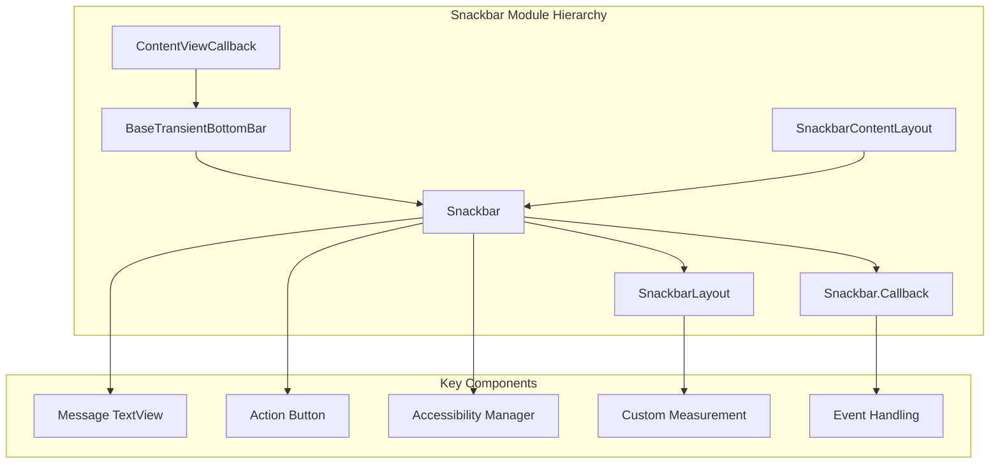
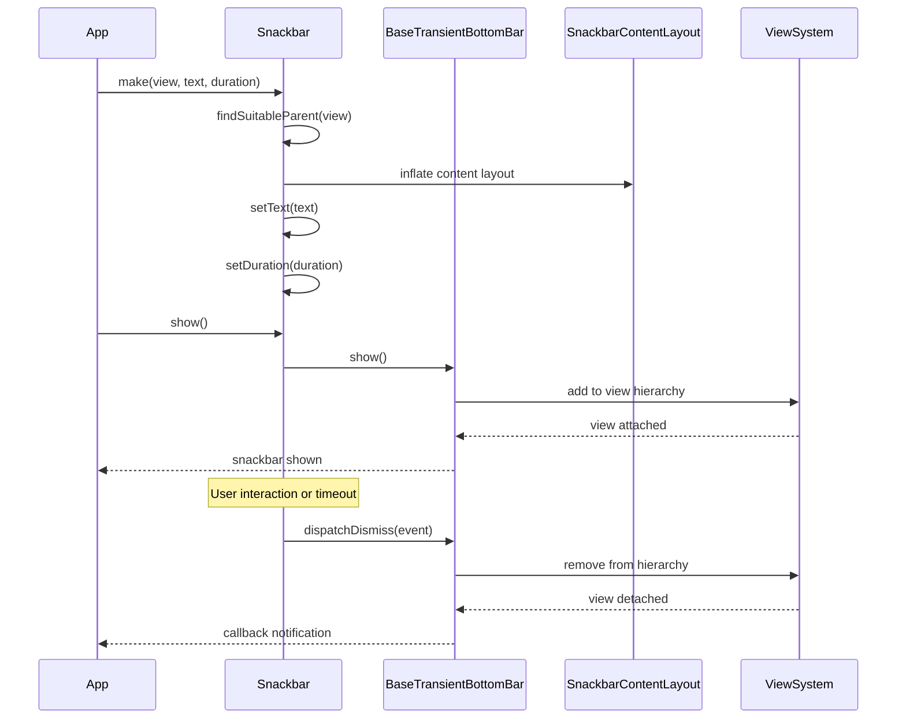
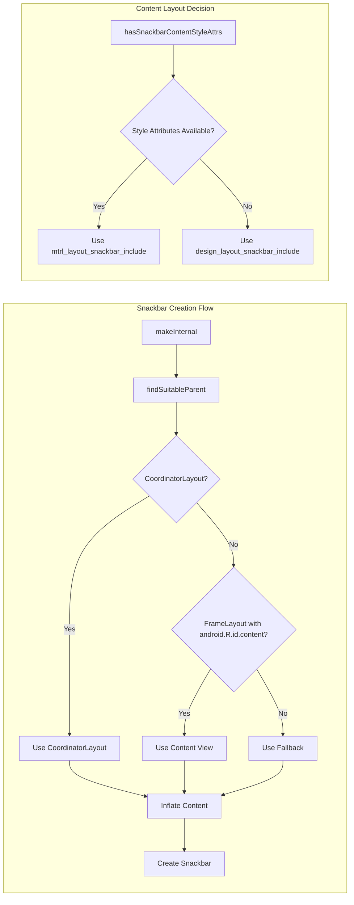
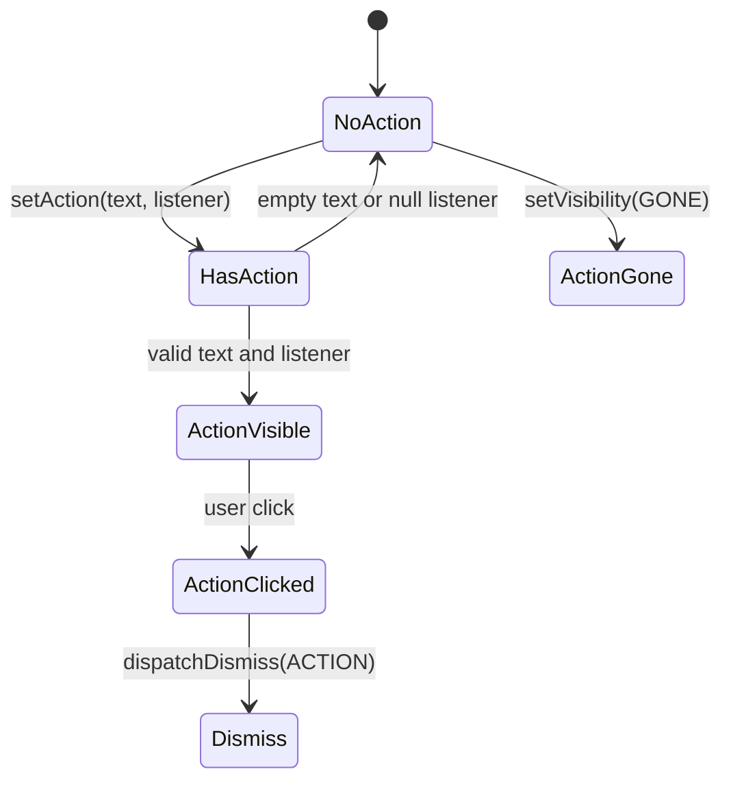

# Snackbar Implementation Module

## Introduction

The snackbar-implementation module provides the core Snackbar functionality within the Material Design Components library. This module implements the primary Snackbar class that displays lightweight feedback messages to users, extending the BaseTransientBottomBar foundation to provide Material Design-compliant snackbar behavior with action buttons, customizable styling, and accessibility features.

## Architecture Overview

The snackbar-implementation module is built upon a hierarchical architecture that separates concerns between transient bottom bar management, content layout, and specific snackbar functionality:



## Core Components

### Snackbar Class

The `Snackbar` class is the main entry point for creating and displaying snackbar notifications. It extends `BaseTransientBottomBar<Snackbar>` to inherit core transient bottom bar functionality while adding snackbar-specific features:

- **Message Display**: Text content with customizable styling and max lines
- **Action Integration**: Optional action buttons with click handling
- **Accessibility Support**: Enhanced accessibility features for screen readers
- **Duration Management**: Smart duration calculation based on content and accessibility settings
- **Styling Options**: Background tint, text colors, and theme integration

### SnackbarLayout

`SnackbarLayout` extends `BaseTransientBottomBar.SnackbarBaseLayout` to provide custom measurement behavior for snackbar content. Key features include:

- **Custom Measurement Logic**: Handles MATCH_PARENT width children by remeasuring with available width
- **Backwards Compatibility**: Maintains compatibility with legacy snackbar implementations
- **Layout Optimization**: Ensures proper width distribution for message and action components

### Snackbar.Callback

`Snackbar.Callback` extends `BaseCallback<Snackbar>` to provide event handling for snackbar lifecycle events:

- **Dismiss Event Types**: SWIPE, ACTION, TIMEOUT, MANUAL, CONSECUTIVE
- **Lifecycle Notifications**: onShown() and onDismissed() callbacks
- **Backwards Compatibility**: Maintains API compatibility with legacy callback implementations

## Data Flow Architecture



## Component Interactions



## Key Features and Behaviors

### Accessibility Integration

The Snackbar implementation includes sophisticated accessibility features:

- **Touch Exploration Detection**: Automatically extends duration when touch exploration is enabled
- **Content Flags**: Uses accessibility manager flags for controls, icons, and text
- **Recommended Timeout**: Leverages system-recommended timeouts on Android Q+

### Action Button Management



### Duration Calculation Logic

The duration calculation considers multiple factors:

1. **User-specified duration**: LENGTH_SHORT, LENGTH_LONG, or custom milliseconds
2. **Action presence**: Whether an action button is displayed
3. **Accessibility settings**: Touch exploration and content flags
4. **System recommendations**: Android Q+ accessibility timeout recommendations

## Integration with Other Modules

The snackbar-implementation module integrates with several other Material Design components:

- **[base-transient-bottom-bar](base-transient-bottom-bar.md)**: Inherits core transient bottom bar functionality
- **[content-layout-system](content-layout-system.md)**: Uses SnackbarContentLayout for content arrangement
- **[CoordinatorLayout](coordinatorlayout.md)**: Leverages CoordinatorLayout for enhanced behavior when available

## Styling and Theming

The module supports Material Design theming through:

- **Style Attributes**: `snackbarButtonStyle` and `snackbarTextViewStyle`
- **Background Tinting**: Programmatic background color customization
- **Text Styling**: Color state lists and direct color application
- **Layout Parameters**: Max inline action width configuration

## Usage Patterns

### Basic Snackbar
```java
Snackbar.make(view, "Message text", Snackbar.LENGTH_SHORT).show();
```

### Snackbar with Action
```java
Snackbar.make(view, "Message text", Snackbar.LENGTH_LONG)
    .setAction("Action", v -> { /* action logic */ })
    .show();
```

### Styled Snackbar
```java
Snackbar.make(view, "Message text", Snackbar.LENGTH_SHORT)
    .setTextColor(Color.WHITE)
    .setActionTextColor(Color.YELLOW)
    .setBackgroundTint(Color.BLUE)
    .show();
```

## Performance Considerations

- **View Recycling**: Efficient view hierarchy traversal for parent finding
- **Lazy Initialization**: Accessibility manager retrieved only when needed
- **Measurement Optimization**: Custom measurement logic minimizes layout passes
- **Memory Management**: Proper cleanup of callbacks and listeners

## Error Handling

The implementation includes robust error handling:

- **Parent Validation**: Throws IllegalArgumentException for invalid view hierarchies
- **Null Safety**: Comprehensive null checking for parameters and dependencies
- **Resource Validation**: Checks for valid style attributes before application
- **Compatibility Handling**: Graceful fallback for missing style attributes

This comprehensive implementation ensures that snackbars provide consistent, accessible, and performant user feedback across all Android applications using Material Design Components.