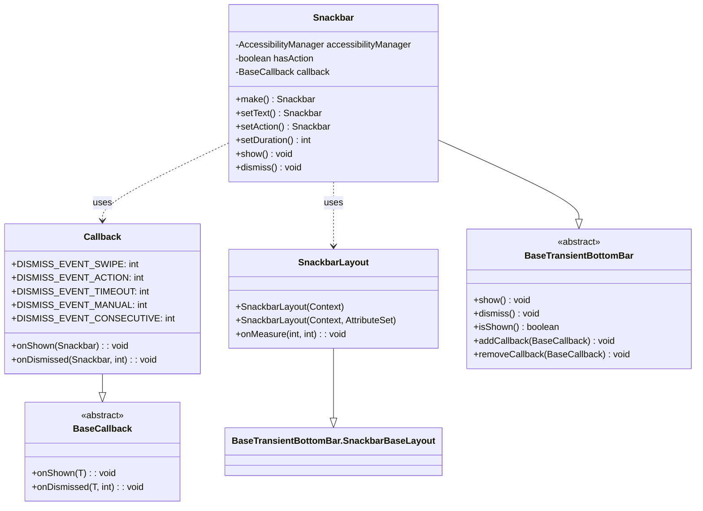
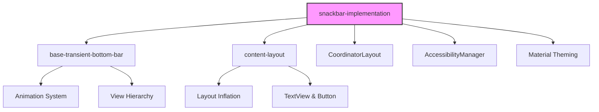
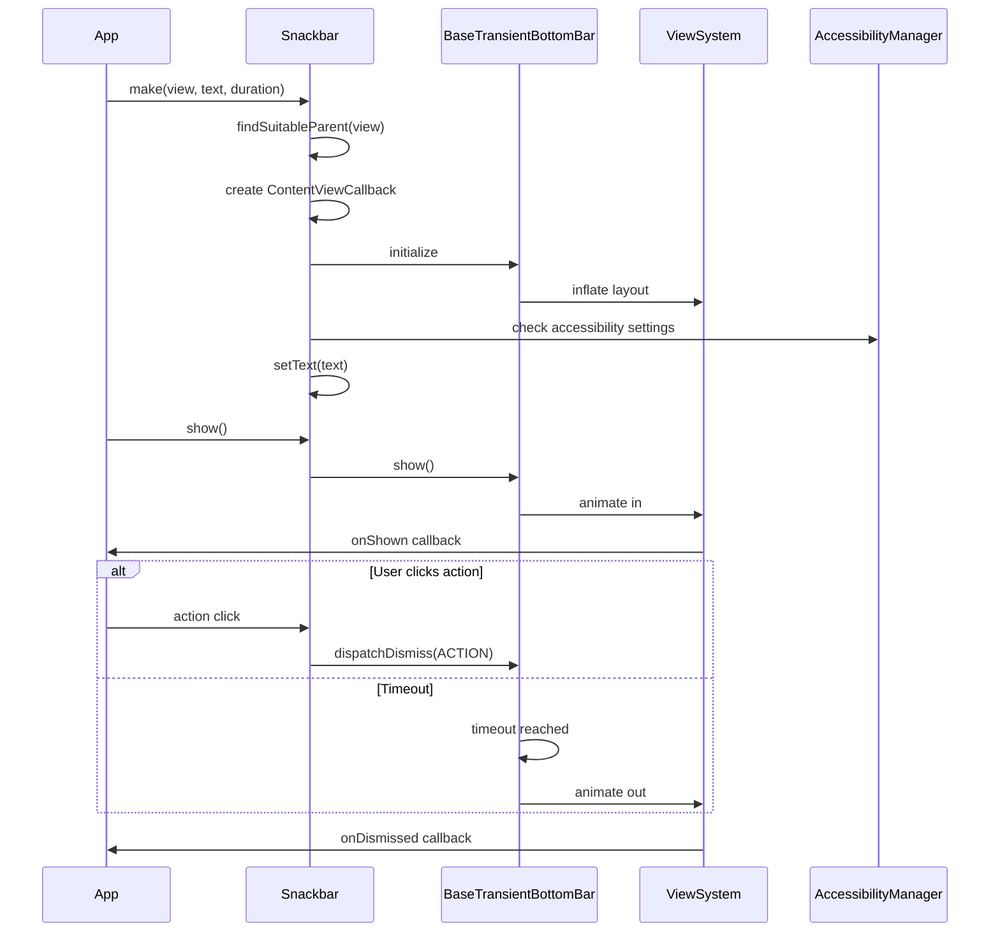
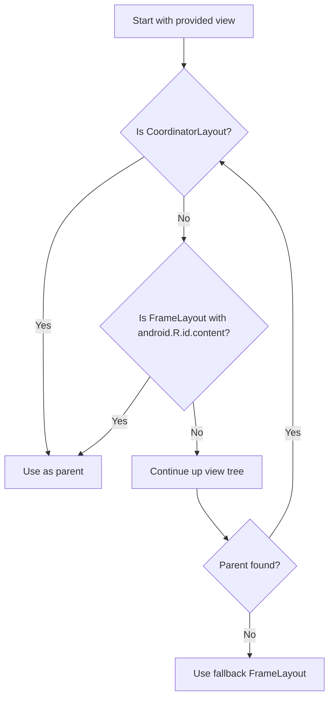

# Snackbar Implementation Module

## Introduction

The snackbar-implementation module provides the core functionality for displaying Material Design snackbars - lightweight feedback messages that appear at the bottom of the screen. This module implements the main Snackbar class and its associated components, offering a flexible and accessible way to show brief messages with optional actions to users.

## Overview

Snackbars are transient UI elements that provide feedback about operations without interrupting the user flow. They automatically disappear after a timeout or can be dismissed through various interactions. The implementation supports accessibility features, theming, and integration with CoordinatorLayout for enhanced behavior.

## Architecture

### Core Components


```mermaid
classDiagram
    class Snackbar {
        -AccessibilityManager accessibilityManager
        -boolean hasAction
        -BaseCallback callback
        +make() Snackbar
        +setText() Snackbar
        +setAction() Snackbar
        +setDuration() int
        +show() void
        +dismiss() void
    }
    
    class Callback {
        +DISMISS_EVENT_SWIPE: int
        +DISMISS_EVENT_ACTION: int
        +DISMISS_EVENT_TIMEOUT: int
        +DISMISS_EVENT_MANUAL: int
        +DISMISS_EVENT_CONSECUTIVE: int
        +onShown(Snackbar): void
        +onDismissed(Snackbar, int): void
    }
    
    class SnackbarLayout {
        +SnackbarLayout(Context)
        +SnackbarLayout(Context, AttributeSet)
        +onMeasure(int, int): void
    }
    
    class BaseTransientBottomBar {
        <<abstract>>
        +show() void
        +dismiss() void
        +isShown() boolean
        +addCallback(BaseCallback) void
        +removeCallback(BaseCallback) void
    }
    
    class BaseCallback {
        <<abstract>>
        +onShown(T): void
        +onDismissed(T, int): void
    }
    
    Snackbar --|> BaseTransientBottomBar
    Callback --|> BaseCallback
    SnackbarLayout --|> BaseTransientBottomBar.SnackbarBaseLayout
    Snackbar ..> Callback : uses
    Snackbar ..> SnackbarLayout : uses
```

### Module Dependencies


```mermaid
graph TD
    A[snackbar-implementation] --> B[base-transient-bottom-bar]
    A --> C[content-layout]
    A --> D[CoordinatorLayout]
    A --> E[AccessibilityManager]
    A --> F[Material Theming]
    
    B --> G[Animation System]
    B --> H[View Hierarchy]
    C --> I[Layout Inflation]
    C --> J[TextView & Button]
    
    style A fill:#f9f,stroke:#333,stroke-width:2px
```

## Component Details

### Snackbar Class

The main `Snackbar` class extends `BaseTransientBottomBar` and provides the primary API for creating and displaying snackbars. Key features include:

- **Message Display**: Set and update text content with `setText()`
- **Action Integration**: Add interactive buttons with `setAction()`
- **Duration Control**: Support for short, long, and indefinite durations
- **Theming Support**: Background tinting, text color customization
- **Accessibility**: Integration with AccessibilityManager for timeout recommendations
- **Layout Management**: Automatic parent view discovery and CoordinatorLayout integration

### Callback System

The `Callback` class provides backwards-compatible event handling for snackbar lifecycle events:

- **Dismiss Events**: Track how the snackbar was dismissed (swipe, action, timeout, manual, consecutive)
- **Visibility Events**: Monitor when snackbars are shown or hidden
- **Event Codes**: Standardized constants for different dismissal reasons

### SnackbarLayout

A specialized layout class that extends `BaseTransientBottomBar.SnackbarBaseLayout`:

- **Custom Measurement**: Handles MATCH_PARENT child width requirements
- **Backwards Compatibility**: Maintains compatibility with existing implementations
- **Layout Optimization**: Ensures proper width allocation for child views

## Data Flow


```mermaid
sequenceDiagram
    participant App
    participant Snackbar
    participant BaseTransientBottomBar
    participant ViewSystem
    participant AccessibilityManager
    
    App->>Snackbar: make(view, text, duration)
    Snackbar->>Snackbar: findSuitableParent(view)
    Snackbar->>Snackbar: create ContentViewCallback
    Snackbar->>BaseTransientBottomBar: initialize
    BaseTransientBottomBar->>ViewSystem: inflate layout
    Snackbar->>AccessibilityManager: check accessibility settings
    Snackbar->>Snackbar: setText(text)
    App->>Snackbar: show()
    Snackbar->>BaseTransientBottomBar: show()
    BaseTransientBottomBar->>ViewSystem: animate in
    ViewSystem->>App: onShown callback
    
    alt User clicks action
        App->>Snackbar: action click
        Snackbar->>BaseTransientBottomBar: dispatchDismiss(ACTION)
    else Timeout
        BaseTransientBottomBar->>BaseTransientBottomBar: timeout reached
        BaseTransientBottomBar->>ViewSystem: animate out
    end
    
    ViewSystem->>App: onDismissed callback
```

## Key Features

### 1. Automatic Parent Discovery

The snackbar implementation includes intelligent parent view discovery:


```mermaid
flowchart TD
    A[Start with provided view] --> B{Is CoordinatorLayout?}
    B -->|Yes| C[Use as parent]
    B -->|No| D{Is FrameLayout with android.R.id.content?}
    D -->|Yes| C
    D -->|No| E[Continue up view tree]
    E --> F{Parent found?}
    F -->|Yes| B
    F -->|No| G[Use fallback FrameLayout]
```

### 2. Accessibility Integration

The implementation provides enhanced accessibility support:

- **Timeout Recommendations**: Uses AccessibilityManager for appropriate duration on Android Q+
- **Touch Exploration**: Extends duration when touch exploration is enabled
- **Content Flags**: Considers controls, icons, and text content for timeout calculations

### 3. Theming and Styling

Supports comprehensive theming options:

- **Background Tinting**: `setBackgroundTint()` and `setBackgroundTintList()`
- **Text Styling**: `setTextColor()`, `setTextMaxLines()`
- **Action Styling**: `setActionTextColor()`, `setMaxInlineActionWidth()`
- **Style Attributes**: Automatic detection of `snackbarButtonStyle` and `snackbarTextViewStyle`

### 4. Layout Variants

The implementation supports two layout variants:

- **Material Layout**: `mtrl_layout_snackbar_include` (with style attributes)
- **Legacy Layout**: `design_layout_snackbar_include` (backwards compatibility)

## Integration Patterns

### Basic Usage

```java
Snackbar.make(view, "Message text", Snackbar.LENGTH_SHORT)
    .setAction("Action", v -> { /* action logic */ })
    .show();
```

### Advanced Configuration

```java
Snackbar snackbar = Snackbar.make(coordinatorLayout, "Message", Snackbar.LENGTH_LONG)
    .setAction("Undo", undoListener)
    .setActionTextColor(Color.RED)
    .setBackgroundTint(Color.DKGRAY)
    .setTextMaxLines(2)
    .setMaxInlineActionWidth(200);

snackbar.addCallback(new Snackbar.Callback() {
    @Override
    public void onDismissed(Snackbar snackbar, int event) {
        // Handle dismissal
    }
});

snackbar.show();
```

## Related Modules

- **[base-transient-bottom-bar](base-transient-bottom-bar.md)**: Provides the base functionality for transient bottom bar components
- **[content-layout](content-layout.md)**: Handles the internal layout structure of snackbars
- **[CoordinatorLayout Integration](coordinatorlayout.md)**: Enables advanced behaviors like swipe-to-dismiss

## Best Practices

1. **Parent Selection**: Use CoordinatorLayout as parent for enhanced features
2. **Duration Selection**: Choose appropriate duration based on message complexity
3. **Action Design**: Keep action text concise and meaningful
4. **Accessibility**: Test with accessibility services enabled
5. **Theming**: Leverage Material theming attributes for consistent appearance
6. **Callback Usage**: Use callbacks for cleanup and analytics tracking

## Technical Considerations

- **Memory Management**: Snackbars are automatically managed and cleaned up
- **Animation Performance**: Uses hardware acceleration for smooth transitions
- **Thread Safety**: All operations must be performed on the main thread
- **View Hierarchy**: Efficient parent discovery minimizes view tree traversal
- **Resource Cleanup**: Proper cleanup of callbacks and listeners

This implementation provides a robust, accessible, and themeable solution for displaying transient feedback messages in Android applications following Material Design guidelines.