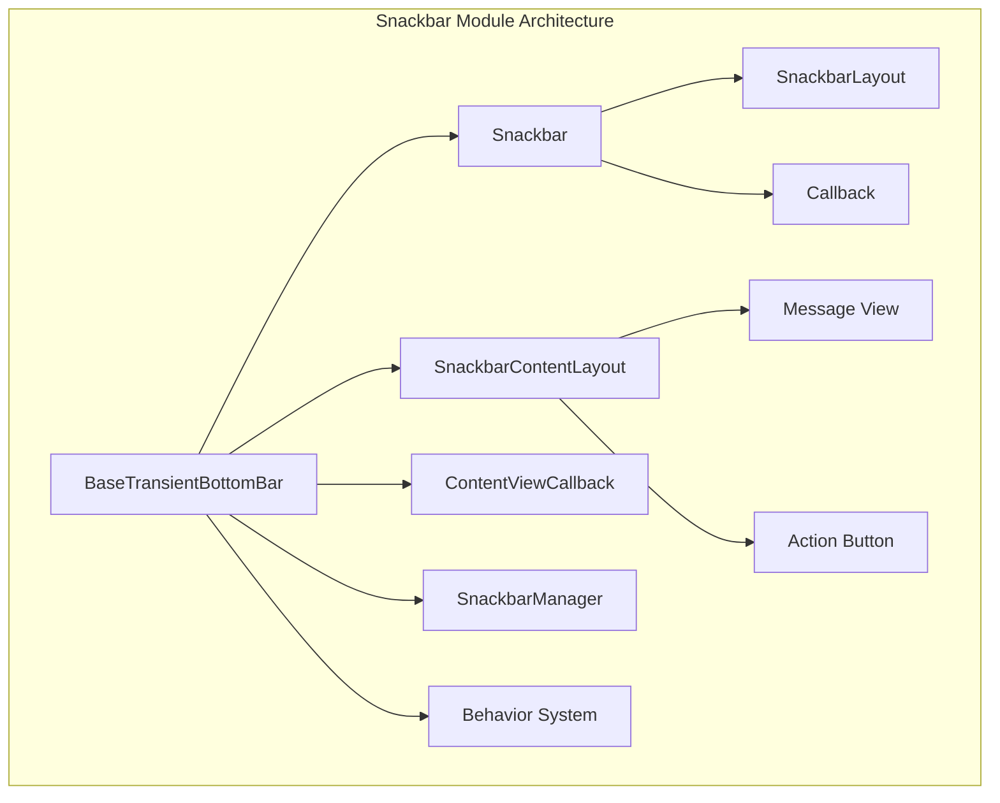
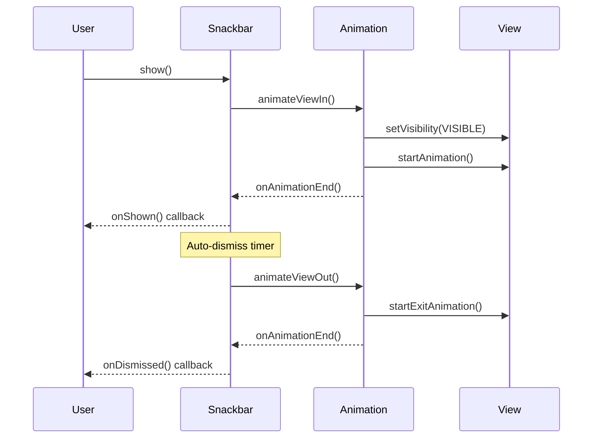
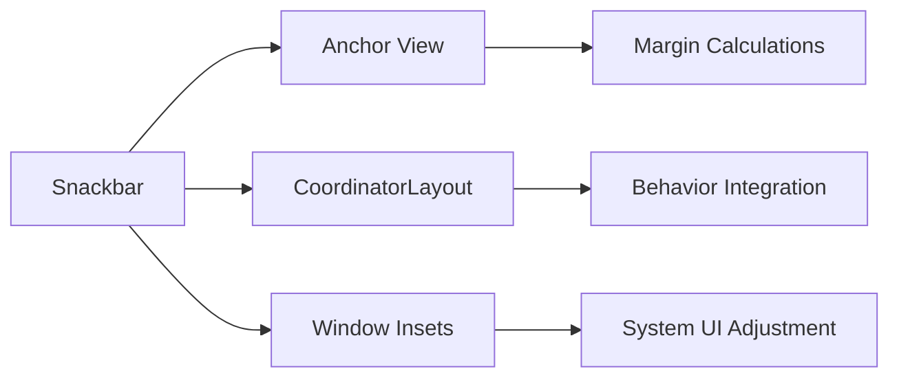

# Snackbar Module Documentation

## Overview

The Snackbar module provides a lightweight feedback mechanism for Android applications, displaying brief messages at the bottom of the screen. Snackbars are part of Google's Material Design components and offer a more elegant alternative to traditional Toast messages, with support for actions, animations, and enhanced user interaction.

## Purpose and Core Functionality

The snackbar module implements transient bottom bars that provide feedback about operations without interrupting the user experience. Key features include:

- **Transient Messaging**: Display brief messages that automatically disappear after a timeout
- **Action Integration**: Support for user actions within the snackbar
- **Swipe-to-Dismiss**: Gesture-based dismissal for improved user interaction
- **Animation Support**: Smooth slide and fade animations with customizable timing
- **Accessibility**: Full accessibility support with screen reader compatibility
- **Anchor Positioning**: Ability to anchor snackbars above specific views
- **Material Design Compliance**: Follows Material Design guidelines for appearance and behavior

## Architecture Overview



### Core Components Structure

The module is built around a hierarchical architecture:

1. **BaseTransientBottomBar**: Abstract base class providing core functionality
2. **Snackbar**: Concrete implementation for standard snackbar behavior
3. **SnackbarContentLayout**: Custom layout for organizing content (message + action)
4. **Supporting Components**: Animation, behavior, and management systems

## Sub-modules

### 1. Base Transient Bottom Bar System
**File**: [base-transient-bottom-bar.md](base-transient-bottom-bar.md)

The foundation of the snackbar module, providing:
- Core lifecycle management (show/dismiss)
- Animation framework with slide and fade modes
- Window inset handling for system UI integration
- Accessibility support and gesture management
- Anchor view positioning system
- Swipe-to-dismiss behavior integration

**Key Components:**
- `BaseTransientBottomBar.ContentViewCallback`: Interface for content animation coordination

### 2. Snackbar Implementation
**File**: [snackbar-implementation.md](snackbar-implementation.md)

The main snackbar class extending BaseTransientBottomBar with:
- Static factory methods for easy creation
- Text and action configuration
- Material Design styling integration
- Accessibility timeout handling
- Custom layout support

**Key Components:**
- `Snackbar.SnackbarLayout`: Custom layout for snackbar container
- `Snackbar.Callback`: Event callback system for show/dismiss events

### 3. Content Layout System
**File**: [content-layout-system.md](content-layout-system.md)

Manages the internal organization of snackbar content:
- Message text view management
- Action button positioning and styling
- Responsive layout (horizontal/vertical orientation)
- Content animation coordination
- Material Design text styling

**Key Components:**
- `SnackbarContentLayout.SnackbarContentLayout`: Main content layout implementation

## Key Features and Capabilities

### Animation System


### Dismiss Events
The module supports multiple dismissal mechanisms:
- **Timeout**: Automatic dismissal after specified duration
- **Swipe**: User swipes the snackbar off screen
- **Action**: User clicks the action button
- **Manual**: Programmatic dismissal
- **Consecutive**: New snackbar replaces current one

### Positioning and Layout


## Integration with Material Design System

The snackbar module integrates with several other Material Design components:

- **[Color Module](color.md)**: Uses MaterialColors for theming and background overlay
- **[Shape Module](shape.md)**: Supports MaterialShapeDrawable for customizable backgrounds
- **[Animation Module](transition.md)**: Leverages motion utilities for smooth animations
- **[Theme System](theme.md)**: Respects Material Design theme attributes

## Usage Patterns

### Basic Usage
```java
Snackbar.make(view, "Message text", Snackbar.LENGTH_SHORT).show();
```

### With Action
```java
Snackbar.make(view, "Message", Snackbar.LENGTH_LONG)
    .setAction("Action", v -> { /* action logic */ })
    .show();
```

### Advanced Configuration
```java
Snackbar snackbar = Snackbar.make(view, "Message", Snackbar.LENGTH_INDEFINITE)
    .setAction("Action", listener)
    .setAnchorView(anchorView)
    .setAnimationMode(BaseTransientBottomBar.ANIMATION_MODE_FADE)
    .setBehavior(customBehavior);
```

## Performance Considerations

- **Memory Management**: Uses WeakReference for anchor views to prevent memory leaks
- **Animation Optimization**: Hardware acceleration support for smooth animations
- **Accessibility**: Respects system accessibility settings for animation preferences
- **Gesture Handling**: Efficient touch event processing with SwipeDismissBehavior

## Thread Safety

All snackbar operations are designed to be called from the main UI thread. The internal Handler ensures proper message queuing and execution on the main looper.

## Extensibility

The module provides several extension points:
- Custom behaviors through BaseTransientBottomBar.Behavior
- Custom content layouts through ContentViewCallback
- Custom animations through animation mode settings
- Theming through Material Design attributes

This architecture ensures that the snackbar module remains flexible while providing a robust foundation for transient messaging in Android applications.