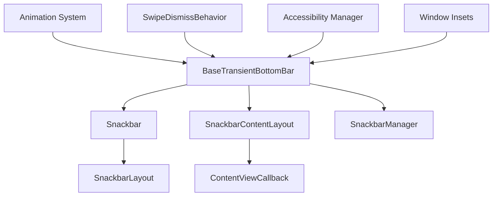

# Snackbar Module Documentation

## Overview

The Snackbar module provides lightweight feedback messages that appear at the bottom of the screen. Snackbars are a core Material Design component used to display brief, non-intrusive messages about app processes, typically appearing above all other UI elements.

## Purpose

Snackbars serve as an elegant alternative to traditional Toast messages, offering:
- **Action Integration**: Optional action buttons for user interaction
- **Swipe Dismissal**: Gesture-based dismissal for enhanced user control
- **Queue Management**: Automatic handling of multiple snackbars
- **Accessibility**: Full accessibility support with screen readers
- **Theming Integration**: Seamless integration with Material Design themes

## Architecture


```mermaid
graph TD
    A[BaseTransientBottomBar] --> B[Snackbar]
    A --> C[SnackbarContentLayout]
    A --> D[SnackbarManager]
    B --> E[SnackbarLayout]
    C --> F[ContentViewCallback]
    
    G[Animation System] --> A
    H[SwipeDismissBehavior] --> A
    I[Accessibility Manager] --> A
    J[Window Insets] --> A
```

## Core Components

### [BaseTransientBottomBar](base-transient-bottom-bar.md)
The foundation class that provides all core functionality for transient bottom bar notifications. This abstract base class handles:
- Animation management (slide and fade modes)
- Duration control and timeout handling
- Swipe-to-dismiss behavior
- Window insets and margin calculations
- Accessibility integration
- Anchor view positioning

### [Snackbar Implementation](snackbar-implementation.md)
The main implementation class that extends BaseTransientBottomBar. Provides:
- Text message display
- Action button configuration
- Text styling and theming
- Duration calculation based on accessibility settings
- Static factory methods for easy creation

### [Content Layout](content-layout.md)
The content container that manages the layout of message text and action buttons:
- Dynamic orientation switching (horizontal/vertical)
- Content animation coordination
- Action button width management
- Multi-line text support

## Key Features

### Animation System
Snackbars support two animation modes:
- **Slide Animation**: Traditional slide-in/slide-out from bottom
- **Fade Animation**: Fade-in/fade-out with scale transformation

### Positioning and Layout
- **Anchor View Support**: Position snackbars above specific views
- **Window Insets**: Automatic adjustment for system UI elements
- **Gesture Insets**: Android Q+ gesture area handling
- **Margin Management**: Dynamic margin calculation for various scenarios

### Accessibility
- Screen reader support with proper announcements
- Touch exploration mode duration adjustments
- Dismiss actions for accessibility services
- Content controls integration

## Integration Points

### Dependencies
- **[CoordinatorLayout](coordinator-layout.md)**: Enhanced behavior with CoordinatorLayout
- **[SwipeDismissBehavior](behavior.md)**: Swipe-to-dismiss functionality
- **[MaterialColors](color.md)**: Theming and color integration
- **[MotionUtils](common-utils.md)**: Animation timing and interpolation
- **[ThemeEnforcement](internal.md)**: Theme validation and enforcement

### Related Modules
- **[BottomSheet](bottom-sheet.md)**: Similar bottom-positioned components
- **[Dialog](dialog.md)**: Alternative feedback mechanisms
- **[Theme](theme.md)**: Material Design theming integration

## Usage Patterns

### Basic Usage
```java
Snackbar.make(view, "Message text", Snackbar.LENGTH_SHORT).show();
```

### With Action
```java
Snackbar.make(view, "Message", Snackbar.LENGTH_LONG)
    .setAction("Action", v -> { /* action */ })
    .show();
```

### Advanced Configuration
```java
Snackbar snackbar = Snackbar.make(view, "Message", Snackbar.LENGTH_INDEFINITE)
    .setAction("Action", listener)
    .setAnchorView(anchorView)
    .setAnimationMode(BaseTransientBottomBar.ANIMATION_MODE_FADE)
    .setBackgroundTint(color)
    .addCallback(callback);
```

## Design Considerations

### Performance
- Efficient queue management prevents multiple simultaneous snackbars
- View recycling minimizes memory usage
- Optimized animation calculations

### User Experience
- Non-intrusive positioning above content
- Consistent dismissal patterns
- Accessibility-first design
- Material Design motion guidelines compliance

### Extensibility
- Abstract base class allows custom implementations
- Behavior system for custom interactions
- Content view callback for custom animations
- Theme attribute support for styling

## Technical Details

### Thread Safety
All operations are performed on the main UI thread through Handler-based message passing.

### Memory Management
- Weak references prevent memory leaks
- Automatic cleanup on view detachment
- Callback management with proper removal

### State Management
- Saved state handling for configuration changes
- Proper lifecycle management
- Event dispatching with type safety

## Best Practices

1. **Message Clarity**: Keep messages concise and actionable
2. **Action Relevance**: Ensure actions are directly related to the message
3. **Duration Selection**: Use appropriate duration based on message complexity
4. **Anchor Positioning**: Consider anchor views for contextual placement
5. **Accessibility**: Test with screen readers and accessibility services

## Migration Notes

The module maintains backward compatibility while providing modern Material Design 3 support. Legacy AppCompat themes are supported through fallback mechanisms.