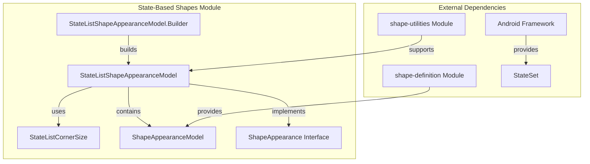
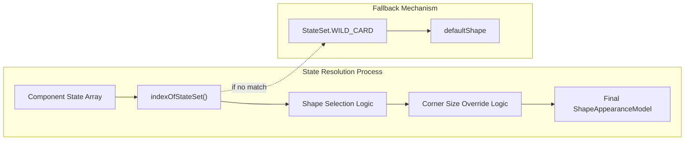
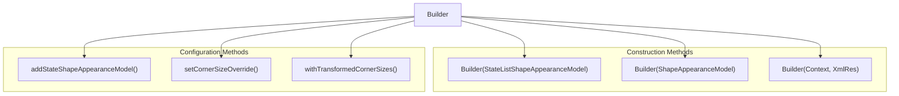
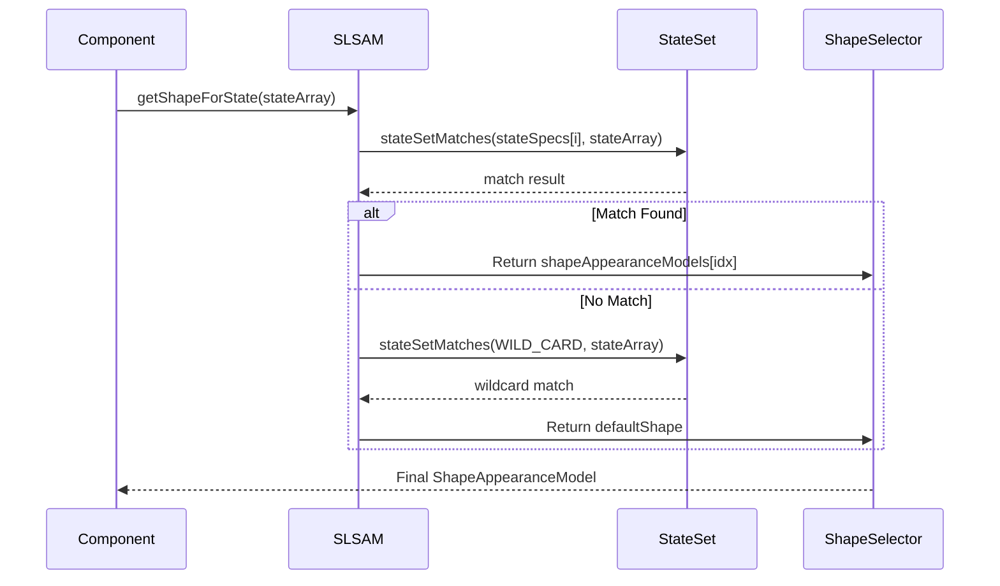
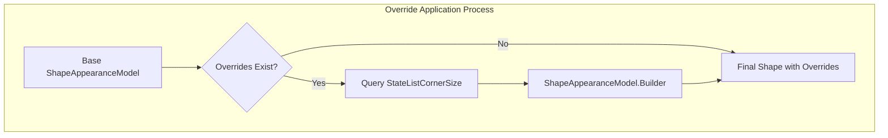
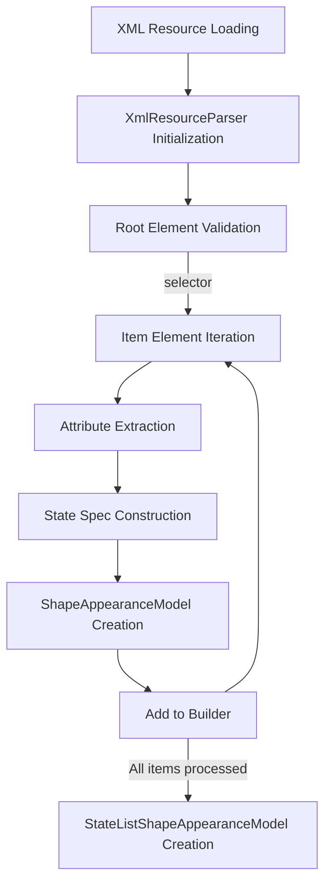
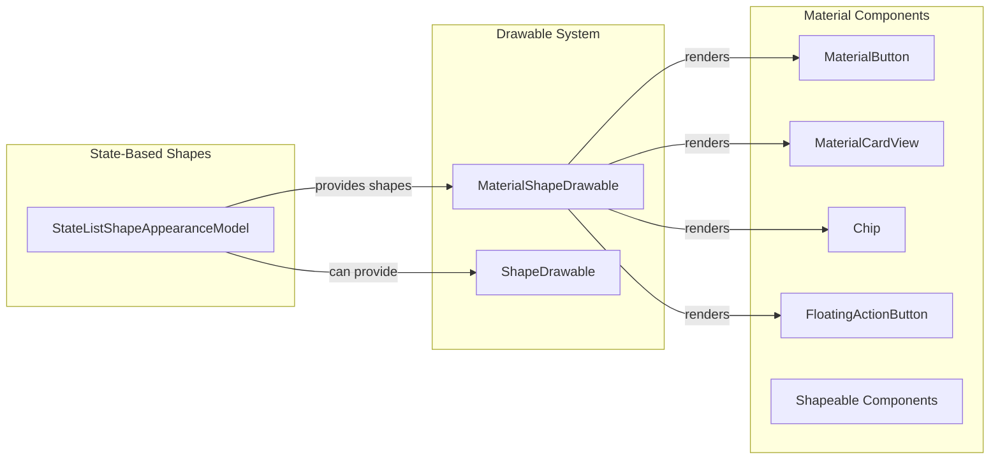
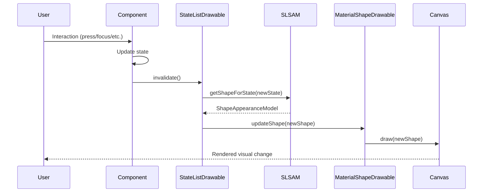

# State-Based Shapes Module Documentation

## Introduction

The state-based-shapes module provides dynamic shape appearance capabilities for Material Design components, enabling UI elements to change their visual shape based on different states (pressed, focused, disabled, etc.). This module is a specialized sub-module within the broader [shape](shape.md) system, focusing on state-driven shape transformations.

## Core Purpose

The module implements a state-list mechanism for `ShapeAppearanceModel` objects, similar to how Android's state list drawables work, but specifically for shape definitions. This allows developers to define different corner radii, edge treatments, and overall shapes that automatically adapt based on component states.

## Architecture Overview

### Component Structure



### State Management Architecture



## Core Components

### StateListShapeAppearanceModel

The main class that manages a collection of `ShapeAppearanceModel` objects mapped to different state specifications. It implements the `ShapeAppearance` interface, making it interchangeable with regular shape appearance models throughout the Material Design system.

**Key Responsibilities:**
- State-to-shape mapping resolution
- Corner size override management
- Shape transformation coordination
- XML resource parsing and loading

### StateListShapeAppearanceModel.Builder

A comprehensive builder class that provides multiple construction patterns:

1. **From existing model**: Copy constructor for creating variations
2. **From single shape**: Wraps a single `ShapeAppearanceModel` as the default
3. **From XML resource**: Parses XML state lists for complex configurations

**Builder Capabilities:**


## State Resolution System

### State Matching Algorithm

The module uses Android's `StateSet` utility for efficient state matching:



### Corner Size Override System

The module supports state-dependent corner size overrides through `StateListCornerSize` objects:



## XML Resource Integration

### Supported XML Structure

The module parses XML resources with the following structure:

```xml
<selector>
    <item android:state_pressed="true"
          app:shapeAppearance="@style/PressedShape"
          app:shapeAppearanceOverlay="@style/PressedOverlay" />
    <item android:state_focused="true"
          app:shapeAppearance="@style/FocusedShape"
          app:shapeAppearanceOverlay="@style/FocusedOverlay" />
    <item app:shapeAppearance="@style/DefaultShape"
          app:shapeAppearanceOverlay="@style/DefaultOverlay" />
</selector>
```

### XML Parsing Process



## Integration with Material Design System

### Component Integration Points

The state-based-shapes module integrates with various Material Design components:



### State Propagation Flow



## Key Features and Capabilities

### 1. Stateful Shape Transitions
- Automatic shape changes based on component states
- Smooth transitions between different shape configurations
- Support for complex state combinations

### 2. Corner Size Overrides
- State-dependent corner radius modifications
- Individual corner control (top-left, top-right, bottom-left, bottom-right)
- Integration with RTL layout considerations

### 3. XML Resource Support
- Declarative shape state definitions
- Integration with Android's resource system
- Support for shape appearance and overlay combinations

### 4. Builder Pattern Implementation
- Flexible construction options
- Copy-and-modify workflows
- Transformation operations on entire state lists

## Usage Patterns

### Programmatic Creation

```java
// Create from existing shape
ShapeAppearanceModel defaultShape = ShapeAppearanceModel.builder()
    .setAllCornerSizes(8dp)
    .build();

StateListShapeAppearanceModel statefulShape = 
    new StateListShapeAppearanceModel.Builder(defaultShape)
        .addStateShapeAppearanceModel(
            new int[]{android.R.attr.state_pressed},
            defaultShape.withCornerSize(16dp))
        .addStateShapeAppearanceModel(
            new int[]{android.R.attr.state_focused},
            defaultShape.withCornerSize(12dp))
        .build();
```

### XML-Based Definition

```xml
<selector xmlns:android="http://schemas.android.com/apk/res/android"
          xmlns:app="http://schemas.android.com/apk/res-auto">
    <item android:state_pressed="true"
          app:shapeAppearance="@style/RoundedPressed"
          app:shapeAppearanceOverlay="@style/PressedOverlay" />
    <item android:state_focused="true"
          app:shapeAppearance="@style/RoundedFocused"
          app:shapeAppearanceOverlay="@style/FocusedOverlay" />
    <item app:shapeAppearance="@style/RoundedDefault"
          app:shapeAppearanceOverlay="@style/DefaultOverlay" />
</selector>
```

## Performance Considerations

### Memory Management
- Initial capacity optimization (10 states)
- Dynamic array growth strategy
- Efficient state matching algorithms

### State Resolution Optimization
- Early termination on state matches
- Wildcard fallback mechanism
- Cached shape computations

## Error Handling

### XML Parsing Resilience
- Graceful fallback on parsing errors
- Resource validation before processing
- Exception-safe resource management

### State Validation
- Empty state set handling
- Invalid state specification detection
- Default shape fallback guarantees

## Relationship to Other Modules

### Parent Module: [shape](shape.md)
- Extends the core shape definition capabilities
- Integrates with `ShapeAppearanceModel` and `ShapeAppearance` interface
- Leverages shape utilities for transformations

### Sibling Modules:
- **[shape-definition](shape-definition.md)**: Provides base shape models used by state lists
- **[shape-utilities](shape-utilities.md)**: Offers utility functions for shape manipulation
- **[path-generation](path-generation.md)**: Handles path creation for rendered shapes

## Future Extensibility

The module's architecture supports future enhancements such as:
- Animation support between state shapes
- More complex state-dependent transformations
- Integration with motion design systems
- Custom state specification mechanisms

## Conclusion

The state-based-shapes module provides a robust foundation for creating dynamic, state-responsive UI elements in Material Design applications. Its flexible architecture, comprehensive XML support, and seamless integration with the broader shape system make it an essential component for building modern, interactive user interfaces that respond meaningfully to user interaction and system states.